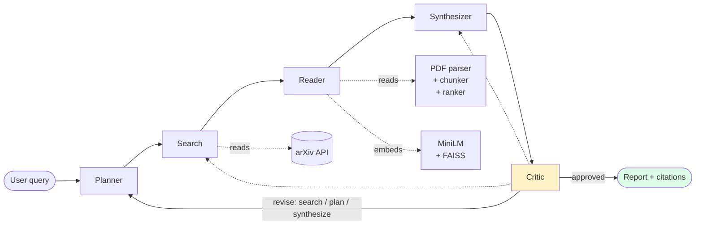
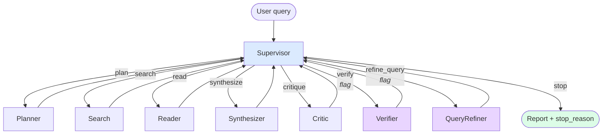
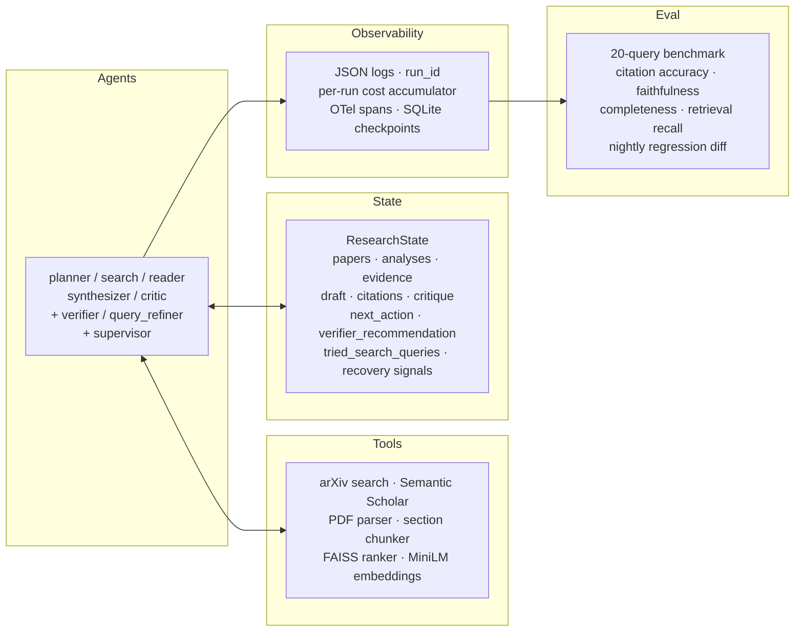

# arxiv-research-agent

A multi-agent research assistant for ML/AI papers. Takes a natural-language
research question, searches arXiv (and optionally Semantic Scholar for
citation-graph enrichment), extracts findings from each paper's full text,
synthesizes a briefing, and self-critiques for quality. Orchestrated with
LangGraph and Claude.

Under the fixed pipeline (Sprint 1 shape) it's a five-agent DAG with one
conditional edge on the critic. Behind opt-in flags it becomes an agentic
supervisor loop with runtime faithfulness verification, evidence-grounded
synthesis, and search-layer / read-layer recovery actions.

## Architecture

### Fixed pipeline — Sprint 1 baseline (default)



Every agent reads from and writes to a shared `ResearchState`
(`src/graph/state.py`). Loops back to the planner / search / synthesizer
when the critic flags revision, capped at `settings.max_iterations`.

### Supervisor loop — Sprint 2+ (opt-in)



Every action node hands control back to the supervisor, which picks the
next action from a strict enum with budget short-circuits and fail-safe
fallback routing. See ADR
[0014](docs/decisions/0014-supervisor-loop-behind-flag.md).

### Shared substrate



- **Agents** read from and write to state; the supervisor picks the next
  agent every turn under the loop.
- **Tools** are pure functions the agents call; no LLM cost beyond the
  callers.
- **Observability** runs alongside every call; per-run cost with cache-
  read / cache-write breakdown when Anthropic prompt caching is on.
- **Eval** consumes the observability output; nightly CI diffs against
  the previous night's baseline and fails on regressions > 0.10.

## What lives behind flags

Every feature added after Sprint 1 is behind an independent flag so
comparisons against the Sprint 1 baseline stay apples-to-apples. Full
list in `src/config.py`.

| Flag | Sprint | What it enables | ADR |
|---|---|---|---|
| `enable_supervisor` | 2 | Observe-decide-act loop replaces the fixed DAG | [0014](docs/decisions/0014-supervisor-loop-behind-flag.md) |
| `enable_verifier` | 2 | `verify` action + runtime faithfulness judge | [0015](docs/decisions/0015-verifier-agent-runtime-faithfulness.md) |
| `enable_evidence_store` | 2 | Reader emits `EvidenceClaim`s; verifier judges chunks | [0016](docs/decisions/0016-evidence-store-source-text-verifier.md) / [0017](docs/decisions/0017-synthesizer-evidence-swap.md) |
| `enable_query_refiner` | 2 | `refine_query` recovery action | [0018](docs/decisions/0018-query-refiner-recovery-action.md) |
| `enable_reader_recovery` | 2 | Reader flags gaps; ranker biases re-reads by section | [0019](docs/decisions/0019-reader-requests-more-chunks.md) |
| `enable_prompt_isolation` | 2 | Untrusted-content tags + sanitization on reader | [0020](docs/decisions/0020-prompt-injection-isolation-reader.md) |
| `<agent>_model` (7 fields) | 3 | Per-agent Claude model routing | [0021](docs/decisions/0021-cost-aware-model-routing.md) |
| `enable_prompt_caching` | 3 | Anthropic ephemeral cache on system prompts | [0022](docs/decisions/0022-anthropic-prompt-caching.md) |
| `enable_semantic_scholar` | 3 | One-hop reference enrichment on top of arXiv | [0023](docs/decisions/0023-semantic-scholar-citation-graph.md) |

Full design log in
[`docs/decisions/`](docs/decisions/README.md); the roadmap lives in
[`CLAUDE-Agent-Proj-1.md`](CLAUDE-Agent-Proj-1.md).

## Demo

See [`docs/demo.md`](docs/demo.md) for a full example run: the query,
the report the workflow produced, and the per-query line from
`summary.jsonl` with metrics + cost + latency.

## Setup

Requires Python 3.11+.

```bash
python -m venv .venv
source .venv/bin/activate
pip install -e .
```

Copy `.env.example` to `.env` and add your Anthropic API key:

```bash
cp .env.example .env
# edit .env and set ANTHROPIC_API_KEY=sk-ant-...
```

## Run

```bash
python -m src.main "What are the latest approaches to reducing hallucination in LLMs?"
```

The final markdown report is printed to stdout and saved to
`outputs/report_<timestamp>.md`.

### Offline mode

If arXiv is rate-limiting or unavailable, force the built-in mock
papers instead of a live search:

```bash
USE_MOCK_DATA=true python -m src.main "..."
```

### With the supervisor loop and verifier

```bash
ENABLE_SUPERVISOR=true \
ENABLE_VERIFIER=true \
ENABLE_EVIDENCE_STORE=true \
python -m src.main "..."
```

## Web UI

Next.js 14 (App Router, TypeScript, Tailwind) demo UI as a separate
compose service on `:3000`. After `docker compose up`, open
[http://localhost:3000/](http://localhost:3000/) in a browser to
run a query and watch nodes complete over Server-Sent Events, with
the report rendered from markdown via `react-markdown` + `remark-
gfm`. Talks to the FastAPI service over the browser's view of the
host-published port. See ADR
[0029](docs/decisions/0029-nextjs-web-ui.md) for the design.

Local dev without Docker:

```bash
cd web
npm install
NEXT_PUBLIC_API_BASE=http://localhost:8000 npm run dev
# → http://localhost:3000/
```

## HTTP API

FastAPI surface layered on top of the workflow. Async job model —
submit a query, get a `job_id`, poll for the result or stream
events over Server-Sent Events. Full design in ADRs
[0025](docs/decisions/0025-fastapi-async-job-model.md) and
[0026](docs/decisions/0026-sse-streaming-endpoint.md).

```bash
python -m src.api.serve                       # bind 127.0.0.1:8000
# or override host/port via env:
API_HOST=0.0.0.0 API_PORT=8080 python -m src.api.serve
```

### Endpoints

| Method | Path | Purpose |
|---|---|---|
| `POST` | `/research` | Submit a query. Body: `{query, hitl_bypass?: bool}`. Returns 202 with `job_id`, `status_url`, `stream_url`. |
| `GET`  | `/research/{job_id}` | Full lifecycle snapshot (status, result, error, cost, metrics, `plan` when awaiting review). |
| `POST` | `/research/{job_id}/review` | Resolve a `pending_review` job. Body: `{action: "approve"\|"revise"\|"cancel", plan?}`. See ADR [0030](docs/decisions/0030-hitl-plan-review.md). |
| `GET`  | `/research/{job_id}/export?format=md\|pdf\|docx` | Download the report in the requested format. See ADR [0031](docs/decisions/0031-multi-format-export.md). |
| `GET`  | `/research/{job_id}/stream` | SSE event stream: `job_started` → N × `node_completed` (+ `plan_ready` when HITL is on) → terminal frame. |
| `GET`  | `/healthz` | Liveness + concurrency headroom. |
| `GET`  | `/docs` | Auto-generated OpenAPI docs. |

### HITL plan review

`enable_hitl` is on by default. Every `POST /research` pauses
after the planner in `pending_review`; the client either
approves as-is, revises `{sub_questions, search_queries}`, or
cancels. The demo UI at `/` renders a `PlanReview` panel when
this state is reached. Programmatic callers (eval runner, CLI,
custom clients) skip the pause via `hitl_bypass: true` on the
request body, or by setting `ENABLE_HITL=false` globally. See
ADR [0030](docs/decisions/0030-hitl-plan-review.md).

### Example

```bash
# submit
curl -s -X POST localhost:8000/research \
  -H 'content-type: application/json' \
  -d '{"query": "chain-of-verification for hallucination"}' | jq .
# → {"job_id": "abc123...", "status_url": "/research/abc123...", ...}

# poll
curl -s localhost:8000/research/abc123... | jq .status

# stream
curl -N localhost:8000/research/abc123.../stream
# → event: job_started
#    data: {"job_id": "abc123...", "query": "..."}
#    ...
#    event: job_completed
#    data: {"iterations": 1, "quality_score": 0.9, "cost_usd": 0.087, ...}
```

Concurrency is bounded per process by
`API_MAX_CONCURRENT_JOBS` (default 10) via `asyncio.Semaphore`;
per-job timeout by `API_JOB_TIMEOUT_SEC` (default 600). Jobs live
in an in-memory store by default; set `JOB_STORE=redis` +
`REDIS_URL=redis://...` to swap in the Redis-backed store for
horizontal scaling and durability across worker restarts
(compose stack below wires this up automatically).

## Run in Docker

Full compose stack — app + Redis (JobStore) + Postgres (paper cache,
Sprint 4 PR 4). See ADR
[0027](docs/decisions/0027-docker-compose-redis-job-store.md) for
image design + service topology.

```bash
export ANTHROPIC_API_KEY=sk-ant-...
docker compose up --build
# → http://localhost:8000/healthz  → 200
# → http://localhost:8000/docs     → OpenAPI UI
```

`ANTHROPIC_API_KEY` is the only required host variable. The compose
file publishes `APP_PORT` (default 8000) to the host; Redis and
Postgres stay on the internal compose network. Named volumes
`redis-data` + `postgres-data` persist state across `docker compose
down`; `down -v` wipes them.

Multi-worker uvicorn is safe under `JOB_STORE=redis` — every worker
reads/writes the shared Redis-backed store. Note that SSE streaming
requires job affinity (see ADR 0027 Consequences); polling works
across workers unconditionally.

The compose stack also sets `PAPER_CACHE=postgres` +
`EMBEDDING_CACHE=postgres` so extracted paper text and MiniLM
embeddings are shared across workers via the Postgres service —
a paper fetched by one worker is instantly available to any
other. Local dev outside the compose stack defaults to
`disk` / `none` (Sprint 1 behavior byte-identical). See ADR
[0028](docs/decisions/0028-postgres-paper-cache-and-embedding-cache.md).

## Eval

Twenty benchmark queries covering hallucination, retrieval, alignment,
reasoning, efficiency, and safety topics
(`src/eval/benchmark_queries.py`). Four LLM-judged metrics — citation
accuracy, faithfulness, completeness, retrieval recall — plus critic
score, iteration count, LLM call count, and cost per query in
`summary.jsonl`. Full eval design in [`docs/eval.md`](docs/eval.md).

```bash
python -m src.eval.runner              # run the benchmark
python -m src.eval.regression_diff \
  outputs/eval/<baseline>/summary.jsonl \
  outputs/eval/<candidate>/summary.jsonl
```

## Tests

```bash
pytest tests/ -q
```

680+ tests across unit + integration tiers (see
[`docs/testing.md`](docs/testing.md) for the strategy).

## Project status

**Sprint 5 in progress.** Sprint 1 shipped the observability + eval
substrate; Sprint 2 shipped the supervisor loop + verifier +
evidence store + recovery actions + prompt-injection isolation;
Sprint 3 shipped cost-aware model routing + Anthropic prompt
caching + Semantic Scholar citation-graph enrichment. Sprint 4
made the system deployable end-to-end: PR CI gate (ADR 0024),
FastAPI + async jobs + SSE (ADRs 0025 / 0026),
Dockerfile + compose stack + `RedisJobStore` (ADR 0027), and
Postgres-backed paper + embedding caches (ADR 0028). Sprint 5
opens the product-surface arc — Next.js web UI (ADR 0029), HITL
plan-review breakpoint (ADR 0030), and multi-format export (ADR
0031) shipped. Next up: follow-up conversation mode.

Full status and phase-by-phase plan in
[`CLAUDE-Agent-Proj-1.md`](CLAUDE-Agent-Proj-1.md).
