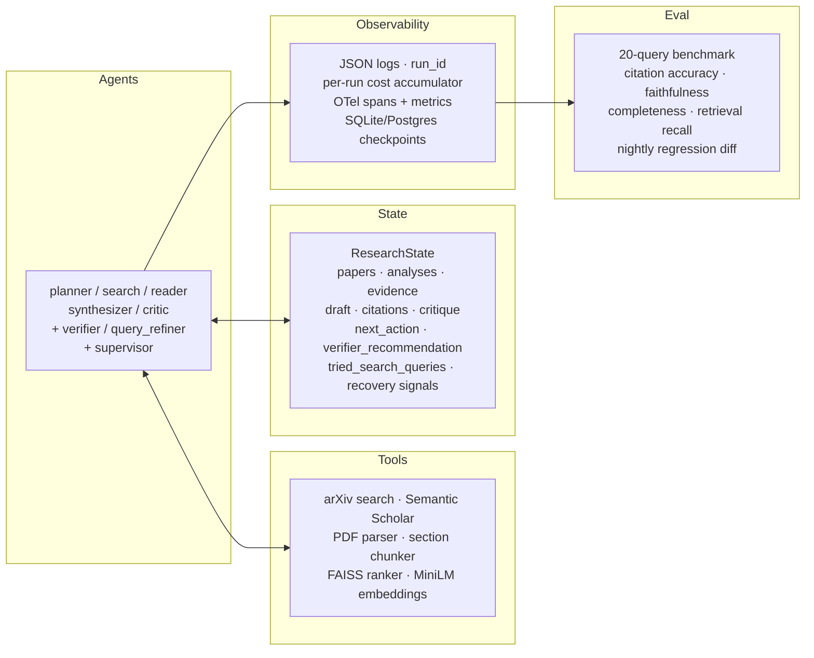

# arxiv-research-agent

A multi-agent research assistant for ML/AI papers. Takes a natural-language
research question, searches arXiv (and optionally Semantic Scholar for
citation-graph enrichment), extracts findings from each paper's full text,
synthesizes a briefing, and self-critiques for quality. Orchestrated with
LangGraph and Claude.

Under the fixed pipeline (Sprint 1 shape) it's a five-agent DAG with one
conditional edge on the critic. Behind opt-in flags it becomes an agentic
supervisor loop with runtime faithfulness verification, evidence-grounded
synthesis, and search-layer / read-layer recovery actions.

The workflow ships behind a production HTTP surface: FastAPI async
jobs with SSE streaming and human-in-the-loop plan review, pluggable
Redis/Postgres backends for every stateful concern (jobs,
checkpoints, conversations, caches, rate limits), worker leases +
a redriver for crash recovery, structured JSON logs + OTel
tracing/metrics, and an LLM-judged eval harness with resume +
budget controls.

## Architecture

### Fixed pipeline — Sprint 1 baseline (default)


```mermaid
flowchart LR
    User([User query]) --> Planner
    Planner --> Search
    Search --> Reader
    Reader --> Synthesizer
    Synthesizer --> Critic
    Critic -->|approved| Output([Report + citations])
    Critic -->|revise: search / plan / synthesize| Planner
    Critic -.-> Search
    Critic -.-> Synthesizer

    Search -.reads.-> ArXiv[(arXiv API)]
    Reader -.reads.-> PDF[PDF parser<br/>+ chunker<br/>+ ranker]
    Reader -.embeds.-> Emb[MiniLM<br/>+ FAISS]

    style Critic fill:#fef3c7
    style Output fill:#dcfce7
```

Every agent reads from and writes to a shared `ResearchState`
(`src/graph/state.py`). Loops back to the planner / search / synthesizer
when the critic flags revision, capped at `settings.max_iterations`.

### Supervisor loop — Sprint 2+ (opt-in)


```mermaid
flowchart TB
    User([User query]) --> Supervisor
    Supervisor -->|plan| Planner
    Supervisor -->|search| Search
    Supervisor -->|read| Reader
    Supervisor -->|synthesize| Synthesizer
    Supervisor -->|critique| Critic
    Supervisor -->|verify<br/><i>flag</i>| Verifier
    Supervisor -->|refine_query<br/><i>flag</i>| QueryRefiner
    Supervisor -->|stop| Output([Report + stop_reason])

    Planner --> Supervisor
    Search --> Supervisor
    Reader --> Supervisor
    Synthesizer --> Supervisor
    Critic --> Supervisor
    Verifier --> Supervisor
    QueryRefiner --> Supervisor

    style Supervisor fill:#dbeafe
    style Verifier fill:#e9d5ff
    style QueryRefiner fill:#e9d5ff
    style Output fill:#dcfce7
```

Every action node hands control back to the supervisor, which picks the
next action from a strict enum with budget short-circuits and fail-safe
fallback routing. See ADR
[0014](docs/decisions/0014-supervisor-loop-behind-flag.md).

### Shared substrate


```mermaid
flowchart LR
    subgraph "Agents"
        A[planner / search / reader<br/>synthesizer / critic<br/>+ verifier / query_refiner<br/>+ supervisor]
    end
    subgraph "Tools"
        T[arXiv search · Semantic Scholar<br/>PDF parser · section chunker<br/>FAISS ranker · MiniLM embeddings]
    end
    subgraph "State"
        S[ResearchState<br/>papers · analyses · evidence<br/>draft · citations · critique<br/>next_action · verifier_recommendation<br/>tried_search_queries · recovery signals]
    end
    subgraph "Observability"
        O[JSON logs · run_id<br/>per-run cost accumulator<br/>OTel spans + metrics<br/>SQLite/Postgres checkpoints]
    end
    subgraph "Eval"
        E[20-query benchmark<br/>citation accuracy · faithfulness<br/>completeness · retrieval recall<br/>nightly regression diff]
    end
    A <--> S
    A <--> T
    A --> O
    O --> E
```

- **Agents** read from and write to state; the supervisor picks the next
  agent every turn under the loop.
- **Tools** are pure functions the agents call; no LLM cost beyond the
  callers.
- **Observability** runs alongside every call; per-run cost with cache-
  read / cache-write breakdown when Anthropic prompt caching is on.
- **Eval** consumes the observability output; nightly CI diffs against
  the previous night's baseline and fails on regressions > 0.10.

## What lives behind flags

Every feature added after Sprint 1 is behind an independent flag so
comparisons against the Sprint 1 baseline stay apples-to-apples. Full
list in `src/config.py`.

| Flag | Sprint | What it enables | ADR |
|---|---|---|---|
| `enable_supervisor` | 2 | Observe-decide-act loop replaces the fixed DAG | [0014](docs/decisions/0014-supervisor-loop-behind-flag.md) |
| `enable_verifier` | 2 | `verify` action + runtime faithfulness judge | [0015](docs/decisions/0015-verifier-agent-runtime-faithfulness.md) |
| `enable_evidence_store` | 2 | Reader emits `EvidenceClaim`s; verifier judges chunks | [0016](docs/decisions/0016-evidence-store-source-text-verifier.md) / [0017](docs/decisions/0017-synthesizer-evidence-swap.md) |
| `enable_query_refiner` | 2 | `refine_query` recovery action | [0018](docs/decisions/0018-query-refiner-recovery-action.md) |
| `enable_reader_recovery` | 2 | Reader flags gaps; ranker biases re-reads by section | [0019](docs/decisions/0019-reader-requests-more-chunks.md) |
| `enable_prompt_isolation` | 2 | Untrusted-content tags + sanitization on reader | [0020](docs/decisions/0020-prompt-injection-isolation-reader.md) |
| `<agent>_model` (7 fields) | 3 | Per-agent Claude model routing | [0021](docs/decisions/0021-cost-aware-model-routing.md) |
| `enable_prompt_caching` | 3 | Anthropic ephemeral cache on system prompts | [0022](docs/decisions/0022-anthropic-prompt-caching.md) |
| `enable_semantic_scholar` | 3 | One-hop reference enrichment on top of arXiv | [0023](docs/decisions/0023-semantic-scholar-citation-graph.md) |

The table stops at Sprint 3 because it tracks *workflow-behavior*
flags — the ones that change what the agents do and so must stay
independently toggleable for A/B eval runs. Later settings (HITL,
metrics, job redriver, storage backends) are API and infrastructure
concerns; the full settings surface is `src/config.py`. Full design
log in
[`docs/decisions/`](docs/decisions/README.md); the sprint-by-sprint
roadmap lives in [`planning/03-roadmap.md`](planning/03-roadmap.md).

## How this was built

Every non-trivial decision in this repo has an Architecture Decision
Record — 50+ ADRs in [`docs/decisions/`](docs/decisions/README.md)
covering everything from "why roll our own chunker" (0002) to "why
the container bakes MiniLM weights at build time" (0053). The ADR
index plus the dated log in
[`planning/03-roadmap.md`](planning/03-roadmap.md) reconstruct the
entire build sequence: what was decided, when, what the alternatives
were, and what broke along the way.

## Demo

See [`docs/demo.md`](docs/demo.md) for a full example run: the query,
the report the workflow produced, and the per-query line from
`summary.jsonl` with metrics + cost + latency.

## Setup

Requires Python 3.11+.

```bash
make install        # fresh .venv + runtime deps (editable)
make install-dev    # + dev deps (pytest, mypy, ruff)
```

(Or by hand: `python -m venv .venv && .venv/bin/pip install -e .`.)

Copy `.env.example` to `.env` and add your Anthropic API key:

```bash
cp .env.example .env
# edit .env and set ANTHROPIC_API_KEY=sk-ant-...
```

## Run

```bash
python -m src.main "What are the latest approaches to reducing hallucination in LLMs?"
```

The final markdown report is printed to stdout and saved to
`outputs/report_<timestamp>.md`.

### Offline mode

If arXiv is rate-limiting or unavailable, force the built-in mock
papers instead of a live search:

```bash
USE_MOCK_DATA=true python -m src.main "..."
```

### With the supervisor loop and verifier

```bash
ENABLE_SUPERVISOR=true \
ENABLE_VERIFIER=true \
ENABLE_EVIDENCE_STORE=true \
python -m src.main "..."
```

## Web UI

Next.js 15 (App Router, TypeScript, Tailwind) demo UI as a separate
compose service on `:3000`. After `docker compose up`, open
[http://localhost:3000/](http://localhost:3000/) in a browser to
run a query and watch nodes complete over Server-Sent Events, with
the report rendered from markdown via `react-markdown` + `remark-
gfm`. Talks to the FastAPI service over the browser's view of the
host-published port. See ADR
[0029](docs/decisions/0029-nextjs-web-ui.md) for the design.

The first query creates a conversation, submits the job, and lands
on `/c/{conversation_id}?job={job_id}`; the thread attaches to the
job named in the URL rather than submitting its own, so reloading
that page rejoins the running job instead of buying a second one
(ADR [0053](docs/decisions/0053-api-web-container-preflight.md)).
Because HITL is on by default, the run pauses at `plan_ready` and
the page shows the plan-review panel — approve, revise, or cancel
to let the run finish.

Local dev without Docker:

```bash
cd web
npm install
NEXT_PUBLIC_API_BASE=http://localhost:8000 npm run dev
# → http://localhost:3000/
```

## HTTP API

FastAPI surface layered on top of the workflow. Async job model —
submit a query, get a `job_id`, poll for the result or stream
events over Server-Sent Events. Full design in ADRs
[0025](docs/decisions/0025-fastapi-async-job-model.md) and
[0026](docs/decisions/0026-sse-streaming-endpoint.md).

```bash
python -m src.api.serve                       # bind 127.0.0.1:8000
# or override host/port via env:
API_HOST=0.0.0.0 API_PORT=8080 python -m src.api.serve
```

### Endpoints

| Method | Path | Purpose |
|---|---|---|
| `POST` | `/research` | Submit a query. Body: `{query, hitl_bypass?: bool}`. Returns 202 with `job_id`, `status_url`, `stream_url`. |
| `GET`  | `/research/{job_id}` | Full lifecycle snapshot (status, result, error, cost, metrics, `plan` when awaiting review). |
| `POST` | `/research/{job_id}/review` | Resolve a `pending_review` job. Body: `{action: "approve"\|"revise"\|"cancel", plan?}`. See ADR [0030](docs/decisions/0030-hitl-plan-review.md). |
| `GET`  | `/research/{job_id}/export?format=md\|pdf\|docx` | Download the report in the requested format. See ADR [0031](docs/decisions/0031-multi-format-export.md). |
| `POST` | `/conversations` | Create a conversation thread. Body: `{title?}`. See ADR [0032](docs/decisions/0032-conversation-mode.md). |
| `GET`  | `/conversations` | List conversations (no job bodies). |
| `GET`  | `/conversations/{id}` | Full thread with every job's report. |
| `DELETE` | `/conversations/{id}` | Delete a conversation + all its jobs (CASCADE). |
| `GET`  | `/research/{job_id}/stream` | SSE event stream: `job_started` → N × `node_completed` (+ `plan_ready` when HITL is on) → terminal frame. Reconnect-safe: attaching replays the terminal frame for a finished job and `plan_ready` for one awaiting review. |
| `GET`  | `/healthz` | Liveness + per-dependency status + concurrency headroom. Always 200; `status: degraded` in the body when a dependency is down. |
| `GET`  | `/docs` | Auto-generated OpenAPI docs. |

### HITL plan review

`enable_hitl` is on by default. Every `POST /research` pauses
after the planner in `pending_review`; the client either
approves as-is, revises `{sub_questions, search_queries}`, or
cancels. The demo UI at `/` renders a `PlanReview` panel when
this state is reached. Programmatic callers (eval runner, CLI,
custom clients) skip the pause via `hitl_bypass: true` on the
request body, or by setting `ENABLE_HITL=false` globally. See
ADR [0030](docs/decisions/0030-hitl-plan-review.md).

### Example

`enable_hitl` defaults to on, so a plain `POST /research` parks the
job in `pending_review` and waits up to `api_hitl_timeout_sec` (30
minutes) for a decision. Pass `hitl_bypass: true` for a
non-interactive one-shot:

```bash
# submit — hitl_bypass runs planner → report with no review pause
curl -s -X POST localhost:8000/research \
  -H 'content-type: application/json' \
  -d '{"query": "chain-of-verification for hallucination", "hitl_bypass": true}' | jq .
# → {"job_id": "abc123...", "status_url": "/research/abc123...", ...}

# poll
curl -s localhost:8000/research/abc123... | jq .status

# stream
curl -N localhost:8000/research/abc123.../stream
# → event: job_started
#    data: {"job_id": "abc123...", "query": "..."}
#    ...
#    event: job_completed
#    data: {"iterations": 1, "quality_score": 0.9, "cost_usd": 0.087, ...}
```

With the review pause left on, the stream stops at `plan_ready` and
the job goes nowhere until the plan is resolved:

```bash
# submit without the bypass
JOB=$(curl -s -X POST localhost:8000/research \
  -H 'content-type: application/json' \
  -d '{"query": "chain-of-verification for hallucination"}' | jq -r .job_id)

# stream in one shell — pauses after the planner
curl -N localhost:8000/research/$JOB/stream
# → event: job_started
#    ...
#    event: plan_ready
#    data: {"job_id": "abc123...", "plan": {"sub_questions": [...], "search_queries": [...]}}

# approve in another shell — the same open stream then resumes and
# ends on job_completed
curl -s -X POST localhost:8000/research/$JOB/review \
  -H 'content-type: application/json' \
  -d '{"action": "approve"}' | jq .
```

Reconnecting to the stream while the job is parked replays
`plan_ready` as the first frame, so a dropped connection during
review is recoverable (ADR
[0053](docs/decisions/0053-api-web-container-preflight.md)).

Concurrency is bounded per process by
`API_MAX_CONCURRENT_JOBS` (default 10) via `asyncio.Semaphore`;
per-job timeout by `API_JOB_TIMEOUT_SEC` (default 600). Jobs live
in an in-memory store by default; set `JOB_STORE=redis` +
`REDIS_URL=redis://...` to swap in the Redis-backed store for
horizontal scaling and durability across worker restarts
(compose stack below wires this up automatically).

## Run in Docker

Full compose stack — four services: the FastAPI app, the Next.js
web UI, Redis (job store, SSE/HITL pub/sub, rate limiter), and
Postgres (checkpoints, conversations, paper + embedding caches).
See ADR
[0027](docs/decisions/0027-docker-compose-redis-job-store.md) for
image design + service topology.

```bash
export ANTHROPIC_API_KEY=sk-ant-...
docker compose up --build
# → http://localhost:8000/healthz  → 200
# → http://localhost:8000/docs     → OpenAPI UI
```

`ANTHROPIC_API_KEY` is the only required host variable. The compose
file publishes `APP_PORT` (default 8000) to the host; Redis and
Postgres stay on the internal compose network. Named volumes
`redis-data` + `postgres-data` persist state across `docker compose
down`; `down -v` wipes them.

Multi-worker uvicorn is safe under `JOB_STORE=redis` — every worker
reads/writes the shared Redis-backed store. SSE streaming and HITL
resume both work across workers via Redis pub/sub on
`events:{job_id}` and `hitl:resume:{job_id}` — no sticky routing
required. See ADRs [0034](docs/decisions/0034-postgres-checkpointer-and-cross-worker-hitl.md)
and [0035](docs/decisions/0035-cross-worker-sse-pubsub.md).

The compose stack also sets `PAPER_CACHE=postgres` +
`EMBEDDING_CACHE=postgres` so extracted paper text and MiniLM
embeddings are shared across workers via the Postgres service —
a paper fetched by one worker is instantly available to any
other. Local dev outside the compose stack defaults to
`disk` / `none` (Sprint 1 behavior byte-identical). See ADR
[0028](docs/decisions/0028-postgres-paper-cache-and-embedding-cache.md).
Likewise `CHECKPOINT_BACKEND=postgres` (cross-worker HITL, ADR
[0034](docs/decisions/0034-postgres-checkpointer-and-cross-worker-hitl.md)),
`CONVERSATION_STORE=postgres` (ADR
[0032](docs/decisions/0032-conversation-mode.md)), and
`RATE_LIMIT_BACKEND=redis` (limits correct across workers, ADR
[0037](docs/decisions/0037-redis-rate-limiter-and-keystore-reload.md)).

## Eval

Twenty benchmark queries covering hallucination, retrieval, alignment,
reasoning, efficiency, and safety topics
(`src/eval/benchmark_queries.py`). Four LLM-judged metrics — citation
accuracy, faithfulness, completeness, retrieval recall — plus critic
score, iteration count, LLM call count, and cost per query in
`summary.jsonl`. Full eval design in [`docs/eval.md`](docs/eval.md).

```bash
make eval                              # run the benchmark
make eval QUERIES=id1,id2              # subset by query id
python -m src.eval.runner --output-dir outputs/eval/<run> --resume   # re-enter an interrupted campaign
python -m src.eval.runner --max-budget-usd 25   # campaign spend ceiling
python -m src.eval.regression_diff \
  outputs/eval/<baseline>/summary.jsonl \
  outputs/eval/<candidate>/summary.jsonl
```

The runner is hardened for real campaigns (ADR
[0050](docs/decisions/0050-eval-runner-hardening.md)): each of the
four metrics is scored in its own guard (a broken judge costs one
score, not the query), results persist incrementally after every
query, `--resume` re-enters a partial run without re-spending, and
`--max-budget-usd` stops the campaign at a dollar ceiling. Distinct
exit codes separate "a query failed" from "budget hit" from
"interrupted" — see [`docs/eval.md`](docs/eval.md).

### Latest eval results

No numbers yet, honestly: the first full green campaign against
`main` hasn't been run. The table below is auto-populated by the
nightly eval workflow
(`.github/workflows/eval-nightly.yml`); until it lands, run the
benchmark yourself with `make eval`.

<!-- eval-nightly:start -->
_Auto-updated by the nightly eval workflow. First nightly run against `main` will populate this row._

| Queries | Mean citation | Mean faithfulness | Mean completeness | Mean recall | Mean cost | Mean latency | Last run |
|---|---|---|---|---|---|---|---|
| - | - | - | - | - | - | - | (pending) |
<!-- eval-nightly:end -->

## Production considerations

Grouped by the operational concerns any production-scale AI system has
to answer. Every tunable is one env-var away — see `src/config.py`.

**Rate limits**
- Anthropic: SDK-native retries with exponential backoff on 408 / 409 / 429 / 5xx (ADR [0009](docs/decisions/0009-anthropic-sdk-native-retry.md)); default 4 retries, 120s timeout.
- arXiv API + PDFs: `urllib3.Retry` with `Retry-After` honored, backoff bounded (ADR [0013](docs/decisions/0013-sprint-1-finish-retry-checkpoint-tracing-recall.md)). Semantic Scholar (ADR [0023](docs/decisions/0023-semantic-scholar-citation-graph.md)) shares the retry adapter; failure-tolerant fallback to arXiv-only.

**Retries and timeouts**
- Per-run: `settings.anthropic_max_retries`, `settings.http_max_retries`, `settings.anthropic_timeout_sec`.
- Per-job HTTP: `settings.api_job_timeout_sec` (default 600s) caps workflow wall clock; `settings.api_hitl_timeout_sec` (default 1800s) caps human review time (ADR [0030](docs/decisions/0030-hitl-plan-review.md)).

**Caching**
- Anthropic prompt caching on system prompts, behind `enable_prompt_caching` (ADR [0022](docs/decisions/0022-anthropic-prompt-caching.md)). Cache-read tokens billed at 10%; per-run cost accumulator surfaces the breakdown.
- Paper cache (extracted PDF text) — disk by default, Postgres in compose (ADR [0028](docs/decisions/0028-postgres-paper-cache-and-embedding-cache.md)).
- Embedding cache (MiniLM vectors) keyed on `(content_hash, model_name)` — a model swap invalidates implicitly (ADR [0028](docs/decisions/0028-postgres-paper-cache-and-embedding-cache.md)).
- API job store — in-memory or Redis (ADR [0027](docs/decisions/0027-docker-compose-redis-job-store.md)). Redis TTL enforces retention; horizontal API workers share the store.

**Cost**
- Per-run cost tracking with per-model breakdown surfaces in `summary.jsonl` and the API's `JobDetail`.
- Nightly regression diff (`src/eval/regression_diff.py`) fails the workflow on cost creep > 25% (ADR [0010](docs/decisions/0010-nightly-eval-ci.md)).
- Cost-aware routing: per-agent Claude model overrides (ADR [0021](docs/decisions/0021-cost-aware-model-routing.md)) — recommended mapping puts Haiku on the reader / supervisor / query refiner for ~50-60% cost cut with baseline quality preserved.

**Failure handling**
- Reader falls back to abstract when PDF fetch / extract / chunk / rank yields nothing (ADR [0004](docs/decisions/0004-reader-fulltext-with-abstract-fallback.md)).
- Eval runner isolates per-query failures — a broken query captures its traceback and continues (ADR [0008](docs/decisions/0008-eval-runner-sequential-per-query-isolation.md)).
- Runs are checkpointed so an interrupted workflow resumes on the same `thread_id`. Backend selected by `settings.checkpoint_backend` — `sqlite` (default, per-worker) or `postgres` (shared across API workers; required for multi-worker HITL). See ADRs [0013](docs/decisions/0013-sprint-1-finish-retry-checkpoint-tracing-recall.md) and [0034](docs/decisions/0034-postgres-checkpointer-and-cross-worker-hitl.md).
- API jobs never lose data on the runner side — every failure mode (`HitlTimeoutError`, `HitlCancelledError`, generic `Exception`, `asyncio.CancelledError`, wall-clock timeout) lands on the `Job` record before propagating.
- Under `JOB_STORE=redis`, each running job holds a TTL'd worker lease; a redriver sweep at startup and every `job_redrive_interval_sec` reclaims jobs orphaned by a dead worker instead of leaving them `running` forever (ADRs [0038](docs/decisions/0038-job-redriver-and-sse-stream.md), [0048](docs/decisions/0048-redriver-cas-and-store-edges.md)).

**Observability**
- Structured JSON logs with per-run `run_id` propagated through ContextVars (ADR [0012](docs/decisions/0012-observability-core-logging-costs.md)). Every LLM call records to the per-run cost accumulator.
- OpenTelemetry spans around each agent node behind `enable_tracing` (ADR [0013](docs/decisions/0013-sprint-1-finish-retry-checkpoint-tracing-recall.md)).
- OpenTelemetry **metrics** behind `enable_metrics` (ADR [0049](docs/decisions/0049-otel-metrics.md)): job submissions / completions / duration, LLM spend, in-flight job concurrency, and rate-limit rejections. Exported to `otel_exporter_endpoint` (shared with tracing) every `otel_metric_export_interval_sec`.
- `/healthz` reports each dependency's status in its body, and logs one WARNING per transition into degraded (never per probe) naming the dependency (ADR [0053](docs/decisions/0053-api-web-container-preflight.md)).

**Security**

The threat model starts from the fact that arXiv PDFs are untrusted
input: anyone can publish a paper, and paper text flows into Claude
calls whose output steers the workflow. The documented defenses
([`docs/security.md`](docs/security.md)):

- Prompt-injection isolation on the reader — untrusted PDF text is wrapped in `<untrusted_paper>` tags with control-string sanitization (ADR [0020](docs/decisions/0020-prompt-injection-isolation-reader.md)); conversation `prior_context` gets the same treatment on the planner (ADR [0033](docs/decisions/0033-safety-hardening-bundle.md)).
- Runtime faithfulness verifier flags unsupported claims post-synthesis (ADR [0015](docs/decisions/0015-verifier-agent-runtime-faithfulness.md)); evidence-store (ADR [0016](docs/decisions/0016-evidence-store-source-text-verifier.md)) grounds each claim in a specific chunk.
- API-key auth (`ENABLE_API_AUTH` + `X-API-Key`, constant-time compare), per-key sliding-hour rate limiting (Redis-backed across workers), and a hot-reloadable file keystore (ADRs [0033](docs/decisions/0033-safety-hardening-bundle.md), [0037](docs/decisions/0037-redis-rate-limiter-and-keystore-reload.md)).
- Per-principal scoping — an API key only sees its own jobs and conversations (ADR [0036](docs/decisions/0036-per-principal-store-scoping.md)).
- Resource guardrails: per-run cost cap enforced between graph nodes (`MAX_COST_USD`), streamed PDF downloads aborted at `pdf_max_bytes` so an adversarial PDF can't OOM a worker (ADR [0033](docs/decisions/0033-safety-hardening-bundle.md)).
- Auth is **off by default** for local dev; any exposed deployment must turn it on or an anonymous caller can spend the Anthropic account's money. `docs/security.md` documents the compose auth-on recipe (ADR [0042](docs/decisions/0042-api-guardrails-and-deploy-hygiene.md)).

## Tests

```bash
pytest tests/ -q
```

1,400+ tests across unit + integration tiers (see
[`docs/testing.md`](docs/testing.md) for the strategy). The command
above runs the whole suite; CI's per-PR gate is `pytest -m "not e2e"`
plus ruff, strict mypy, a Docker build, and the `web/` check chain.
The `e2e` cassette tier is registered but not yet built — pipeline
quality is guarded by the nightly LLM-judged eval workflow instead.

## Project status

**Sprints 1-5 complete, plus a sustained hardening campaign.**
Sprint 1 shipped the observability + eval substrate; Sprint 2 the
supervisor loop + verifier + evidence store + recovery actions +
prompt-injection isolation; Sprint 3 cost-aware model routing +
Anthropic prompt caching + Semantic Scholar enrichment; Sprint 4
the deployable surface (PR CI, FastAPI async jobs + SSE, Docker
compose, Redis/Postgres backends); Sprint 5 the product surface
(Next.js web UI, HITL plan review, multi-format export,
conversation mode).

Since Sprint 5, a hardening chain (ADRs 0033-0053) has taken the
system from "works" to "operable": auth + rate limiting + cost
caps, cross-worker HITL/SSE via Postgres checkpoints and Redis
pub/sub, per-principal scoping, job leases + redriver, supply-chain
pinning + lockfile, bounded executor + cooperative cancel, OTel
metrics, eval-runner crash-safety + resume + budget, LLM cost
enforcement, native-crash containment, and an end-to-end pre-flight
of the shipped container + web path.

Fresh numbers as of this writing: 53 ADRs, 60+ merged PRs, ~1,400
tests. The dated per-merge log — and the authoritative list of
what's next — lives in
[`planning/03-roadmap.md`](planning/03-roadmap.md); the project
index is [`CLAUDE-Agent-Proj-1.md`](CLAUDE-Agent-Proj-1.md).
