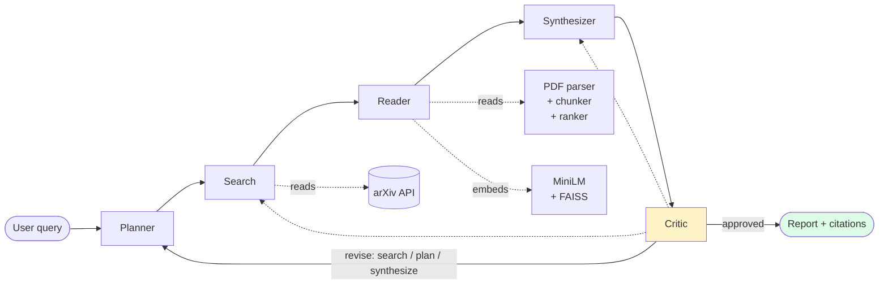
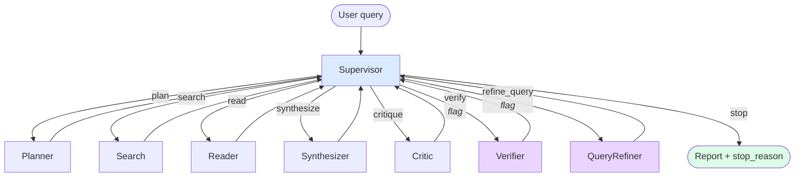
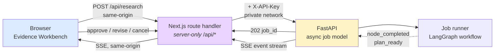
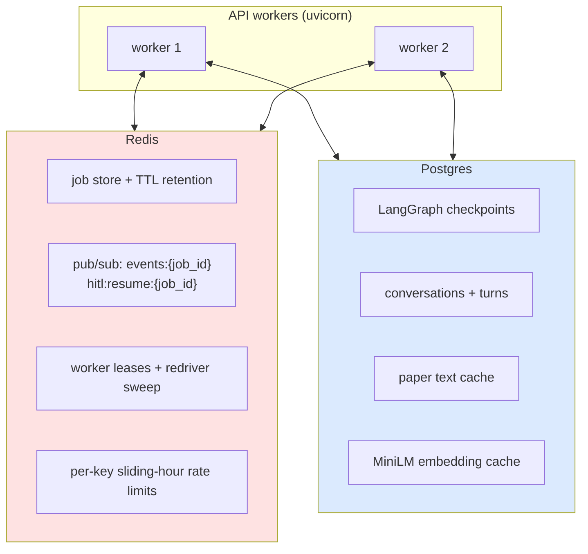
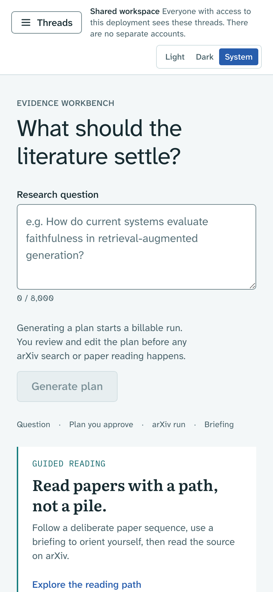

# arxiv-research-agent

[](https://github.com/kudratsingh/arxiv-research-agent/actions/workflows/ci.yml)
[](pyproject.toml)
[](web/package.json)
[](web/package.json)

A multi-agent research assistant for ML/AI papers, and the operable
surface around it. Ask a research question in natural language; the
system plans the search, **pauses for you to approve or rewrite that
plan before it spends anything**, searches arXiv (optionally enriching
through Semantic Scholar's citation graph), reads each paper's full
text, synthesizes a briefing with citations, and self-critiques for
quality. The workflow is orchestrated with LangGraph and Claude and
ships behind a FastAPI async job API with SSE streaming and a Next.js
browser client — the **Evidence Workbench** — so a run is something you
watch and steer, not a black box you wait on.


Under the fixed pipeline (Sprint 1 shape) it's a five-agent DAG with one
conditional edge on the critic. Behind opt-in flags it becomes an
agentic supervisor loop with runtime faithfulness verification,
evidence-grounded synthesis, and search-layer / read-layer recovery
actions. Every stateful concern has a pluggable Redis/Postgres backend
(jobs, checkpoints, conversations, caches, rate limits), workers hold
leases with a redriver for crash recovery, and everything emits
structured JSON logs plus OpenTelemetry traces and metrics.

## Architecture

### The workflow — two shapes

The comparison is the point: the same agents, rewired from a fixed graph
into an observe-decide-act loop, so a Sprint 1 baseline and a supervisor
run stay directly comparable.

**Fixed pipeline — Sprint 1 baseline (default)**


```mermaid
flowchart LR
    User([User query]) --> Planner
    Planner --> Search
    Search --> Reader
    Reader --> Synthesizer
    Synthesizer --> Critic
    Critic -->|approved| Output([Report + citations])
    Critic -->|revise: search / plan / synthesize| Planner
    Critic -.-> Search
    Critic -.-> Synthesizer

    Search -.reads.-> ArXiv[(arXiv API)]
    Reader -.reads.-> PDF[PDF parser<br/>+ chunker<br/>+ ranker]
    Reader -.embeds.-> Emb[MiniLM<br/>+ FAISS]

    style Critic fill:#fef3c7
    style Output fill:#dcfce7
```

Every agent reads from and writes to a shared `ResearchState`
(`src/graph/state.py`). Loops back to the planner / search / synthesizer
when the critic flags revision, capped at `settings.max_iterations`.

**Supervisor loop — Sprint 2+ (opt-in)**


```mermaid
flowchart TB
    User([User query]) --> Supervisor
    Supervisor -->|plan| Planner
    Supervisor -->|search| Search
    Supervisor -->|read| Reader
    Supervisor -->|synthesize| Synthesizer
    Supervisor -->|critique| Critic
    Supervisor -->|verify<br/><i>flag</i>| Verifier
    Supervisor -->|refine_query<br/><i>flag</i>| QueryRefiner
    Supervisor -->|stop| Output([Report + stop_reason])

    Planner --> Supervisor
    Search --> Supervisor
    Reader --> Supervisor
    Synthesizer --> Supervisor
    Critic --> Supervisor
    Verifier --> Supervisor
    QueryRefiner --> Supervisor

    style Supervisor fill:#dbeafe
    style Verifier fill:#e9d5ff
    style QueryRefiner fill:#e9d5ff
    style Output fill:#dcfce7
```

Every action node hands control back to the supervisor, which picks the
next action from a strict enum with budget short-circuits and fail-safe
fallback routing. See ADR
[0014](docs/decisions/0014-supervisor-loop-behind-flag.md).

### The production surface — request path

What actually runs in the compose stack. The browser never holds an API
key and never talks to FastAPI directly: every call is same-origin to
`/api/*`, and a server-only Next.js route handler forwards it over the
private Compose network, injecting `X-API-Key` where the deployment
requires one.


```mermaid
flowchart LR
    Browser["Browser<br/>Evidence Workbench"]
    Proxy["Next.js route handler<br/><i>server-only</i> /api/*"]
    API["FastAPI<br/>async job model"]
    Runner["Job runner<br/>LangGraph workflow"]

    Browser -->|"POST /api/research<br/>same-origin"| Proxy
    Proxy -->|"+ X-API-Key<br/>private network"| API
    API -->|"202 job_id"| Proxy
    API --> Runner
    Runner -.->|"node_completed<br/>plan_ready"| API
    API -->|"SSE event stream"| Proxy
    Proxy -->|"SSE, same-origin"| Browser
    Browser -->|"approve / revise / cancel"| Proxy

    style Browser fill:#dbeafe
    style Proxy fill:#e9d5ff
    style API fill:#fef3c7
```

`POST /research` returns `202` with a `job_id` immediately. Because HITL
is on by default the run stops after the planner and emits `plan_ready`;
the workbench renders the plan editor and the job goes nowhere until
someone approves, revises or cancels. Reattaching to the stream replays
the terminal frame for a finished job and `plan_ready` for one awaiting
review, so a dropped connection mid-review is recoverable. ADRs
[0025](docs/decisions/0025-fastapi-async-job-model.md),
[0026](docs/decisions/0026-sse-streaming-endpoint.md),
[0029](docs/decisions/0029-nextjs-web-ui.md),
[0030](docs/decisions/0030-hitl-plan-review.md).

### The production surface — state and durability

Nothing durable lives in a worker's memory, which is what makes multiple
uvicorn workers safe and a crashed worker recoverable rather than a lost
job.


```mermaid
flowchart TB
    subgraph Workers["API workers (uvicorn)"]
        W1[worker 1]
        W2[worker 2]
    end

    subgraph Redis["Redis"]
        R1["job store + TTL retention"]
        R2["pub/sub: events:{job_id}<br/>hitl:resume:{job_id}"]
        R3["worker leases + redriver sweep"]
        R4["per-key sliding-hour rate limits"]
    end

    subgraph Postgres["Postgres"]
        P1["LangGraph checkpoints"]
        P2["conversations + turns"]
        P3["paper text cache"]
        P4["MiniLM embedding cache"]
    end

    W1 <--> Redis
    W2 <--> Redis
    W1 <--> Postgres
    W2 <--> Postgres

    style Redis fill:#fee2e2
    style Postgres fill:#dbeafe
```

SSE streaming and HITL resume both work across workers via Redis pub/sub
— no sticky routing required — and a running job holds a TTL'd lease so
a redriver sweep reclaims jobs orphaned by a dead worker instead of
leaving them `running` forever. The compose stack wires all of this up
automatically; local dev outside compose defaults to an in-memory job
store, SQLite checkpoints and a disk paper cache, so a checkout with
neither Redis nor Postgres runs the Sprint 1 storage path unchanged.
Those three defaults are read back out of this sentence by
`tests/test_documented_claims.py::TestTheStandaloneDefaults`, and
asserted as values by
`tests/test_config.py::TestDefaults::test_standalone_storage_defaults`.
Byte-identical *output* is not claimed: no Sprint 1 artifact is kept
anywhere here to diff against and the outputs are model-generated, so
that half of the earlier wording was never measurable by anything. ADRs
[0027](docs/decisions/0027-docker-compose-redis-job-store.md),
[0028](docs/decisions/0028-postgres-paper-cache-and-embedding-cache.md),
[0032](docs/decisions/0032-conversation-mode.md),
[0034](docs/decisions/0034-postgres-checkpointer-and-cross-worker-hitl.md),
[0035](docs/decisions/0035-cross-worker-sse-pubsub.md),
[0037](docs/decisions/0037-redis-rate-limiter-and-keystore-reload.md),
[0038](docs/decisions/0038-job-redriver-and-sse-stream.md).

## The web UI — Evidence Workbench

A Next.js 16 App Router client (TypeScript, Tailwind, token-driven
theming with light / dark / system) that treats a research run as
evidence you can inspect rather than a spinner you wait on. It runs as
its own compose service on `:3000`.

**Ask a question.** The landing composer states the cost boundary before
you spend anything: generating a plan starts a billable run, and you
review that plan before any arXiv search or paper reading happens.


**Approve the plan before anything is spent.** HITL is on by default, so
the run parks at `plan_ready` and the plan editor opens. Sub-questions
and arXiv queries are both editable, addable and removable; the run is
paused and not spending while it waits, and it stops on its own if
nobody reviews it. Above it the checkpoint spine shows where the run
actually is — `Question observed`, `Plan waiting for your review`, `Run`
and `Report` not yet observed — and the diagnostics disclosure lists the
raw SSE frames behind that state.


**Read the briefing.** The report reader renders the markdown with a
section rail for navigation and a metrics strip carrying the run's
iterations, quality score, cost, LLM calls and duration. Export
discloses markdown, PDF and DOCX. A partial briefing from a failed run
is still shown and still exportable — a partial answer you paid for is
not the same thing as no answer.

**Dark mode is a first-class theme**, not an inverted filter: the whole
palette is defined in design tokens and contrast-checked in both themes
by an axe sweep that runs over every UI state on every PR.


**It works at 390 px.** The shell collapses the thread rail into a
drawer and the workbench keeps a usable work surface at the narrow
widths the design audit targets.



The browser tier that produces this UI's evidence — Playwright plus
`@axe-core/playwright` against a seeded local stack — is documented in
[`web/e2e/README.md`](web/e2e/README.md). The design campaign behind the
redesign (brief, tokens, architecture, work orders, gate reviews) is
[`docs/revamp/STATUS.md`](docs/revamp/STATUS.md).

> **Screenshots** are captured from the seeded local Compose stack with
> `ANTHROPIC_API_KEY=local-preview-disabled`. The fixtures are written
> directly into Postgres and Redis, never through `POST /research`, so
> no model call was made to produce them. That mechanism is read back —
> `tests/test_documented_claims.py::TestTheScreenshotMechanism` holds
> the seed script to writing behind the API and the stack to the
> sentinel key, and `web/tests/ci.test.ts` holds CI to handing the e2e
> stack that same key rather than the repository secret. **What nothing
> checks is that these particular PNGs came out of that stack**: no
> test binds a committed image to a run, so a hand-edited screenshot
> would pass everything above. The seeded thread was created outside a
> live session, which is why its checkpoint spine honestly reports `No
> longer available` rather than inventing a history.

## What lives behind flags

Every feature added after Sprint 1 is behind an independent flag so
comparisons against the Sprint 1 baseline stay apples-to-apples.
`Settings` declares **nineteen `enable_*` flags**, and the **eight** of
them in the table below are the Sprint 2-3 workflow-behavior set: every
one of those defaults **off**, and every one can be switched on by
itself, which is what *independent* is asserted to mean here. (The
ninth row is `<agent>_model`, seven model-routing fields rather than a
flag.) Full list in `src/config.py`.

| Flag | Sprint | What it enables | ADR |
|---|---|---|---|
| `enable_supervisor` | 2 | Observe-decide-act loop replaces the fixed DAG | [0014](docs/decisions/0014-supervisor-loop-behind-flag.md) |
| `enable_verifier` | 2 | `verify` action + runtime faithfulness judge | [0015](docs/decisions/0015-verifier-agent-runtime-faithfulness.md) |
| `enable_evidence_store` | 2 | Reader emits `EvidenceClaim`s; verifier judges chunks | [0016](docs/decisions/0016-evidence-store-source-text-verifier.md) / [0017](docs/decisions/0017-synthesizer-evidence-swap.md) |
| `enable_query_refiner` | 2 | `refine_query` recovery action | [0018](docs/decisions/0018-query-refiner-recovery-action.md) |
| `enable_reader_recovery` | 2 | Reader flags gaps; ranker biases re-reads by section | [0019](docs/decisions/0019-reader-requests-more-chunks.md) |
| `enable_prompt_isolation` | 2 | Untrusted-content tags + sanitization on reader | [0020](docs/decisions/0020-prompt-injection-isolation-reader.md) |
| `<agent>_model` (7 fields) | 3 | Per-agent Claude model routing | [0021](docs/decisions/0021-cost-aware-model-routing.md) |
| `enable_prompt_caching` | 3 | Anthropic ephemeral cache on system prompts | [0022](docs/decisions/0022-anthropic-prompt-caching.md) |
| `enable_semantic_scholar` | 3 | One-hop reference enrichment on top of arXiv | [0023](docs/decisions/0023-semantic-scholar-citation-graph.md) |

The table stops at Sprint 3 because it tracks *workflow-behavior*
flags — the ones that change what the agents do and so must stay
independently toggleable for A/B eval runs. The other **eleven**
`enable_*` flags are named here rather than left implicit, because a
flag nobody lists is a switch nobody knows to throw. Four are API and
infrastructure concerns that default **on** (`enable_hitl`,
`enable_checkpointing`, `enable_job_redriver`, `enable_retry_budget`);
three default off and change no agent behaviour (`enable_api_auth`,
`enable_tracing`, `enable_metrics`); and four are the learning
platform's ladder, all off and deliberately **not** independent of one
another — `enable_learner_profile` needs `enable_api_auth`,
`enable_session_loop` needs `enable_learner_profile`, and
`enable_assessment_judge` needs `enable_session_loop`, while
`enable_learn_content` stands alone.

`tests/test_documented_claims.py::TestTheFlagSet` holds those two
paragraphs against `Settings` in both directions, so a flag added to
`src/config.py` and to no document goes red. What it cannot see is a
*feature* shipped with no flag at all — nothing enumerates features —
so the sentence at the top of this section is enforced in one
direction only. The full settings surface is `src/config.py`. Full
design log in
[`docs/decisions/`](docs/decisions/README.md); the sprint-by-sprint
roadmap lives in [`planning/03-roadmap.md`](planning/03-roadmap.md).

## How this was built

Every non-trivial decision in this repo has an Architecture Decision
Record — an extensively ADR-documented build in
[`docs/decisions/`](docs/decisions/README.md) covering everything from
"why roll our own chunker" (0002) to "why the container bakes MiniLM
weights at build time" (0053) to "where the production trust boundary
sits" (0054). The ADR index plus the dated log in
[`planning/03-roadmap.md`](planning/03-roadmap.md) reconstruct the
entire build sequence: what was decided, when, what the alternatives
were, and what broke along the way. The frontend redesign has its own
gated campaign record — discovery, design brief, architecture, work
orders, independent gate reviews and a decision log — under
[`docs/revamp/`](docs/revamp/STATUS.md).

## Demo

See [`docs/demo.md`](docs/demo.md) for a full example run across all
three surfaces — CLI, HTTP API and the browser workbench: the query, the
report the workflow produced, and the per-query line from
`summary.jsonl` with metrics + cost + latency.

## Quickstart

### Docker — the whole stack

Four services: the FastAPI app, the Next.js web UI, Redis (job store,
SSE/HITL pub/sub, rate limiter) and Postgres (checkpoints,
conversations, paper + embedding caches).

```bash
export ANTHROPIC_API_KEY=sk-ant-...
docker compose up --build
# → http://localhost:3000/         → Evidence Workbench
# → http://localhost:8000/healthz  → 200
# → http://localhost:8000/docs     → OpenAPI UI
```

`ANTHROPIC_API_KEY` is the only required host variable. The compose file
publishes `APP_PORT` (default 8000) and `WEB_PORT` (default 3000) to
**loopback**; Redis and Postgres stay on the internal Compose network.
Set `APP_BIND_ADDRESS` or `WEB_BIND_ADDRESS` explicitly only when a
trusted network genuinely needs a broader bind. Named volumes
`redis-data` + `postgres-data` persist state across `docker compose
down`; `down -v` wipes them.

For the production single-VPS path, use the hardened Caddy overlay and
runbook in [`deploy/hetzner/`](deploy/hetzner/README.md). It removes the
app/web host ports, forces API auth, parameterizes the database secret,
and publishes only HTTPS through Caddy (ADR
[0054](docs/decisions/0054-hetzner-production-boundary.md)).

### Python only — the CLI

Requires Python 3.11+ (the container images build on `python:3.14-slim`).

```bash
make install        # fresh .venv + runtime deps (editable)
make install-dev    # + dev deps (pytest, mypy, ruff)

cp .env.example .env
# edit .env and set ANTHROPIC_API_KEY=sk-ant-...

python -m src.main "What are the latest approaches to reducing hallucination in LLMs?"
```

The final markdown report is printed to stdout and saved to
`outputs/report_<timestamp>.md`.

If arXiv is rate-limiting or unavailable, force the built-in mock papers
instead of a live search with `USE_MOCK_DATA=true`. To run the agentic
shape:

```bash
ENABLE_SUPERVISOR=true \
ENABLE_VERIFIER=true \
ENABLE_EVIDENCE_STORE=true \
python -m src.main "..."
```

### The web UI outside Docker

Requires Node 22+.

```bash
cd web
npm install
npm run dev
# → http://localhost:3000/
```

The proxy defaults to `http://localhost:8000` outside Compose, so run
`python -m src.api.serve` alongside it. For an auth-on API, set
`ARXIV_API_KEY` in the Next.js **server** environment; it is never a
`NEXT_PUBLIC_*` value and never reaches browser JavaScript.

## HTTP API

FastAPI surface layered on top of the workflow. Async job model — submit
a query, get a `job_id`, poll for the result or stream events over
Server-Sent Events.

```bash
python -m src.api.serve                       # bind 127.0.0.1:8000
# or override host/port via env:
API_HOST=0.0.0.0 API_PORT=8080 python -m src.api.serve
```

### Endpoints

| Method | Path | Purpose |
|---|---|---|
| `POST` | `/research` | Submit a query. Body: `{query, hitl_bypass?: bool}`. Returns 202 with `job_id`, `status_url`, `stream_url`. |
| `GET`  | `/research/{job_id}` | Full lifecycle snapshot (status, result, error, cost, metrics, `plan` when awaiting review). |
| `POST` | `/research/{job_id}/review` | Resolve a `pending_review` job. Body: `{action: "approve"\|"revise"\|"cancel", plan?}`. See ADR [0030](docs/decisions/0030-hitl-plan-review.md). |
| `GET`  | `/research/{job_id}/export?format=md\|pdf\|docx` | Download the report in the requested format. See ADR [0031](docs/decisions/0031-multi-format-export.md). |
| `POST` | `/conversations` | Create a conversation thread. Body: `{title?}`. See ADR [0032](docs/decisions/0032-conversation-mode.md). |
| `GET`  | `/conversations` | List conversations (no job bodies). |
| `GET`  | `/conversations/{id}` | Full thread with every job's report. |
| `DELETE` | `/conversations/{id}` | Delete a conversation + all its jobs (CASCADE). |
| `GET`  | `/learn/paths`, `/learn/paths/{path_id}` | Published reading paths, read-only. Off unless `enable_learn_content`. |
| `GET/PUT/DELETE` | `/learn/profile` | Per-principal learner record. Off unless `enable_learner_profile` (which requires `enable_api_auth`). See ADR [0058](docs/decisions/0058-learner-profile-store-and-provenance.md). |
| `GET`  | `/learn/progress` | The principal's append-only progress ledger. Same gate as the profile. |
| `POST` | `/learn/sessions` | Start one guided-read session (a `kind="session"` job). Off unless `enable_session_loop`. See ADR [0057](docs/decisions/0057-job-kinds-and-awaiting-learner.md). |
| `GET`  | `/learn/sessions/{session_id}` | Session snapshot: lifecycle and the parked `turn` from the job row, plus `transcript` / `transcript_status` / `assessment_status` rehydrated from the LangGraph checkpoint. This is what makes a mid-session reload work. |
| `POST` | `/learn/sessions/{session_id}/turn` | Resume a session parked in `awaiting_learner`. Body: `{message, end_session?: bool}`. |
| `GET`  | `/research/{job_id}/stream` | SSE event stream: `job_started` → N × `node_completed` (+ `plan_ready` when HITL is on, `turn_ready` for a guided session) → terminal frame. Reconnect-safe: attaching replays the terminal frame for a finished job, `plan_ready` for one awaiting review and `turn_ready` for one awaiting a learner. |
| `GET`  | `/healthz` | Liveness + per-dependency status + concurrency headroom. Always 200; `status: degraded` in the body when a dependency is down. |
| `GET`  | `/docs` | Auto-generated OpenAPI docs. |

### HITL plan review

`enable_hitl` is on by default. Every `POST /research` pauses after the
planner in `pending_review`; the client either approves as-is, revises
`{sub_questions, search_queries}`, or cancels. The workbench renders the
plan editor when this state is reached. Programmatic callers (eval
runner, CLI, custom clients) skip the pause via `hitl_bypass: true` on
the request body, or by setting `ENABLE_HITL=false` globally.

### Example

`enable_hitl` defaults to on, so a plain `POST /research` parks the job
in `pending_review` and waits up to `api_hitl_timeout_sec` (30 minutes)
for a decision. Pass `hitl_bypass: true` for a non-interactive one-shot:

```bash
# submit — hitl_bypass runs planner → report with no review pause
curl -s -X POST localhost:8000/research \
  -H 'content-type: application/json' \
  -d '{"query": "chain-of-verification for hallucination", "hitl_bypass": true}' | jq .
# → {"job_id": "abc123...", "status_url": "/research/abc123...", ...}

# poll
curl -s localhost:8000/research/abc123... | jq .status

# stream
curl -N localhost:8000/research/abc123.../stream
# → event: job_started
#    data: {"job_id": "abc123...", "query": "..."}
#    ...
#    event: job_completed
#    data: {"iterations": 1, "quality_score": 0.9, "cost_usd": 0.087, ...}
```

With the review pause left on, the stream stops at `plan_ready` and the
job goes nowhere until the plan is resolved:

```bash
# submit without the bypass
JOB=$(curl -s -X POST localhost:8000/research \
  -H 'content-type: application/json' \
  -d '{"query": "chain-of-verification for hallucination"}' | jq -r .job_id)

# stream in one shell — pauses after the planner
curl -N localhost:8000/research/$JOB/stream
# → event: job_started
#    ...
#    event: plan_ready
#    data: {"job_id": "abc123...", "plan": {"sub_questions": [...], "search_queries": [...]}}

# approve in another shell — the same open stream then resumes and
# ends on job_completed
curl -s -X POST localhost:8000/research/$JOB/review \
  -H 'content-type: application/json' \
  -d '{"action": "approve"}' | jq .
```

Concurrency is bounded per process by `API_MAX_CONCURRENT_JOBS`
(default 10) via `asyncio.Semaphore`; per-job timeout by
`API_JOB_TIMEOUT_SEC` (default 600). Jobs live in an in-memory store by
default; set `JOB_STORE=redis` + `REDIS_URL=redis://...` to swap in the
Redis-backed store for horizontal scaling and durability across worker
restarts (the compose stack wires this up automatically).

## Tests and CI

Every PR and every push to `main` runs **nine parallel jobs**, with no
`needs:` edge between any of them: ruff, strict mypy, the whole Python
suite (**over 3,300 tests**, every tier including `e2e`, under enforced
project, per-package and patch coverage floors, publishing the
adversarial suite's attack-success rate as an artifact), a Docker image
build with base and production compose-file
validation, a web image smoke test probing `/` and `/api/healthz`
through the proxy, the web tier (TypeScript, ESLint, generated-type
drift, **3,380 Vitest tests across 155 files** with coverage floors, and
a production build with per-route JS budgets), the dependency-audit gate
in its own bounded job, the Storybook static build with story tests, and
Playwright + `@axe-core/playwright` against a seeded Compose stack
pinned to a deliberately invalid API key. The same workflow runs
nightly with the full browser matrix (firefox, webkit and two device
profiles) instead of chromium alone — the tiers, what fails each one,
and the local equivalents are in [`docs/testing.md`](docs/testing.md).

Every number in that paragraph is now read back out of it by
[`tests/test_documented_claims.py`](tests/test_documented_claims.py) and
checked against the thing it describes. Both counts that stood here
before were wrong, and one of them went stale twice in a single week —
which is what a number nobody reads back does. The Python figure is a
**floor** and the Vitest figure an **equality**, deliberately: the
Python suite grows on most pull requests, so an equality would make
every one of them edit this paragraph, while the Vitest count of record
moves only when somebody re-seeds the coverage thresholds in
`web/vitest.config.mts` — which is where the test reads it from, rather
than from a browser run this tier has no business starting. That makes
the Vitest figure an agreement between two documents, so two further
checks keep the source of truth from rotting quietly: the note is
pinned to the coverage thresholds seeded under it, and its file count
is banded against the test files actually on disk.

The audit is a job of its own because it is the only web gate whose
answer comes from a remote service: on 2026-09-04 npm's advisory
endpoint degraded, an unbounded audit call spent the whole `web` job
ceiling, and four gates that had nothing to do with the registry were
cancelled without ever reporting. It is still a hard gate — an audit
that could not run is red — and every network step in the workflow now
carries its own timeout.

```bash
pytest tests/ -q -m "not e2e"        # the Python half of the gate
```

Two things worth stating plainly rather than leaving to inference. The
good one: **no tier under `web/` ever makes a paid model call**, and
three independent mechanisms enforce that rather than one convention —
the Compose overlay pins an invalid key, the Playwright config
overwrites the variable before any test loads, and the submit leg is
fulfilled in the browser so it never reaches the backend. The gap, and
it is narrower than this page claimed for months: the Python **`e2e`
tier is built and gates every pull request** — **sixteen tests across
four modules** under `tests/e2e/`, driving the real graphs through the
real ASGI app in about five seconds, run by `make test-e2e` as a step of
the `tests` job. What the tier does not have is **recorded cassettes**:
every one of those tests runs on mock mode and canned agent output, by
decision, so nothing in this repository replays a real provider
response. Provider-shaped drift — a changed error body, a changed
refusal, a changed tool-call envelope — is uncovered here and by a
nightly eval that has never run green (below), so treat changes at that
boundary with extra review care.

**How do you know?** [`docs/assurance/`](docs/assurance/README.md) is the
index that answers that question. It carries a claim → enforcement table —
every claim in this README and in `docs/architecture.md`, and the test, gate
or instrument that fails when it stops being true — plus a **system** card
(this project trains no model), a data-provenance record on the NIST AI 300-1
field set, and a framework mapping across NIST, OWASP, ISO 42001 and the EU AI
Act. Read the **Partial** rows first, and the one claim that is still false.
Nothing-enforces is down to zero — every sentence in that table now has
something behind it, read back out of the prose by
[`tests/test_documented_claims.py`](tests/test_documented_claims.py) — but
twenty-one claims have *less* behind them than the sentence says, and each
of those rows names its own gap. The residue is the interesting part:
nothing binds the committed screenshots to a run, no test can see a feature
that shipped with no flag at all, the nightly eval's real state lives in
GitHub's settings rather than in this tree, and "every non-trivial decision
has an ADR" has a forward half no test will ever hold.

## Eval

Twenty benchmark queries covering hallucination, retrieval, alignment,
reasoning, efficiency, and safety topics
(`src/eval/benchmark_queries.py`). Four LLM-judged metrics — citation
accuracy, faithfulness, completeness, retrieval recall — plus critic
score, iteration count, LLM call count, and cost per query in
`summary.jsonl`. Full design in [`docs/eval.md`](docs/eval.md).

```bash
make eval                              # run the benchmark
make eval QUERIES=id1,id2              # subset by query id
python -m src.eval.runner --output-dir outputs/eval/<run> --resume   # re-enter an interrupted campaign
python -m src.eval.runner --max-budget-usd 25   # campaign spend ceiling
python -m src.eval.regression_diff \
  outputs/eval/<baseline>/summary.jsonl \
  outputs/eval/<candidate>/summary.jsonl
```

The runner is hardened for real campaigns (ADR
[0050](docs/decisions/0050-eval-runner-hardening.md)): each of the four
metrics is scored in its own guard (a broken judge costs one score, not
the query), results persist incrementally after every query, `--resume`
re-enters a partial run without re-spending, and `--max-budget-usd`
stops the campaign at a dollar ceiling. Distinct exit codes separate "a
query failed" from "budget hit" from "interrupted".

### Status: disabled, never run green — and no numbers to show

**The nightly eval workflow is disabled at the repository**
(`disabled_manually`) and stays that way until the owner's funding
decision; `.github/workflows/eval-nightly.yml` says so in its own
header, above a `cron:` that GitHub keeps in the file and ignores.
**Every run it did have failed — 54 of 54**, from 2026-07-07 to
2026-08-29, at a missing `ANTHROPIC_API_KEY` repository secret. The
harness is built and unit-tested and the README-updating step exists —
but **no campaign has ever produced a `summary.jsonl`**, so the
regression gate has never compared two real runs and there are no
quality numbers to publish here.

`docs/eval.md` §"Status: disabled, and no green campaign yet" is the
long form, and
`tests/test_documented_claims.py::TestTheNightlyEvalState` holds this
paragraph, that section and the workflow file to one story — the three
of them disagreed for months and nothing noticed. It cannot check the
state itself: `disabled_manually` is an attribute GitHub stores against
the workflow, not a field in the checkout, and the 54 runs live in
Actions history where no test reaches them.

There is deliberately **no eval badge** in this README: it would be red,
and a red badge for work that was never funded says the wrong thing.
There are also deliberately no placeholder numbers. Unblocking this
means paying for a 20-query campaign — a spend decision reserved for the
repository owner, not something an implementer takes. Consequences and
the run-book are in [`docs/eval.md`](docs/eval.md).

Run the benchmark yourself with `make eval` and your own key if you want
numbers before then.

The block below is the one the nightly workflow patches
(`src/eval/readme_update.py` replaces everything between the markers).
It is empty because nothing has ever been measured — not because the
row was trimmed for space.

<!-- eval-nightly:start -->
_Auto-updated by the nightly eval workflow. No campaign has completed, so this row has never been populated._

| Queries | Mean citation | Mean faithfulness | Mean completeness | Mean recall | Mean cost | Mean latency | Last run |
|---|---|---|---|---|---|---|---|
| - | - | - | - | - | - | - | (never run) |
<!-- eval-nightly:end -->

## Production considerations

Grouped by the operational concerns any production-scale AI system has
to answer. Every tunable is one env-var away — see `src/config.py`.

**Rate limits**
- Anthropic: SDK-native retries with exponential backoff on 408 / 409 / 429 / 5xx (ADR [0009](docs/decisions/0009-anthropic-sdk-native-retry.md)); default 4 retries, 120s timeout.
- arXiv API + PDFs: `urllib3.Retry` with `Retry-After` honored, backoff bounded (ADR [0013](docs/decisions/0013-sprint-1-finish-retry-checkpoint-tracing-recall.md)). Semantic Scholar (ADR [0023](docs/decisions/0023-semantic-scholar-citation-graph.md)) shares the retry adapter; failure-tolerant fallback to arXiv-only.

**Retries and timeouts**
- Per-run: `settings.anthropic_max_retries`, `settings.http_max_retries`, `settings.anthropic_timeout_sec`.
- Per-job HTTP: `settings.api_job_timeout_sec` (default 600s) caps workflow wall clock; `settings.api_hitl_timeout_sec` (default 1800s) caps human review time (ADR [0030](docs/decisions/0030-hitl-plan-review.md)).

**Caching**
- Anthropic prompt caching on system prompts, behind `enable_prompt_caching` (ADR [0022](docs/decisions/0022-anthropic-prompt-caching.md)). Cache-read tokens billed at 10%; per-run cost accumulator surfaces the breakdown.
- Paper cache (extracted PDF text) — disk by default, Postgres in compose (ADR [0028](docs/decisions/0028-postgres-paper-cache-and-embedding-cache.md)).
- Embedding cache (MiniLM vectors) keyed on `(content_hash, model_name)` — a model swap invalidates implicitly (ADR [0028](docs/decisions/0028-postgres-paper-cache-and-embedding-cache.md)).
- API job store — in-memory or Redis (ADR [0027](docs/decisions/0027-docker-compose-redis-job-store.md)). Redis TTL enforces retention; horizontal API workers share the store.

**Cost**
- Per-run cost tracking with per-model breakdown surfaces in `summary.jsonl` and the API's `JobDetail`, and in the workbench's metrics strip.
- HITL is the first-order cost control: the run pauses before any search or paper read, so a bad plan costs one planner call rather than a full campaign.
- Cost-aware routing: per-agent Claude model overrides (ADR [0021](docs/decisions/0021-cost-aware-model-routing.md)) — the recommended mapping puts Haiku on the reader, supervisor and query refiner. **The saving is modelled, not measured, and the quality half is not measured at all.** The model is arithmetic you can check: `src/observability/costs.py` prices Haiku 4.5 at exactly one third of Sonnet 4.6 per token, input and output alike, so moving a share *s* of a run's token spend onto Haiku cuts the total by two thirds of *s* — **50-60% if those three agents carry 75-90% of it**, which is what ADR 0021 argues from call volume ("Reader alone is 60%+ of a typical run's spend") and never measured. Nothing in this repository has ever priced a run under the routed mapping, and "baseline quality preserved" — the previous wording — has no artifact behind it: ADR 0021 defers that evidence to paired-diff eval runs, and no eval campaign has ever completed (see the eval status above).
- The nightly regression diff (`src/eval/regression_diff.py`) is written to fail the workflow on cost creep > 25% (ADR [0010](docs/decisions/0010-nightly-eval-ci.md)) — designed and unit-tested, but never exercised against two real runs (see the eval status above).

**Failure handling**
- Reader falls back to abstract when PDF fetch / extract / chunk / rank yields nothing (ADR [0004](docs/decisions/0004-reader-fulltext-with-abstract-fallback.md)).
- Eval runner isolates per-query failures — a broken query captures its traceback and continues (ADR [0008](docs/decisions/0008-eval-runner-sequential-per-query-isolation.md)).
- Runs are checkpointed so an interrupted workflow resumes on the same `thread_id`. Backend selected by `settings.checkpoint_backend` — `sqlite` (default, per-worker) or `postgres` (shared across API workers; required for multi-worker HITL). See ADRs [0013](docs/decisions/0013-sprint-1-finish-retry-checkpoint-tracing-recall.md) and [0034](docs/decisions/0034-postgres-checkpointer-and-cross-worker-hitl.md).
- API jobs never lose data on the runner side — every failure mode (`HitlTimeoutError`, `HitlCancelledError`, generic `Exception`, `asyncio.CancelledError`, wall-clock timeout) lands on the `Job` record before propagating.
- Under `JOB_STORE=redis`, each running job holds a TTL'd worker lease; a redriver sweep at startup and every `job_redrive_interval_sec` reclaims jobs orphaned by a dead worker instead of leaving them `running` forever (ADRs [0038](docs/decisions/0038-job-redriver-and-sse-stream.md), [0048](docs/decisions/0048-redriver-cas-and-store-edges.md)).
- The browser client has its own recovery surfaces: route error boundaries, a reconnecting stream, and a diagnostics disclosure that copies the last 200 SSE frames with no question or briefing text in them.

**Observability**
- Structured JSON logs with per-run `run_id` propagated through ContextVars (ADR [0012](docs/decisions/0012-observability-core-logging-costs.md)). Every LLM call records to the per-run cost accumulator.
- OpenTelemetry spans around each agent node behind `enable_tracing` (ADR [0013](docs/decisions/0013-sprint-1-finish-retry-checkpoint-tracing-recall.md)).
- OpenTelemetry **metrics** behind `enable_metrics` (ADR [0049](docs/decisions/0049-otel-metrics.md)): job submissions / completions / duration, LLM spend, in-flight job concurrency, and rate-limit rejections. Exported to `otel_exporter_endpoint` (shared with tracing) every `otel_metric_export_interval_sec`.
- `/healthz` reports each dependency's status in its body, and logs one WARNING per transition into degraded (never per probe) naming the dependency (ADR [0053](docs/decisions/0053-api-web-container-preflight.md)).

**Security**

The threat model starts from the fact that arXiv PDFs are untrusted
input: anyone can publish a paper, and paper text flows into Claude
calls whose output steers the workflow. The documented defenses
([`docs/security.md`](docs/security.md)):

- Prompt-injection isolation on the reader — untrusted PDF text is wrapped in `<untrusted_paper>` tags with control-string sanitization (ADR [0020](docs/decisions/0020-prompt-injection-isolation-reader.md)); conversation `prior_context` gets the same treatment on the planner (ADR [0033](docs/decisions/0033-safety-hardening-bundle.md)).
- Runtime faithfulness verifier flags unsupported claims post-synthesis (ADR [0015](docs/decisions/0015-verifier-agent-runtime-faithfulness.md)); evidence-store (ADR [0016](docs/decisions/0016-evidence-store-source-text-verifier.md)) grounds each claim in a specific chunk.
- API-key auth (`ENABLE_API_AUTH` + `X-API-Key`, constant-time compare), per-key sliding-hour rate limiting (Redis-backed across workers), and a hot-reloadable file keystore (ADRs [0033](docs/decisions/0033-safety-hardening-bundle.md), [0037](docs/decisions/0037-redis-rate-limiter-and-keystore-reload.md)).
- Per-principal scoping — an API key only sees its own jobs and conversations (ADR [0036](docs/decisions/0036-per-principal-store-scoping.md)).
- Resource guardrails: per-run cost cap enforced between graph nodes (`MAX_COST_USD`), streamed PDF downloads aborted at `pdf_max_bytes` so an adversarial PDF can't OOM a worker (ADR [0033](docs/decisions/0033-safety-hardening-bundle.md)).
- The browser never holds a key: the Next.js proxy is server-only and injects `X-API-Key` on the private network (ADR [0029](docs/decisions/0029-nextjs-web-ui.md)).
- Auth is **off by default** for local dev. The Hetzner production overlay forces it on, and Caddy adds a separate human-facing login so an anonymous visitor cannot spend the Anthropic account's money (ADR [0054](docs/decisions/0054-hetzner-production-boundary.md)).

## Project status

**On `main`: Sprints 1–5, a sustained hardening chain, and the
front-end revamp's implementation set.** Sprint 1 shipped the
observability + eval substrate; Sprint 2 the supervisor loop + verifier
+ evidence store + recovery actions + prompt-injection isolation;
Sprint 3 cost-aware model routing + Anthropic prompt caching + Semantic
Scholar enrichment; Sprint 4 the deployable surface (PR CI, FastAPI
async jobs + SSE, Docker compose, Redis/Postgres backends); Sprint 5 the
product surface (web UI, HITL plan review, multi-format export,
conversation mode). The hardening chain (ADRs 0033–0054) then took the
system from "works" to "operable": auth + rate limiting + cost caps,
cross-worker HITL/SSE, per-principal scoping, job leases + redriver,
supply-chain pinning + lockfile, OTel metrics, eval-runner crash-safety,
and an end-to-end pre-flight of the shipped container + web path. Most
recently, the Evidence Workbench redesign landed as a gated campaign —
design tokens, a component library with Storybook, route composition,
route/bundle budgets, an axe gate with an empty allowlist, and the
seeded Playwright tier.

**In progress or planned — not on `main`, and not claimed above:**

| Work | State |
|---|---|
| Revamp hardening wave (a11y, visual regression, Lighthouse, legacy removal, ADRs) — WO-27–29, 31–33 | **In progress**, tracked in [`docs/revamp/STATUS.md`](docs/revamp/STATUS.md) |
| MT-01 — real multi-tenancy (per-user accounts, not the current shared workspace) | **PROPOSED only.** The proposal is merged; the decision is reserved for the repository owner |
| Hetzner deployment | **Planned, blocked.** The overlay and runbook exist; provisioning is a cost decision reserved for the owner |
| First funded eval campaign, and the results table it would populate | **Planned, blocked** on the same cost decision (see the eval status above) |
| Recorded cassettes for the Python `e2e` tier | **Not built.** The tier itself ships and gates every PR; what is missing is captured real provider responses to replay against — every e2e test runs on mock mode and canned agent output |

The dated per-merge log — and the authoritative list of what's next —
lives in [`planning/03-roadmap.md`](planning/03-roadmap.md); the
documentation index is [`docs/README.md`](docs/README.md); the frontend
campaign's own index is
[`docs/revamp/STATUS.md`](docs/revamp/STATUS.md).
