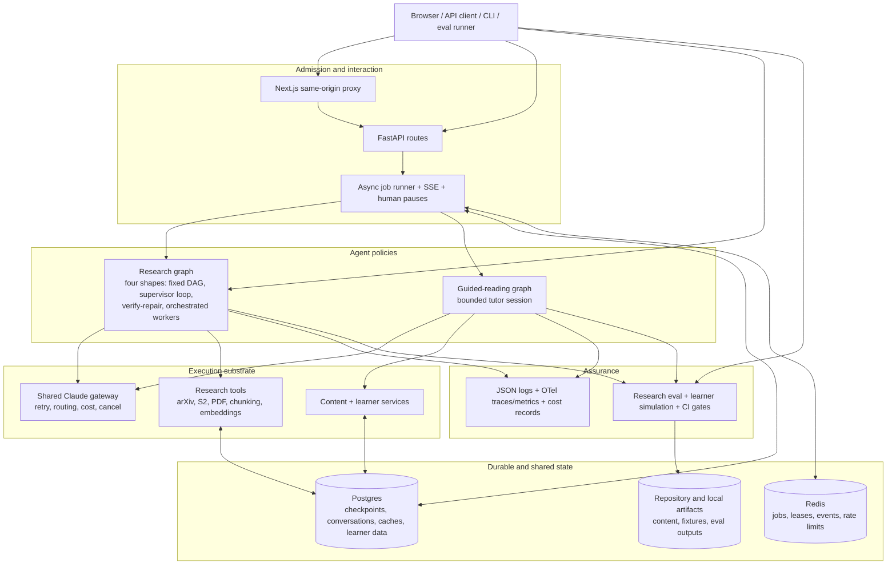
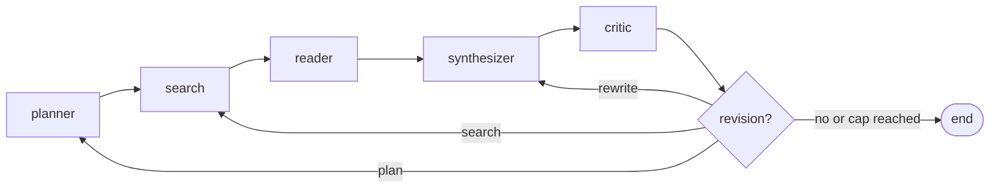
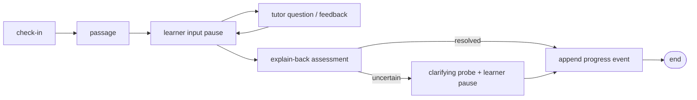

# Current architecture and capability map

Status: **CURRENT-STATE SNAPSHOT — NOT A TARGET DESIGN**

Snapshot: `main@a3b112f`, 2026-09-17

The code-level source of truth remains [`../architecture.md`](../architecture.md).
This page maps the same system in agent-engineering terms: control policy,
tools, evidence, memory, evaluation, and the improvement loop.

## 1. System context

The system is not one monolithic “research agent.” It is a product runtime
with two domain policies sharing the same operational substrate.

## 2. Research workflow

The research graph operates over the total `ResearchState` contract in
[`src/graph/state.py`](../../src/graph/state.py).

### Default path: deterministic graph with bounded revision

This path is predictable and is still the default. The critic can cause a
bounded re-entry, but this path itself runs no search over alternative plans or
candidate reports.

`src/graph/workflow.py` compiles **four** shapes in all, and the three below
the default are each flag-gated and off by default: the supervisor loop;
`research_policy=fixed_verify_repair`, which inserts an explicit `verify` node
with at most one deterministic `repair` and a re-verification (ADR 0076); and
`research_policy=orchestrated_workers`, which replaces the `search → reader`
leg with `planner → lead → workers → merge` (ADR 0086). With
`compute_controller=deterministic` the shape is chosen per job rather than per
process (ADR 0085), and with `orchestration=on` beside it the branch graph is
reachable to that controller as T2.

### Optional path: supervisor-controlled loop

With `enable_supervisor=true`, every completed action returns to a supervisor.
Its strict action space is `plan`, `search`, `read`, `synthesize`, `critique`,
and `stop`, with `verify` and `refine_query` added by separate flags. The loop
has cost, iteration, and quality short-circuits and deterministic fallbacks for
malformed routing output.

This is a real observe-decide-act loop, but it is not a learned policy. The
supervisor itself estimates no task difficulty and compares no candidate
trajectories — those belong to the compute controller and the listwise
selector, which refuse to load beside it — and nothing here predicts the value
of another tool call or optimizes a measured long-horizon reward.

### Agent and tool responsibilities

| Component | Current responsibility | Important engineering property |
|---|---|---|
| Planner | Decomposes the question into sub-questions and search queries | Can pause for human plan review in the API path |
| Search | Retrieves arXiv papers; optionally expands one-hop references through Semantic Scholar | Bounded fan-out and canonical deduplication |
| Reader | Downloads/parses PDFs, chunks and ranks text, analyzes papers in a bounded thread pool | Per-paper containment and abstract fallback |
| Evidence store | Emits typed claims linked to ranked source chunks | Present but feature-flagged |
| Synthesizer | Produces report and citations from analyses or evidence claims | One bounded retry for parse/output failure |
| Critic | Scores a draft and requests a targeted revision | In-loop self-judge; not an independent release evaluator |
| Verifier | Checks draft claims against evidence and recommends recovery | Optional supervisor action, model-based |
| Query refiner | Generates novel searches from coverage/evidence gaps | Deduplicates against attempted queries and fails closed |
| Supervisor | Selects the next action and stop reason | Strict enum, hard loop/cost caps, rule fallback |
| LLM gateway | Direct Anthropic calls, model routing, prompt caching, retry telemetry, cancellation and spend enforcement | Single choke point for all paid calls |
| Retrieval tools | arXiv, Semantic Scholar, HTTP/PDF parsing, section chunking, MiniLM/FAISS ranking, caches | Purpose-built scholarly retrieval rather than a general browser |

Detailed contracts are in [`../agents/`](../agents/).

## 3. Guided-reading workflow

The learning experience is deliberately a separate LangGraph over
`SessionState`, not tutoring nodes attached to the research graph.

Each learner turn is a durable LangGraph interrupt. The session reuses the
research job runner's leases, cancellation, timeout, cost accounting,
checkpointing, terminal persistence, and event stream. Learner claims and
progress events carry provenance and avoid unsupported mastery scores.

The learning loop currently supports bounded in-session adaptation. It does
not yet learn a policy from longitudinal outcomes, optimize a curriculum from
feedback, or update model weights.

## 4. Runtime and production substrate

| Concern | Implemented shape | Agent-engineering implication |
|---|---|---|
| Job execution | Async FastAPI jobs over synchronous graph nodes in a bounded executor | Long calls do not block the event loop; zombie work is measured |
| Durability | SQLite/local fallbacks; Postgres shared checkpoints and domain stores | Human pauses and cross-worker recovery are possible |
| Coordination | Redis jobs, pub/sub, leases, rate limiting, compare-and-set redrive | Multi-worker operation does not require sticky routing |
| Human control | Plan review and guided-session turns | Human input is part of the graph state rather than an out-of-band chat |
| Streaming | Snapshot-aware SSE with terminal and pause replay | The UI can recover without inventing internal state |
| Cost | Per-call and per-run limits with per-agent model routing | A future compute policy can be constrained at the same choke point |
| Safety | API auth/scoping, prompt isolation, SSRF and PDF limits, bounded inputs | Tool expansion must preserve these boundaries |
| Observability | Structured logs, run-scoped costs, node traces, runtime metrics | Useful operational telemetry exists, but full trajectories are not a training dataset |
| Frontend | Typed Next.js client, total job state machine, contract and browser tests | Agent state is presented conservatively and reloads are first-class |

## 5. Evaluation already present

The repository has more than a conventional unit-test suite:

- a 20-query research benchmark;
- five research metrics — citation resolution rate (deterministic, ADR 0074),
  citation accuracy (a regex diagnostic), and three LLM-judged ones
  (completeness, faithfulness, retrieval recall) — plus critic score,
  iterations, LLM-call count, and cost;
- per-query persistence, resume, judge-failure isolation, budget caps, and
  regression diffing;
- 15 guided-reading scenarios across learner personas and adversarial or
  honesty-sensitive situations;
- deterministic scripted sessions and recorded mock transcripts;
- model-judged session-plan, explain-back, and shame-free-copy metrics;
- extensive Python, contract, web, accessibility, performance, and container
  gates.

This is a strong base. The key current limitation is evidentiary: the funded
research and learning campaigns and human/judge calibration are still recorded
as deferred in [`../eval.md`](../eval.md) and the learning campaign status.
The existing regression thresholds are documented as priors rather than
variance estimates from repeated live runs.

## 6. Capability maturity

Legend: **operational** means implemented with production-oriented controls;
**partial** means implemented but optional, narrow, or not yet validated by a
funded campaign; **absent** means no current subsystem should be described as
providing it.

| Capability | Maturity | Evidence in the current system |
|---|---|---|
| Multi-step planning | Operational | Planner, critic-directed revision, human plan review |
| Dynamic agent routing | Partial | Flag-gated supervisor with strict actions and stop caps |
| Source-grounded synthesis | Partial | Full-text ranking and typed evidence claims exist; evidence path is flag-gated |
| Robust verification | Partial | Critic, verifier, deterministic citation metric; no verifier ensemble or calibrated abstention |
| Adaptive test-time compute | Partial | `compute_controller=deterministic` scores difficulty and routes a job to T0/T1/T2 (ADR 0085); flag-gated, default off, and never run for money |
| Parallel candidate search | Partial | The orchestrator-workers branch tier runs sibling candidates and a listwise selector picks among them with a marginal-stop record (ADRs 0086, 0091); flag-gated, default off. Reader parallelism still processes papers, not trajectories |
| General web deep research | Absent | arXiv + optional Semantic Scholar + paper PDFs, not persistent open-web browsing |
| General code/tool execution | Absent | Purpose-built internal tools only; no sandboxed Python/shell/research notebook tool |
| Episodic trajectory memory | Partial | A canonical append-only trajectory with a per-run hash chain and a durable sink now exists (P0-WO04/WO08); there is still no reward signal and nothing is training-eligible |
| Long-term learner memory | Partial | Provenance-aware profile and progress ledger, bounded in scope |
| Learning from user feedback | Absent | No explicit report rating/edit/citation feedback schema or training-consent path |
| Prompt/policy optimization | Absent | Changes are manually authored and promoted through ordinary tests |
| Fine-tuning / preference optimization | Absent | System consumes hosted foundation models; no train/evaluate/registry pipeline |
| Reinforcement learning | Absent | No agent environment, reward contract, credit assignment, or policy training |
| Autonomous self-improvement | Absent by design | No live self-modification; future proposals remain offline and gated |
| Agentic long-horizon eval | Partial | Durable jobs and session trajectories exist; benchmarks are short, bounded workflows |

## 7. Current strengths to preserve

- **Truthful state presentation.** The UI distinguishes observed checkpoints
  from inferred or unknown stages.
- **Typed, bounded control surfaces.** Agent actions, API inputs, state, loop
  iterations, tool fan-out, time, and cost have explicit limits.
- **Failure containment.** Individual papers, judge metrics, jobs, threads,
  stores, and external services can fail without silently rewriting the result.
- **Operational parity.** The same graph and runner serve CLI, eval, API, and
  multiple job kinds with deliberate sync/async boundaries.
- **Research/learning separation.** Shared infrastructure has not collapsed
  distinct objectives into one vague agent.
- **Evaluation artifacts.** Runs are persisted rather than reduced to one
  aggregate number.

## 8. Highest-leverage gaps

1. ~~**No canonical trajectory record.**~~ **Closed by P0-WO04/WO05/WO08.**
   Logs, checkpoints, job rows, costs and eval records now join into one
   versioned episode: a sealed `RunManifest`, an append-only trajectory with a
   verified hash chain on a durable sink, and content-addressed artifacts. What
   is still absent is the *reward* half — every event is
   `training_eligible: false` and no policy learns from one.
2. **No calibrated quality baseline.** Before advanced agent designs are
   defensible, repeated funded runs and a human-labeled judge set are needed.
3. **Verification is mostly model-on-model.** Deterministic and source checks
   need expansion, and model judges need independence, calibration, and
   explicit abstention.
4. **Compute policy is static by default.** A per-job controller exists (ADR
   0085) and is off unless `compute_controller=deterministic` is set, so on the
   shipped defaults easy and hard tasks still receive the same graph shape until
   a critic or supervisor reacts after spending compute. Whether routing helps
   is unmeasured: no funded run has exercised it.
5. **Retrieval breadth and evidence reasoning are narrow.** The system is very
   good at arXiv-centric research, but not yet at heterogeneous sources,
   conflicting claims, temporal freshness, or source-quality ranking.
6. **Feedback cannot close the loop.** There is no structured path from user
   acceptance, edits, or downstream outcomes to an offline training/eval set.
7. **Long-horizon progress is not modeled as a first-class artifact.** A job is
   durable, but goals, subtask dependencies, intermediate artifacts, and
   resumable research across hours or days are not yet a general contract.

These gaps determine the target architecture and roadmap. They also explain why
adding a debate agent, a second critic, or an RL trainer immediately would be
premature: the system first needs trustworthy episodes and rewards.
