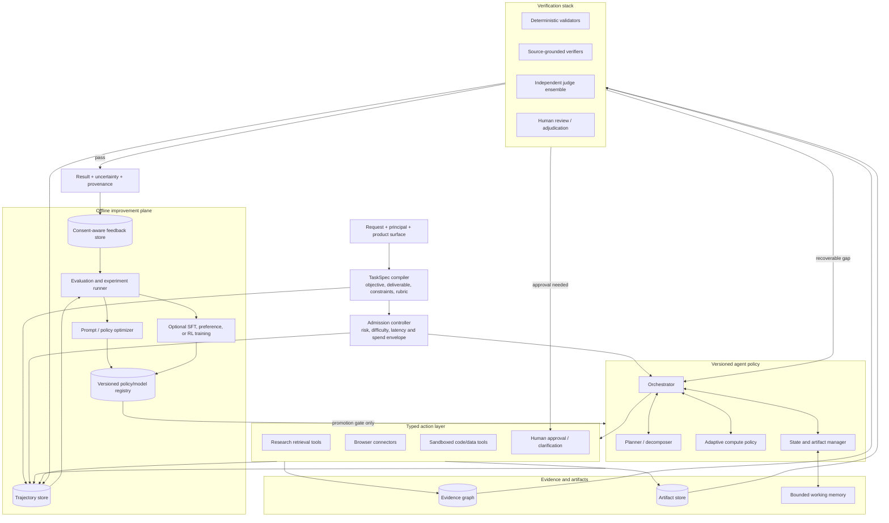
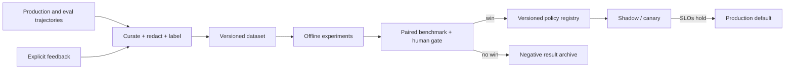

# Target agent-engineering architecture

Status: **PROPOSED — FOR DISCUSSION**

The target is an evidence-driven agent platform, not a larger collection of
prompts. It keeps the current research and guided-reading graphs, then adds
shared contracts for tasks, trajectories, verification, compute allocation,
feedback, experiments, and optional offline training.

## 1. Design goals

The target architecture should make these questions answerable for every run:

1. What task did the system believe it was solving?
2. Which policy, prompts, models, tools, datasets, and budgets did it use?
3. Which actions and artifacts changed the state?
4. What evidence supports each important output claim?
5. Which checks passed, failed, or abstained?
6. Why did the system stop, retry, re-plan, escalate, or ask a human?
7. Did extra inference compute improve the result enough to justify its cost?
8. Which user feedback may be used for support, evaluation, or training?
9. Which benchmark and promotion decision allowed this policy into production?

## 2. Logical architecture



The runtime and improvement plane are deliberately separated. Production can
record an episode, but it cannot use that episode to change its own policy.

## 3. Core contracts

These are conceptual schemas. Field names should be finalized in an ADR before
implementation.

### `TaskSpec`

A normalized task contract compiled from the user request and product surface:

```text
task_id, task_kind, objective, deliverables, acceptance_checks,
source_scope, freshness_requirement, allowed_tools, denied_actions,
latency_slo, spend_ceiling, autonomy_tier, human_checkpoints
```

For research, it should say whether the user wants a quick answer, literature
survey, evidence table, contradiction analysis, or reproducible experiment.
For learning, it should say whether the goal is orientation, guided reading,
practice, or assessment. A prompt alone is not a sufficient task contract.

### `RunManifest`

The immutable identity of an experiment or production episode:

```text
run_id, task_set_version, code_commit, policy_version, prompt_versions,
model_routes, tool_versions, config_digest, seed_or_sampling_settings,
budget, start_time, environment_class
```

This closes the gap between “we ran the agent” and a reproducible comparison.

### `TrajectoryEvent`

An append-only, privacy-reviewed record of a state transition:

```text
event_id, run_id, parent_event_id, step, actor, action_type,
bounded_action_input, observation_ref, artifact_refs, latency_ms,
token_and_cost_delta, status, error_class, policy_reason_code
```

Raw prompts, PDF content, learner text, secrets, and chain-of-thought should not
be copied into this record by default. Store bounded summaries or references
under an explicit retention policy.

### `ArtifactRef`

Plans, retrieved sources, parsed documents, evidence tables, candidate drafts,
code outputs, verification reports, and final reports need immutable ids,
content hashes, media types, provenance, and parent relationships. A candidate
draft should never overwrite the artifact it revised.

### `EvidenceNode` and `EvidenceEdge`

The existing `EvidenceClaim` should evolve into a graph capable of expressing:

- a claim supported or contradicted by one or more source spans;
- source identity, publication time, access time, and quality signals;
- derivation through a calculation or code artifact;
- agreement and disagreement across sources;
- which report sentence or decision consumed the evidence;
- verifier outcomes and unresolved uncertainty.

This is not a generic knowledge graph. It is a bounded provenance graph for one
task and its reusable scholarly artifacts.

### `VerificationResult`

```text
check_id, layer, subject_ref, verdict(pass/fail/abstain), confidence,
evidence_refs, failure_codes, suggested_recovery, verifier_version,
latency_ms, cost
```

Abstention is a first-class verdict. A verifier that lacks evidence must not be
forced to turn uncertainty into a pass or fail.

### `FeedbackEvent`

```text
feedback_id, run_id, subject_ref, signal_type, value, reason_tags,
free_text_ref, source(user/editor/downstream/system), consent_scope,
created_at, retracted_at
```

Useful initial signals include report helpfulness, factual-error flags,
accepted/rejected citations, section edits, chosen candidate, learner
confusion, task abandonment, and successful downstream use. “Thumbs up” alone
is too sparse to assign credit.

## 4. Adaptive test-time compute

The compute controller should allocate a bounded strategy, not a raw token
count. A proposed first policy has four tiers:

| Tier | Intended task | Strategy |
|---|---|---|
| T0: direct | Simple, low-risk, high-confidence | One plan, one evidence path, deterministic checks |
| T1: verify | Ordinary research | One trajectory plus source and claim verification; one targeted repair |
| T2: branch | Ambiguous or evidence-sparse | Diverse search branches or candidate outlines, listwise selection, verification |
| T3: deliberate | High-value, conflicting, or long-horizon | Hierarchical plan, parallel subtasks, checkpoints, multiple candidates/verifiers, human gate |

Admission can initially use deterministic features: requested deliverable,
number of entities/sub-questions, freshness need, source diversity, conflict
signals, retrieval yield, verifier uncertainty, and remaining budget. A learned
router should come only after these decisions and outcomes exist as data.

### Compute actions

- generate alternative search plans, not paraphrases of one plan;
- diversify retrieval by source, query strategy, date window, and citation
  graph direction;
- produce candidate outlines or reports only when selection can be evaluated;
- run aspect-specific verifiers in parallel;
- repair only failed sections or unsupported claims;
- compress and checkpoint context between long-horizon stages;
- stop when the expected marginal quality gain is below the next action's cost
  or the hard budget is reached.

### Required measurements

Every compute experiment must report quality-versus-cost and
quality-versus-latency curves, not only the best score. At minimum compare:

- single run;
- sequential self-revision;
- best-of-N or listwise-selected candidates;
- diversified search branches;
- one versus multiple verifier aspects;
- static versus difficulty-conditioned allocation.

## 5. Verification stack

Verification should be a cascade from cheap and objective to costly and
subjective.

### Layer 0: contract and deterministic validation

- schema and bounded-output validation;
- URL, identifier, citation, and source-span resolution;
- numeric recomputation and unit checks;
- duplicate, missing-section, broken-link, and stale-source checks;
- tool execution status and artifact hash validation;
- privacy, policy, and prompt-injection scans.

### Layer 1: source-grounded verification

- claim-to-span entailment with an explicit insufficient-evidence outcome;
- contradiction detection across sources;
- quote fidelity and citation placement;
- temporal validity: whether the evidence predates the claim's required
  freshness window;
- coverage of the task rubric and expected evidence types.

### Layer 2: independent model review

Use separated prompts and, when justified by evaluation, different models for
aspects such as factuality, coverage, methodological soundness, and writing.
Prefer listwise comparison of candidates over independent scalar scores when
selecting among outputs. Calibrate each judge against human-labeled examples
and monitor disagreement.

### Layer 3: human review

Human review is required for benchmark calibration, high-impact publication,
policy exceptions, disputed verifier outcomes, and any training-data promotion
that includes user content. Product HITL may remain lighter and task-specific.

### Recovery policy

A failed check should return a bounded recovery action:

```text
missing source -> search with named evidence gap
weak source -> retrieve an independent primary source
unsupported claim -> remove, qualify, or re-read named spans
contradiction -> preserve disagreement and investigate
coverage gap -> revise the named section only
judge disagreement -> abstain, add evidence, or escalate
```

“Reflect again” is not a recovery policy.

## 6. Trajectory and memory architecture

Three stores should remain conceptually separate:

1. **Working memory** — bounded state needed to complete the current task;
   subject to compression and checkpointing.
2. **Product memory** — user-visible, principal-scoped conversations, learner
   profiles, progress events, and saved artifacts with deletion semantics.
3. **Improvement data** — de-identified or consented trajectories, feedback,
   labels, and experiment outcomes under dataset versioning.

The same content may be eligible for one and not the others. Deleting a product
conversation must not silently leave a training example behind unless the user
was explicitly told that the training copy has a separate lifecycle.

## 7. Feedback and learning loop

The first learning loop should change configuration, prompts, routing, or
retrieval—not model weights:



Only after that loop is reliable should the project add supervised fine-tuning,
preference optimization, verifier training, or RL.

## 8. Train-time scaling boundary

“Train-time scaling” spans very different investments. For this project the
practical order is:

1. train or tune retrieval/reranking components on task-specific labels;
2. learn a small difficulty/compute router from trajectory outcomes;
3. distill successful plans and tool trajectories into an open-weight model;
4. preference-train candidate selection or report revision;
5. train a calibrated verifier or value model;
6. explore agent RL only with stable tasks, executable or rubric-backed
   rewards, held-out evaluation, and a reproducible training environment;
7. consider continued pretraining or larger foundation-model training out of
   scope unless the product and resources change materially.

Hosted frontier models can remain the high-quality generator while local or
open-weight models learn narrower routing, ranking, verification, and tool-use
policies. The architecture should not assume we can update a provider model's
weights.

## 9. Long-horizon task support

A long-horizon research task needs more than a larger loop limit. Add:

- a goal tree with typed dependencies and acceptance checks;
- durable subtask status and artifact ownership;
- stage-level budgets and deadlines;
- context compaction with a loss audit;
- idempotent tools and resumable actions;
- explicit blocked, waiting, failed, and superseded states;
- periodic plan revalidation against the original `TaskSpec`;
- human checkpoints before high-cost or externally consequential actions;
- final reconciliation proving which requested deliverables were completed.

The job lease and checkpoint substrate is already useful here, but the current
research state is a linear report state rather than a general project ledger.

## 10. Self-improvement safety model

Allowed in an offline sandbox:

- propose prompt, policy, tool, test, benchmark, or code variants;
- generate synthetic tasks or adversarial cases with provenance;
- replay historical episodes;
- run approved evaluations;
- open a reviewable change with evidence.

Not allowed:

- modify production code, weights, prompts, tools, judges, or thresholds;
- add its own generated tests to the acceptance set and grade itself on them;
- train on evaluation or canary data;
- use private user data outside its consent scope;
- remove a failing safety check or increase a budget to create an apparent win;
- deploy, purchase compute, or call paid services without approval.

The immutable external gate is: a candidate may propose its successor, but it
cannot define the benchmark, approve the result, and promote itself.

## 11. Migration constraints

- Extend the current `ResearchState` only for runtime state; keep trajectory
  events and immutable artifacts out of the LangGraph state blob.
- Reuse the existing LLM cost/cancel choke point and `JobKindRuntime` rather
  than creating a second unbounded runner.
- Keep research and learning task specs, rewards, and judges separate even if
  they share schemas and stores.
- Add new tools through capability-scoped adapters with timeouts, result-size
  limits, provenance, and policy checks.
- Preserve the frontend rule that only observed states are presented as facts.
- Default new policies off until their paired evaluation and rollout gates
  pass.
