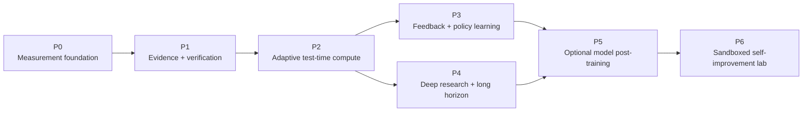

# Dependency-ordered roadmap

Status: **PROPOSED — NO WORK ORDERS AUTHORIZED**

This roadmap is sequenced by evidence dependencies, not calendar estimates.
Each phase should be split into reviewable work orders only after the relevant
decisions in [`06-decisions-and-discussion.md`](06-decisions-and-discussion.md)
are made.

## 1. Roadmap at a glance

The order prevents three common failures:

- scaling inference before measuring marginal value;
- training on trajectories that lack stable rewards or provenance;
- giving a self-improving agent control over the evaluator that defines
  improvement.

## 2. Phase P0 — measurement foundation

Proposed implementation decomposition:
[`12-p0-work-orders.md`](12-p0-work-orders.md). The work orders remain
unauthorized planning until the owner selects an implementation wave.

Objective: turn each run into a reproducible, inspectable episode and establish
the first statistically credible baseline.

### AE-000 — Ratify task and product objectives

Contract proposal: [`08-task-spec-rfc.md`](08-task-spec-rfc.md).

Define `task_kind` values and the primary outcome for each:

- quick scholarly answer;
- focused evidence review;
- literature survey;
- method/comparison brief;
- contradiction or consensus analysis;
- guided-reading session;
- future long-horizon research project.

Exit: each task kind has a deliverable contract, allowed source/tool scope,
primary metric, safety constraints, and maximum autonomy tier.

### AE-001 — Run manifest and version registry

Contract proposal: [`09-run-manifest-rfc.md`](09-run-manifest-rfc.md).

Create immutable identifiers for code, prompts, policy, model routes, tool
versions, task set, judge configuration, source snapshot, and budgets.

Exit: two runs that differ in behavior can be mechanically compared and their
configuration difference is visible.

### AE-002 — Canonical trajectory schema

Contract proposal: [`10-trajectory-event-rfc.md`](10-trajectory-event-rfc.md).

Normalize existing node events, costs, tool actions, observations, artifacts,
verifier results, stop reasons, and failures into an append-only episode. Add
redaction, retention, and size policies before persistence.

Exit: one research run and one guided session can be reconstructed at the
decision/artifact level without reading raw application logs.

### AE-003 — Evaluation dataset registry

Contract proposal:
[`11-benchmark-data-registry-rfc.md`](11-benchmark-data-registry-rfc.md).

Version tasks, rubrics, source snapshots, labels, contamination canaries,
licenses, and development/validation/sealed splits.

Exit: every campaign manifest resolves all evaluation inputs by immutable id.

### AE-004 — Judge calibration set

Create a small expert-adjudicated set of claims, citations, coverage decisions,
and paired reports. Test current judges for false passes, false failures,
position/verbosity bias, and abstention behavior.

Exit: judge performance is reported by slice; unsupported confidence is not
used as a release gate.

### AE-005 — Repeated live baseline

Run the existing research and learning campaigns with repeated trials, fixed
manifests, and the current default policy. This is the first cost-bearing item
and requires explicit approval.

The approved comparison design is
[`07-first-policy-experiment.md`](07-first-policy-experiment.md). Its first arm
provides the repeated fixed-pipeline baseline; later arms enter only after their
implementation and no-cost qualification gates pass.

Exit: task-level distributions, confidence intervals, error taxonomy, cost and
latency frontiers, and judge failure rates are published. Current heuristic
regression bands are either justified or replaced.

### P0 gate

- episodes are reproducible and privacy-reviewed;
- baseline denominators include failures and null judge scores;
- at least one human-labeled calibration set exists;
- the largest quality and reliability error classes are known;
- the first P1 experiment is chosen from evidence, not preference.

## 3. Phase P1 — evidence and verification

Objective: make correctness and recovery more grounded before spending extra
inference compute.

### AE-100 — Evidence graph v2

Extend typed evidence from per-paper claims into claim/source-span/report-
sentence relationships, including contradiction, source quality, access time,
and derived calculations.

Exit: every checked report claim resolves to its source spans or to an explicit
missing-evidence state.

### AE-101 — Source identity, quality, and freshness

Canonicalize scholarly ids and versions; distinguish primary papers, reviews,
metadata, blogs, and future web sources; record publication and retrieval time;
make retractions/corrections and duplicates visible where available.

Exit: the system can enforce a task's source and freshness requirements rather
than merely mention them in a prompt.

### AE-102 — Deterministic validator pack

Add citation placement/resolution, numeric/unit recomputation, quote fidelity,
date constraint, duplicate claim, broken source, and artifact integrity checks.

Exit: objective failures are caught without an LLM judge and emitted as typed
`VerificationResult`s.

### AE-103 — Calibrated verifier cascade

Refactor the current verifier into aspect-specific checks with `pass`, `fail`,
and `abstain`; evaluate same-model, cross-model, and deterministic/model mixes.

Exit: each verifier has a labeled confusion matrix and an explicit routing
policy for disagreement.

### AE-104 — Targeted repair

Translate failed checks into bounded actions: retrieve a named gap, re-read a
source span, replace a weak source, recompute a number, qualify/remove a claim,
or rewrite a named section.

Exit: repair success and regression rates are measured; a repair never
silently expands the task or budget.

### P1 gate

The candidate must beat the default policy on claim support or required
evidence coverage without a safety regression, and report the added cost and
latency. Otherwise the evidence substrate may ship independently while the
new runtime policy remains off.

## 4. Phase P2 — adaptive test-time compute

Objective: spend extra inference and tool compute only where it produces
measurable marginal value.

### AE-200 — Difficulty and uncertainty features

Start with interpretable signals: task kind, requested depth, ambiguity,
freshness, source diversity, retrieval yield, evidence gaps, verifier
abstention/disagreement, and prior task-slice failure rates.

Exit: features are logged before the compute decision and correlated with
actual error, cost, and latency.

### AE-201 — Candidate and branch protocol

Represent alternative plans, search branches, outlines, and drafts as sibling
artifacts with parentage. Require diversity features so N samples are not N
near-duplicates.

Exit: candidate generation is reproducible and the oracle-best candidate can
be identified offline.

### AE-202 — Listwise selector

Compare candidates against the task rubric and evidence graph in one selection
context. Measure selector accuracy, bias, abstention, and oracle gap.

Exit: selection beats a single candidate and cheap baselines under matched
budgets on the slices where branching is enabled.

### AE-203 — Compute controller v1

Implement deterministic T0–T3 routing with hard per-tier limits and stop rules.
Do not train the router yet.

Exit: easy tasks do not pay the deliberate-tier tax; difficult tasks gain
quality; all tiers respect spend, latency, tool, and iteration ceilings.

### AE-204 — Compute allocation experiments

Run matched-budget ablations:

- generation samples versus verifier samples;
- sequential repair versus parallel candidates;
- independent search branches versus report variants;
- same-model versus heterogeneous verification;
- static versus task-conditional allocation.

Exit: publish quality/cost and quality/latency curves with the chosen operating
points and negative results.

### AE-205 — Learned compute router, optional

Train only after deterministic routing has enough episodes. Begin with a small,
interpretable model that predicts expected marginal gain for each tier.

Exit: held-out routing improves utility under the same budget, passes drift and
calibration checks, and has a rule-based fallback.

### P2 gate

At least one non-default compute tier has a statistically credible win on its
target task slice, while the global default is non-inferior on cost, latency,
safety, and simple tasks.

## 5. Phase P3 — feedback and policy learning

Objective: build a consented, versioned data flywheel before changing model
weights.

### AE-300 — Feedback product contract

Choose high-information signals: error type, citation acceptance, preferred
candidate, section-level edit, missing topic, downstream use, learner
confusion, and abandonment. Separate operational feedback from training
consent.

Exit: users can correct the system without being forced to label everything,
and every signal has provenance and lifecycle semantics.

### AE-301 — Feedback and annotation store

Store structured events with principal scope, consent scope, retraction,
retention, artifact version, and adjudication status.

Exit: deletion/retraction and dataset export behavior are tested end to end.

### AE-302 — Curation and credit assignment

Join feedback to the trajectory and identify which plan, action, source,
candidate, or verifier decision it can reasonably supervise. Do not assign
report-level reward uniformly to every step.

Exit: curated examples carry an explicit target and confidence; ambiguous
credit remains unassigned.

### AE-303 — Offline prompt and policy optimization

Search prompt components, routing rules, tool policies, and thresholds on the
development split. Candidate generation and evaluation run in separate roles.

Exit: a proposed policy wins on validation and sealed sets, and its gains
survive human review.

### AE-304 — Shadow feedback loop

Compare the candidate and production policy on eligible real tasks without
allowing the candidate to affect user-visible output.

Exit: offline gains transfer to the product distribution and monitoring catches
slice regressions.

### P3 gate

Feedback data has a reviewed consent policy, enough density to support the
chosen learning target, and a proven offline-to-online promotion path.

## 6. Phase P4 — deep research and long-horizon tasks

Objective: move from bounded paper-report jobs to durable, heterogeneous
research projects without losing provenance or operator control.

### AE-400 — Capability-scoped web research tools

Add search/open/extract adapters behind domain, size, time, and content-policy
bounds. Prefer official APIs and primary sources. Every observation records URL,
access time, content hash, and extraction method.

Exit: browsing benchmarks and adversarial web-content tests pass; source
content cannot write control fields.

### AE-401 — Sandboxed code and data-analysis tools

Add an isolated execution environment with no default secrets or network,
resource/time limits, immutable inputs, captured outputs, and explicit network
or package-install approvals.

Exit: generated calculations and plots are reproducible artifacts, and escape,
resource-exhaustion, and data-exfiltration tests pass.

### AE-402 — Hierarchical goal and artifact ledger

Model goals, subtasks, dependencies, assignees/policies, status, checkpoints,
acceptance checks, artifacts, and supersession.

Exit: a killed project resumes without redoing completed work or forgetting the
original objective.

### AE-403 — Context compaction with loss checks

Build stage summaries from referenced artifacts, then verify that constraints,
open questions, evidence gaps, and decisions survived compression.

Exit: resumed performance is non-inferior to uncompressed controls within the
target context budget.

### AE-404 — Long-horizon benchmark lane

Create tasks bucketed by human completion time and number of dependent stages.
Score milestone completion, artifact quality, recovery, human interventions,
and final reconciliation.

Exit: the project reports success by horizon and reliability rather than
claiming autonomy from one completed demo.

### AE-405 — Deep research report mode

Combine hierarchical planning, heterogeneous retrieval, evidence graphs,
analysis code, contradiction handling, staged verification, and human
checkpoints into a named product mode.

Exit: internal and external deep-research benchmarks show a quality win with a
published cost/latency envelope and source audit.

### P4 gate

The system reliably completes the chosen multi-stage task class, resumes after
faults, preserves provenance, and asks for help at declared boundaries. General
autonomy is not inferred from narrow success.

## 7. Phase P5 — optional model post-training

Objective: learn narrow, valuable policies only where prompt/config optimization
has saturated and sufficient approved data exists.

### AE-500 — Model ownership and serving decision

Choose whether the project will operate open-weight models and for which roles:
router, query planner, reranker, verifier, tutor, synthesizer, or all-agent
policy. Document GPU, serving, license, security, and rollback costs.

### AE-501 — Supervised distillation

Distill high-quality, adjudicated plans, tool decisions, or structured outputs
into a small model. Start with narrow actions and exact schemas.

### AE-502 — Preference optimization

Use paired candidates with adjudicated preferences for selection or revision.
Keep style preference separate from factual and safety rewards.

### AE-503 — Verifier or value model

Train a calibrated model to predict task/rubric success or action value. Guard
against reward hacking with sealed adversarial and distribution-shift sets.

### AE-504 — Agent RL pilot

Only after the environment and reward are stable, train one narrow policy such
as search planning or tool selection. Require executable or rubric-backed
rewards, step-level attribution, KL/behavior constraints, checkpointed training,
and comparisons against SFT and inference-time search.

### AE-505 — Scaling study

Vary data, rollout count, model size, training steps, and compute under a fixed
protocol. Fit empirical curves and stop when added training compute is dominated
by inference-time allocation or a stronger base model.

### P5 gate

The trained component beats hosted-model prompting or a simpler learned policy
on held-out product tasks after total training and serving cost is included.

## 8. Phase P6 — sandboxed self-improvement lab

Objective: study automated agent-system improvement without granting production
control.

### AE-600 — Candidate mutation space

Allow proposals to prompts, routing policies, tool descriptions, context
management, and eventually code within explicit paths. Keep judges, sealed
tasks, budget caps, security checks, and promotion code immutable.

### AE-601 — Archive and lineage

Maintain a diverse archive of candidates, parents, changes, evaluations, and
failure causes rather than greedily replacing one incumbent.

### AE-602 — Sandboxed evaluation fleet

Run candidates with no production credentials or user data. Enforce resource
budgets and detect attempts to modify tests, inspect hidden labels, or weaken
checks.

### AE-603 — Human-approved proposal workflow

The system produces a reviewable patch and evidence package. A human owns merge
and deployment; ordinary repository CI and all earlier gates still apply.

### P6 gate

Self-generated candidates show repeatable improvements on untouched tasks
without benchmark tampering, safety regression, or evaluator capture. Even then,
promotion remains external.

## 9. Cross-cutting workstreams

These apply to every phase:

- privacy, consent, retention, and tenant isolation;
- model/provider abstraction without hiding provider-specific cost semantics;
- artifact and dataset lineage;
- reproducible environments and dependency provenance;
- security evaluation for every new tool;
- operational SLOs and cost alerts;
- product UX for uncertainty, verification, waiting, and human decisions;
- negative-result and decision records.

## 10. Recommended first vertical slice

After P0, the best first architecture experiment is:

> **Claim-level verification with abstention, targeted evidence repair, and a
> two-tier compute policy that invokes repair only when deterministic or
> source-grounded checks fail.**

Why this slice:

- it builds directly on the existing evidence store, verifier, query refiner,
  reader recovery, and cost choke point;
- it improves factual reliability before adding broad tools or model training;
- it produces the trajectory and reward data needed for a later compute router;
- it can be compared against the fixed pipeline under matched tasks;
- it has a clear rollback: disable the policy and retain the evidence artifacts.

The first slice should not include open-web browsing, arbitrary code execution,
RL, or autonomous code modification. Those add multiple new failure surfaces
before the core quality loop is calibrated.
