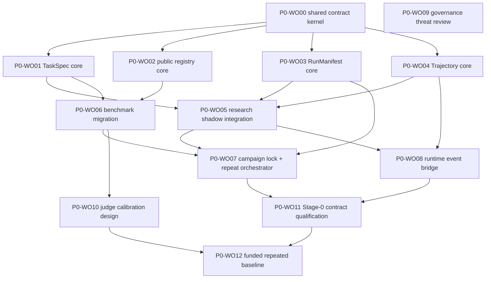

# P0 measurement-foundation work orders

Status: **PROPOSED — NO IMPLEMENTATION OR SPEND AUTHORIZED**

Date: **2026-09-04**

Target roadmap phase: **P0 — measurement foundation**

Inputs:

- [`04-roadmap.md`](04-roadmap.md)
- [`06-decisions-and-discussion.md`](06-decisions-and-discussion.md)
- [`07-first-policy-experiment.md`](07-first-policy-experiment.md)
- [`08-task-spec-rfc.md`](08-task-spec-rfc.md)
- [`09-run-manifest-rfc.md`](09-run-manifest-rfc.md)
- [`10-trajectory-event-rfc.md`](10-trajectory-event-rfc.md)
- [`11-benchmark-data-registry-rfc.md`](11-benchmark-data-registry-rfc.md)

This document translates the P0 RFCs into bounded, reviewable implementation
units. It is a planning artifact only. It does not authorize code changes,
production data collection, live model calls, human-labeling spend, deployment,
GPU/cloud use, or implementation of experimental policies C and E.

## 1. P0 outcome

P0 is complete when one current research run and one guided-learning session
can be represented as reproducible episodes with:

- one immutable task contract;
- one sealed run manifest and least-privilege runtime projection;
- one canonical append-only trajectory;
- one registry-locked set of benchmark inputs and evaluator refs;
- explicit failures, null metrics, repeats, attempts, costs, and denominators;
- no hidden-label or cross-principal leakage; and
- a no-cost dry-run/replay path that exercises the contracts before any funded
  baseline is requested.

P0 does not need to prove that a new agent policy is better. Its job is to make
that claim testable.

## 2. Ratified inputs and unresolved authority

These owner decisions are already fixed for this package:

- D1: claim support and evidence completeness are the first optimization
  target;
- D2: task-rubric success and supported-claim precision remain separate
  primary outcomes, with non-regression gates and separate frontier metrics;
- D3: the fixed graph remains control and fallback; the five-arm protocol is
  the comparison design.

These remain unresolved and constrain implementation:

- D8 blocks production/user trajectory collection and training exports until
  consent, retention, deletion, and processing purposes are approved;
- D9 blocks every live baseline, model judge, paid label, or funded experiment;
- C's fixed verify-repair policy and E's adaptive-compute policy are future
  implementation work, not P0 foundation work;
- validation/sealed data storage requires a real access boundary and cannot be
  simulated by a private-looking folder in the agent-readable repository.

## 3. Shared implementation invariants

Every work order must preserve these rules:

1. `TaskSpec` owns requested outcome and maximum permissions, not policy choice
   or spend approval.
2. One stored TaskSpec is reused for all arms and repeats of one selected case
   revision.
3. `RunManifest` is sealed before side effects and is never mutated by runtime
   status or cost.
4. The full manifest is control-plane-only; the candidate receives a hashed,
   least-privilege projection.
5. `run.admitted` is the first trajectory event. A run can contain multiple
   process attempts; a repeat is a new run; an action retry is an action
   attempt.
6. Hidden case identity, split membership, labels, graders, judge prompts,
   canaries, approval details, and restricted locators never reach the
   candidate trajectory or runtime projection.
7. Cross-contract refs use `kind`, `id`, semantic `revision`, and
   algorithm-prefixed `digest`. Locators are transport metadata.
8. Contract hashing uses `agent-contract-json/v1`: RFC 8785 canonical JSON,
   RFC 3339 UTC timestamp strings, SHA-256 references, and six-decimal USD
   strings.
9. The effective policy is the most restrictive intersection of task,
   platform, campaign, provider, registry, and approval constraints.
10. Possessing an API key or declaring a positive ceiling never authorizes
    chargeable work.
11. Failed, cancelled, timed-out, budget-stopped, and partially scored episodes
    remain in artifacts and denominators.
12. Historical data is never backfilled with invented provenance.

## 4. Dependency graph

W00 is deliberately first. Without one shared identity/hash/data-class package,
four teams would encode four subtly incompatible contracts.

## 5. Work-order summary

| Work order | Size | Primary output | Parallel-safe after | Cost class |
|---|---:|---|---|---|
| P0-WO00 | M | Shared contract kernel | Start | Local/no-cost |
| P0-WO01 | M | TaskSpec models and deterministic compilers | W00 | Local/no-cost |
| P0-WO02 | M | Development-registry schemas and resolver | W00 | Local/no-cost |
| P0-WO03 | L | Sealed manifest, admission, runtime projection | W00 | Local/no-cost |
| P0-WO04 | L | Event registry and in-memory trajectory adapter | W00 | Local/no-cost |
| P0-WO05 | L | Research shadow integration | W01 + W03 + W04 | Local/no-cost |
| P0-WO06 | L | Research/learning benchmark adapters | W01 + W02 | Local/no-cost |
| P0-WO07 | L | Campaign lock, repeats, resume, denominators | W03 + W05 + W06 | Local/no-cost |
| P0-WO08 | L | Runtime trajectory bridge and local artifact adapter | W04 + W05 | Local/no-cost |
| P0-WO09 | M | Governance/threat decision package | W00 | Planning/no-cost |
| P0-WO10 | M | Judge-calibration protocol and fixtures | W06 | Planning/local fixtures |
| P0-WO11 | M | Stage-0 contract qualification report | W07 + W08 | Local/no-cost |
| P0-WO12 | L | Repeated current-policy baseline | W10 + W11 + D9 | **Chargeable; blocked** |

Sizes indicate review and integration complexity, not calendar promises.

## 6. P0-WO00 — shared contract kernel

### Objective

Provide the small dependency-free vocabulary imported by the other three
contracts so identity, hashing, time, money, data sensitivity, and refs cannot
drift.

### Deliverables

- `ImmutableObjectRef` with `kind`, `id`, `revision`, and `digest`;
- `DataClass` ordered as `public < internal < user_confidential <
  learner_sensitive`;
- `RetentionPolicyRef` using the immutable-ref contract;
- `MoneyUsd` fixed six-decimal string type;
- RFC 3339 UTC timestamp validator;
- canonical JSON serializer/digest helper implementing
  `agent-contract-json/v1`;
- strict schema base with unknown fields rejected;
- common error codes for schema, digest, ref, redaction, and compatibility
  failures;
- JSON Schema export and golden fixtures.

### Acceptance

- equivalent objects hash identically across key order and process restarts;
- semantic changes alter the digest;
- floats, naive timestamps, bare hashes, mutable aliases, unknown fields, and
  malformed refs fail;
- no helper reads environment variables, credentials, network, or repository
  state;
- unit/property tests make zero external calls.

### Out of scope

Storage, task semantics, manifest admission, events, registry content, and
signing.

## 7. P0-WO01 — TaskSpec core and deterministic compilers

### Objective

Implement [`08-task-spec-rfc.md`](08-task-spec-rfc.md) without changing runtime
behavior.

### Deliverables

- strict TaskSpec v1 models and semantic validators;
- full and semantic digest projections;
- immutable persistence interface with local test adapter;
- agent-safe and control-plane projections;
- deterministic research-request compiler;
- deterministic guided-session compiler;
- benchmark-case compiler interface;
- pre-run compilation receipt;
- shadow-mode adapters for current `Job`, `ResearchState`, and `SessionState`.

### Acceptance

- every current research and guided-learning intake field is mapped or
  explicitly excluded;
- no model chooses task kind or rewrites user intent;
- platform intersection never broadens source, tool, autonomy, time, call,
  cost, or data-use boundaries;
- raw conversation/profile/source content is represented by scoped immutable
  refs rather than copied into the spec;
- hidden evaluator overlays are absent from the agent-safe projection;
- one registry case produces one stable TaskSpec reused across arms/repeats;
- legacy jobs remain readable with a null task ref.

### Rollback

Disable shadow compilation; retain nullable refs and leave current job/state
construction unchanged.

## 8. P0-WO02 — development benchmark registry core

### Objective

Implement the public/development subset of
[`11-benchmark-data-registry-rfc.md`](11-benchmark-data-registry-rfc.md) with a
fail-closed boundary for restricted data.

### Deliverables

- suite, task-set, task-case, rubric, label, source-snapshot, fixture,
  split-assignment, grader-profile, retention, and external-adapter schemas;
- canonical object envelope, lifecycle, and typed resolver;
- Git/local resolver for public metadata and small licensed fixtures;
- registry lock generator and validation receipt;
- license, intended/prohibited-use, retention, and contamination validation;
- role-aware projection interface;
- CLI for validate, resolve, and lock with no execution side effects.

### Acceptance

- development objects resolve by exact revision and digest;
- aliases are refused in campaign locks;
- validation/sealed/canary payload modes fail closed until a separate broker is
  configured;
- label and hidden-rubric refs cannot be resolved by the candidate role;
- revoked, expired, deleted, digest-mismatched, or prohibited-use objects stop
  before provider initialization;
- no credentials or private absolute paths appear in registry artifacts.

### Rollback

Existing Python benchmark constants and fixture manifests remain authoritative
until W06 completes parity validation.

## 9. P0-WO03 — sealed RunManifest and admission

### Objective

Implement [`09-run-manifest-rfc.md`](09-run-manifest-rfc.md) as a pre-side-
effect reproducibility and authority boundary.

### Deliverables

- campaign, episode, replicate-group, run, repeat, and process-attempt ids;
- strict manifest schema and atomic seal/digest sidecar;
- TaskSpecRef, registry resolution, policy, config, model, prompt, tool, source,
  code, dependency, environment, randomness, output, and evaluation sections;
- deterministic admission intersection with receipt;
- separately hashed least-privilege runtime projection;
- fake/local cost-approval backend for tests;
- resume compatibility validator;
- attempt and completion receipt schemas;
- legacy import wrapper that marks unknown provenance.

### Acceptance

- manifest seals before any model/tool/network/sandbox side effect;
- full manifest is never handed to candidate code;
- the runtime projection excludes evaluator, split, label, approval, and
  locator material;
- a chargeable manifest is rejected before credential lookup unless an
  external approval record matches campaign, stage, provider, resource, and
  cap;
- API-key presence alone cannot pass admission;
- repeats, reruns, resumes, and attempts have distinct tested semantics;
- a dirty worktree is explicitly represented and cannot claim promotion-grade
  reproducibility without a reviewed patch digest.

### Rollback

Keep current eval output behavior and disable manifest admission behind a
typed, default-off integration flag. Sealed test artifacts remain readable.

## 10. P0-WO04 — trajectory schema and in-memory adapter

### Objective

Implement the schema/semantics half of
[`10-trajectory-event-rfc.md`](10-trajectory-event-rfc.md) without production
persistence.

### Deliverables

- event envelope and event-type registry;
- ArtifactRef, usage delta, data-governance, replay, branch, candidate,
  process-attempt, and action-attempt types;
- in-memory append adapter with store-assigned `run_seq`;
- idempotency, causal-reference, lineage, legal-status, and terminal-state
  validation;
- canonical hashing and per-run hash chain;
- fold/replay library and versioned derived views;
- JSONL import/export;
- golden event for every registered type.

### Acceptance

- `run.admitted` is always the first accepted event;
- duplicate retries return the stored event; different content under the same
  idempotency key fails;
- multi-branch concurrent appends preserve one run order and explicit
  causality;
- raw secrets, hidden evaluator content, chain-of-thought, oversized payloads,
  and data-class downgrades are rejected;
- verifier abstention, repair lineage, cancellation, timeout, budget stop, and
  partial final output remain first-class outcomes;
- replay labels every observation after decision divergence as held constant
  or simulated, never newly observed.

### Out of scope

Production Postgres schema, production retention/deletion, and broad user-data
capture.

## 11. P0-WO05 — research shadow integration

### Objective

Bind TaskSpec, RunManifest, and trajectory contracts to the current research
path without changing the graph's output or default policy.

### Deliverables

- shadow TaskSpec compilation at research intake and eval-case selection;
- manifest builder for the current fixed and supervisor graphs;
- policy-shape introspection so claimed capabilities match compiled graph;
- in-memory event bridge for graph/node/model/tool/budget/checkpoint lifecycle;
- artifact refs for existing final/recovered reports and relevant state;
- parity diagnostics comparing old state/output with contract projections;
- default-off enforcement switch after shadow evidence is reviewed.

### Acceptance

- fixed A, evidence B, and existing supervisor D configurations are
  mechanically distinguishable without executing a live model;
- C cannot be represented by `ENABLE_VERIFIER=true` under the fixed graph;
- E cannot be represented without a real controller, candidate lineage,
  selector, and marginal-stop protocol;
- query refiner and reader recovery remain independent held-out factors;
- current cancellation, recovery, checkpoint, cost, and report paths keep their
  existing behavior;
- all tests use mocked providers/recorded fixtures.

### Rollback

Disable shadow hooks. No existing job/checkpoint/state schema is removed in
this work order.

## 12. P0-WO06 — benchmark migration and parity

### Objective

Register current evaluation inputs without changing their meaning or claiming
new generalization evidence.

### Deliverables

- `research-policy-v1@1.0.0` development suite mapping every current research
  query id one-to-one;
- evaluator-only mapping for expected topics and grader profile;
- guided-learning development suite mapping every current scenario/persona/
  paper/script/expectation id;
- registered learning fixture-set refs preserving current manifest status;
- adapters that present the old runner data shapes;
- parity reports for inputs, order, ids, and score semantics;
- explicit `public_repository` contamination/exposure record.

### Acceptance

- current benchmark invariant tests still pass;
- every old id has exactly one new immutable case ref;
- research and learning remain separate task and metric lanes;
- expected topics, labels, scripts, and evaluator configuration do not enter
  the candidate runtime projection;
- the public 20-query suite is barred from `promotion`/`sealed` intended use;
- no historical result is labeled registry-resolved without exact commit/input
  proof.

### Rollback

Runners continue reading existing modules through adapters until a later ADR
chooses the registry as authoritative.

## 13. P0-WO07 — campaign lock, repeats, resume, and denominators

### Objective

Add a no-cost-capable orchestration layer around the current eval runner.

### Deliverables

- campaign manifest and immutable registry lock;
- task/arm/repeat matrix compiler;
- distinct output directory and manifest per repeat;
- interleaved/predeclared arm ordering;
- resume on the same lock and cap only;
- lineage for a new campaign when protocol or cap changes;
- expected-denominator ledger including errors, cancellations, timeouts,
  budget stops, exclusions, and null metric results;
- dry-run plan that initializes no provider or network client;
- campaign-level cost categories and approval admission interface.

### Acceptance

- `--repeats` or equivalent orchestration never uses resume as a repeat;
- the same TaskSpec and registry refs appear across each paired block;
- source snapshot and live-retrieval campaigns cannot aggregate together;
- a campaign-level budget stop may resume only with the same immutable cap and
  remaining approval; raising a cap creates a new campaign with lineage;
- completed episode artifacts are never overwritten;
- dry-run output enumerates every planned episode and its zero-cost status.

### Rollback

The current sequential runner remains callable directly. New orchestration
writes to a separate output root.

## 14. P0-WO08 — runtime event bridge and local artifact adapter

### Objective

Prove canonical event capture on synthetic/replay data while preserving current
SSE, logs, OTel, checkpoints, `RunCosts`, and learner `ProgressEvent` contracts.

### Deliverables

- local content-addressed artifact adapter with staging/promote and integrity
  checks;
- research runtime bridge for admitted/attempt/action/model/tool/evidence/
  verification/budget/checkpoint/final/terminal events;
- guided-learning bridge for session/HITL/checkpoint/final events without
  conflating trajectory with learner progress;
- safe SSE/log/trace projections from canonical events where appropriate;
- `RunCosts` reconciliation;
- fault-injection and concurrent append tests;
- evaluation-only configuration; production user capture remains disabled.

### Acceptance

- one synthetic research and one synthetic guided-learning episode reconstruct
  at the decision/artifact level;
- projection failure cannot erase an accepted event;
- checkpoint resume does not duplicate an action or reset cost;
- cross-principal access tests are zero-tolerance;
- artifacts fail on digest/length mismatch and never store signed URLs,
  secrets, or raw private reasoning;
- all v1 events remain `training_eligible=false`.

### Gate

Production/user-content enablement remains blocked until W09 resolves D8 and a
separate implementation/rollout decision is approved.

## 15. P0-WO09 — governance and threat-review package

Review artifact: [`13-governance-threat-review.md`](13-governance-threat-review.md).

### Objective

Turn D8 and the restricted-evaluation boundary into explicit owner decisions
before persistent user/learner trajectories or sealed data exist.

### Deliverables

- data inventory by TaskSpec, manifest, event, artifact, registry, label, and
  feedback object;
- processing-purpose and consent matrix;
- retention, deletion, retraction, export, and legal-hold behavior;
- principal/tenant access model and restricted evaluator role;
- encryption/key-erasure proposal;
- prompt-injection, label leakage, benchmark tampering, evaluator capture,
  source-rights, and artifact-correlation threat model;
- decision checklist for development, validation, sealed, production, human
  evaluation, and training use;
- proposed D8 ruling and ADR outline.

### Acceptance

- no category inherits training permission from product operation;
- learner data receives the strictest default;
- deletion behavior names both content and retained non-content audit facts;
- sealed evaluation requires a boundary the candidate cannot read or modify;
- unresolved questions are owner decisions, not implementation guesses.

This work order is documentation and review. It does not collect new data.

## 16. P0-WO10 — judge-calibration protocol and fixture design

### Objective

Prepare AE-004 without performing paid judging or committing owner/expert time
that has not been approved.

### Deliverables

- claim/citation/coverage/pairwise label schemas;
- annotation guide and disagreement/adjudication protocol;
- sampling plan across task and failure slices;
- adversarial cases for unsupported polish, verbosity, citation swaps,
  injected source instructions, contradiction, and honest abstention;
- deterministic synthetic fixtures and expected results;
- judge blinding/randomization plan;
- metrics for agreement, false pass/fail, abstention, position bias, and slice
  coverage;
- cost/time estimate template with stop conditions.

### Acceptance

- all schemas and synthetic fixtures validate locally;
- model outputs are never called ground truth;
- human labels preserve individual decisions and adjudication lineage;
- the plan identifies which work needs expert time or paid model calls;
- no real judge/provider call or human-labeling campaign starts.

## 17. P0-WO11 — Stage-0 contract qualification

### Objective

Produce the no-cost evidence package required before asking to run a funded
baseline or implement candidate policies.

### Deliverables

- dry-run campaign lock over the development suite;
- valid manifests for A/B/D using current real graph capabilities;
- schema-valid non-executable descriptors for C/E that are explicitly marked
  `capability_missing`, not runnable;
- mocked/recorded synthetic episodes exercising all five policy identities;
- arm-difference and common-config report;
- task/ref/source/seed/repeat/denominator integrity report;
- privacy/redaction/leakage/adversarial report;
- failure taxonomy and open implementation prerequisites;
- zero-external-call attestation from test instrumentation.

### Acceptance

- no arm can misrepresent a missing runtime capability;
- A/B/D dry-run shapes match current code/config behavior;
- C names fixed post-synthesis verify, at most one targeted repair, and
  re-verification;
- E names T0–T2, candidate lineage, listwise selection, and marginal stop; T3
  is rejected;
- all five identities are distinct while paired task/data refs remain equal;
- provider/network initialization fails the test if attempted;
- report explicitly states that contract qualification is not policy-quality
  evidence.

## 18. P0-WO12 — funded repeated current-policy baseline

Status: **BLOCKED ON EXPLICIT D9 COST APPROVAL**

### Objective

Execute the minimum live campaign needed to estimate variance, calibrate
denominators/judges, and size later comparisons.

### Required approval packet

Before execution, present:

- exact then-current provider/model ids and verified prices;
- exact case slice, repeat count, grader calls, and source mode;
- per-episode and total campaign caps, including in-flight overshoot behavior;
- owner/expert labeling time or monetary budget;
- interleaving, stopping, resume, and artifact-retention rules;
- no-cost W10/W11 evidence;
- explicit go/no-go question.

### Initial scope recommendation

Start with the current fixed policy only to estimate variance and cost. Add a
paired existing-policy arm only if the approved cap covers the comparison and
the analysis remains interpretable. Do not include unimplemented C or E.

### Outputs

- task-level distributions and hierarchical/paired uncertainty estimates;
- completion/failure/null-score denominators;
- workflow and judge cost/latency distributions;
- judge failure and disagreement report;
- error taxonomy by task slice;
- recommendation to retain, replace, or justify current heuristic thresholds.

This work order remains blocked even if credentials are present and even if
all local tests pass.

## 19. Parallel worktree plan

Use separate worktrees only when file ownership and dependency state are
unambiguous.

### Wave 0 — serial contract seed

- W00 owns the shared package and schemas. No parallel contract implementation
  starts until its public interface is reviewed.

### Wave 1 — four bounded worktrees

After W00 lands, these can proceed concurrently:

- W01 owns TaskSpec models/compilers and dedicated tests;
- W02 owns registry models/resolver/CLI and dedicated tests;
- W03 owns manifest models/sealing/admission with fake dependencies;
- W04 owns trajectory schemas/in-memory adapter/folds.

Each worktree imports W00 and may add adapter protocols, but may not duplicate
or privately redefine shared types.

### Wave 2 — two integration lanes

- W05 integrates TaskSpec/manifest/trajectory with research runtime;
- W06 migrates research and learning benchmark data through adapters.

They may run concurrently only if W05 does not edit benchmark modules and W06
does not edit runtime graph/job/event bridges.

### Wave 3 — controlled convergence

- W07 campaign orchestration starts after W05/W06 contracts merge;
- W08's evaluation-only event bridge may start after W04/W05; production or
  retained user-content capture remains blocked on W09;
- W10 calibration design can proceed alongside W07/W08 because it owns docs,
  schemas, and synthetic fixtures only;
- W11 is an integration worktree after W07/W08 merge.

W12 is an operational campaign, not a development worktree, and remains
approval-gated.

## 20. PR and review rules

Each implementation PR should:

- name exactly one work order and its dependencies;
- include the relevant RFC acceptance criteria in its description;
- keep migrations additive and rollback-safe;
- add deterministic tests before enabling a behavior flag;
- prove no paid/network/provider call in local qualification;
- state current-versus-planned behavior honestly;
- avoid modifying sealed labels, evaluator gates, and candidate policy in the
  same PR;
- avoid mixing storage vendor choice with schema semantics where an adapter
  suffices;
- update the RFC if implementation discovers a contract change;
- attach validation output and list remaining gates.

A PR that defines a schema plus its first consumer is acceptable when splitting
would ship an unusable half-contract. A PR that simultaneously changes tasks,
policy, judges, labels, and promotion thresholds is not reviewable.

## 21. P0 program gate

Before requesting W12 approval, all of the following must be true:

- W00–W11 acceptance criteria are green or explicitly waived by the owner;
- one research and one guided-learning synthetic episode reconstruct cleanly;
- campaign resolution pins every task/data/evaluator input by immutable ref;
- no candidate role can access hidden evaluation material;
- manifests seal before side effects and chargeable admission fails closed;
- repeat/resume/rerun semantics and denominators are tested;
- current A/B/D capability claims match compiled graphs;
- missing C/E capabilities are explicit and non-runnable;
- D8 has a recorded decision for any proposed retained user/learner content;
- the W12 approval packet names an exact maximum cost and stop rule.

If this gate fails, continue local schema, fixture, replay, and documentation
work. Do not substitute a live campaign for missing contract evidence.
