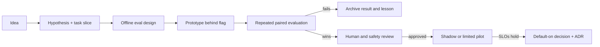

# Agent engineering program

Status: **DRAFT FOR DISCUSSION**

Snapshot date: **2026-09-04**

Repository baseline: `0caefa2` on `main`

This folder is the forward-looking engineering program for the research and
learning agents. It starts from what is actually implemented, defines how
improvements will be measured, and sequences larger bets such as adaptive
test-time compute, feedback learning, model post-training, and long-horizon
research.

This is a planning package, not implementation authority. A capability moves
from here into an ADR and a bounded work order only after its objective,
evaluation, cost boundary, and rollback are agreed.

## Why this folder exists

The repository already has detailed references:

- [`../architecture.md`](../architecture.md) documents the deployed system
  shape and storage boundaries.
- [`../agents/`](../agents/) documents each current agent's inputs, outputs,
  prompts, and failure modes.
- [`../eval.md`](../eval.md) documents the research and guided-reading eval
  harnesses.
- [`../../planning/`](../../planning/) is the historical roadmap and working
  log that drove the current implementation.
- [`../decisions/`](../decisions/) contains the accepted ADRs.

Those pages answer “how does the current code work?” This package answers a
different question: **what capability and measurement architecture should we
build next, and in what evidence-gated order?**

## Documents

1. [`01-current-architecture.md`](01-current-architecture.md) — a
   capability-level map of the system as it exists, including strengths,
   partial capabilities, and important absences.
2. [`02-target-architecture.md`](02-target-architecture.md) — the proposed
   agent runtime, evidence, verification, trajectory, feedback, and promotion
   layers.
3. [`03-evaluation-strategy.md`](03-evaluation-strategy.md) — the benchmark
   portfolio, metrics, experiment design, and release gates.
4. [`04-roadmap.md`](04-roadmap.md) — a dependency-ordered implementation
   sequence from measurement foundations through optional post-training.
5. [`05-research-frontier.md`](05-research-frontier.md) — current research
   areas, what they imply for this product, and experiments worth running.
6. [`06-decisions-and-discussion.md`](06-decisions-and-discussion.md) — the
   owner decisions and product questions to settle before work orders are
   created.
7. [`07-first-policy-experiment.md`](07-first-policy-experiment.md) — the
   approved five-arm experiment comparing the fixed pipeline, evidence path,
   verify-and-repair, supervisor, and adaptive-compute policies. Execution and
   spend remain deferred.
8. [`08-task-spec-rfc.md`](08-task-spec-rfc.md) — the typed task contract that
   fixes the objective, deliverable, rubric, constraints, source/tool scope,
   budget envelope, and autonomy boundary before an episode starts.
9. [`09-run-manifest-rfc.md`](09-run-manifest-rfc.md) — the immutable run and
   campaign provenance contract for policy, model, prompt, tool, data, code,
   environment, budget, repeat, and output identity.
10. [`10-trajectory-event-rfc.md`](10-trajectory-event-rfc.md) — the canonical
    append-only event envelope for decisions, tool use, evidence, verification,
    repair, artifacts, budgets, checkpoints, and terminal outcomes.
11. [`11-benchmark-data-registry-rfc.md`](11-benchmark-data-registry-rfc.md) —
    the versioned registry for task cases, rubrics, source snapshots, labels,
    split access, contamination records, licenses, and grader profiles.
12. [`12-p0-work-orders.md`](12-p0-work-orders.md) — dependency-ordered,
    reviewable implementation slices for the four contracts, their integration,
    governance/calibration prerequisites, Stage-0 qualification, and the
    separately blocked funded baseline.
13. [`13-governance-threat-review.md`](13-governance-threat-review.md) — the
    data inventory, processing-purpose and consent matrix, retention and
    deletion behaviour, principal access model, and threat review the D8
    ruling turns on.
14. [`14-judge-calibration-protocol.md`](14-judge-calibration-protocol.md) —
    the AE-004 design package: label schemas and adjudication lineage, the
    annotation guide, the sampling plan and the noise floor of a twenty-query
    set, the blinding and position-bias plan, synthetic adversarial fixtures,
    the calibration metrics and their PROMOTE/HOLD/ROLLBACK gate, and a
    cost/time estimate template. No judging, no labeling campaign, no spend.

## P0 implementation status

The RFCs above are planning documents; this table is what has actually
landed against them. It is the answer to "can I build on that yet?",
which the work-order document deliberately does not track — a dependency
graph says what *may* start, not what has merged.

| Work order | Output | Status |
|---|---|---|
| P0-WO00 | Shared contract kernel | Landed — [#167](https://github.com/kudratsingh/arxiv-research-agent/pull/167) |
| P0-WO01 | TaskSpec models and deterministic compilers | Landed — [#193](https://github.com/kudratsingh/arxiv-research-agent/pull/193) |
| P0-WO02 | Development benchmark registry core | Landed — [#188](https://github.com/kudratsingh/arxiv-research-agent/pull/188) |
| P0-WO03 | Sealed RunManifest and admission | Landed — [#201](https://github.com/kudratsingh/arxiv-research-agent/pull/201) |
| P0-WO04 | Trajectory schema and in-memory adapter | Landed — [#203](https://github.com/kudratsingh/arxiv-research-agent/pull/203) |
| P0-WO05 | Research shadow integration | Landed — [#215](https://github.com/kudratsingh/arxiv-research-agent/pull/215) |
| P0-WO06 | Benchmark migration and parity | Landed — [#214](https://github.com/kudratsingh/arxiv-research-agent/pull/214) |
| P0-WO07 | Campaign lock, repeats, resume, denominators | Landed — [#221](https://github.com/kudratsingh/arxiv-research-agent/pull/221) |
| P0-WO08 | Runtime event bridge and artifact adapter | This PR — see [ADR 0083](../decisions/0083-runtime-event-bridge-and-artifact-adapter.md) |
| P0-WO09 | Governance and threat review | Landed — [#205](https://github.com/kudratsingh/arxiv-research-agent/pull/205) |
| P0-WO10 | Judge-calibration protocol and fixtures | This PR — see [`14-judge-calibration-protocol.md`](14-judge-calibration-protocol.md); no ADR, this is a design package |
| P0-WO11 | Stage-0 contract qualification | Pending |
| P0-WO12 | Funded repeated current-policy baseline | Blocked on funding approval (D9) |

Nothing in this table authorizes spend. W12 stays blocked until the
program gate in [`12-p0-work-orders.md`](12-p0-work-orders.md) §21 is
green and an exact maximum cost and stop rule are approved.

The four RFCs are the P0 contract set. They are designed together: the
registry supplies immutable evaluation inputs, a case compiles into a
`TaskSpec`, a `RunManifest` freezes the episode configuration, and
`TrajectoryEvent` records what occurred without exposing evaluator-only data.
They remain planning documents until an ADR and bounded work orders authorize
implementation.

### Draft P0 interface conventions

The RFCs use these shared conventions so their examples can become one system:

- immutable cross-contract refs have `kind`, `id`, semantic `revision`, and an
  algorithm-prefixed `digest`; storage locators are separate transport data;
- contract schemas use `schema_kind` plus semantic `schema_version`, while a
  task's logical `task_revision` remains a separate integer;
- `agent-contract-json/v1` means RFC 8785 canonical JSON, RFC 3339 UTC
  timestamps, SHA-256 references, and six-decimal USD strings;
- one stored `TaskSpec` is compiled per selected benchmark case revision and
  reused across every policy arm and statistical repeat;
- a run is one logical episode sample, a repeat is a new run, a safe resume is
  a new process attempt within the same run, and a provider/tool retry is a
  separate action attempt;
- the complete `RunManifest` is a control-plane object. The candidate receives
  a separately hashed runtime projection without sealed split/case identity,
  labels, grader configuration, approval details, or private locators; and
- task compilation produces a pre-run receipt, the manifest is sealed, and
  `run.admitted` becomes the first append-only trajectory event.

These are proposed integration contracts, not owner approval of implementation
or spend. An implementation ADR may refine them only by updating all four RFC
interfaces together.

## P0 implementation status

The RFCs above are contracts; this table is what exists in the tree. A work
order is "landed" only when its acceptance criteria are green in CI.

| Work order | Output | Where it lives | State |
|---|---|---|---|
| P0-WO00 | Shared contract kernel | `src/contracts/kernel.py` | landed |
| P0-WO01 | TaskSpec models and compilers | `src/contracts/task_spec.py` | landed |
| P0-WO02 | Development registry core | `src/contracts/registry.py` | landed |
| P0-WO03 | Sealed RunManifest and admission | `src/contracts/run_manifest.py` | landed |
| P0-WO04 | Trajectory schema and replay | `src/contracts/trajectory.py` | landed |
| P0-WO05 | Research shadow integration | `src/contracts/research_binding.py`, `src/contracts/shadow_bridge.py` | landed |
| P0-WO06 | Benchmark migration and parity | `eval_registry/`, `src/contracts/benchmark_adapters.py` | landed |
| P0-WO07 | Campaign lock, repeats, denominators | `src/campaign/` | landed |
| P0-WO08 | Runtime event bridge | `src/contracts/runtime_bridge.py`, `src/contracts/artifact_store.py` | in flight |
| P0-WO09 | Governance and threat review | [`13-governance-threat-review.md`](13-governance-threat-review.md) | landed |
| P0-WO10 | Judge-calibration design | [`14-judge-calibration-protocol.md`](14-judge-calibration-protocol.md), `src/calibration/`, `eval_registry_calibration/` | landed |
| P0-WO11 | Stage-0 contract qualification | — | not started |
| P0-WO12 | Funded repeated baseline | — | approval-gated, blocked on D9 |

The evaluation runners still read their own modules. `eval_registry/` is a
generated, digest-verified view of `src/eval/benchmark_queries.py` and
`src/eval/learning_benchmark.py`; `python -m src.contracts.registry parity`
proves the two agree, and a later ADR decides which one is authoritative
([ADR 0079](../decisions/0079-benchmark-registry-migration-and-parity.md)).

Campaign orchestration is `python -m src.campaign plan|dry-run|resume|status`.
`dry-run` enumerates every planned episode of a registry-locked
`cases x repeats x arms` matrix at zero cost and writes nothing; `plan`
materializes the campaign directory including its denominator ledger. Neither
runs an episode, contacts a provider, or authorizes spend — a chargeable
campaign is refused before a credential is read unless an external approval
record covers it, and **P0-WO12 remains blocked on D9**
([ADR 0082](../decisions/0082-campaign-lock-repeats-and-denominators.md)).

## Program thesis

The next quality jump should not come from adding more named agents. It should
come from a closed, inspectable improvement loop:

```text
task contract
  -> policy chooses tools and compute budget
  -> agents produce typed actions and evidence
  -> independent checks score the result and the trajectory
  -> outcomes and consented feedback become versioned data
  -> offline experiments propose a better policy
  -> benchmark and human gates decide whether it ships
```

The repository already owns much of the production substrate around that loop:
bounded jobs, checkpointing, cost enforcement, cancellation, typed state,
retrieval, a verifier, observability, and two evaluation lanes. The missing
piece is a sufficiently rich and statistically defensible learning and
promotion system.

## Operating principles

1. **Baseline before optimization.** No architecture, prompt, model, or
   compute policy is “better” until it wins a paired evaluation against a
   frozen baseline.
2. **Outcome and process are both measured.** A good report produced by a
   wasteful, brittle, or unsafe trajectory is not a production win.
3. **Verification is layered.** Deterministic checks, source-grounded checks,
   model judges, and human review answer different questions; no single judge
   is treated as ground truth.
4. **Compute is allocated, not merely increased.** More samples, revisions,
   tools, or verifiers must be justified by uncertainty and marginal quality
   gain under a hard budget.
5. **Product loops remain distinct.** Research-report generation and guided
   learning share infrastructure and data contracts, but keep separate task
   policies, rewards, and eval suites.
6. **Feedback is data, not permission.** Product feedback may be logged for
   support and evaluation without automatically becoming training data.
   Training use requires an explicit policy and consent boundary.
7. **Self-improvement is offline and reversible.** Agents may propose prompts,
   policies, tools, tests, or code in a sandbox. They may not modify the live
   runtime, training set, judge, or promotion thresholds.
8. **Paid work stays gated.** Live model benchmarks, post-training, GPU work,
   and new hosted infrastructure require explicit approval before cost is
   incurred.
9. **Failed and partial runs remain useful evidence.** The trajectory store
   must retain why a run stopped, what it tried, and what artifact was last
   known good.
10. **Research claims are time-bounded.** The frontier review records an
    as-of date and distinguishes published evidence from our own hypotheses.

## Decision flow



Every arrow should leave an artifact. “The output looked better” is not an
artifact; a versioned task set, run manifest, trajectory, scores, confidence
interval, error analysis, and decision record are.
