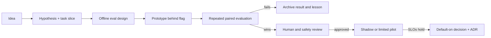

# Agent engineering program

Status: **DRAFT FOR DISCUSSION**

Snapshot date: **2026-09-17**

Repository baseline: `a3b112f` on `main`

This folder is the forward-looking engineering program for the research and
learning agents. It starts from what is actually implemented, defines how
improvements will be measured, and sequences larger bets such as adaptive
test-time compute, feedback learning, model post-training, and long-horizon
research.

This is a planning package, not implementation authority. A capability moves
from here into an ADR and a bounded work order only after its objective,
evaluation, cost boundary, and rollback are agreed.

## Why this folder exists

The repository already has detailed references:

- [`../architecture.md`](../architecture.md) documents the deployed system
  shape and storage boundaries.
- [`../agents/`](../agents/) documents each current agent's inputs, outputs,
  prompts, and failure modes.
- [`../eval.md`](../eval.md) documents the research and guided-reading eval
  harnesses.
- [`../../planning/`](../../planning/) is the historical roadmap and working
  log that drove the current implementation.
- [`../decisions/`](../decisions/) contains the accepted ADRs.

Those pages answer “how does the current code work?” This package answers a
different question: **what capability and measurement architecture should we
build next, and in what evidence-gated order?**

## Documents

1. [`01-current-architecture.md`](01-current-architecture.md) — a
   capability-level map of the system as it exists, including strengths,
   partial capabilities, and important absences.
2. [`02-target-architecture.md`](02-target-architecture.md) — the proposed
   agent runtime, evidence, verification, trajectory, feedback, and promotion
   layers.
3. [`03-evaluation-strategy.md`](03-evaluation-strategy.md) — the benchmark
   portfolio, metrics, experiment design, and release gates.
4. [`04-roadmap.md`](04-roadmap.md) — a dependency-ordered implementation
   sequence from measurement foundations through optional post-training.
5. [`05-research-frontier.md`](05-research-frontier.md) — current research
   areas, what they imply for this product, and experiments worth running.
6. [`06-decisions-and-discussion.md`](06-decisions-and-discussion.md) — the
   owner decisions and product questions to settle before work orders are
   created.
7. [`07-first-policy-experiment.md`](07-first-policy-experiment.md) — the
   approved five-arm experiment comparing the fixed pipeline, evidence path,
   verify-and-repair, supervisor, and adaptive-compute policies. Execution and
   spend remain deferred.
8. [`08-task-spec-rfc.md`](08-task-spec-rfc.md) — the typed task contract that
   fixes the objective, deliverable, rubric, constraints, source/tool scope,
   budget envelope, and autonomy boundary before an episode starts.
9. [`09-run-manifest-rfc.md`](09-run-manifest-rfc.md) — the immutable run and
   campaign provenance contract for policy, model, prompt, tool, data, code,
   environment, budget, repeat, and output identity.
10. [`10-trajectory-event-rfc.md`](10-trajectory-event-rfc.md) — the canonical
    append-only event envelope for decisions, tool use, evidence, verification,
    repair, artifacts, budgets, checkpoints, and terminal outcomes.
11. [`11-benchmark-data-registry-rfc.md`](11-benchmark-data-registry-rfc.md) —
    the versioned registry for task cases, rubrics, source snapshots, labels,
    split access, contamination records, licenses, and grader profiles.
12. [`12-p0-work-orders.md`](12-p0-work-orders.md) — dependency-ordered,
    reviewable implementation slices for the four contracts, their integration,
    governance/calibration prerequisites, Stage-0 qualification, and the
    separately blocked funded baseline.
13. [`13-governance-threat-review.md`](13-governance-threat-review.md) — the
    data inventory, processing-purpose and consent matrix, retention and
    deletion behaviour, principal access model, and threat review the D8
    ruling turns on.
14. [`14-judge-calibration-protocol.md`](14-judge-calibration-protocol.md) —
    the AE-004 design package: label schemas and adjudication lineage, the
    annotation guide, the sampling plan and the noise floor of a twenty-query
    set, the blinding and position-bias plan, synthetic adversarial fixtures,
    the calibration metrics and their PROMOTE/HOLD/ROLLBACK gate, and a
    cost/time estimate template. The protocol's offline half has since
    shipped — `python -m src.calibration packets|ingest` renders blinded
    packets and reports agreement on completed labels — and the judged
    metric paths can be exercised against a fixture judge under mock mode
    ([ADR 0095](../decisions/0095-deterministic-mock-judge-campaign-scoring.md)).
    Still no judging against a live model, no labeling campaign, no spend.
15. [`15-stage0-qualification-report.md`](15-stage0-qualification-report.md) —
    the no-cost evidence package: the dry-run campaign lock over the whole
    development suite, sealed manifests for A/B/C/D against the graphs this
    checkout compiles, four synthetic episodes with verified hash chains and
    zero parity mismatches, the integrity, privacy and failure-taxonomy
    reports, and a bullet-by-bullet verdict on the 12 §21 program gate.
    Contract qualification, explicitly not policy-quality evidence. Read it
    as the **dated report** it is: it qualified arm E as
    `capability_missing`, which CAP-09 has since closed
    ([ADR 0091](../decisions/0091-listwise-candidate-selection-and-the-marginal-stop.md)),
    and it fenced the W11-F1 artifact-retention finding, which
    [ADR 0096](../decisions/0096-structural-screens-not-phrase-screens.md)
    has since settled.
16. [`16-w12-approval-packet-draft.md`](16-w12-approval-packet-draft.md) — the
    12 §18 packet, pre-filled and unsigned. Every figure is labelled
    `ESTIMATE / RE-PRICE BEFORE APPROVAL`, the preconditions that are not met
    are listed rather than discovered after an approval, and the go/no-go
    question is left unanswered. **Not an approval request.**
17. [`17-w11f1-retention-options.md`](17-w11f1-retention-options.md) — the
    options memo for finding W11-F1: the artifact store's private-reasoning
    screen refused any body containing "chain-of-thought", which cost the
    evidence-path arms their briefing bytes on a benchmark made of
    LLM-research questions. States what the rule protects, measures the loss
    (and shows the same rule also refused a retrieved paper's own abstract
    under `source_document`), and sets out three options with costs and
    risks. **Settled**: the owner took option C, and
    [ADR 0096](../decisions/0096-structural-screens-not-phrase-screens.md)
    made the screen structural — markers, not phrases — so the memo is now
    the record of a decision rather than a question.

## P0 implementation status

The RFCs above are planning documents; this table is what has actually
landed against them. It is the answer to "can I build on that yet?",
which the work-order document deliberately does not track — a dependency
graph says what *may* start, not what has merged.

| Work order | Output | Where it lives | Status |
|---|---|---|---|
| P0-WO00 | Shared contract kernel | `src/contracts/kernel.py` | Landed — [#167](https://github.com/kudratsingh/arxiv-research-agent/pull/167) |
| P0-WO01 | TaskSpec models and deterministic compilers | `src/contracts/task_spec.py` | Landed — [#193](https://github.com/kudratsingh/arxiv-research-agent/pull/193) |
| P0-WO02 | Development benchmark registry core | `src/contracts/registry.py` | Landed — [#188](https://github.com/kudratsingh/arxiv-research-agent/pull/188) |
| P0-WO03 | Sealed RunManifest and admission | `src/contracts/run_manifest.py` | Landed — [#201](https://github.com/kudratsingh/arxiv-research-agent/pull/201) |
| P0-WO04 | Trajectory schema and in-memory adapter | `src/contracts/trajectory.py` | Landed — [#203](https://github.com/kudratsingh/arxiv-research-agent/pull/203) |
| P0-WO05 | Research shadow integration | `src/contracts/research_binding.py`, `src/contracts/shadow_bridge.py` | Landed — [#215](https://github.com/kudratsingh/arxiv-research-agent/pull/215) |
| P0-WO06 | Benchmark migration and parity | `eval_registry/`, `src/contracts/benchmark_adapters.py` | Landed — [#214](https://github.com/kudratsingh/arxiv-research-agent/pull/214) |
| P0-WO07 | Campaign lock, repeats, resume, denominators | `src/campaign/` | Landed — [#221](https://github.com/kudratsingh/arxiv-research-agent/pull/221) |
| P0-WO07b | Campaign execution loop and the `run` verb | `src/campaign/execute.py` | Landed — [#234](https://github.com/kudratsingh/arxiv-research-agent/pull/234), [ADR 0088](../decisions/0088-campaign-execution-loop.md) |
| P0-WO07c | Per-episode operator log events for campaign execution | `src/campaign/execute.py` | Landed — [#238](https://github.com/kudratsingh/arxiv-research-agent/pull/238) |
| P0-WO08 | Runtime event bridge and artifact adapter | `src/contracts/runtime_bridge.py`, `src/contracts/artifact_store.py` | Landed — [#222](https://github.com/kudratsingh/arxiv-research-agent/pull/222) |
| P0-WO09 | Governance and threat review | [`13-governance-threat-review.md`](13-governance-threat-review.md) | Landed — [#205](https://github.com/kudratsingh/arxiv-research-agent/pull/205) |
| P0-WO10 | Judge-calibration protocol and fixtures | [`14-judge-calibration-protocol.md`](14-judge-calibration-protocol.md), `src/calibration/`, `eval_registry/` | Landed — [#217](https://github.com/kudratsingh/arxiv-research-agent/pull/217); no ADR, this is a design package |
| P0-WO11 | Stage-0 contract qualification | [`15-stage0-qualification-report.md`](15-stage0-qualification-report.md), [`16-w12-approval-packet-draft.md`](16-w12-approval-packet-draft.md), `tests/test_stage0_qualification.py` | Landed — [#228](https://github.com/kudratsingh/arxiv-research-agent/pull/228); no ADR, this is a report plus three fixes inside existing ADRs' scope |
| Contract follow-ups | Non-arm `PolicySnapshot`, arm-E redefinition, learning `ContextRef` kinds, one registry root | `src/contracts/` | Landed — [#236](https://github.com/kudratsingh/arxiv-research-agent/pull/236), [ADR 0089](../decisions/0089-non-arm-policy-snapshots-and-one-registry-root.md) |
| W11-F1 | Artifact-retention options memo, then the structural screen | [`17-w11f1-retention-options.md`](17-w11f1-retention-options.md), `src/contracts/artifact_store.py` | Landed — [#251](https://github.com/kudratsingh/arxiv-research-agent/pull/251) and [#253](https://github.com/kudratsingh/arxiv-research-agent/pull/253), [ADR 0096](../decisions/0096-structural-screens-not-phrase-screens.md) |
| Mock judge | The three judged metric paths execute under mock mode | `src/eval/mock_judge.py` | Landed — [#249](https://github.com/kudratsingh/arxiv-research-agent/pull/249), [ADR 0095](../decisions/0095-deterministic-mock-judge-campaign-scoring.md) |
| Offline labeling | Blinded labeling packets and the agreement report | `src/calibration/packets.py`, `src/calibration/labels.py` | Landed — [#252](https://github.com/kudratsingh/arxiv-research-agent/pull/252); no ADR |
| Campaign report | The `report` verb over a finished campaign's sealed records | `src/campaign/report.py` | Landed — [#254](https://github.com/kudratsingh/arxiv-research-agent/pull/254); no ADR |
| P0-WO12 | Funded repeated current-policy baseline | — | **Blocked on funding approval (D9).** The execution-loop blocker is closed by W07b; what remains is an owner's approval record, re-verified prices and expert labeling time — see [`15-stage0-qualification-report.md`](15-stage0-qualification-report.md) §7.3 |

Nothing in this table authorizes spend. W12 stays blocked until the
program gate in [`12-p0-work-orders.md`](12-p0-work-orders.md) §21 is
green and an exact maximum cost and stop rule are approved. That gate is
**not** green today: nine of its ten bullets pass and the tenth — "the
W12 approval packet names an exact maximum cost and stop rule" — fails by
construction, because passing it requires an owner to price and approve.
[`15-stage0-qualification-report.md`](15-stage0-qualification-report.md)
§10 records the verdict per bullet.

The four RFCs are the P0 contract set. They are designed together: the
registry supplies immutable evaluation inputs, a case compiles into a
`TaskSpec`, a `RunManifest` freezes the episode configuration, and
`TrajectoryEvent` records what occurred without exposing evaluator-only data.
They remain planning documents until an ADR and bounded work orders authorize
implementation.

### Draft P0 interface conventions

The RFCs use these shared conventions so their examples can become one system:

- immutable cross-contract refs have `kind`, `id`, semantic `revision`, and an
  algorithm-prefixed `digest`; storage locators are separate transport data;
- contract schemas use `schema_kind` plus semantic `schema_version`, while a
  task's logical `task_revision` remains a separate integer;
- `agent-contract-json/v1` means RFC 8785 canonical JSON, RFC 3339 UTC
  timestamps, SHA-256 references, and six-decimal USD strings;
- one stored `TaskSpec` is compiled per selected benchmark case revision and
  reused across every policy arm and statistical repeat;
- a run is one logical episode sample, a repeat is a new run, a safe resume is
  a new process attempt within the same run, and a provider/tool retry is a
  separate action attempt;
- the complete `RunManifest` is a control-plane object. The candidate receives
  a separately hashed runtime projection without sealed split/case identity,
  labels, grader configuration, approval details, or private locators; and
- task compilation produces a pre-run receipt, the manifest is sealed, and
  `run.admitted` becomes the first append-only trajectory event.

These are proposed integration contracts, not owner approval of implementation
or spend. An implementation ADR may refine them only by updating all four RFC
interfaces together.

### What the contracts settled after the work orders closed

**P0 contract follow-ups (2026-09-05, [ADR 0089](../decisions/0089-non-arm-policy-snapshots-and-one-registry-root.md)).**
Three findings the work orders above recorded rather than fixed are now
closed. `PolicySnapshot` has a `policy_kind` discriminator, so a branch
run (`research_shape`) and a guided session (`guided_session`) seal
manifests instead of declining them, and arm E was redefined as the
deterministic controller plus a listwise selector plus a marginal-stop
record. ADR 0089 left that redefinition `capability_missing`, with the
refusal naming the two capabilities CAP-09 owed; **CAP-09 then built
both** ([ADR 0091](../decisions/0091-listwise-candidate-selection-and-the-marginal-stop.md)),
so `UNRUNNABLE_ARMS` is now empty, arm E is runnable, and every refusal
comes from probing a compiled graph rather than from a standing constant.
`ContextRef` carries the three candidate-visible learning kinds, so a
guided-learning case compiles with its refs populated. And W10's
calibration suite lives under `eval_registry/`:
`eval_registry_calibration/` is gone, the 120 objects moved byte for
byte, and parity is stated over the union at 257 objects, 0 mismatches.

The evaluation runners still read their own modules. `eval_registry/` is a
generated, digest-verified view of `src/eval/benchmark_queries.py`,
`src/eval/learning_benchmark.py` and `src/calibration/suite.py`; `python -m src.contracts.registry parity`
proves the two agree, and a later ADR decides which one is authoritative
([ADR 0079](../decisions/0079-benchmark-registry-migration-and-parity.md)).

Campaign orchestration is now six verbs —
`python -m src.campaign plan|dry-run|run|resume|status|report` — and
**`run` is the only one with execution side effects.** `dry-run`
enumerates every planned episode of a registry-locked
`cases x repeats x arms` matrix at zero cost and writes nothing; `plan`
materializes the campaign directory including its denominator ledger;
`resume` reopens a materialized campaign under the same lock and cap;
`status` reconciles the ledger against the receipts on disk; and `report`
reads a finished campaign's sealed records and the trajectories they
point at and writes one markdown document — quality, cost and latency per
arm, the error-taxonomy counts, the denominators and the lineage. None of
the five read-only verbs runs an episode, contacts a provider, or
authorizes spend — a chargeable campaign is refused before a credential
is read unless an external approval record covers it, and **P0-WO12
remains blocked on D9**
([ADR 0082](../decisions/0082-campaign-lock-repeats-and-denominators.md)).

`run` iterates the manifest's interleaved order, seals each episode, opens
W08's durable trajectory, drives the policy, scores it with free
deterministic checks, writes the episode's artifacts with `completion.json`
last, and checks the campaign cap between episodes — which is where
`budget_stop_reached` finally acquired a production caller. The full
`20 x 3 x 5` development matrix executes end to end under `USE_MOCK_DATA`
at exactly `$0.000000` with `llm_calls=0`; since arm E became runnable the
ledger reconciles **300 completed and 0 excluded**
([ADR 0088](../decisions/0088-campaign-execution-loop.md),
[ADR 0091](../decisions/0091-listwise-candidate-selection-and-the-marginal-stop.md)).
The three judged metrics can be exercised on that same path behind
`--mock-judge`, against a checked-in fixture that refuses to run without
both mock data and the zero-spend sentinel
([ADR 0095](../decisions/0095-deterministic-mock-judge-campaign-scoring.md)).
Judge calibration has an offline surface of its own:
`python -m src.calibration packets` renders blinded labeling packets and
`ingest` un-blinds a completed label file and reports agreement. It
produces work for a human labeler; it judges nothing and spends nothing.

**Running the matrix is not policy evidence.** It proves the contracts,
the denominators, the resume rule and the cap stop; it says nothing about
whether any arm is better, because a mock episode serves fixtures rather
than reasoning. W12 remains blocked on D9, on an approval record an owner
actually created, on re-verified prices, and on expert labeling time
([`15-stage0-qualification-report.md`](15-stage0-qualification-report.md)
§7.3).

## Program thesis

The next quality jump should not come from adding more named agents. It should
come from a closed, inspectable improvement loop:

```text
task contract
  -> policy chooses tools and compute budget
  -> agents produce typed actions and evidence
  -> independent checks score the result and the trajectory
  -> outcomes and consented feedback become versioned data
  -> offline experiments propose a better policy
  -> benchmark and human gates decide whether it ships
```

The repository already owns much of the production substrate around that loop:
bounded jobs, checkpointing, cost enforcement, cancellation, typed state,
retrieval, a verifier, observability, and two evaluation lanes. The missing
piece is a sufficiently rich and statistically defensible learning and
promotion system.

## Operating principles

1. **Baseline before optimization.** No architecture, prompt, model, or
   compute policy is “better” until it wins a paired evaluation against a
   frozen baseline.
2. **Outcome and process are both measured.** A good report produced by a
   wasteful, brittle, or unsafe trajectory is not a production win.
3. **Verification is layered.** Deterministic checks, source-grounded checks,
   model judges, and human review answer different questions; no single judge
   is treated as ground truth.
4. **Compute is allocated, not merely increased.** More samples, revisions,
   tools, or verifiers must be justified by uncertainty and marginal quality
   gain under a hard budget.
5. **Product loops remain distinct.** Research-report generation and guided
   learning share infrastructure and data contracts, but keep separate task
   policies, rewards, and eval suites.
6. **Feedback is data, not permission.** Product feedback may be logged for
   support and evaluation without automatically becoming training data.
   Training use requires an explicit policy and consent boundary.
7. **Self-improvement is offline and reversible.** Agents may propose prompts,
   policies, tools, tests, or code in a sandbox. They may not modify the live
   runtime, training set, judge, or promotion thresholds.
8. **Paid work stays gated.** Live model benchmarks, post-training, GPU work,
   and new hosted infrastructure require explicit approval before cost is
   incurred.
9. **Failed and partial runs remain useful evidence.** The trajectory store
   must retain why a run stopped, what it tried, and what artifact was last
   known good.
10. **Research claims are time-bounded.** The frontier review records an
    as-of date and distinguishes published evidence from our own hypotheses.
11. **Safety and retention screens match structure, never phrases.** A
    screen refuses on markers, field names, artifact kind, role or trust
    class — things that say who *authored* a span. It never refuses on a
    natural-language phrase, because product text quotes the world: the
    phrase a screen forbids will appear in the material the system
    legitimately handles. W11-F1 is the measured case
    ([ADR 0096](../decisions/0096-structural-screens-not-phrase-screens.md))
    — the artifact store forbade "chain of thought", which is the name of
    a research topic, so it rejected the source abstracts a research
    agent reads and the briefings that quote them. Such a failure is
    doubly dangerous: it is *silent* (the run continues and only a
    WARNING fires), and its false positives are *correlated with the
    subject under study* rather than random, so they bias an experiment
    instead of adding noise to it.

## Decision flow



Every arrow should leave an artifact. “The output looked better” is not an
artifact; a versioned task set, run manifest, trajectory, scores, confidence
interval, error analysis, and decision record are.
