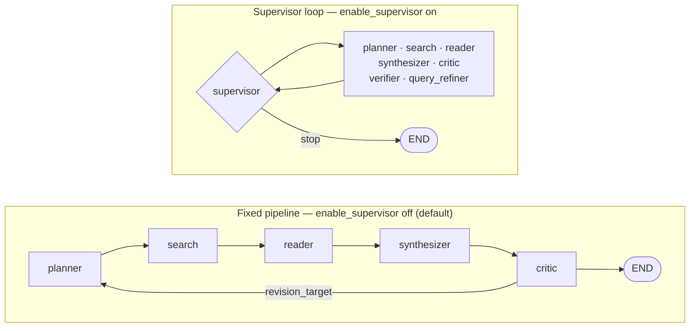

# Agent design pages

One page per agent in `src/agents/`, with one exception named below, plus
one page for a model caller that is deliberately *not* an agent — the
[evaluation judge](judge.md). Every page follows the same skeleton —
**Purpose · Flow · Inputs · Outputs · Prompt design · Failure modes ·
Flags · Testing · Related** — with agent-specific sections (evidence
path, recovery path, dedup, iteration cap …) inserted wherever they read
best.

These pages describe `main` as it is. Workflow-level wiring — the four
graph shapes, checkpointing, the API layer — lives in
[`docs/architecture.md`](../architecture.md).

| Agent | Runs under | Gated by | Page |
|---|---|---|---|
| Planner | all four shapes | always on | [planner.md](planner.md) |
| Search | all four; inside a worker branch under `orchestrated_workers` | always on | [search.md](search.md) |
| Reader | all four; inside a worker branch under `orchestrated_workers` | always on | [reader.md](reader.md) |
| Synthesizer | all four shapes | always on | [synthesizer.md](synthesizer.md) |
| Critic | all four shapes | always on | [critic.md](critic.md) |
| Supervisor | supervisor loop | `enable_supervisor` | [supervisor.md](supervisor.md) |
| Verifier | supervisor loop as an *action*; `fixed_verify_repair` and `orchestrated_workers` as the `verify` **node** | `enable_verifier` for the action; the policy for the node | [verifier.md](verifier.md) |
| Query refiner | supervisor loop | `enable_query_refiner` | [query_refiner.md](query_refiner.md) |
| Tutor | guided-read session graph | `enable_session_loop` | [tutor.md](tutor.md) |
| Evaluation judge | **no graph** — it scores finished runs offline | `EVAL_JUDGE_MODEL`; the campaign's `--mock-judge` flag | [judge.md](judge.md) |

The judge is the row that is not an agent. It lives in
`src/eval/metrics.py`, never runs inside a job, and produces three of the
five metrics a scored run carries — the other two are deterministic
(ADR [0074](../decisions/0074-deterministic-groundedness.md)). It earns a
page here because it is a model caller with prompts, versions, a failure
taxonomy and a calibration story, and because the three nearby things it
is *not* — the [verifier](verifier.md), the [critic](critic.md) and the
assessment judge below — are exactly what a reader confuses it with. No
live judge call has ever been made in this repository; see
[judge.md](judge.md) for what one would still need.

`repair` is a node without an agent page: it makes no model call and
picks from a deterministic table — see [repair.md](repair.md). So are
`lead`, `workers` and `merge`, the branch tier's three (ADR 0086), and
`select`, CAP-09's listwise candidate selector (ADR 0091), which is
compiled into the branch shape only when `candidate_selection=listwise`
and is the one of those four that *does* make a model call.

The **assessment judge** (`src/agents/assessment.py`) is the exception
to the one-page rule: it runs on the guided-read session graph beside
the [tutor](tutor.md), produces tutor guidance rather than anything the
research graph reads, and its design record is
[ADR 0060](../decisions/0060-evidence-grounded-assessment-judge.md). It
is a different thing from the [evaluation judge](judge.md) above, which
shares neither its graph, its prompts nor its purpose; the two are
distinguished at the top of that page because the names alone will not
do it.

## The four shapes

The two below are the two `enable_supervisor` selects, and they are what
`research_policy="legacy"` — the default — compiles:

In the fixed pipeline the critic's `revision_target` drives the only
conditional edge, and it can point at `planner`, `search`, or
`synthesizer`. In the supervisor loop every action node edges straight
back to the supervisor, which picks the next action or stops. The query
refiner exists only in the loop, and only when its flag is on.

The other two are selected by `research_policy` rather than by a flag,
and both put the verifier on the graph as a node:

- **`fixed_verify_repair`** (ADR
  [0076](../decisions/0076-fixed-verify-repair-research-policy.md)) —
  `planner → search → reader → synthesizer → verify`, at most one
  deterministic `repair` on a failed verdict, then re-verification
  before the critic.
- **`orchestrated_workers`** (ADR
  [0086](../decisions/0086-orchestrator-workers-for-the-branch-tier.md))
  — `planner → lead → workers → merge` replaces the single
  `search → reader` leg, each worker researching one sub-question on an
  isolated state; after the merge the graph *is* the shape above. With
  `candidate_selection=listwise` a `select` node sits between `workers`
  and `merge` (ADR
  [0091](../decisions/0091-listwise-candidate-selection-and-the-marginal-stop.md));
  at the setting's `off` default the edges are ADR 0086's exactly.

Both refuse to load unless `enable_supervisor=false`,
`enable_evidence_store=true` and `enable_verifier=false`. Drawn edge by
edge in
[`docs/architecture.md`](../architecture.md#the-workflow--four-shapes),
which is also where `compute_controller` — the switch that picks a shape
per *job* rather than per process — is described.

## Cross-cutting flags

Each page's **Flags** section lists what drives that agent. The ones
that touch more than one:

- `enable_evidence_store` — reader emits `EvidenceClaim`s, synthesizer
  writes from them, verifier judges against them. All three switch
  together (ADRs 0016 / 0017).
- `enable_prompt_isolation` — reader-side wrapping and output
  sanitizing; the choke point that protects the supervisor's routing
  (ADR 0020). Extended to the planner's `prior_context` by ADR 0033.
- `enable_prompt_caching`, `<agent>_model` — per-agent LLM plumbing,
  uniform across all nine LLM-calling agents (ADRs 0022 / 0021). The
  search agent makes no LLM call and reads neither.
- `max_cost_usd` — checked by the supervisor before its own LLM call,
  and independently by the API runner between nodes under both shapes
  (ADRs 0033 / 0051).
- `learning_session_max_cost_usd` — task-local override for guided-read
  sessions at the same shared LLM choke point; it never changes a research
  job's `max_cost_usd` ceiling (ADR 0062).
- `llm_effort`, `<agent>_effort` — `output_config.effort`, resolved at
  the same choke point as `<agent>_model`. Every one of the nine
  LLM-calling agents names itself at its `call_llm_json` call site,
  which is what makes these fields live at all; empty — the default —
  sends no effort field (ADRs 0077 / 0085).
- `compute_controller`, `tier_effort_overrides` — with the controller
  on, each research job is allocated tier T0 (the fixed pipeline) or T1
  (the verify-and-repair graph) by a deterministic rule table over the
  query, and `tier_effort_overrides` may raise one agent's effort on one
  tier: `{"T1.verifier": "high"}` is the intended shape. Neither reaches
  a guided-read session, which drives its own graph. Off by default, and
  off is byte-identical (ADR 0085).
- `orchestration`, `orchestration_max_branches`,
  `orchestration_max_papers_per_branch`,
  `orchestration_branch_cost_share` — the branch tier. Under
  `research_policy=orchestrated_workers` (or tier T2, which
  `orchestration=on` lets the controller select) the planner's
  sub-questions become bounded worker branches: each runs the search and
  reader agents on an isolated state with its own `branch_id`, its own
  paper cap — which is also its model-call cap, since the reader spends
  one call per paper — and its own share of `max_cost_usd` bound at the
  shared choke point, and a merge node unions their evidence tables with
  provenance before the synthesizer sees them. No new agent and no new
  prompt: `lead`, `workers` and `merge` make no model call. Off by
  default (ADR 0086).
