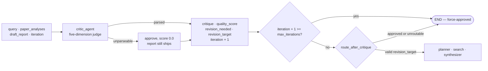

# Critic agent

## Purpose

Evaluates the synthesized draft and decides whether another revision
round is worth it — and if so, which agent should run again. Last node
in the fixed pipeline, where its `revision_target` drives the only
conditional edge; the `critique` action in the supervisor loop, where
its scores feed the supervisor's stop condition instead.

Source: `src/agents/critic.py`. Wiring:
[`docs/architecture.md`](../architecture.md).

## Flow

## Inputs

Reads from `ResearchState`:

- `query` — the research question the report must answer.
- `paper_analyses` — titles listed in the prompt so the judge knows
  what evidence base the draft had to work with.
- `draft_report` — the full draft under evaluation.
- `iteration` — current revision count; used for the force-approve cap.

## Outputs

Writes to `ResearchState`:

- `critique: str` — specific, actionable feedback. Read back by the
  [planner](planner.md), [synthesizer](synthesizer.md) and
  [query refiner](query_refiner.md) on the next round.
- `quality_score: float` — the judge's `average_score` field, coerced
  through `_safe_float` (see below).
- `revision_needed: bool` / `revision_target: str` — the routing
  decision (`planner` / `search` / `synthesizer`, or `""` on approve).
- `iteration: int` — incremented by 1.
- A `messages` entry (`AIMessage` named `"critic"`) with score, status,
  and `iteration/max_iterations`.

## Prompt design

**System** (`SYSTEM_PROMPT`): a rigorous-evaluator role, the five
scoring dimensions, the JSON response schema (`scores`,
`average_score`, `critique`, `revision_needed`, `revision_target`),
and the revision decision rules stated to the judge directly.
`max_tokens=2048`.

**User** (`_build_user_prompt`): the research question, the count and
titles of the analyzed papers, and the full draft report. Nothing else
— the judge scores the report against the question, not against the
papers' full text.

### Scoring rubric

Five dimensions, each 0.0-1.0: completeness, accuracy, coherence,
depth, balance. The routing rules given to the judge:

- average >= 0.7 → approve (`revision_needed: false`,
  `revision_target: "none"`).
- Missing topic coverage → `revision_target: "planner"`.
- Too few papers or weak evidence → `revision_target: "search"`.
- Weak synthesis, structure, or citations → `revision_target: "synthesizer"`.

The agent does **not** recompute `average_score` from the five
dimension scores — it reads the judge's own `average_score` field, and
the per-dimension `scores` object is not written to state at all. The
0.7 bar is a prompt instruction, not a code-side threshold.

## Iteration cap

After the LLM verdict, the agent force-approves when
`iteration + 1 >= settings.max_iterations` — `revision_needed` and
`revision_target` are overridden regardless of score. This is the fixed
pipeline's loop-termination guarantee: without it, a persistently
low-scoring draft would cycle forever. (The supervisor loop has its
own independent caps — `max_loop_iterations` and `max_cost_usd`.)

`max_iterations` therefore names the number of **critic passes** a run
may make, which is what the summary line has always claimed by printing
`iteration N/max_iterations`. Until WO-A17 the comparison was made
against the count *coming in* rather than the pass about to be
recorded, so a run made `max_iterations + 1` passes and the last one
rendered `(iteration 3/2)` — a counter above its own ceiling.
`supervisor._fallback_route` already read the post-increment counter
(`state["iteration"] < max_iterations`), so the two paths disagreed by
one about where the loop ends; they now agree.

Downstream, `route_after_critique` (`src/graph/workflow.py`) routes to
the named target only when `revision_needed` is true **and** the
target is one of the three valid nodes; anything else falls through to
`END`, logging `revision_target_undispatchable` at WARNING so a silent
END never reads as an approved report.

## Failure modes

| Failure | Where | Handling |
|---|---|---|
| Anthropic 429 / 5xx | SDK layer | Retried by the SDK (ADR 0009); exhausted retries propagate — no fallback verdict is fabricated for a transport failure. |
| Response not JSON / not an object | `critic_agent` (ADR 0041 parse defense) | Logged at WARNING (`critic_response_unparseable` / `critic_response_not_an_object`) and coerced to safe defaults: **approved with score 0.0**. The critic is the terminal node — a formatting hiccup here must never discard the finished report the run already paid for. The zero score keeps the degradation honest in the summary line. |
| `average_score` missing or wrong-typed (a string, `null`) | `_safe_float` | Coerced to `0.0` with a `critic_score_unparseable` WARNING. A JSON-string number (`"0.82"`) is accepted, since `float()` parses it. |
| `revision_needed` not a literal JSON `true` | `critic_agent` | Treated as `false`. Same idiom the verifier uses for its `verified` field — a truthy-but-not-`true` value never triggers a revision round. |
| `revision_needed` with an unroutable `revision_target` | `critic_agent` | `critic_revision_target_invalid` WARNING; revision cancelled — deliver the report rather than spin a round the graph cannot route. |
| `revision_target` outside the enum reaching the router (e.g. a stale checkpoint) | `route_after_critique` | Falls through to `END` with a `revision_target_undispatchable` WARNING — run finishes with the current draft. |
| Score inflation / judge drift | Not handled here | The offline eval metrics (`src/eval/metrics.py`) score the same reports independently, so systematic critic drift shows up in the nightly regression diff. |
| Injected paper text steering the verdict | Prompt path | Paper *titles* and the draft are in the prompt; reader-side isolation (ADR 0020) scrubs upstream, but the critic's own prompt is not tag-wrapped — same follow-up as the synthesizer/verifier (ADR 0020 non-goals). |

## Flags

Settings that drive the critic (see `src/config.py`):

- `max_iterations: int = 3` — hard cap on critic-driven revision
  loops.
- `critic_model: str = ""` — per-agent model override (ADR 0021).
  Empty falls back to `anthropic_model`.
- `enable_prompt_caching: bool = False` — system-prompt caching (ADR
  0022).
- `min_quality_score: float = 0.75` — **supervisor-loop only**: the
  supervisor's stop threshold reads the critic's `quality_score`; the
  0.7 approve bar inside the critic's own prompt is independent of it,
  and the two are deliberately not kept in sync.

## Testing

- Routing: `tests/test_smoke.py` — `route_after_critique` (approve →
  END, each valid target, invalid target → END, missing fields → END).
- Parse defense: `tests/test_parse_defense.py::TestCriticParseDefense`
  — unparseable / non-object / wrong-typed judge output degrades to
  approved-with-zero-score instead of raising (ADR 0041).
- LLM-call plumbing: `tests/test_agent_model_routing.py` (the
  `critic_model` override) and `tests/test_agent_cache_flag.py` (the
  prompt-caching flag), both with `call_llm_json` monkeypatched.
- Iteration ceiling:
  `tests/e2e/test_research_workflow.py::test_a_critic_that_never_approves_stops_at_the_iteration_ceiling`
  — the e2e tier drives the compiled graph with a critic that demands a
  revision every time and asserts the node trajectory, the final
  counter, and the `N/max_iterations` text of the last message. It is
  the tier that found the off-by-one, and it owns it: the branch is
  invisible to a unit test of the critic, which never sees the loop it
  bounds.
- Judge quality itself is guarded by the nightly eval, not unit tests.

## Related

- **Hands off to** — `END`, or back to [planner](planner.md) /
  [search](search.md) / [synthesizer](synthesizer.md) via
  `revision_target`. In the supervisor loop, control returns to the
  [supervisor](supervisor.md), which reads `quality_score` against
  `min_quality_score` as its `quality_reached` stop condition.
- **ADRs** — [0041](../decisions/0041-retrieval-and-degradation-honesty.md)
  (parse defense),
  [0014](../decisions/0014-supervisor-loop-behind-flag.md) (how the
  loop consumes this agent's score),
  [0021](../decisions/0021-cost-aware-model-routing.md) (model
  routing), [0022](../decisions/0022-anthropic-prompt-caching.md)
  (prompt caching),
  [0005](../decisions/0005-custom-eval-over-ragas.md) /
  [0044](../decisions/0044-eval-cost-accuracy-and-regression-thresholds.md)
  (the offline metrics that cross-check this judge).
- **Workflow wiring** — [`docs/architecture.md`](../architecture.md).
