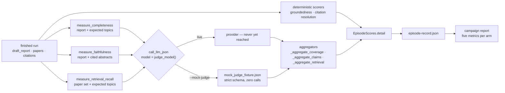

# Evaluation judge

## Purpose

The instrument that scores a finished research run. Three of the five
metrics a scored run carries are LLM-as-judge calls; the other two are
deterministic. This page is about the three.

It is the one page here whose subject is **not** in `src/agents/`, and
the reason is the whole of its design: the judge never participates in a
run. It reads a report the graph has already finished, against material
the run already retrieved, and writes a number nobody on the graph can
see. An agent that could influence the run it is grading would not be an
instrument.

Source: `src/eval/metrics.py` — the three rubrics, their prompts, their
version constants and their aggregators. Called from two places and no
others: `src/eval/runner.py` (the sequential eval tier) and
`src/eval/mock_judge.py` (the campaign's opt-in fixture scorer).

Three things it is not, because all three are nearby and the names
collide:

| Not this | What that is |
|---|---|
| [Verifier](verifier.md) | A *runtime* faithfulness check on the graph. Same family of question, different job: its verdict changes what the run does next. |
| [Critic](critic.md) | The run's own quality gate, inside the loop, whose `revision_target` drives an edge. |
| Assessment judge | `src/agents/assessment.py`, on the guided-read session graph, producing tutor guidance ([ADR 0060](../decisions/0060-evidence-grounded-assessment-judge.md)). A learner-facing agent, not an evaluator. |

**These three rubrics have never been run live.** No eval campaign in
this repository has ever completed against a provider — `docs/eval.md`
records the position plainly, and
[`15-stage0-qualification-report.md`](../agent-engineering/15-stage0-qualification-report.md)
attests zero external calls across the whole Stage-0 matrix. Every
number any of the three has produced came from a test stub or from the
deterministic fixture
[ADR 0095](../decisions/0095-deterministic-mock-judge-campaign-scoring.md)
added. That is a fact about the repository's history rather than about a
default setting, and [What a real run still
needs](#what-a-real-run-still-needs) is what stands between it and a
measurement.

## What it scores

Five metrics reach a campaign report (`METRIC_IDS` in
`src/campaign/report.py`). `JUDGE_METRICS` is the subset that costs
money:

| Metric | Instrument | Unit of the rate | ADR |
|---|---|---|---|
| `supported_claim_precision` | **deterministic** — paired claim outcomes from `src/eval/groundedness.py` | claims | [0074](../decisions/0074-deterministic-groundedness.md) |
| `citation_resolution_rate` | **deterministic** — cited identifiers resolved against the papers the run retrieved | citations | [0074](../decisions/0074-deterministic-groundedness.md) |
| `completeness` | **judge** — one batched call over the expected topics | expected topics | [0006](../decisions/0006-completeness-batched-judge.md) |
| `faithfulness` | **judge** — extract-and-judge in one call against cited abstracts | decided claims | [0007](../decisions/0007-faithfulness-single-call-abstracts.md) |
| `retrieval_recall` | **judge** — one batched call over the retrieved paper set | expected topics | [0013](../decisions/0013-sprint-1-finish-retry-checkpoint-tracing-recall.md) |

The sequential tier's five are *nearly* the same list: it reports
`citation_accuracy` — the legacy `[Author, Year]` diagnostic ADR 0074
kept deliberately broken — where the campaign reports
`supported_claim_precision`. The three judge rubrics are identical in
both.

`RESEARCH_RUBRICS` is a fourth list and a different question: it is what
a row *records*, and it holds **four** entries — the three judges plus
`groundedness`. The deterministic check carries a version constant and a
normalization-spec digest precisely so that changing it rebaselines a
campaign exactly as a prompt edit does; `regression_diff` exits 3 rather
than diffing a row scored before the change against one scored after.
`citation_accuracy` is absent from that list because it publishes
neither, so there is nothing a lock could hold it to.

## Flow



Each rubric is **one call**, not one call per item. Completeness and
retrieval recall batch every expected topic into a single request;
faithfulness extracts and judges every claim in a single request. That
is ADR 0006's and ADR 0007's decision and it is what makes §3 of the
approval packet a three-call-per-episode line rather than a
per-claim one.

## Inputs

Read from the finished run's state, never from the network:

- `draft_report` — the text being graded. Faithfulness short-circuits on
  an empty draft (`score=1.0`, `total_claims=0`) and makes no call.
  Completeness deliberately does **not**: an empty report is judged in
  the normal way, and typically comes back all-uncovered, because "the
  report covered none of the topics" is a real result and 1.0 would not
  be.
- `papers` — `PaperMetadata` the run actually retrieved. Supplies
  faithfulness's source index (joined against `citations`) and is the
  whole input to retrieval recall.
- `citations` — what the report claims to cite. Faithfulness judges each
  claim against the abstract its citation resolves to; a claim whose
  abstract could not be supplied is excluded from the denominator and
  counted as `source_unavailable` (ADR 0007's denominator choice).
- `expected_topics` — from the benchmark case, not from the run. The only
  input the run did not produce, and the reason completeness and
  retrieval recall can only be scored against a registered case. Empty
  topics short-circuit both without a call.

## Outputs

Each rubric returns a typed result the aggregator built from the parsed
JSON, and the campaign writes all of it into the episode record's
`scores` detail:

| Field | Meaning |
|---|---|
| `metrics.completeness` / `.faithfulness` / `.retrieval_recall` | the three rubric results, with per-topic and per-claim decisions |
| `judges_run` | `true` only when the three rubrics actually executed |
| `judge_rubrics_skipped` | the names that did not run — `["completeness", "faithfulness", "retrieval_recall"]` on the default scorer |
| `judge_records` | one record per rubric call, under `--mock-judge` |
| `judge_abstentions` | how many claims the instrument declined to decide |

Those fields are what the report reads back. Each arm's quality block
prints `judges_run on N of M`, names `skipped_rubrics`, and prints
`not run` with a reason for any metric that has none — **a metric that
did not run is not a zero**, and a report that showed `0.000` for three
rubrics nobody switched on would be describing an instrument that was
never turned on.

Cost is kept in its own column all the way through. `judge_cost_usd` and
`judge_model_calls` are separate fields on `EpisodeScores`, separate
caps on `EpisodeBudget`, and a separate row in the report's cost table
(ADR [0050](../decisions/0050-eval-runner-hardening.md)). A judge
and a workflow are not the same spend and never share a total.

## Prompt design

Three system prompts, in `src/eval/metrics.py`, each with a version
constant beside it:

| Rubric | Prompt | `max_tokens` | Version |
|---|---|---|---|
| completeness | strict topic-coverage evaluator; one decision per expected topic, in input order | 2048 | `COMPLETENESS_RUBRIC_VERSION` |
| faithfulness | extract the report's claims, then judge each against its cited abstract | 8192 | `FAITHFULNESS_RUBRIC_VERSION` |
| retrieval recall | decide per topic whether *at least one retrieved paper* plausibly covers it — the search results, not the report | 2048 | `RETRIEVAL_RECALL_RUBRIC_VERSION` |

Two properties are structural rather than stylistic, and both come from
ADR [0070](../decisions/0070-eval-integrity-provenance.md):

- **Every call names its model.** `judge_model()` reads
  `settings.eval_judge_model` at call time. Before that existed the
  judges passed no model at all, `src/llm.py` fell through to
  `settings.anthropic_model`, and **a product-model upgrade silently
  changed the grader**. Read at call time rather than bound at import,
  so a campaign that overrides the setting gets the override.
- **Every prompt carries a version.** An unversioned prompt let an edit
  rebaseline a metric with nothing in the row to say so.
  `tests/test_eval_rubric_versions.py` is what stops the text moving
  under a stale version.

Each prompt demands JSON matching an exact schema with no markdown
fencing, and each returns one object per input item in input order — the
property the aggregators rely on to join a decision back to the topic or
claim it belongs to.

## Abstention is a first-class answer

Faithfulness's schema allows `supported: true | false | null`, and
`null` means the judge declined — typically because the cited abstract
was unavailable. Anything that is neither a bool nor `null` is folded to
`None` rather than misattributed.

The counting choice matters more than it looks: the calibration
protocol's §9.1 records that how abstentions are counted swings measured
accuracy by **10–34 points on identical verdicts**. So the protocol
requires the policy to be a declared field of every agreement report,
computes all three policies, and always reports the abstention *rate*
from the raw triples so no policy can make abstentions disappear from
the report that measures them. The recommended policy is `excluded`:
counting a decline as a failure punishes exactly the behaviour the
experiment design asks for.

## How it runs today: the fixture

`python -m src.campaign run --mock-judge`
([ADR 0095](../decisions/0095-deterministic-mock-judge-campaign-scoring.md)).
Default-off, and available only when `USE_MOCK_DATA=true` **and** the
API key is exactly `local-preview-disabled` — `build_mock_judge_scorer`
refuses to construct otherwise.

What it does: installs a fixture-backed callable over the three judge
sites for the duration of scoring, and restores the original afterwards.
It never constructs a provider client. The checked-in fixture supplies
*decisions* rather than prose pretending to be model output, and every
generated response is validated by a strict Pydantic model before the
production aggregator consumes it — so the thing under test is the real
parser, the real aggregator, the real persistence path and the real
denominator, with the network removed.

It also runs `src/calibration/blinding.py` over the public synthetic
pairwise fixtures while it scores: case ids become blinded ids, the
seeded schedule presents every pair in both AB and BA order, and every
metric prompt is scanned for identity leaks before the fixture is
allowed to answer it.

Episode records from that pass carry all five metrics, three
mock-judge records, `judges_run: true`, **zero** judge model calls and
**$0.000000** judge cost.

**None of this is quality evidence.** It is harness qualification. Every
number is a deterministic consequence of a public fixture and says
nothing about whether a real judge is accurate or calibrated. The
default scorer remains the deterministic one, and `execute_campaign`
refuses to use it for a campaign that budgeted judge calls — so a
protocol that declared judges cannot be quietly scored without them.

## Calibration: the workflow, and what it would prove

Judge–human agreement is **unmeasured on all three judged metrics**. The
protocol is
[`14-judge-calibration-protocol.md`](../agent-engineering/14-judge-calibration-protocol.md);
its frame is one sentence — *LLM judges are instruments, not labels* —
and an uncalibrated instrument produces numbers that look like
measurements.

Four steps, two of which are commands and two of which are people:

```bash
# 1. Generate. Writes outputs/calibration/<packet_set_id>/ and nothing else.
python -m src.calibration packets

# 2. Label. Offline, by two people, independently. Nothing runs here.

# 3+4. Ingest and report, once per returned packet.
python -m src.calibration ingest outputs/calibration/<id>/expert-a/returned.json \
  --manifest outputs/calibration/<id>/manifest.json \
  --output outputs/calibration/<id>/expert-a/agreement.md
```

Two verbs and no third. Neither calls a model, touches the network, or
starts a labelling campaign.

**What the annotator gets.** Two packets, `expert-a` and `expert-b`,
carrying the same 30 registered calibration cases in independently
shuffled order, addressed by blinded ids (`itm-<12 hex>`). The packet
carries the report excerpt, the cited source, the rubric item and the
label type's decision vocabulary; it omits the registry case id, the
reference decision, the authored rationale, the slice tags and the
presentation order. Four label types are defined —
`claim_support`, `citation_correctness`, `rubric_coverage`,
`pairwise_preference`.

**The blinding key travels separately.** `manifest.json` sits *outside*
both packet directories, so handing over the wrong thing means handing
over a directory that visibly is not a packet. It maps blinded ids back
to registry cases and records each packet's presentation order, and it
deliberately does **not** carry the reference decisions — the answer key
stays in the sealed label set and is resolved at ingest. A leaked
manifest reveals which case an item is and never what the right answer
was.

The default seed is the registered blinding plan's — `20260905`, from
`judge-calibration-blinding@1.0.0` — so the default packet set is
reproducible by anybody holding this repository, and the packet set id
is a digest of the corpus, the seed and the packet shape rather than a
timestamp.

**Ingestion refuses loudly** (exit 2) on a manifest that no longer
renders the registry it claims, a partially-labelled file (naming every
unlabelled item), a file that does not cover exactly the packet's items,
a decision outside its vocabulary, or a returned packet whose material
changed under it.

**What comes out** is six measures, each with numerator, denominator and
a Wilson interval from `src/eval/stats.py`: agreement (φ with raw
agreement and *both* positive rates on the same line), false pass over
the reference-fail items, false fail over the reference-pass items,
abstention, position bias, and slice coverage. The three error
denominators differ on purpose — false pass over reference-fail items
answers "when the work was bad, how often did the judge wave it
through", and dividing by all items would make a judge look better
simply by being given more good work. φ is `None`, never `0.0`, when any
margin of the table is zero.

**And a gate.** `decide()` answers PROMOTE (this judge may carry a
release gate), HOLD (its numbers are diagnostics only) or ROLLBACK (it
must not gate a release), evaluated in a fixed order: an integrity veto
first and unconditionally, then comparability and sufficiency, then the
measurement — false-pass Wilson *upper bound* against its ceiling, φ
against its floor, position bias against its band. The thresholds are
proposed and not approved, and `UsabilityThresholds` refuses to be
constructed with `approved_by_owner=True`: an owner approval is recorded
in an approval ledger, not typed into a threshold object.

Every report this repository can produce today HOLDs, for the right
reason — its verdicts are predictions rather than human labels.

## What a real run still needs

Nothing in this list is code:

1. **An owner decision to spend.** Every live baseline, model judge and
   paid label is blocked on it, and the packet that would be presented
   ([`16-w12-approval-packet-draft.md`](../agent-engineering/16-w12-approval-packet-draft.md))
   is a draft whose go/no-go question is deliberately unanswered.
2. **The judge model re-pinned and its price re-verified, at run time.**
   The approval packet marks both `RE-PIN BEFORE APPROVAL`, and the
   price table carries its own `PRICES_LAST_VERIFIED` date so a stale
   one is visible rather than assumed. Re-pinning `EVAL_JUDGE_MODEL` is
   a decision and not a setting: it changes the instrument and
   invalidates every prior baseline (ADR 0070).
3. **Measured token counts.** The approval packet's per-rubric token
   figures are assumptions about prompts that exist and have never been
   run against this benchmark. One episode under a separately approved
   micro-cap replaces all of them with a measurement.
4. **Human labels.** The packets can be written today; nobody has been
   asked to label one, and the retention of a completed packet — a
   human-label artifact — is an open owner decision, which is why
   `outputs/` is git-ignored and a completed packet stays in the
   operator's hands rather than in this repository.

Until those exist, what the repository has is an executable harness with
a fixture in it, and it says so in every artifact it writes.

## Flags and settings

- `EVAL_JUDGE_MODEL` (`settings.eval_judge_model`) — the model **every**
  judge call is issued against. A separate instrument from
  `ANTHROPIC_MODEL` on purpose; changing it invalidates prior baselines
  (ADR 0070).
- `USE_MOCK_DATA` — required `true` for `--mock-judge`, and the switch
  that makes the whole research graph model-free (ADR 0080). A campaign
  scored under it is scored over the fixture corpus.
- `ANTHROPIC_API_KEY=local-preview-disabled` — required exactly for
  `--mock-judge`, and a structural refusal in `src/llm._get_client`
  everywhere else.
- `--mock-judge` — the `run` flag that selects the fixture scorer. Off
  by default; the default scorer runs the deterministic checks and
  records `judges_run: false`.
- `EVAL_SEED` (`settings.eval_seed`) — pins the harness's own
  randomness. It does **not** make a judged campaign reproducible: the
  Messages API exposes no sampling seed and the judges are sampled.
  Recording the seed says what was pinned, and ADR 0070 says plainly
  what it does not buy.
- `judge_cost_usd_max` and `judge_model_calls_max` on the campaign's
  `EpisodeBudget` — the judge's own ceilings, declared and enforced
  separately from the workflow's. `execute_campaign` refuses to start a
  campaign that budgeted judge calls with a scorer that makes none.

## Failure modes

| Mode | What happens |
|---|---|
| The provider call raises | The sequential runner records that metric as `None` with the exception in `failures` and logs `eval_metric_failed`; the other four still score. Isolation is the point — one broken rubric is not a lost run. |
| The response is unparseable | The aggregator sees nothing it can use and the metric is `None`. Under `--mock-judge` the strict output model rejects it before the aggregator is reached. |
| A cited source is unavailable | The judge returns `supported: null` and the aggregator counts the claim as `source_unavailable`, excluded from the denominator. A decline is never scored as a failure. |
| Nothing to grade | Three short-circuits, none of which calls a model: faithfulness on an empty report, completeness on an empty topic list, retrieval recall on either an empty topic list (`1.0`) or an empty paper set (`0.0`, all uncovered). |
| Judge failure across a campaign | The approval packet's §5 proposes a stop rule at **more than 10 % of episodes** losing a primary score to judge failure: stop and report the null-score denominator, because a campaign whose scores are mostly absent is not a variance estimate. Proposed, not yet enforced in code. |
| Judges were never run at all | `judges_run: false`, the three rubric names in `judge_rubrics_skipped`, and `not run` with a reason in the report. Never a zero. |

## Testing

- `tests/test_metrics_completeness.py`,
  `tests/test_metrics_faithfulness.py`,
  `tests/test_metrics_retrieval_recall.py` — the three aggregators,
  against parsed responses rather than a provider; and
  `tests/test_metrics_citation_resolution.py` /
  `tests/test_metrics_citation_accuracy.py` for the deterministic two.
- `tests/test_eval_rubric_versions.py` — the prompts cannot move under a
  stale version constant.
- `tests/test_mock_judge.py` and `tests/test_campaign_execution.py` —
  the fixture scorer, the strict output models, the blinding pass, and
  the full matrix reporting all five metrics with **zero** judge model
  calls and **$0.000000** judge cost.
- `tests/test_calibration_labels.py`,
  `tests/test_calibration_packets.py`,
  `tests/test_calibration_metrics.py` and their siblings — the label
  vocabulary, the packet renderer, what ingestion refuses, the six
  measures and the gate.
- `tests/conftest.py`'s spend guard and socket guard — every one of the
  above runs with both armed, so "no judge call was made" is a property
  of the suite rather than of a promise.

## Related

- **Scored by** — `src/eval/runner.py` (sequential tier),
  `src/campaign/execute.py` via `src/eval/mock_judge.py` (campaign
  tier). Neither is on the research graph.
- **Grades the output of** — the [synthesizer](synthesizer.md), against
  what the [search](search.md) and [reader](reader.md) agents
  retrieved. The runtime analogue is the [verifier](verifier.md).
- **ADRs** — [0006](../decisions/0006-completeness-batched-judge.md)
  (completeness),
  [0007](../decisions/0007-faithfulness-single-call-abstracts.md)
  (faithfulness),
  [0013](../decisions/0013-sprint-1-finish-retry-checkpoint-tracing-recall.md) (retrieval
  recall),
  [0070](../decisions/0070-eval-integrity-provenance.md) (judge model,
  rubric versions, the seed's limits),
  [0074](../decisions/0074-deterministic-groundedness.md) (the two
  deterministic metrics),
  [0050](../decisions/0050-eval-runner-hardening.md) (judge vs
  workflow spend),
  [0095](../decisions/0095-deterministic-mock-judge-campaign-scoring.md)
  (the fixture judge).
- **Protocol and strategy** —
  [`14-judge-calibration-protocol.md`](../agent-engineering/14-judge-calibration-protocol.md),
  [`docs/eval.md`](../eval.md).
