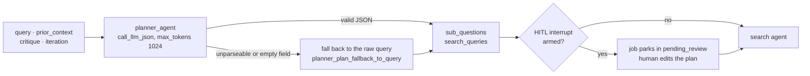

# Planner agent

## Purpose

Decomposes the user's research question into 2-4 focused sub-questions
and 1-2 targeted arXiv search queries per sub-question. First node in
the fixed pipeline; the `plan` action in the supervisor loop. Also the
HITL breakpoint: when the graph is compiled with a checkpointer and
`enable_hitl` is effective, LangGraph is given
`interrupt_after=["planner"]`, so the workflow pauses right after this
agent for a human to review and edit the plan before search runs (ADR
[0030](../decisions/0030-hitl-plan-review.md)).

Source: `src/agents/planner.py`. Wiring:
[`docs/architecture.md`](../architecture.md).

## Flow

## Inputs

Reads from `ResearchState`:

- `query` — the user's research question. The only required field.
- `prior_context` — conversation mode only (ADR
  [0032](../decisions/0032-conversation-mode.md)): top-K chunks
  retrieved from the thread's prior reports, injected by the API
  runner before the workflow starts. Blank outside conversations.
- `critique` — previous critic feedback, if any. Included verbatim so
  the revision addresses it.
- `iteration` — when `> 0`, the prompt states which revision round
  this is.

## Outputs

Writes to `ResearchState`:

- `sub_questions: list[str]` — 2-4 focused sub-questions.
- `search_queries: list[str]` — concise keyword phrases for arXiv.
- A `messages` entry (`AIMessage` named `"planner"`) with the counts.

Consumed by the [search agent](search.md) (`search_queries`), the
[reader](reader.md) (`sub_questions` drive chunk ranking and claim
attribution), the [synthesizer](synthesizer.md) and
[verifier](verifier.md) (coverage targets), and the
[query refiner](query_refiner.md) (gap analysis).

## Prompt design

**System** (`SYSTEM_PROMPT`): role + the decomposition rules (cover
methods / theory / applications / benchmarks / recency angles; search
queries are keyword phrases, not sentences) + the JSON response schema
`{sub_questions, search_queries}`. When the state carries
`prior_context` **and** `settings.enable_prompt_isolation` is on,
`PRIOR_CONTEXT_ISOLATION_INSTRUCTION` is prepended — prior reports were
synthesized from untrusted paper text, so a cross-turn injection could
otherwise steer this run's plan (ADR
[0033](../decisions/0033-safety-hardening-bundle.md)).

**User** (`_build_user_prompt`): the research question, then, in this
order:

- `prior_context`, wrapped in `<untrusted_prior_context>` tags when
  isolation is on, positioned *above* the critique so the model treats
  it as background rather than corrective feedback. The instruction
  tells the model to avoid re-researching covered ground and to target
  the gaps the follow-up asks about.
- The previous critique, if any.
- The revision-iteration note, if `iteration > 0`.

Output cap is `max_tokens=1024` — a plan is a short JSON object, and
the cap is well clear of what the schema needs.

## Failure modes

| Failure | Where | Handling |
|---|---|---|
| Anthropic 429 / 5xx | SDK layer | Retried by the SDK (`anthropic_max_retries`, ADR 0009); exhausted retries propagate — a transport failure is not a formatting hiccup. |
| Response not JSON / not an object | `planner_agent` (ADR 0041 parse defense) | Logged at WARNING (`planner_response_unparseable` / `planner_response_not_an_object`) and treated as an empty plan — see the next row. |
| Missing / empty / wrong-typed `sub_questions` or `search_queries` | `planner_agent` | Each field falls back **independently** to the user's raw query (`sub_questions or [query]`, `search_queries or [query]`), logged once as `planner_plan_fallback_to_query` with both counts. A partially usable plan keeps the half that parsed. |
| Non-string / blank entries inside either list | `_coerce_str_list` | Dropped silently; the surviving entries are stripped. An all-blank list is empty and hits the row above. |
| Prompt injection via `prior_context` | Cross-turn (ADR 0033) | Mitigated behind `enable_prompt_isolation`: wrap + system instruction. Off by default. |

The fallback is the raw query, never a fabricated decomposition: a
degraded plan is visibly shallow (one sub-question) rather than
plausible-looking garbage, and the WARNING makes the degradation
greppable. (Before ADR 0041 a malformed response propagated and
failed the whole job.)

## Flags

Settings that drive the planner (see `src/config.py`):

- `use_mock_data: bool = False` — **Mock mode** (ADR
  [0080](../decisions/0080-mock-mode-covers-the-whole-research-graph.md)):
  the plan is ADR 0041's fallback shape — the raw query as the single
  sub-question and search query — built by `src.agents.mock_mode` before
  the prompt is assembled, so no model client is constructed. Mock mode
  invents no decomposition, because a guess about the topic dressed as
  an analysis of it is worse than a visibly shallow plan.
- `planner_model: str = ""` — per-agent model override (ADR 0021).
  Empty falls back to `anthropic_model`.
- `enable_prompt_caching: bool = False` — marks the system prompt for
  Anthropic's ephemeral cache (ADR 0022).
- `enable_prompt_isolation: bool = False` — gates the prior-context
  wrapping described above (ADR 0033).
- `enable_hitl: bool = True` — the post-planner interrupt lives in the
  workflow wiring (`_compile` in `src/graph/workflow.py`), not in this
  agent, but it is this agent's output the human reviews (ADR 0030).
  Two conditions gate it: the graph must have been compiled with a
  checkpointer (`enable_checkpointing`, on by default), and the
  per-build override wins over the setting — the eval runner and
  `POST /research { hitl_bypass: true }` pass `enable_hitl=False`.
- `conversation_context_top_k: int = 5` — how many prior-report chunks
  the API runner puts in `prior_context` (ADR 0032). Not read by this
  agent, but it sizes the block this prompt embeds.

## Testing

- Unit: `tests/test_planner_prior_context.py` — prompt-builder
  coverage: prior-context block presence/absence, ordering relative to
  the critique, isolation wrapping on/off, system-prompt shape, and
  full-agent behavior with `call_llm_json` monkeypatched.
- Parse defense: `tests/test_parse_defense.py::TestPlannerParseDefense`
  — unparseable / non-object / wrong-typed responses all degrade to
  the raw-query plan instead of raising (ADR 0041).
- LLM-call plumbing: `tests/test_agent_model_routing.py` (the
  `planner_model` override) and `tests/test_agent_cache_flag.py` (the
  prompt-caching flag).
- Plan-review flow (edited sub-questions / search queries resuming the
  workflow): `tests/test_api_hitl.py`.

## Related

- **Hands off to** — [search](search.md). Re-entered from
  [critic](critic.md) (`revision_target: "planner"`) and from the
  [supervisor](supervisor.md) (`plan` action).
- **ADRs** — [0030](../decisions/0030-hitl-plan-review.md) (HITL plan
  review), [0032](../decisions/0032-conversation-mode.md)
  (`prior_context`),
  [0033](../decisions/0033-safety-hardening-bundle.md) (prior-context
  isolation), [0041](../decisions/0041-retrieval-and-degradation-honesty.md)
  (parse defense), [0021](../decisions/0021-cost-aware-model-routing.md)
  (model routing), [0022](../decisions/0022-anthropic-prompt-caching.md)
  (prompt caching).
- **Workflow wiring** — [`docs/architecture.md`](../architecture.md).
