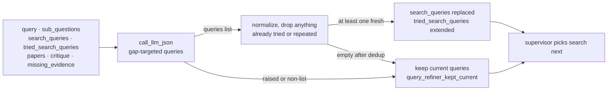

# Query refiner agent

## Purpose

Recovery action for weak search results. When the supervisor picks
`refine_query`, this agent produces a fresh set of arXiv search
queries targeted at coverage gaps — verifier `missing_evidence`,
critic feedback, sub-questions not yet answered — and replaces
`state.search_queries` with them so the next `search` action tries
something different. Without it, the supervisor's "search again" is
just "search the same thing again", and the loop thrashes instead of
recovering.

The refiner is **supervisor-only**. Under the fixed pipeline it is
never wired. `enable_query_refiner` is independent of every other
Sprint 2 flag so its lift can be measured separately.

Source: `src/agents/query_refiner.py`. Wiring:
[`docs/architecture.md`](../architecture.md).

## Flow

## Inputs

Reads from `ResearchState`:

- `query` — original research question.
- `sub_questions` — planner decomposition.
- `search_queries` — currently in flight (about to be replaced).
- `tried_search_queries` — history of every query the loop has run
  in this workflow. Used for dedup.
- `papers` — already retrieved; titles + abstract heads (first 40
  words) inform what territory is covered.
- `missing_evidence` — verifier-reported gaps (when available).
- `critique` — critic feedback (when available).

## Outputs

Writes to `ResearchState` (only on success):

- `search_queries` — replaced with the refined set.
- `tried_search_queries` — extended with what was in
  `search_queries` at entry, so the next refinement can't propose them
  again.
- A `messages` entry (`AIMessage` named `"query_refiner"`) with the
  fresh-query count, the number dropped as dupes, and the model's
  stated reason.

On fail-closed rounds (LLM error, non-list response, empty output,
all duplicates), only the `messages` entry is returned — search
state stays intact.

## Prompt design

**System** (`QUERY_REFINER_SYSTEM_PROMPT`): role + rules — never
repeat an already-tried query even paraphrased, go after a distinct
angle / synonym family / methodology / benchmark / subfield, prefer
queries targeting the listed gaps over broad rewordings, return an
empty list rather than padding with paraphrases. The cap is
interpolated from `settings.query_refiner_max_queries`. Response
schema is `{queries: [...], reason: "..."}`. `max_tokens=1024`.

**User** (`_build_user_prompt`): original question + sub-questions +
all already-tried queries (history ∪ currently in flight) +
retrieved-paper block (title + first 40 words of abstract per paper) +
verifier `missing_evidence` + critic feedback (appended last, only if
present).

Kept short-ish by design — abstract heads instead of full abstracts,
flat lists everywhere.

### Dedup

Two-level:

1. **Prompt-side**: the system prompt tells the LLM never to repeat
   an already-tried query, even paraphrased, and to return `[]` if
   it can't find a genuinely new angle.
2. **Server-side**: the refiner normalizes every candidate
   (lowercase + strip), rejects those in
   `tried_search_queries ∪ current search_queries`, and dedupes
   duplicates within the current batch (first-occurrence order). The
   raw list is sliced to `query_refiner_max_queries` *before* the
   filter runs, so the cap bounds what is considered, not just what
   is kept.

Prompt-side dedup catches "why did the LLM repeat itself?" bugs
during dev; server-side dedup is the load-bearing guarantee.

## Failure modes

The refiner never blanks `search_queries`. Three branches call
`_keep_current`, covering four triggers:

| Trigger | Where | Reason logged with `query_refiner_kept_current` |
|---|---|---|
| LLM call raised (transport failure after SDK retries, unparseable JSON) | broad `except` around `call_llm_json` | `LLM call failed (<ExcType>)` |
| `queries` field is not a list | post-parse type check | `LLM returned non-list 'queries' field` |
| LLM returned an empty list | dedup filter | `LLM returned no queries distinct from history` |
| Every candidate duplicated something already tried | dedup filter | same as above |

Other coercions, none of which abort the round:

| Failure | Where | Handling |
|---|---|---|
| Non-string or blank entries inside `queries` | dedup loop | Skipped individually; surviving entries are stripped. |
| Missing / non-string `reason` | post-parse | Rendered as `(no reason given)` in the message. |
| Refined queries retrieve papers already in `state.papers` | Not handled here | Dedup is query-level only; the [search agent](search.md)'s `deduplicate_papers` collapses the overlap at the paper level on the next round. |

Rationale for fail-closed: repeating a weak query is worse than
nothing but strictly better than searching for nothing. The loop stays
alive; the supervisor can pick a different action next.

## Flags

Settings that drive the refiner (see `src/config.py`):

- `enable_query_refiner: bool = False` — master flag. When off,
  `refine_query` is stripped from the supervisor's action enum and
  the workflow doesn't wire this node.
- `query_refiner_max_queries: int = 5` — cap on queries emitted per
  invocation. Interpolated into the system prompt and enforced
  server-side.
- `query_refiner_model: str = ""` — per-agent model override (ADR
  0021); Haiku is the recommended override for this short generation
  task.
- `enable_prompt_caching: bool = False` — system-prompt caching
  (ADR 0022). Note the system prompt is `.format()`-interpolated with
  the query cap, so it is stable across a run and cacheable.

No refiner-specific cost / iteration caps — the supervisor's
`max_cost_usd` and `max_loop_iterations` gate every node including
this one.

## Testing

- Unit: `tests/test_query_refiner.py` — 16 tests covering the prompt
  builder (already-tried listing, missing evidence, critique
  inclusion, papers block), normalization, all four fail-closed
  triggers (LLM exception, non-list, empty output, all duplicates),
  and the happy path (fresh queries land in state, history extends,
  within-batch dedup, non-string entries dropped, config cap
  respected).
- Supervisor gating: `tests/test_supervisor.py::TestQueryRefinerGating`
  — 8 tests covering the `enable_query_refiner` flag (`refine_query`
  accepted / rejected, state summary contents, router behavior with
  stale checkpoints).

## Known limitations

- **No search-side caching**. The refined queries can retrieve
  papers that overlap with what was already found; there's no dedup
  at the query-planning level (only `deduplicate_papers` downstream).
- **Verifier-independent gap signal only**. The refiner reads
  `missing_evidence` and `critique` but not `unsupported_claims` —
  the latter is a synthesis-level problem, not a retrieval one.
- **`tried_search_queries` is never trimmed**. It grows for the life
  of the run and is fully re-listed in every refiner prompt, so a long
  supervisor loop pays linearly more per refinement.

## Related

- **Hands off to** — the [supervisor](supervisor.md), always; the
  intended next action is [search](search.md) with the replaced
  `search_queries`. Its gap inputs come from the
  [verifier](verifier.md) (`missing_evidence`) and the
  [critic](critic.md) (`critique`), over the
  [planner](planner.md)'s `sub_questions`.
- **ADRs** — [0018](../decisions/0018-query-refiner-recovery-action.md)
  (this agent), [0014](../decisions/0014-supervisor-loop-behind-flag.md)
  (the loop that invokes it),
  [0015](../decisions/0015-verifier-agent-runtime-faithfulness.md)
  (`missing_evidence`),
  [0021](../decisions/0021-cost-aware-model-routing.md),
  [0022](../decisions/0022-anthropic-prompt-caching.md).
- **Workflow wiring** — [`docs/architecture.md`](../architecture.md).
