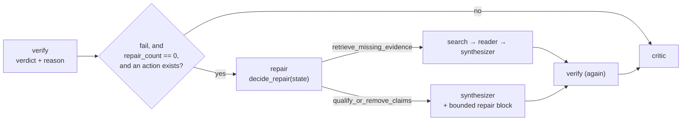

# Repair policy

## Purpose

The recovery half of the fixed verify-and-repair research policy (arm C,
ADR [0076](../decisions/0076-fixed-verify-repair-research-policy.md)).
When the [verifier](verifier.md) fails a report, this is what decides
*what to do about it* — one bounded, named action, chosen by a table.

It is deliberately **not an agent**. There is no prompt on this page and
no model call in the decision: `src/policies/repair.py` is a pure
function from state to a named action, and the graph node that records
it does nothing but write the decision and set up the node that carries
it out. `docs/agent-engineering/02-target-architecture.md` §5 ends its
recovery section with "reflect again is not a recovery policy"; a repair
chosen by a second model call would have been a more expensive way of
saying the same thing, and would have made the arm's behaviour
unattributable — the same input could pick a different repair on every
run.

Source: [`src/policies/repair.py`](../../src/policies/repair.py).
Wiring: [`docs/architecture.md`](../architecture.md).

## Flow

The decision is derived twice — once by `route_after_verification` to
pick the edge, once inside the node to record it. Both are the same pure
function over the same state, so they cannot disagree, and deriving it
twice is cheaper than a state key that exists only to carry an answer
between two adjacent nodes.

## Inputs

Reads from `ResearchState`, each with a default so the function is total
over a state that has never been verified:

- `verification_verdict` — only `fail` can produce a repair.
- `missing_evidence` — the verifier's named gaps; become search queries.
- `unsupported_claims` — the verifier's flagged claims; become the
  synthesizer's repair block.
- `verifier_recommendation` — read *only* to distinguish the two
  approved repairs that are not implemented yet, never to choose an
  implemented one.
- `tried_search_queries` and `search_queries` — dedup history.

## Outputs

Writes to `ResearchState`:

- `repair_action` — the selected action, from `REPAIR_ACTIONS`
  (`retrieve_missing_evidence` | `qualify_or_remove_claims` | `none`).
  Read by `route_after_repair` to pick the next node, and by the
  synthesizer to decide whether its repair block applies.
- `repair_count` — incremented on every visit to the node, whether or
  not the decision found something to do. It is the run's "a repair was
  attempted" record, not a success counter, and incrementing
  unconditionally is what makes the one-repair cap hold under a state
  the router did not anticipate.
- `search_queries` / `tried_search_queries` — rewritten for
  `retrieve_missing_evidence` only, with the same bookkeeping the
  [query refiner](query_refiner.md) does: the gaps become the new
  queries and the queries that were in flight move into history.
- A `messages` entry (`AIMessage` named `"repair"`).

## Decision table

| Verifier output | Action | Reason code | Executes |
|---|---|---|---|
| `missing_evidence` non-empty, at least one gap unsearched | `retrieve_missing_evidence` | `missing_evidence` | search -> reader -> synthesizer |
| `missing_evidence` non-empty, every gap already searched | `none` | `missing_evidence_all_tried` | critic |
| `unsupported_claims` non-empty, no missing evidence | `qualify_or_remove_claims` | `unsupported_claims` | synthesizer |
| verdict `pass` | `none` | `verdict_pass` | critic |
| verdict `abstain` | `none` | `verdict_abstain` | critic |
| `fail`, no lists, `recommended_action="read_more"` | `none` | `reread_sections_not_implemented` | critic |
| `fail`, no lists, `recommended_action="revise_report"` | `none` | `rewrite_section_not_implemented` | critic |
| `fail`, nothing actionable | `none` | `no_actionable_repair` | critic |

Precedence between the two implemented repairs is deliberate: retrieval
can make an unsupported claim supportable, while rewriting a claim
cannot make a missing source appear. With one repair to spend, the run
spends it on the action that can still change the evidence.

The `not_implemented` codes are two of the five repairs
`docs/agent-engineering/07-first-policy-experiment.md` §3 approves —
re-reading named sections, and rewriting the named section only. Naming
them rather than falling through to a bare `none` is what lets an
evaluation count how often the missing repair was the indicated one.

## The repair the synthesizer executes

`qualify_or_remove_claims` reaches the model as an **additional
user-prompt block**, appended last by
`src/agents/synthesizer.py::_repair_instruction`. It lists the flagged
claims (at most ten) and asks for each to be qualified to what a listed
source supports, or removed, changing nothing else.

Neither system prompt is touched. Prompt text is the instrument the
first policy experiment measures with, and rewording it re-baselines
every faithfulness number ever recorded (ADR
[0070](../decisions/0070-eval-integrity-provenance.md)). The block is
gated on `repair_action`, a key nothing outside this policy writes, so
under every other configuration the prompt is byte-identical to what it
has always been.

`repair_action` is a durable record rather than a one-shot flag: it is
what a manifest reads to say which repair a run took, so the verify node
carries it through instead of clearing it. One consequence is worth
knowing: if the critic later sends the run back to the synthesizer, the
repair block is built again — from the *current* `unsupported_claims`,
which the most recent verification refreshed, so it lists what is
unsupported now rather than a stale copy. It is one bounded instruction
either way, and the one-repair cap is enforced on the repair node, not
on the prompt.

## Bounds

| Bound | Value | Where |
|---|---|---|
| Repairs per run | 1 | `route_after_verification` reads `repair_count` |
| Re-verification after a repair | always | the graph's edges — every repair path re-enters `verify` |
| New searches per repair | 5 | `MAX_REPAIR_QUERIES` |
| Claims listed in a repair block | 10 | `_MAX_REPAIR_CLAIMS` |
| Critic revision loop | unchanged | `max_iterations`, after verification |
| Spend, cancellation, timeout | unchanged | the gateway and the node wrapper (ADRs 0047, 0051) |

## Failure modes

| Failure | Where | Handling |
|---|---|---|
| Verdict is `abstain` | `decide_repair` | No repair. A judge that did not answer has found no fault, and repairing on it would spend the cap on a diagnosis nobody made. |
| Every named gap is already searched | `decide_repair` | No repair, code `missing_evidence_all_tried`. Re-running the same searches returns the same papers. |
| The verifier lists thirty gaps | `_fresh_gap_queries` | Capped at five. A verifier that names thirty gaps has produced a re-plan, not a repair. |
| Wrong-typed list fields on state | `_clean_list` | Coerced to `[]`, the same defence `src/agents/verifier.py` applies to judge output. |
| `repair_action` the router cannot dispatch | `route_after_repair` | Logged and routed to the critic. Unreachable through `route_after_verification`, kept so a total router never fails a run for lack of an answer. |
| Cancel or cost ceiling mid-repair | the node wrapper / the gateway | Propagated, never converted into a verdict. `tests/fault/test_verify_repair_faults.py` asserts both. |

## Flags

- `research_policy: Literal["legacy", "fixed_verify_repair"] =
  "legacy"` — the only switch. Under `legacy` this module is imported
  and never called: no node runs it, and its four state keys never
  appear.
- The policy requires `enable_supervisor=false`,
  `enable_evidence_store=true` and `enable_verifier=false`; any other
  combination is refused at settings load (ADR 0076).

## Testing

- Decision table: `tests/test_research_policy.py::TestTheRepairDecisionTable`
  — one test per row, plus abstain, dedup, the cap, and the frozen
  decision.
- Graph shape: `tests/test_research_policy.py::TestTheCompiledShapeIsStructural`
  — the compiled nodes and edges, and that no legacy flag combination
  produces them.
- Trajectories: `tests/e2e/test_verify_repair.py` — the five node
  sequences, including the second failure that must not earn a second
  repair, and the assertion that the repair block actually reaches the
  synthesizer's prompt.
- Faults: `tests/fault/test_verify_repair_faults.py` — a cancel landing
  mid-repair, and a cost ceiling tripping inside the verification.

## Related

- **Fed by** — the [verifier](verifier.md)'s verdict and its two lists.
- **Executes through** — [search](search.md) + [reader](reader.md) +
  [synthesizer](synthesizer.md) for a retrieval repair, the
  [synthesizer](synthesizer.md) alone for a claim repair.
- **Hands off to** — `verify` again, always, and then the
  [critic](critic.md).
- **ADRs** —
  [0076](../decisions/0076-fixed-verify-repair-research-policy.md) (this
  policy),
  [0015](../decisions/0015-verifier-agent-runtime-faithfulness.md),
  [0016](../decisions/0016-evidence-store-source-text-verifier.md),
  [0018](../decisions/0018-query-refiner-recovery-action.md) (the dedup
  rule this reuses),
  [0047](../decisions/0047-bounded-executor-and-cooperative-cancel.md),
  [0051](../decisions/0051-llm-cost-enforcement-and-visibility.md).
- **Workflow wiring** — [`docs/architecture.md`](../architecture.md).
