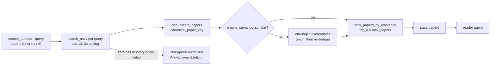

# Search agent

## Purpose

Queries arXiv with the planner's search queries, deduplicates,
optionally enriches through Semantic Scholar's citation graph, and
ranks the pool by embedding similarity to the user's question. One of
the five agents wired into both the fixed pipeline and the supervisor
loop.

This is the only agent that makes **no LLM call** — every step is
deterministic tool work (HTTP + embeddings), so there is no prompt to
design and no judge output to defend against. Its failure modes are
network and retrieval failures instead.

Source: `src/agents/search.py`. Wiring:
[`docs/architecture.md`](../architecture.md).

## Flow

## Inputs

Reads from `ResearchState`:

- `search_queries: list[str]` — the planner's (possibly HITL-edited,
  possibly refiner-replaced) keyword queries.
- `query: str` — the original research question, used as the ranking
  target.
- `papers` — read only to preserve a prior round's results when a
  supervisor-loop re-search comes up empty (see below).

## Outputs

Writes to `ResearchState`:

- `papers: list[PaperMetadata]` — ranked, deduped, capped at
  `settings.max_papers`.
- A `messages` entry (`AIMessage` named `"search"`) reporting the
  count and source (`arXiv`, `arXiv + N S2 references`, or
  `mock data`).

## Prompt design

None — no LLM call. The retrieval "prompt" is the planner's keyword
queries; the relevance judgment is a cosine similarity over MiniLM
embeddings, not a model asked for an opinion.

## Retrieval honesty (ADR 0041)

The built-in `MOCK_PAPERS` demo fixture is served **only** under
`settings.use_mock_data`, in which case the agent is fully offline
(no arXiv, no S2, no query cap — the fixture is ranked and returned
directly). A live search never silently substitutes fabricated
sources.

## Query cap and pacing

`MAX_SEARCH_QUERIES_PER_RUN = 12` bounds the per-run arXiv traffic.
The planner's schema already bounds plan size, but a HITL-edited plan
arrives from outside that schema — this cap is defense in depth. Trims
are logged (`search_query_cap_applied`). Between queries the agent
sleeps 3 seconds, so a full 12-query plan spends ~33s in pacing alone.

## Deduplication

`deduplicate_papers` keys on `canonical_paper_key`, which collapses
arXiv URL ids scheme-, host-case- and version-insensitively
(`http://arxiv.org/abs/2311.09000v1` ≡
`https://arxiv.org/abs/2311.09000`, both to `arxiv:2311.09000`);
non-arXiv ids pass through unchanged. This is what makes the ADR 0023
promise real: arXiv Atom seeds carry a `vN` suffix while Semantic
Scholar's external-ID mapping emits the unversioned form, and the two
must collide to one entry. First occurrence wins, so the arXiv seed
beats an S2 duplicate.

## Ranking

The deduped pool is ranked against the original question by cosine
similarity over MiniLM embeddings — `rank_papers_by_relevance` in
`src/tools/embeddings.py`, a `faiss.IndexFlatIP` inner-product index
over normalized vectors — capped at `settings.max_papers`. The encoder
is the process-wide shared model: torch's OpenMP pool is pinned to one
thread and the device is explicit (`embedding_device`, default `cpu`)
— the native-crash containments of ADR 0052 — and
`embedding_cache=postgres` skips re-encoding texts seen before (ADR
0028).

## Semantic Scholar enrichment (ADR 0023)

Gated by `settings.enable_semantic_scholar`. The top
`semantic_scholar_seed_count` seeds (pre-ranked against the query with
a separate `rank_papers_by_relevance` call) are expanded with up to
`semantic_scholar_refs_per_seed` one-hop references each; total S2
fetches per run are bounded at `seed_count * refs_per_seed`. Setting
either to 0 disables enrichment even with the flag on. Lookups strip
the arXiv version suffix (`ARXIV:2405.12345`, not `...v2`) — S2 404s
on versioned external ids, which previously made enrichment a 100%
silent no-op. Per-seed failures are swallowed: enrichment is
best-effort and never derails the workflow.

## Failure modes

| Failure | Where | Handling |
|---|---|---|
| Every query failed at the transport level (outage, rate limit, non-200) | `search_agent` | Raises `ArxivUnavailableError` — the job fails with that `error_type`. |
| arXiv answered, but zero papers matched | `search_agent` | Raises `NoPapersFoundError`, distinct from the transport case so the failure names its real cause. |
| Some queries failed, others found papers | `search_agent` | Proceeds with what was found; logs `search_partial_arxiv_failure` at WARNING. |
| Re-search (supervisor loop) found nothing but state already has papers | `search_agent` | Returns the prior papers unchanged and logs `search_empty_keeping_prior_papers` — an empty round must not destroy results an earlier round paid for. Neither typed error is raised on this path. |
| Individual arXiv request 429 / 5xx | `src/tools/http_session.py` | Shared `urllib3.Retry` session (`http_max_retries`, `http_backoff_factor`) retries before the query counts as failed. |
| Semantic Scholar unreachable or rate-limited | `_enrich_with_s2_references` | Per-seed failure is skipped; the run proceeds on the arXiv set alone. |
| Adversarial paper title in a search result | Source adapters | `search_arxiv` and `_map_s2_paper` normalize titles to a single line capped at 300 characters, so a multi-line title can't imitate an instruction block in the reader's prompt (ADR 0020 / 0041). |

The tool layer supports the transport/empty distinction via
`search_arxiv(..., raise_on_unavailable=True)`; the default `False`
preserves the historical return-`[]` contract for other callers.

## Flags

Settings that drive the search agent (see `src/config.py`):

- `use_mock_data: bool = False` — serve `MOCK_PAPERS` offline instead
  of hitting arXiv. The only path on which the fixture is reachable.
- `max_papers: int = 10` — cap on the ranked pool handed downstream.
- `results_per_query: int = 5` — arXiv results fetched per query.
- `enable_semantic_scholar: bool = False` — citation-graph enrichment
  (ADR 0023), with `semantic_scholar_seed_count = 3`,
  `semantic_scholar_refs_per_seed = 3`,
  `semantic_scholar_timeout_sec = 30.0`, and the optional
  `semantic_scholar_api_key`.
- `http_max_retries: int = 3` / `http_backoff_factor: float = 1.0` —
  retry policy shared with PDF downloads.
- `embedding_device: Literal = "cpu"` / `embedding_cache: Literal =
  "none"` — ranking substrate (ADRs 0028 / 0052).

No model-routing or prompt-caching flag applies here — there is no LLM
call to route or cache.

## Testing

- `tests/test_search_honesty.py` — mock gating, typed failures,
  partial-failure behavior, prior-papers preservation, the query cap,
  the tool-layer `raise_on_unavailable` contract, and canonical dedup.
- `tests/test_search_enrichment.py` — S2 enrichment flag behavior,
  version-stripped lookups, cross-source dedup.
- `tests/test_arxiv_search.py`, `tests/test_semantic_scholar.py` — the
  two source adapters this agent composes.

## Related

- **Hands off to** — [reader](reader.md). Re-entered from
  [critic](critic.md) (`revision_target: "search"`), from the
  [supervisor](supervisor.md) (`search` action), and after the
  [query refiner](query_refiner.md) replaces `search_queries`.
- **ADRs** — [0023](../decisions/0023-semantic-scholar-citation-graph.md)
  (citation graph),
  [0041](../decisions/0041-retrieval-and-degradation-honesty.md)
  (retrieval honesty),
  [0028](../decisions/0028-postgres-paper-cache-and-embedding-cache.md)
  (embedding cache),
  [0052](../decisions/0052-native-crash-containment-and-data-lifecycle-edges.md)
  (embedding device),
  [0013](../decisions/0013-sprint-1-finish-retry-checkpoint-tracing-recall.md)
  (HTTP retry session).
- **Workflow wiring** — [`docs/architecture.md`](../architecture.md).
