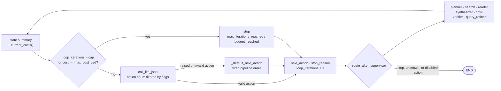

# Supervisor agent

## Purpose

Chooses the next action in the research loop when
`settings.enable_supervisor` is `True`. Under the fixed pipeline (the
default) this node is never added to the graph. When on, the workflow
becomes an observe-decide-act loop: the supervisor picks the next node
from a strict enum, that node runs, control returns here.

Source: `src/agents/supervisor.py` (the agent and the
`route_after_supervisor` conditional edge). Wiring:
[`docs/architecture.md`](../architecture.md).

## Flow



## Inputs

Reads from `ResearchState`:

- `query` — the user's research question.
- `sub_questions` / `search_queries` — presence signals whether the
  planner has run.
- `papers` / `paper_analyses` — presence signals search / read progress.
- `draft_report` / `critique` / `quality_score` — synthesizer + critic
  progress.
- `revision_needed` / `revision_target` — from the critic; used by the
  rules-based fallback if the LLM returns garbage.
- `iteration` / `loop_iterations` — the two independent counters.
- Flag-gated blocks in the state summary: `verified` /
  `unsupported_claims` / `missing_evidence` /
  `verifier_recommendation` (when `enable_verifier`),
  `tried_search_queries` (when `enable_query_refiner`),
  `reader_analysis_complete` / `reader_requested_sections` /
  `reader_missing_context` (when `enable_reader_recovery`).
- Cost accumulator via `current_costs()` — for the budget
  short-circuit. Renders as `$?` when no accumulator is bound.

## Outputs

Writes to `ResearchState`:

- `next_action: str` — one of `plan / search / read / synthesize /
  critique / stop`, plus `verify` when `enable_verifier` is on and
  `refine_query` when `enable_query_refiner` is on. Read by
  `route_after_supervisor`.
- `stop_reason: str` — populated only when `next_action == "stop"`;
  cleared to `""` otherwise. Values the code can emit:
  `max_iterations_reached`, `budget_reached`, `supervisor_stop`, and
  whatever the judge returns for a self-chosen stop (the prompt offers
  `quality_reached` alongside the other three).
- `loop_iterations: int` — bumped by 1 on each supervisor call.
- A `messages` entry (`AIMessage` named `"supervisor"`) recording the
  decision + reason.

> **Drift note.** `supervisor.py`'s module docstring lists `llm_failed`
> as a fifth `stop_reason` bucket. No code path emits it: on an LLM
> failure the agent falls back to `_default_next_action` and writes
> either `""` (non-stop fallback) or `supervisor_stop` (fallback chose
> stop). Treat `llm_failed` as unimplemented; the LLM failure is
> visible through the `supervisor_llm_failed_fallback_to_default`
> WARNING and the decision message instead.

## Prompt design

**System** (`SUPERVISOR_SYSTEM_PROMPT`): role + the action list + stop
conditions interpolated from settings (`min_quality_score`,
`max_cost_usd`, `max_loop_iterations`) + the response schema
`{next_action, reason, stop_reason}`, with `stop_reason` required to
be empty when not stopping. `max_tokens=512`.

Three parts of the prompt are conditional, assembled by
`.format()` at call time so a disabled feature never appears:

| Flag | Adds |
|---|---|
| `enable_verifier` | the `verify` action line and a hint to run `verify` after `synthesize` and consume its `recommended_action` |
| `enable_query_refiner` | the `refine_query` action line and a hint to prefer it over a repeat `search` when papers are weak or `missing_evidence` is non-empty |
| `enable_reader_recovery` | a hint to pick `read` again when `reader_analysis_complete` is false |

The `action_enum` placeholder in the schema is the sorted, filtered
action set — the model is never shown an action it isn't allowed to
pick.

**User** (`_summarize_state`): a compact state summary — counts of
`sub_questions`, `search_queries`, `papers`, `paper_analyses`;
presence flags for `draft_report` and `critique`; current
`quality_score`, `revision_needed`, `revision_target`, `iteration`,
`loop_iterations`, cost; then the flag-gated verifier / refiner /
recovery blocks; then a critique snippet truncated to 200 chars.
Roughly 300 tokens, deliberately — the supervisor needs a progress
snapshot, not paper contents.

## Decision procedure

```
supervisor_agent(state):
    loop_iter = state.loop_iterations + 1

    # 1. Hard iteration cap — no LLM call.
    if loop_iter > settings.max_loop_iterations:
        return emit("stop", ..., "max_iterations_reached")

    # 2. Cost cap — no LLM call.
    if current_costs() >= settings.max_cost_usd:
        return emit("stop", ..., "budget_reached")

    # 3. Ask the LLM, with the enum filtered by feature flags.
    available = _available_actions()
    try:
        parsed = call_llm_json(prompt=_summarize_state(state),
                               system_prompt=SUPERVISOR_SYSTEM_PROMPT.format(...))
    except Exception:
        return emit(_default_next_action(state), ...)

    # 4. Validate against the *available* set, not VALID_ACTIONS.
    action = parsed.get("next_action", "")
    if action not in available:
        return emit(_default_next_action(state), ...)

    # 5. Normalize stop_reason, then return.
    #    stop with no reason -> "supervisor_stop"; non-stop -> ""
    return emit(action, ..., stop_reason)
```

`VALID_ACTIONS` is the full frozenset; `_available_actions()` is that
set minus `verify` (when `enable_verifier` is off) and `refine_query`
(when `enable_query_refiner` is off). Validation, the prompt's enum,
and the router all read the filtered set, so a flag flipped off
between checkpoints can never route to a node the graph doesn't have.

## Fallback behavior — `_default_next_action`

Runs when:

- the LLM call raises (including a JSON parse failure, which surfaces
  as an exception from `call_llm_json`)
- the response's `next_action` is missing or outside
  `_available_actions()`

Rules-based routing that mirrors the fixed pipeline order:

1. If `revision_needed` and `iteration < max_iterations` → route to the
   critic's `revision_target` (`planner` → `plan`, `search` →
   `search`, `synthesizer` → `synthesize`).
2. Else, first empty field in the pipeline order wins: no
   `sub_questions` → `plan`; no `papers` → `search`; no
   `paper_analyses` → `read`; no `draft_report` → `synthesize`; no
   `critique` → `critique`.
3. Everything populated → `stop` (emitted with
   `stop_reason="supervisor_stop"`).

## Failure modes

| Failure | Where | Handling |
|---|---|---|
| Anthropic 429 after retries | `call_llm_json` (Anthropic SDK layer) | Caught here; falls back to `_default_next_action`. Logged as `supervisor_llm_failed_fallback_to_default`. |
| Malformed JSON | `call_llm_json` | Same — the raised `JSONDecodeError` is caught by the same broad `except` and the fallback fires. |
| Response chose a disabled action (`verify` with `enable_verifier=False`, or any future flag-gated action) | Validation against `_available_actions()` | Falls back to `_default_next_action`; logged as `supervisor_invalid_action_fallback` with the received value and the currently-available set. |
| Response chose an action outside `VALID_ACTIONS` entirely | Same validation | Same fallback path. |
| Response returns `stop` with no `stop_reason` | Post-validation | Defaults to `supervisor_stop` so downstream analysis has a bucket. |
| Response returns non-stop action with a `stop_reason` | Post-validation | `stop_reason` cleared to empty. |
| `next_action` / `reason` / `stop_reason` wrong-typed | `_clean_string` | Non-strings coerce to `""`, which then fails the enum check and takes the fallback path. |
| Loop iterations exceed `max_loop_iterations` | Pre-LLM check | Returns `stop` with `stop_reason="max_iterations_reached"`. |
| Cumulative cost exceeds `max_cost_usd` | Pre-LLM check | Returns `stop` with `stop_reason="budget_reached"`. |
| Stale checkpoint carries a now-disabled `next_action` | `route_after_supervisor` | Routes to `END` with `route_after_supervisor_disabled_action_endpoint`; an unknown action gets `..._unknown_action_endpoint`. The graph can never wedge on an unroutable action. |
| Judge tries to redirect via prompt-injected paper text | Reader-level isolation (ADR 0020) | Mitigated behind `enable_prompt_isolation`: reader control fields are scrubbed before they reach the supervisor's state summary. Strongly recommended whenever `enable_supervisor` is on. See `docs/security.md`. |

## Flags

Settings that drive the supervisor (see `src/config.py`):

- `enable_supervisor: bool = False` — master flag. Selects the loop
  graph shape in `_build_graph_shape`.
- `enable_verifier: bool = False` — adds `verify` to the action enum
  and wires the [verifier](verifier.md) node. Independent of
  `enable_supervisor` so the two can be A/B'd separately. See ADR 0015.
- `enable_query_refiner: bool = False` — adds `refine_query` to the
  action enum and wires the [query refiner](query_refiner.md) node.
  Independent of every other Sprint 2 flag. See ADR 0018.
- `enable_reader_recovery: bool = False` — [reader](reader.md) emits
  `analysis_complete` / `missing_context` / `request_more_sections`,
  which surface on the state summary and add a deviation hint to the
  system prompt; the ranker biases re-reads toward the requested
  sections. Doesn't add a new action — the supervisor picks the
  existing `read` action to trigger a narrower re-read. See ADR 0019.
- `min_quality_score: float = 0.75` — interpolated into the prompt as
  a stop condition. Not enforced in code.
- `max_cost_usd: float = 2.00` — pre-LLM budget check here; also
  enforced independently by the API runner between nodes (ADR 0033 /
  0051).
- `max_loop_iterations: int = 20` — pre-LLM iteration check.
- `supervisor_model: str = ""` — per-agent model override (ADR 0021);
  Haiku is the recommended override for this high-volume routing call.
- `enable_prompt_caching: bool = False` — system-prompt caching (ADR
  0022); the per-turn loop is one of the two big cache-hit wins.

All env-overridable per ADR 0011.

## Testing

- Unit: `tests/test_supervisor.py` — 47 tests across nine classes
  covering the rules-based fallback (each pipeline stage), the state
  summarizer, short-circuits (iteration cap + cost cap without LLM
  calls), the LLM path (valid action, stop-with-default-reason,
  stop-reason cleared on non-stop, invalid action, missing action, LLM
  exception, prompt shape), the router (every valid action + unknown
  fallback to `END`), enum invariants, and flag gating for `verify` (8
  tests), `refine_query` (8 tests), and the reader-recovery state
  surface.
- Graph shape: `tests/test_workflow_backend_selector.py`,
  `tests/test_workflow_startup_once.py`.
- E2E: the workflow-level cassette suite is still **planned, not
  built** — see `docs/testing.md`.

## Follow-ups (tracked in `planning/05-agentic-upgrade-plan.md`)

- ~~`verify` action + verifier agent (item 4).~~ Landed — ADR 0015.
- ~~`EvidenceClaim` store + verifier judges chunks (item 5a).~~ Landed — ADR 0016.
- ~~Synthesizer reads from evidence (item 5b).~~ Landed — ADR 0017.
- ~~`refine_query` action + query refiner (item 6).~~ Landed — ADR 0018.
- ~~Reader-requests-more-chunks (item 7).~~ Landed — ADR 0019.
- ~~Prompt-injection isolation on the reader (item 8).~~ Landed — ADR
  0020 (extended to `prior_context` by ADR 0033).
- Isolation for the supervisor's own prompt (the state summary embeds
  reader-derived strings) — ADR 0020 deliberately treats the reader as
  the choke point so the control tokens are scrubbed before they reach
  this prompt; its non-goals defer isolation on the synthesizer and
  verifier prompts, not a supervisor-side wrap.
- Emit the `llm_failed` stop bucket the module docstring advertises, or
  drop it from the docstring — see the drift note above.

## Related

- **Dispatches to** — [planner](planner.md), [search](search.md),
  [reader](reader.md), [synthesizer](synthesizer.md),
  [critic](critic.md), and (flag-gated) [verifier](verifier.md),
  [query refiner](query_refiner.md). Every one of them edges straight
  back here.
- **ADRs** — [0014](../decisions/0014-supervisor-loop-behind-flag.md)
  (this agent), [0015](../decisions/0015-verifier-agent-runtime-faithfulness.md),
  [0018](../decisions/0018-query-refiner-recovery-action.md),
  [0019](../decisions/0019-reader-requests-more-chunks.md),
  [0020](../decisions/0020-prompt-injection-isolation-reader.md),
  [0021](../decisions/0021-cost-aware-model-routing.md),
  [0022](../decisions/0022-anthropic-prompt-caching.md),
  [0051](../decisions/0051-llm-cost-enforcement-and-visibility.md)
  (the cost ceiling this agent also checks).
- **Workflow wiring** — [`docs/architecture.md`](../architecture.md).
