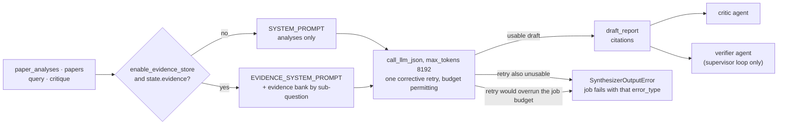

# Synthesizer agent

## Purpose

Turns paper analyses (and, when available, source-grounded evidence)
into a structured markdown research briefing with an inline citation
list. One of the five agents wired into both the fixed pipeline and
the supervisor loop. The draft report **is** the product, which is why
this is the one agent with no honest degraded output.

Source: `src/agents/synthesizer.py`. Wiring:
[`docs/architecture.md`](../architecture.md).

## Flow



## Inputs

Reads from `ResearchState`:

- `query` — the user's research question.
- `paper_analyses` — required. Free-form summaries from the reader.
  Used as paper "shape" context (methodology / limitations) even on
  the evidence path.
- `papers` — supplies author labels for the paper header lines and the
  URL on each block.
- `critique` — previous critic feedback, if any. Included verbatim so
  the LLM addresses it in this revision.
- `evidence` — optional. When populated **and** `enable_evidence_store`
  is on, triggers the evidence path.
- `sub_questions` — used to group evidence claims in prompt order
  (evidence path only).

## Outputs

Writes to `ResearchState`:

- `draft_report` — markdown report body with inline `[Author, Year]`
  citations. Shape is the same on both paths.
- `citations` — list of `Citation` TypedDicts, one per cited paper.
- A `messages` entry (`AIMessage` named `"synthesizer"`) summarizing
  the run; on the evidence path it also names the grounded-claim count.

## Prompt design

`_use_evidence_path(state)` picks between two system prompts at call
time:

```
enable_evidence_store  state.evidence   → path
False                  any              → base
True                   []               → base (fall-back)
True                   [claim, ...]     → evidence
```

The base path is byte-identical to Sprint 1. The evidence path adds
grounding rules to the system prompt and appends an evidence bank to
the user prompt. Both paths use `max_tokens=8192`.

### Base path (Sprint 1 baseline)

- `SYSTEM_PROMPT` — high-level rules (group by theme, compare methods,
  identify consensus / contradictions / gaps, cite inline as
  `[Author, Year]`, end with Key Takeaways + Open Questions, aim for
  800-1500 words).
- User prompt = `Research question` + `critique` (if any) + numbered
  `--- Paper N ---` blocks with title / authors / ID / URL / key
  findings / methodology / results / limitations / relevance.

Preserved exactly so `enable_evidence_store=False` runs compare
directly against pre-flag numbers.

### Evidence path

- `EVIDENCE_SYSTEM_PROMPT` — same rules plus a **GROUNDING RULES**
  block: every factual claim must trace to a provided excerpt,
  missing coverage goes to "Open Questions" rather than being filled
  from the abstract, paraphrasing is fine but adding facts is not.
- User prompt = base prompt + **sub-questions list** + **evidence
  bank** grouped by `supports_question` in planner order (claims the
  reader couldn't attribute land under an "Unassigned excerpts"
  heading rather than being dropped). Within each group, claims are
  sorted by `relevance_score` descending so the strongest support
  comes first. Each entry shows author label, section, relevance, the
  claim itself, and the verbatim `source_text` excerpt.

Response schema is unchanged (`draft_report` + `citations`). No claim
IDs embedded in the report text — the grounding rules in the system
prompt do the work.

## Failure modes

| Failure | Where | Handling |
|---|---|---|
| Unparseable JSON, non-object JSON, or empty `draft_report` (typically `max_tokens` truncation) | `_call_with_one_retry` | Retried exactly once with a corrective "return only the JSON object" nudge — one cheap call can rescue the whole already-billed run (ADR 0041). The output cap is 8192 (was 4096, which left no margin over a full report's ~3000-3300 tokens and made truncation deterministic). |
| Retry also unusable | `_call_with_one_retry` | Raises the typed `SynthesizerOutputError`, so the job's `error_type` names the real failure instead of a generic `JSONDecodeError`. The report is the product; there is no honest fallback for it. |
| First attempt unusable, and a second would not fit the job budget | `_second_attempt_fits` | The retry is skipped and `SynthesizerOutputError` is raised immediately, with a `synthesizer_retry_budget_exhausted` WARNING carrying the elapsed time, the budget and the worst case. ADR 0068 follow-up 3: `src/llm.py` clamps *one* call chain against `api_job_timeout_sec`, and this node makes the call twice — worst case 2 x 5 x 120s against a 600s job. Bounding the pair is the fix; removing the retry would delete a real recovery. |
| `citations` is not a list | `_parse_citations` | Logged as `synthesizer_citations_not_a_list`; treated as no citations. The report still ships. |
| Malformed `citations` entries (non-dict, or blank `title`) | `_parse_citations` | Individually dropped, tallied in one `synthesizer_citations_dropped` WARNING; a thinner citation list is still a real report, and the verifier/critic flag citation gaps downstream. |
| Anthropic 429 / other transport exception | `call_llm_json` | Propagates. Synthesizer intentionally doesn't retry transport errors above the SDK layer (ADR 0009); the single ADR 0041 retry targets only *format* failures the SDK can't see. |
| `EvidenceClaim.supports_question` doesn't match a planner sub-question | Reader `_parse_claim` | Already cleared to `""` at emission time, so it lands under "Unassigned excerpts" here. |
| Evidence bank silent on a sub-question | Prompt design | LLM instructed to add it to "Open Questions" rather than fabricate coverage. |
| Report cites a paper not in `state.papers` | Downstream | Caught by the citation-accuracy metric (offline) and the verifier's `missing_evidence` (online). |
| Prompt injection carried through `source_text` | Not mitigated here | `EvidenceClaim.source_text` is deliberately verbatim; the synthesizer's prompt is not tag-wrapped. Listed in ADR 0020's non-goals. |

## Flags

Settings that drive the synthesizer (see `src/config.py`):

- `enable_evidence_store: bool = False` — same flag that gates the
  reader's claim emission and the verifier's chunks dossier. Turning
  it on switches all three agents together (ADR 0017).
- `synthesizer_model: str = ""` — per-agent model override (ADR 0021).
  Writing quality benefits from the base model; override only to
  trade quality for cost.
- `enable_prompt_caching: bool = False` — system-prompt caching
  (ADR 0022).
- `api_job_timeout_sec: int = 600` — read here, not just by the runner.
  The corrective retry is only issued when the first attempt's elapsed
  time plus one more clamped call chain fits inside 75% of it — the
  same share `src/llm.py` gives a single chain, because this node
  produces the deliverable and a smaller share would refuse the retry
  on every deployment.

## Testing

- Unit: `tests/test_synthesizer.py` — 16 tests covering
  `_use_evidence_path` (all three cells of the table above),
  base-path prompt stability (headers byte-identical to baseline,
  critique carried through, evidence ignored when flag off), evidence
  block formatting (grouped by sub-question in planner order, ordered
  by relevance within group, unassigned heading, verbatim
  `source_text`), evidence-path prompt shape, and full agent
  behavior including message summaries.
- Parse defense: `tests/test_parse_defense.py` — the one-retry path,
  the typed `SynthesizerOutputError`, and per-entry citation dropping
  (ADR 0041).
- Retry budget: `tests/fault/test_call_chain_budget_faults.py` — the
  fault tier drives a first attempt that returns something unusable
  after most of the job budget has gone and asserts no second call is
  made, that the WARNING carries the arithmetic, and that a fast first
  attempt still gets its retry.
- LLM-call plumbing: `tests/test_agent_model_routing.py` (the
  `synthesizer_model` override) and `tests/test_agent_cache_flag.py`
  (the prompt-caching flag).
- E2E: the workflow-level cassette suite is still **planned, not
  built** — see `docs/testing.md`.

## Follow-ups

- Evidence-aware completeness / citation-accuracy metrics. Offline
  metric substrate stays abstract-based (ADR 0007) so cross-config
  comparability holds during the substrate rollout.
- `open_questions` / `evidence_gaps` state fields with dedicated
  producers (a critic or verifier extension). Report body still
  surfaces open questions inside the markdown for now.
- Prompt-injection isolation for this agent's prompt — ADR 0020
  non-goal, still open.

## Related

- **Hands off to** — [critic](critic.md) in the fixed pipeline; in the
  supervisor loop, control returns to the
  [supervisor](supervisor.md), which typically picks `verify` (see
  [verifier](verifier.md)) or `critique` next. Re-entered from the
  critic's `revision_target: "synthesizer"` and from the verifier's
  `revise_report` recommendation.
- **ADRs** — [0016](../decisions/0016-evidence-store-source-text-verifier.md)
  (evidence store),
  [0017](../decisions/0017-synthesizer-evidence-swap.md) (this agent's
  evidence path),
  [0041](../decisions/0041-retrieval-and-degradation-honesty.md)
  (retry + typed failure),
  [0021](../decisions/0021-cost-aware-model-routing.md) (model
  routing), [0022](../decisions/0022-anthropic-prompt-caching.md)
  (prompt caching),
  [0020](../decisions/0020-prompt-injection-isolation-reader.md)
  (isolation non-goals).
- **Workflow wiring** — [`docs/architecture.md`](../architecture.md).
