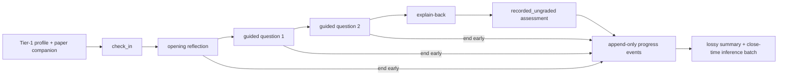

# Tutor agent

## Purpose

Runs one bounded guided read against a published learning-path entry. It plans
to the learner's declared time, asks one question at a time, records an
explain-back in the learner's own words, and ends with an honest activity record
rather than a mastery claim. At close it also creates the bounded, visibly
lossy memory used by the next check-in.

Source: `src/agents/tutor.py`. State and wiring:
`src/graph/session_state.py`, `src/graph/session_workflow.py`, and ADR
[0059](../decisions/0059-guided-read-session-graph.md).

## Flow

Every learner-facing pause is a LangGraph dynamic interrupt. The API resumes it
with `Command(resume=...)`; the transcript and next node live in the configured
checkpointer rather than process memory.

## Inputs

Reads from `SessionState`:

- `tier1` — the `tier1.v1` block: structured goals, daily time budget and
  declared constraints; provenance-tagged skills; active path position;
  today's session; and the previous visibly lossy summary. Compact JSON is
  hard-bounded to a 2.5K-token estimate.
- `session_spec` — path/resource ids, paper title and canonical URL, approved
  briefing label, and close/skim guidance extracted from that companion.
- `learner_reply` — the current reply only; learner prose never enters a routing
  field.
- `turn_number`, `awaiting_assessment`, and `end_requested` — bounded control
  state.

## Outputs

- `session_plan` — available minutes, explicit downscope reason, named sections,
  and two checks. Ten-minute sessions select one section.
- `turn` / `activity` — opaque learner-facing payload for `turn_ready`.
- `messages` — learner/tutor transcript entries retained by the checkpoint.
  `GET /learn/sessions/{id}` projects them onto `SessionDetail.transcript` as
  `{role: "learner" | "tutor", text}`, dropping the internal `check_in` plan
  receipt — that is a receipt the tutor never showed the learner, so it is not
  part of the reading margin the browser renders. The checkpoint, not the
  stream, is the source: a reloaded page and a live one show the same margin.
- `assessment` — `recorded_ungraded`, guidance-only, with the learner's own
  explain-back quote. WO-W04 supplies judged gap findings. The HTTP surface
  flattens this to `SessionDetail.assessment_status`, one of `""` (nothing
  recorded yet), `recorded_ungraded`, `unassessed` or `assessed`, so a missing
  assessment reaches the browser as a fact rather than as an absent field.
- `progress_events` — idempotently keyed `assessment` and `session_completed`
  records for the principal's append-only ledger. The completion event carries
  the lossy summary, which is never valid skill evidence.
- `inference_batch` — optional unconfirmed skill claims, transcript-grounded
  and citing the exact session. The runner applies them only after close.
- `draft_report` — a short session record that explicitly says it is not a
  mastery score.

## Prompt design

`CHECK_IN_SYSTEM_PROMPT` permits only the supplied paper metadata, approved
companion guidance, bounded profile, and available time. A model-proposed
section is accepted only when its name occurs in the validated guidance.

`TUTOR_SYSTEM_PROMPT` requests brief feedback and exactly one grounded question.
It forbids invented paper claims, shame, grades, and mastery. Learner/profile
text uses the existing untrusted-learner isolation instruction before entering
a prompt.

Mock mode takes a deterministic branch before `call_llm_json`; no Anthropic
client is constructed. Real-model JSON is allowlisted. An unusable plan becomes
a visibly safe minimal plan; unusable tutor output becomes an honest re-ask.
An unusable session-memory response becomes a deterministic activity summary
with an empty inference batch.

## Failure modes

| Failure | Handling |
|---|---|
| Session flag off | All session routes return `404 session_loop_disabled`. |
| No owner profile | Create returns `404 learner_profile_required`. |
| Missing/unpublished content or companion | Create returns a typed 404/409/503; no job is started. |
| Malformed model JSON | Bounded fallback or re-ask; never a fabricated reading claim. |
| Worker dies while parked | The checkpoint preserves transcript/next input; the job redriver's existing orphan policy remains authoritative. |
| Checkpoint snapshot unreadable | `GET /learn/sessions/{id}` still serves the job row and reports `transcript_status: "unavailable"`, logging `api_session_transcript_unavailable`. The margin is never reconstructed from stream frames, because a margin assembled from whatever this connection happened to see is not the one the session actually has. |
| Learner never replies | `session_turn_timeout_sec` fails the job with the session timeout vocabulary. |
| Learner ends early | Routes directly to the activity ledger with `ended_early=true`. |
| Tier-1 profile reaches every cap | Lower-priority skills are visibly omitted; goals, budget, and declared constraints are never truncated. |
| Summary contradicts the profile | Structured facts win; the summary remains marked lossy. |
| Summary id offered as skill evidence | The profile store rejects the claim. |
| Session reaches its cost ceiling | The shared LLM choke point refuses the next call. The configured behavior either fails explicitly or closes with static honest copy; it never spends once more to apologize. |

## Flags

- `enable_session_loop = false` — master backend gate; requires learner profiles
  and checkpointing when enabled.
- `tutor_model = ""` — optional model override, falling back to
  `anthropic_model`.
- `use_mock_data` — deterministic no-client path used by tests/fixtures.
- `session_turn_timeout_sec` / `session_max_turns` — parking and structural
  ceilings inherited by the shared runner.
- `learning_session_max_cost_usd = 0.50` — session-only effective ceiling;
  research jobs retain `max_cost_usd`.
- `learning_session_cost_cap_behavior = "refuse"` — `refuse` or
  `degraded_close`; both expose an explicit `cost_cap_status` and cost totals.
- `enable_prompt_isolation` / `enable_prompt_caching` — prompt safety and cache
  behavior shared with the research agents.

## Testing

`tests/test_guided_session_graph.py` proves the four learner pauses through the
HTTP surface, explain-back evidence, zero mock cost/calls, owner scoping, feature
gating, ten-minute downscope, malformed-output defense, a new graph process
reattaching to the same SQLite checkpoint, and the reload contract the browser
depends on — that a rehydrated `SessionDetail` carries the transcript with the
`check_in` receipt filtered out.

The browser half is `web/e2e/session.spec.ts`, against the seeded Compose stack
with `ANTHROPIC_API_KEY=local-preview-disabled`. It does *not* mock the session
read: the page fetches a real `awaiting_learner` job whose margin exists only in
a seeded LangGraph checkpoint, so a reload that re-renders it is evidence of
rehydration rather than of the test's own fixture. Both session writes stay
interdicted in the browser by `web/e2e/support/paid-path.ts`, counted in
`web/build/e2e/research-post-count.txt`.

## Related

- [Architecture](../architecture.md) — the API layer's
  "Guided-read sessions" paragraph and the web tier's job machine
- `web/components/patterns/GuidedSessionView.tsx` — the browser surface, with
  `web/lib/job/machine.ts`'s `awaiting_learner` phase and `turn_ready` event
- [ADR 0057](../decisions/0057-job-kinds-and-awaiting-learner.md)
- [ADR 0058](../decisions/0058-learner-profile-store-and-provenance.md)
- [ADR 0059](../decisions/0059-guided-read-session-graph.md)
- [ADR 0060](../decisions/0060-evidence-grounded-assessment-judge.md)
- [ADR 0061](../decisions/0061-bounded-tier1-session-memory.md)
- [ADR 0062](../decisions/0062-session-specific-cost-ceilings.md)
