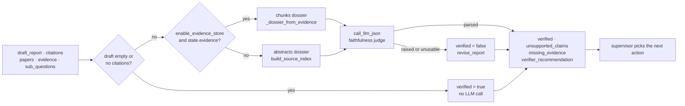

# Verifier agent

## Purpose

Runtime faithfulness check. The node reads the current draft plus a
per-paper source dossier — ranked chunks when the evidence store is on
and populated, abstracts otherwise — judges each cited claim against it,
and writes a recovery recommendation back to state.

Two entry points reach that one judge (ADR
[0076](../decisions/0076-fixed-verify-repair-research-policy.md)):

| Entry point | Reachable when | Writes |
|---|---|---|
| `verifier_agent` | the supervisor picks `verify`, with `enable_verifier` on | the four fields under [Outputs](#outputs) |
| `verify_node` | `research_policy="fixed_verify_repair"` | those four, plus a first-class verdict and the two repair keys |

Same prompt, same call, same cost. What the fixed policy's node adds is
the **verdict** — `pass` / `fail` / `abstain` — which its graph routes on
and its [repair policy](repair.md) decides from.

Under the legacy fixed pipeline neither is wired in. That is what
`ENABLE_VERIFIER=true` with `ENABLE_SUPERVISOR=false` has always meant
and still means: nothing. Arm C is a `research_policy` value rather than
a flag combination, and `tests/test_research_policy.py` asserts that no
combination of the three legacy flags produces a `verify` node.

Source: `src/agents/verifier.py`. Wiring:
[`docs/architecture.md`](../architecture.md).

## Flow



## Inputs

Reads from `ResearchState`:

- `draft_report` — required; an empty/whitespace draft short-circuits
  with `verified=True` and no LLM call.
- `citations` — required; a draft with no citations skips the judge
  entirely and returns `verified=True` (the critic catches that case).
- `papers` — supplies the abstracts joined against `citations` via
  `build_source_index` (shared with ADR 0007's offline metric), and
  the author last names that key the chunks dossier.
- `evidence` — optional. When populated **and**
  `enable_evidence_store` is on, the dossier is built from the
  reader's ranked chunks instead of abstracts.
- `sub_questions` — surfaced to the judge as "topics the report should
  cover" so `missing_evidence` can name specific gaps.
- `query` — included as context in the prompt.

## Outputs

Writes to `ResearchState`:

- `verified: bool` — true iff every cited claim resolved and no
  sub-question was flagged as missing evidence.
- `unsupported_claims: list[str]` — verbatim claim strings the judge
  flagged.
- `missing_evidence: list[str]` — topics / sub-questions lacking a
  cited source. Also read by the
  [query refiner](query_refiner.md) as its gap signal.
- `verifier_recommendation: str` — one of `read_more | search_more |
  revise_report | ""`. Intent-shaped, not routing-shaped; the
  [supervisor](supervisor.md) translates it into an action.
- A `messages` entry (`AIMessage` named `"verifier"`) summarizing the
  decision.

### The fixed path's verdict (ADR 0076)

`verify_node` writes everything above — unchanged, including the
conservative `verified=False` on an unusable judge response — and four
more keys, stamping its message `"verify"` after the node that produced
it:

- `verification_verdict: "pass" | "fail" | "abstain" | ""`
- `verification_reason: str` — a stable snake_case code
- `repair_count: int` — carried through, never reset by a verification
- `repair_action: str` — carried through

| Verdict | When | Reason codes |
|---|---|---|
| `pass` | the judge approved every cited claim | `verified` |
| `fail` | the judge reported a problem | `unsupported_claims`, `missing_evidence`, `unsupported_and_missing`, `verifier_reported_failure` |
| `abstain` | nothing was judged | `no_draft`, `no_citations`, `upstream_model`, `upstream_model_output` |

**Abstain is not a polite fail.** Every path that reaches a result
without a usable judgement — the two pre-LLM short-circuits, a provider
that did not answer, output the parser could not use — has found no
fault. The [repair policy](repair.md) must not spend the run's one
repair on a diagnosis nobody made, and the `verified` boolean alone
cannot tell those cases apart: `verified=True` with empty lists is
emitted both by a judge that approved the report and by the
short-circuit that never asked one.

The last two abstention codes are `src/errors.py`'s own
(`upstream_model`, `upstream_model_output`), reused so a dashboard can
join an abstention to the provider failure that caused it.

Two exceptions are **not** verdicts and are re-raised out of the judge
call rather than caught by the fallback path: `JobCancelledError` and
`CostBudgetExceeded`. Both are raised by `call_llm` before it issues
anything (ADRs 0047 / 0051), and swallowing a budget stop into an
abstention would let the run continue past its own ceiling — under the
fixed policy, straight into a repair, a second synthesis and a second
verification. Same treatment, for the same reason,
`src/agents/reader.py` gives them in its fan-out.

## Prompt design

**System** (`VERIFIER_SYSTEM_PROMPT`): ADR-0007's calibrated
faithfulness prompt reused as the basis — no new prompt engineering —
with the response schema extended by `recommended_action`. It
describes both source shapes explicitly so the judge treats them
differently: **source chunks** are the strongest evidence; an
**abstract fallback**, marked `abstract (no chunks available)`, is a
lower bound and should be judged more strictly. It also defines what
counts as a factual claim, what "supported" means, and when to pick
each recovery action. `max_tokens=2048`.

**User** (`_build_user_prompt`): research question + the sub-questions
the report should cover + the full draft + the cited-paper dossier
(see below).

### Response schema

```json
{
  "verified": true,
  "unsupported_claims": ["<claim text>", ...],
  "missing_evidence": ["<topic>", ...],
  "recommended_action": "read_more|search_more|revise_report|",
  "reason": "one-sentence overall diagnosis"
}
```

Extends ADR 0007's per-claim judge output with a runtime recovery
recommendation and a top-level `verified` flag. The judge does not
control routing — it names the failure mode; the supervisor picks
the next node.

## Decision procedure

```
verifier_agent(state):
    # 1. Cheap short-circuits — no LLM call.
    if not state.draft_report.strip():
        return empty_result("no draft to verify")     # verified=True
    if not state.citations:
        return empty_result("draft has no citations") # verified=True

    # 2. Ask the judge.
    try:
        parsed = call_llm_json(prompt=_build_user_prompt(state),
                               system_prompt=VERIFIER_SYSTEM_PROMPT)
    except (JobCancelledError, CostBudgetExceeded):
        raise                 # not judgements — see Outputs above
    except Exception:
        return fallback_result("LLM call failed")
        # verified=False, recommendation="revise_report"

    # 3. Coerce + validate the response.
    verified = parsed.get("verified") is True
    unsupported = _coerce_string_list(parsed.get("unsupported_claims"))
    missing = _coerce_string_list(parsed.get("missing_evidence"))
    recommendation = _clean_recommendation(parsed.get("recommended_action"))

    # 4. Enforce invariants.
    if verified and (unsupported or missing):
        verified = False          # judge contradicts itself -> not verified
    if not verified and not recommendation:
        if missing and not unsupported:
            recommendation = "search_more"
        elif unsupported:
            recommendation = "revise_report"
        # neither flagged -> recommendation stays ""
    if verified:
        recommendation = ""

    return { verified, unsupported_claims, missing_evidence, verifier_recommendation }
```

Note step 4's inference order: `search_more` is only inferred when the
judge reported missing evidence and **no** unsupported claims. When
both are present, an over-claiming report is the more actionable
diagnosis, so `revise_report` wins. And a `verified=False` verdict with
neither list populated keeps an empty recommendation — the supervisor
falls back to its own routing rather than being handed a guess.

## Source dossier — abstracts vs chunks (ADR 0016)

`_build_user_prompt` picks its dossier shape at call time:

- **Chunks dossier** (`_dossier_from_evidence`) — when
  `settings.enable_evidence_store` is on AND `state.evidence` is
  populated. Groups evidence claims by cited paper, keyed by
  `[Author, Year]` using the same first-author-lastname + 4-digit-year
  normalization as `build_source_index`, and emits each paper's ranked
  chunks verbatim with `(section, relevance=X.XX)` headers. Papers
  cited but lacking evidence claims (partial coverage — e.g. the
  reader couldn't fetch that PDF) fall back to their abstract inside
  the same block, explicitly marked `abstract (no chunks available)`,
  so the judge can calibrate strictness per paper. Cited papers whose
  first author can't be resolved to a last name are skipped entirely.
- **Abstracts dossier** — default. Uses `build_source_index` (shared
  with the offline faithfulness metric) so runtime and offline
  judges read the same substrate.

Either way, a dossier that ends up empty is sent as the literal string
`(no cited papers with sources available)` / `(no cited papers with
abstracts available)` rather than a blank block.

## Failure modes

| Failure | Where | Handling |
|---|---|---|
| Empty draft | Pre-LLM check | `verified=True`, no LLM call, no recommendation. Prevents paying for verification before synthesis. |
| Draft has no citations | Pre-LLM check | `verified=True`, no LLM call. Critic catches the "no citations" case separately. |
| Anthropic 429 / other exception | `call_llm_json` | Caught; falls back to `verified=False, recommendation="revise_report"`. Logged as `verifier_llm_failed_fallback`. Verdict `abstain`, reason `upstream_model`. |
| Judge output not JSON | `call_llm_json` | Same fallback path — the raised `JSONDecodeError` is caught by the same broad `except`. Verdict `abstain`, reason `upstream_model_output`. |
| Job cancelled, or the cost ceiling tripped | `call_llm_json` | **Re-raised**, ahead of the broad handler. Neither is a judgement, and an abstention here would let a stopped run carry on spending (ADRs 0047 / 0051). |
| `verified=True` alongside flagged issues | Post-parse invariant | Downgraded to `verified=False`; recommendation kept. `verified` must mean "no follow-up needed". |
| `verified` truthy but not literal `true` | Post-parse | Treated as `False`. Same idiom the critic uses for `revision_needed`. |
| `recommended_action` outside the enum | `_clean_recommendation` | Cleared to empty, then re-inferred per step 4 above. |
| Wrong-typed fields (`unsupported_claims` = `"string"`, etc.) | `_coerce_string_list` | Coerced to `[]` (drops the field silently rather than crashing). Non-string / blank entries inside a real list are dropped individually. |
| Judge redirects via prompt-injected paper text | Partially mitigated | Reader-side isolation (ADR 0020) scrubs the `claim` fields that reach the chunks dossier, but `source_text` is verbatim by design and the verifier's own prompt is not tag-wrapped — listed in ADR 0020's non-goals. See `docs/security.md`. |

## Flags

Settings that drive the verifier (see `src/config.py`):

- `use_mock_data: bool = False` — **Mock mode** (ADR
  [0080](../decisions/0080-mock-mode-covers-the-whole-research-graph.md)):
  both entry points report `verified=True` with no unsupported claims
  and no missing evidence, and construct no model client. That is not a
  finding: it is how "nobody looked" has to be encoded on a field whose
  consumers read `True` as "no follow-up needed", and the node's message
  says so in words. The verdict is `abstain` with reason `mock_mode` —
  a fifth abstain code, extending the four ADR 0076 published — because
  `pass` would tell `src/policies/repair.py` a faithfulness check
  succeeded when none ran.
- `research_policy: Literal["legacy", "fixed_verify_repair"] =
  "legacy"` — selects the fixed verify-and-repair graph, whose `verify`
  node is the other entry point (ADR 0076). It requires
  `enable_verifier=false`: that flag names the *supervisor's* verify
  action, and the two together would put two verifiers in one
  configuration with nothing to say which a result came from, so the
  combination is refused at settings load.
- `enable_verifier: bool = False` — master flag for the supervisor's
  action. When off, the verifier node is not added to the supervisor
  graph and its action enum excludes `verify`. It has never had any
  effect on the fixed pipeline.
- `enable_evidence_store: bool = False` — selects the chunks dossier
  over abstracts (ADR 0016). Shared with the reader and synthesizer;
  turning it on switches all three together.
- `verifier_model: str = ""` — per-agent model override (ADR 0021).
  Empty falls back to `anthropic_model`.
- `enable_prompt_caching: bool = False` — system-prompt caching
  (ADR 0022).

The verifier does not have its own cost / iteration caps — the
supervisor's `max_cost_usd` and `max_loop_iterations` gate every node
including this one, and the API runner's between-node budget check
(ADR 0051) applies regardless of graph shape.

## Testing

- Unit: `tests/test_verifier.py` — 23 tests covering short-circuits
  (empty draft, no citations), well-formed judge output (all three
  recommendation values), invariants (`verified=True` + issues gets
  downgraded, recommendations get inferred when the judge omits them),
  and malformed output (LLM exception, unknown recommendation,
  wrong-typed fields).
- Fixed-path verdict: `tests/e2e/test_verify_repair.py` — the verdict
  each judge response produces, driven through the compiled graph, and
  `tests/fault/test_verify_repair_faults.py` for the two exceptions the
  node re-raises instead of turning into one.
- Supervisor gating: `tests/test_supervisor.py::TestVerifierGating` —
  8 tests covering the `enable_verifier` flag (`verify` accepted /
  rejected, state summary contents, router behavior with stale
  checkpoints).
- Shared join: `tests/test_metrics_faithfulness.py` — exercises
  `build_source_index`, the abstracts-dossier substrate.

## Known limitations

- **Reader-dependent substrate**. The verifier judges against chunks
  only when the reader could extract them (PDF fetch + chunk + rank
  succeeded). When any of those fail, the verifier falls back to the
  abstract for that paper — same behavior as before ADR 0016, but now
  marked in the dossier and applied per-paper instead of per-run.
- **No per-claim citation cross-check**. If the judge flags a claim
  whose only cited source we couldn't provide, we currently keep the
  claim rather than reclassifying it as `source_unavailable` (which is
  what the offline metric does). Deliberate: the alternative requires
  a per-claim citation index, and the supervisor's `missing_evidence`
  handling covers this case orthogonally.
- **Prompt not isolated**. The dossier embeds verbatim paper text;
  wrapping it is ADR 0020's deferred follow-up.
- ~~**Synthesizer still writes from `paper_analyses`, not
  `evidence`**.~~ Landed — the synthesizer's evidence-grounded path
  shipped as ADR 0017 (same `enable_evidence_store` flag; no claim
  IDs embedded in the report text — the grounding rules in the system
  prompt do the work).

## Related

- **Hands off to** — under the supervisor loop, the
  [supervisor](supervisor.md), always: the recommendation maps to a next
  action there — `read_more` → [reader](reader.md), `search_more` →
  [search](search.md) or the [query refiner](query_refiner.md),
  `revise_report` → [synthesizer](synthesizer.md). Under the fixed
  verify-and-repair policy, the [repair policy](repair.md), which reads
  the verdict and the two lists rather than the recommendation.
- **ADRs** — [0076](../decisions/0076-fixed-verify-repair-research-policy.md)
  (the fixed path's verdict and its repair),
  [0015](../decisions/0015-verifier-agent-runtime-faithfulness.md)
  (this agent),
  [0007](../decisions/0007-faithfulness-single-call-abstracts.md) (the
  offline judge it promotes),
  [0016](../decisions/0016-evidence-store-source-text-verifier.md)
  (chunks dossier),
  [0017](../decisions/0017-synthesizer-evidence-swap.md),
  [0014](../decisions/0014-supervisor-loop-behind-flag.md),
  [0020](../decisions/0020-prompt-injection-isolation-reader.md)
  (isolation non-goals),
  [0021](../decisions/0021-cost-aware-model-routing.md),
  [0022](../decisions/0022-anthropic-prompt-caching.md).
- **Workflow wiring** — [`docs/architecture.md`](../architecture.md).
