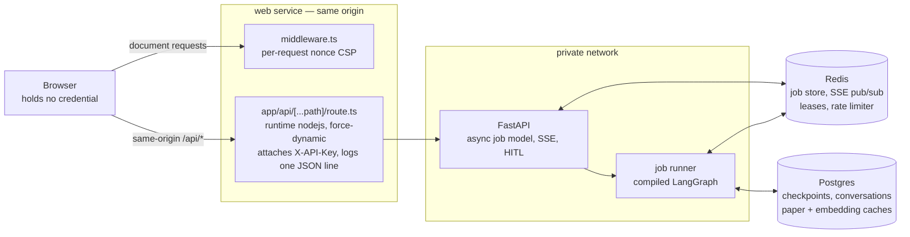
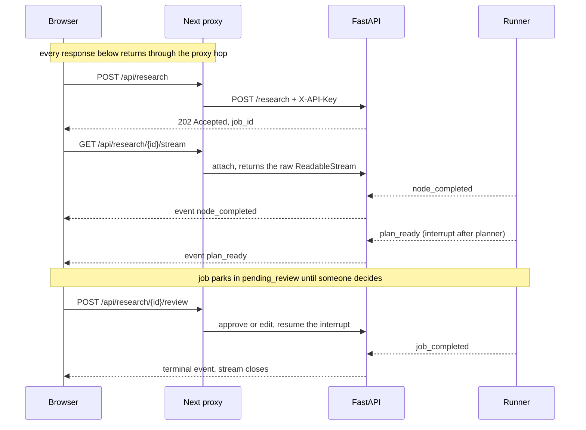

# Architecture

System-level view of `arxiv-research-agent`: the two workflow shapes,
the HTTP surface layered on top, the browser tier in front of it, and
the storage matrix that decides where every piece of state lives.
Everything here is derived from the code on `main`
(`src/graph/workflow.py`, `src/api/app.py`, `src/api/routes.py`,
`src/config.py`, `web/`); the linked ADRs carry the rationale — this
page does not restate them. The [README](../README.md) has the same
picture one level up; this page is the level below it.

## The shape of the system

Three properties of that picture are load-bearing rather than
incidental, and each is argued in ADR
[0055](decisions/0055-frontend-architecture-confirmation.md):

- **The browser never holds a credential.** `X-API-Key` is attached
  server-side in the proxy route and nowhere else. Every call the
  browser makes is same-origin.
- **The proxy is not optional.** Native `EventSource` and `<a download>`
  cannot carry a request header, so under `ENABLE_API_AUTH=true` —
  the production configuration — neither the event stream nor any
  export could be authenticated from browser code at all.
- **Redis and Postgres are what make the tier horizontal.** On the
  defaults everything is in-process; the shared backends are what let a
  second worker exist. See the [storage matrix](#storage-matrix).

## The workflow — two shapes

`src/graph/workflow.py::build_workflow` compiles one of two LangGraph
graphs over the shared `ResearchState` (`src/graph/state.py`),
selected by `settings.enable_supervisor`:

**Fixed pipeline (default)** — the conditional edge is the whole
shape, so it is drawn as a node rather than as an annotation:

On `revision_needed` the critic's `revision_target` picks which of the
three nodes the run re-enters; revisions are capped at
`settings.max_iterations`.

**Supervisor loop** (`enable_supervisor=true`, ADR
[0014](decisions/0014-supervisor-loop-behind-flag.md)) — the fan-out is
uniform, so what matters is the cycle and where it terminates:

Every agent node hands control back to the supervisor, which picks
the next action from a strict enum — `plan / search / read /
synthesize / critique / stop`, plus `verify` when
`enable_verifier` is on (ADR
[0015](decisions/0015-verifier-agent-runtime-faithfulness.md)) and
`refine_query` when `enable_query_refiner` is on (ADR
[0018](decisions/0018-query-refiner-recovery-action.md)). Budget and
iteration caps short-circuit before the LLM call; malformed judge
output falls back to rules that mirror the fixed-pipeline order.

Regardless of shape, `build_workflow` also wires two production
knobs:

- **Checkpointing** — `SqliteSaver` (per-worker) or `PostgresSaver`
  (shared across workers), selected by
  `settings.checkpoint_backend`. Postgres is required for
  multi-worker HITL. ADRs
  [0013](decisions/0013-sprint-1-finish-retry-checkpoint-tracing-recall.md)
  / [0034](decisions/0034-postgres-checkpointer-and-cross-worker-hitl.md).
- **Tracing** — `traced_node` wraps every agent in an OpenTelemetry
  span when `settings.enable_tracing` is on (ADR
  [0012](decisions/0012-observability-core-logging-costs.md)).
  Metrics ride the same OTLP endpoint behind their own flag (ADR
  [0049](decisions/0049-otel-metrics.md)), but no instrument wraps a
  node: they hang off choke points the API layer and the cost
  accumulator already own, and only an API worker installs a provider.

The compiled graph is expensive (it opens the checkpointer's
connection), so it is built **once** at app startup and shared —
never per request (ADR 0034).

Per-agent behavior (inputs, outputs, prompt design, failure modes)
lives in [`docs/agents/`](agents/) — one page per agent.

## The API layer

`src/api/` wraps the workflow in a FastAPI app (factory:
`app.py::create_app`; routes: `routes.py`). Design in ADR
[0025](decisions/0025-fastapi-async-job-model.md).

**Job model.** `POST /research` returns `202 Accepted` with a
`job_id` immediately; the runner (`runner.py`) drives the compiled
graph through `astream` (ADR
[0040](decisions/0040-async-checkpointer-and-runner.md)), bounded by
a process-wide semaphore (`api_max_concurrent_jobs`) and a hard
timeout (`api_job_timeout_sec`). Job lifecycle:
`pending → running → (pending_review | awaiting_learner →)*
succeeded / failed / cancelled`. `GET /research/{job_id}` polls
status + result.

**Job kinds.** A job carries a `kind` — `research` (the default, and
everything above) or `session`, a guided-read tutoring run against a
second graph (ADR
[0057](decisions/0057-job-kinds-and-awaiting-learner.md)). One driver
serves both: `runner.py`'s `JobKindRuntime` records the four
decisions that differ — the graph input, what an interrupt means, how
many interrupts are plausible, and the wall-clock ceiling — and
nothing else in `run_job` branches on the kind. That is the point of
the field: a session inherits the lease, the semaphore, the cancel
token, the cost accumulator, the terminal persistence and the outcome
metrics rather than a second driver having to earn them again.
`JobDetail.kind` reports it, defaulted so the field is additive.

The guided-read graph is a bounded second shape: check-in, opening reflection,
two guided questions, explain-back, guidance-only assessment, and append-only
progress update. Each learner input is a distinct dynamic interrupt resumed by
`Command(resume=...)`, so a checkpoint can be reattached by a new process
without replaying the preceding tutor turn. Its async node wrapper is
`SessionState`-typed rather than cast from the research wrapper because
LangGraph uses the runtime annotation to project node inputs (ADR
[0059](decisions/0059-guided-read-session-graph.md)).

**Parking.** A job can pause mid-graph and wait for a human, in
exactly one shape: it moves to a non-terminal *parked* status, the
runner publishes a frame naming the decision, and it blocks on the
job's resume event until the resume endpoint sets it locally or a
peer worker's pub/sub message does. Two parkings exist —
`pending_review`/`plan_ready` bounded by `api_hitl_timeout_sec`
(ADR 0030), and `awaiting_learner`/`turn_ready` bounded by
`session_turn_timeout_sec` (ADR 0057) — and they share
`runner.py`'s `ParkingSpec` + `_park_until_resumed`. The structural
difference is how often: a research run reviews only its *first*
interrupt and auto-resumes any re-plan, whereas a session parks on
every turn, bounded by `session_max_turns`. A parked job is held open
by a live worker refreshing its lease, so the redriver reads it as
healthy rather than stale; an *orphaned* parked job is failed and
never requeued, for the same reason an orphaned `running` job is.

**Node execution + cancellation.** Agents are synchronous, so the
async path runs each node on a lifespan-owned `ThreadPoolExecutor`
sized to `api_max_concurrent_jobs` — the semaphore then bounds
threads rather than coroutines. A timeout can only cancel the
awaiting coroutine, so the runner also sets a per-job cancel token
(checked before every LLM call and between the reader's papers) and
holds the job's permit until the node thread actually returns,
bounded by `api_job_drain_timeout_sec`. Threads it gives up on stay
counted in `/healthz`'s `active_jobs`. ADR
[0047](decisions/0047-bounded-executor-and-cooperative-cancel.md).

**SSE streaming.** `GET /research/{job_id}/stream` streams events as
the runner emits them: `node_completed`, `plan_ready`, `turn_ready`,
`job_completed`, `job_failed`, `job_cancelled`, plus heartbeats so
proxies don't drop the stream and a `stream_timeout` frame when
`api_sse_max_duration_sec` closes a long-lived connection (ADRs
[0026](decisions/0026-sse-streaming-endpoint.md) /
[0038](decisions/0038-job-redriver-and-sse-stream.md)). The two
parking frames are deliberately neither terminal nor stream-closing:
the connection carries the pause, so a session does not cost a
reconnect per turn. Connecting to
an already-finished job replays the single terminal frame and closes,
which makes reconnects idempotent; connecting to a parked job replays
its pause frame the same way, so a reconnect during plan review sees
the plan, and a page reload mid-session sees the turn, instead of
waiting out the parking timeout in silence (ADRs
[0053](decisions/0053-api-web-container-preflight.md) /
[0057](decisions/0057-job-kinds-and-awaiting-learner.md)). Under the Redis
job store, events fan out across workers via pub/sub on
`events:{job_id}` so the streaming request need not land on the
worker running the job (ADR
[0035](decisions/0035-cross-worker-sse-pubsub.md)); a late subscriber
on that path sees only events published after it connects — which is
why the replays above are snapshots read from the job row, not a
backlog.

**Job leases + redriver.** Under the Redis job store, a worker holds
`joblease:{job_id}` (TTL `job_lease_ttl_sec`, refreshed in the
background) while it runs a job; a worker that dies stops refreshing,
and the redriver reclaims its orphaned jobs — failing them with
`error_type=orphaned` (or resubmitting still-`pending` ones when
`job_redrive_requeue_pending` is on). The sweep runs at startup **and**
on a jittered `job_redrive_interval_sec` timer, because a container
restarted inside its own lease window sees the dead lease as live at
boot and needs a later pass (ADR 0053). Sweeps serialize on a
cluster-wide `redrive:lock`, and every reclaim is a compare-and-set
(`update_if_status`, WATCH/MULTI/EXEC) so a job that finishes while
the sweep is deciding keeps its report (ADRs
[0038](decisions/0038-job-redriver-and-sse-stream.md) /
[0048](decisions/0048-redriver-cas-and-store-edges.md) / 0053).

**HITL.** When `enable_hitl` is on, the workflow interrupts after
the planner; the job parks in `pending_review` and
`POST /research/{job_id}/review` approves or edits the plan
(sub-questions + search queries) before search runs. Per-request
bypass via `{"hitl_bypass": true}` — the runner resumes the
interrupt immediately without emitting a review event. (The eval
runner and CLI avoid the pause upstream instead, compiling the
workflow with `enable_hitl=False`.) ADR
[0030](decisions/0030-hitl-plan-review.md); cross-worker resume via
Redis pub/sub in ADR 0034.

**Conversations.** `POST/GET/DELETE /conversations` group jobs into
threads; follow-up jobs get `prior_context` — top-K chunks retrieved
from the thread's prior reports (`retriever.py`) — injected into the
planner's prompt (ADR [0032](decisions/0032-conversation-mode.md)).

**Learner profile.** Opt-in behind `enable_learner_profile` (which
requires `enable_api_auth`): `GET/PUT/DELETE /learn/profile` keeps a
small per-principal record of what a learner has declared about
themselves, plus claims the system inferred or assessed. Every skill
claim carries non-nullable `declared` / `inferred` / `assessed`
provenance — enforced in the type, in the merge, and in the table's
CHECK constraints — and the prompt serializer confines inferred
claims to an "unconfirmed impressions" block so no prompt presents a
guess as fact (ADR
[0058](decisions/0058-learner-profile-store-and-provenance.md)). The
flag is off by default, and the routes answer 404 while it is.

**Guided-read sessions.** Opt-in behind `enable_session_loop`, which
requires `enable_learner_profile` (and so `enable_api_auth`) and
`enable_checkpointing`. `POST /learn/sessions` starts one
`kind="session"` job on the guided-read graph; `GET
/learn/sessions/{id}` reads it; `POST /learn/sessions/{id}/turn`
resumes a session parked in `awaiting_learner` with the learner's
reply. `SessionDetail` is assembled from **two** durable sources, and
the split matters: lifecycle fields and the currently parked `turn`
come off the job row, while `transcript` — the learner/tutor
exchange, with the internal `check_in` plan receipt filtered out —
is rehydrated from the LangGraph checkpoint for that session's
thread. A snapshot read that fails is reported as
`transcript_status: "unavailable"` rather than reconstructed from
stream events, and `assessment_status` (`""` /
`recorded_ungraded` / `unassessed` / `assessed`) reports the judge's
outcome as a fact rather than as a grade. That is what makes a
mid-session reload work: the browser re-reads the session and gets
the margin back, having held nothing (ADR
[0057](decisions/0057-job-kinds-and-awaiting-learner.md), ADR
[0059](decisions/0059-guided-read-session-graph.md)).

**Export.** `GET /research/{job_id}/export?format=md|pdf|docx`
renders the finished report via `src/api/exporters/` (ADR
[0031](decisions/0031-multi-format-export.md)).

**Auth, scoping, rate limiting** (`auth.py`). Opt-in behind
`enable_api_auth`: every route (except `/healthz`) requires an
`X-API-Key` header resolved against the keystore — either the
`api_keys` setting or a hot-reloadable JSON file (`api_keys_file`,
ADR [0037](decisions/0037-redis-rate-limiter-and-keystore-reload.md)).
Jobs and conversations are scoped to the creating principal;
cross-principal access returns 404 (ADR
[0036](decisions/0036-per-principal-store-scoping.md)). Submits are
rate-limited per key per sliding hour — in-memory per worker, or a
shared Redis ZSET under `rate_limit_backend=redis` (ADR 0037). The
broader hardening bundle (cost cap enforcement, PDF size cap, CORS
opt-in, prompt-isolation extensions) is ADR
[0033](decisions/0033-safety-hardening-bundle.md); threat model in
[`docs/security.md`](security.md).

**Web tier.** `web/` is a Next.js App Router application whose route
handler is the credential boundary above. It gets its own section
below; ADRs [0029](decisions/0029-nextjs-web-ui.md) and
[0055](decisions/0055-frontend-architecture-confirmation.md).

## The web tier

`web/` is not a single-page client. It is an App Router application
with five routes in two groups, three separable layers, and a server
boundary that is part of the security model rather than a convenience.

**Routes.** `/` (the workspace) and `/c/[id]` (a thread) under the
`(workspace)` group; `/learn` (the path library), `/learn/paths/[id]`
(one reading path) and `/learn/sessions/[id]` (one guided session)
under `(learn)`. Both groups mount the same shell, so the wedge is
inside the workbench rather than beside it.
`web/tests/shell/routing.test.ts` pins the set, so a route added
without a decision fails the unit suite.
`/login` and `/settings` are **reserved names with no files** — as is
`web/app/api/auth/[...path]/route.ts` — because there is no identity
yet and a disabled login control would be a fake one.

**The shell.** `app/(workspace)/layout.tsx` and `app/(learn)/layout.tsx`
each mount `WorkbenchShell`,
which owns the header, the thread rail, the skip link and the main
landmark. Components are layered `foundations → primitives → patterns
→ features`, so a primitive never imports a feature. The header
contains an `IdentitySlot` that **returns `null`**: it reserves a DOM
position and a module name for a future account control without
rendering an avatar, a "Sign in", or a disabled button. What occupies
the header today is the truthful string "Shared workspace — Everyone
with access to this deployment sees these threads. There are no
separate accounts."

**The data layer.** `lib/api/` is a typed client whose types are
*generated* from `contract/openapi.json` (a CI job fails on drift), and
`lib/queries/` wraps it in TanStack Query. Every query key is
`[resource, principal, …]` with `principal` a module constant today, so
that when identity arrives the caches partition without a call-site
change. All of it goes through `/api` on the same origin; no component
ever sees `API_INTERNAL_BASE`.

**The job machine.** `lib/job/machine.ts` is a pure reducer — no clock,
no network, no `EventSource`, no React. Its transition table is
**total**: all 11 phases × 26 event types are decided explicitly, a
deliberately-ignored combination is written as `IGNORE` rather than
omitted, and there is no default branch, so adding a phase or an event
fails typecheck until every cell is decided. `lib/job/useJobStream.ts`
is the impure half that owns the `EventSource` and feeds it frames.

The split exists because the hard part is not rendering — it is being
honest about what is known. The machine never invents a stage: the
`checkpoint` field is written only by `node_completed`, is reset on
every stream open (including the browser's own automatic retry), and is
never persisted or derived from a polled `JobDetail`. Terminal copy is
therefore `failed after <checkpoint>` or plain `failed` — never
`failed in <node>`, because no terminal payload carries a node.

### How a run travels

The job id travels in the URL as `?job=`, which is what makes a reload
mid-run recoverable: the page attaches to an existing job rather than
submitting a new one (ADR
[0053](decisions/0053-api-web-container-preflight.md)). Reattaching
replays the terminal frame for a finished job, `plan_ready` for one
parked in review and `turn_ready` for a session parked in
`awaiting_learner`, so a dropped connection during a pause does not
wait out the timeout in silence.

The session surface reuses that whole machine rather than growing a
second one. `awaiting_learner` is an eleventh phase and `turn_ready` a
twenty-sixth event, both decided in every cell of the table above;
`lib/job/session.ts` projects a `SessionDetail` onto the lifecycle
fields the reducer consumes, so transport, reconnect and terminal
handling are shared code. `turn_ready` is treated as a *pause signal*,
not as a transcript source: the frame moves the phase, and the surface
then re-reads `GET /learn/sessions/{id}` for what to render — which is
why a live turn and a reloaded one produce the same screen.

**The server boundary.** `middleware.ts` mints a per-request nonce and
sets the CSP on every document response; the proxy route emits one
structured JSON log line per proxied request with a path *template*
rather than a raw id; the container healthcheck probes `/api/healthz`
*through* the proxy. All three, plus the CSP's exact policy and the
deliberate CSRF scope note, are in
[`security.md`](security.md#browser-facing-hardening-on-the-nextjs-service-wo-30).

Because the nonce is per-request, `/` is **dynamically rendered** — a
nonce cannot live in a cached document. That is inherent to the choice,
not a regression; the consequences are recorded in ADR
[0055](decisions/0055-frontend-architecture-confirmation.md).

**Styling and weight.** Colour, space, type and motion come from one
token chain with a parity test and an ESLint ban on literal colours,
and every route carries a gzip byte ceiling enforced on every PR under
a ratchet rule. Both are ADR
[0056](decisions/0056-design-tokens.md).

**A note on the deployment gate.** The production Caddy edge asks for
HTTP basic auth before anything else. It is a **deployment gate, not a
user account**, and the UI must never render it as a signed-in user —
see [`security.md`](security.md#s7--the-deployment-gate-is-not-an-identity).

## Storage matrix

Every stateful concern has a pluggable backend chosen by one
setting in `src/config.py`. Defaults favor zero-dependency local
dev; the compose stack (`docker-compose.yml`, ADR
[0027](decisions/0027-docker-compose-redis-job-store.md)) selects
the shared backends.

| Concern | Setting | Options (default first) | Shared across workers? | ADR |
|---|---|---|---|---|
| Job store (status, result, events) | `job_store` | `memory` / `redis` | Redis only | 0025, 0027 |
| SSE + HITL fan-out | (follows job store) | in-process queue / Redis pub/sub | Redis only | 0034, 0035 |
| Conversation store | `conversation_store` | `memory` / `postgres` | Postgres only | 0032 |
| LangGraph checkpoints | `checkpoint_backend` | `sqlite` / `postgres` | Postgres only | 0013, 0034 |
| Paper cache (parsed PDF text) | `paper_cache` | `disk` / `postgres` | Postgres only | 0028 |
| Embedding cache | `embedding_cache` | `none` / `postgres` | Postgres only | 0028 |
| Rate limiter | `rate_limit_backend` | `memory` / `redis` | Redis only | 0033, 0037 |
| API keystore | `api_keys` / `api_keys_file` | env string / JSON file (hot-reload) | file is shared by mount | 0033, 0037 |

Rule of thumb: a single-process deployment can run entirely on the
defaults; any horizontally-scaled deployment needs `redis` for the
job store + rate limiter and `postgres` for checkpoints,
conversations, and caches — which is exactly what
`docker-compose.yml` wires.

The container image installs `requirements-lock.txt` (never
pyproject's ranges, so it runs the dependency set CI tested) and
bakes the MiniLM embedding weights into the image at build time —
the first live job no longer downloads ~90MB inside its own timeout
budget (ADR [0053](decisions/0053-api-web-container-preflight.md);
pinned without a build by `tests/test_container_contract.py`).

## Cross-cutting concerns

- **LLM access** — one shared client (`src/llm.py`), SDK-native
  retry (ADR [0009](decisions/0009-anthropic-sdk-native-retry.md)),
  per-agent model routing (ADR
  [0021](decisions/0021-cost-aware-model-routing.md)), prompt caching
  (ADR [0022](decisions/0022-anthropic-prompt-caching.md)).
  `call_llm` is the enforcement choke point (ADR
  [0051](decisions/0051-llm-cost-enforcement-and-visibility.md)): it
  checks the per-job cancel token, then the run's accumulated spend
  against `max_cost_usd`, before every call — so the dollar ceiling
  binds on the CLI and eval paths too, and a node's parallel fan-out
  cannot overshoot by its whole spend. The retry envelope is clamped
  so one flaky call chain fits inside 75% of `api_job_timeout_sec`,
  and the SDK's own `retries_taken` is logged and counted per call.
- **Embeddings** — MiniLM via sentence-transformers
  (`src/tools/embeddings.py`), shared by paper ranking, chunk
  ranking, and conversation retrieval. Torch's OpenMP pool is pinned
  to one thread at model load and the device is explicit
  (`embedding_device`, default `cpu`) — both are native-crash
  containments, logged once at model load (ADR
  [0052](decisions/0052-native-crash-containment-and-data-lifecycle-edges.md)).
  The container image ships the weights pre-baked (ADR 0053).
- **Observability** — three signals out of `src/observability/`.
  **Logs**: structured JSON with `run_id` propagation, plus per-run
  cost accounting (ADR
  [0012](decisions/0012-observability-core-logging-costs.md)); the
  runner's between-nodes `max_cost_usd` check (ADR
  [0033](decisions/0033-safety-hardening-bundle.md)) remains as the
  coarser stop above the per-call ceiling in `call_llm` (ADR 0051).
  **Traces**: `traced_node` spans per agent behind `enable_tracing`
  (ADR
  [0013](decisions/0013-sprint-1-finish-retry-checkpoint-tracing-recall.md)).
  **Metrics**: nine OTel instruments behind `enable_metrics` (ADR
  [0049](decisions/0049-otel-metrics.md), extended by ADR 0051) —
  terminal job counts by status + error type, a job-duration
  histogram, LLM spend, call, retry and upstream-error counts by
  model, rate-limit rejections by backend, and observable
  gauges for this worker's in-flight jobs and its abandoned node
  threads. Traces and metrics share one `otel_exporter_endpoint`, so
  a single OTLP collector receives both. Every metric is recorded at
  an existing choke point — the runner's terminal write, the cost
  accumulator, the shared 429 helper — and the gauges observe the
  same accounting `/healthz` reports rather than a second set of
  counters. Pointing a collector at it:
  [`development.md`](development.md#opentelemetry-traces--metrics).
- **Evaluation** — custom in-repo benchmark + LLM-judge metrics
  (`src/eval/`, ADR [0005](decisions/0005-custom-eval-over-ragas.md))
  run nightly in CI with regression diffing (ADR
  [0010](decisions/0010-nightly-eval-ci.md)). The campaign runner is
  crash-safe: per-query persistence, `--resume`, per-metric judge
  isolation, a `--max-budget-usd` ceiling, and honest exit codes
  (ADR [0050](decisions/0050-eval-runner-hardening.md)); strategy in
  [`docs/eval.md`](eval.md).
