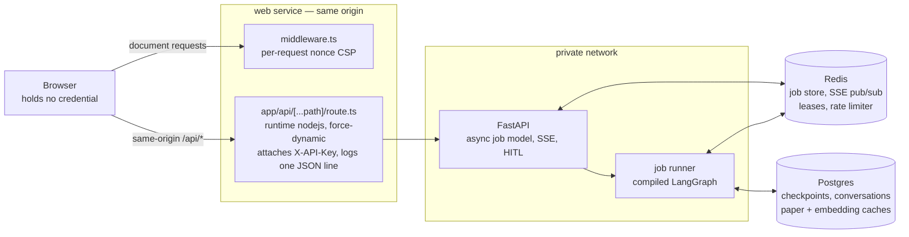
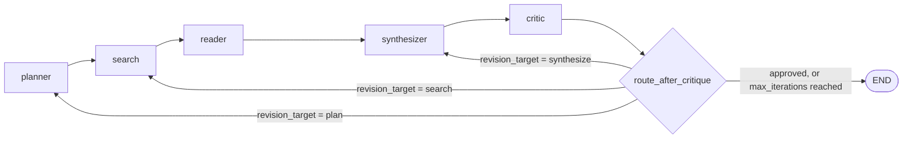
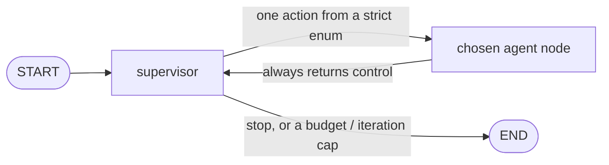
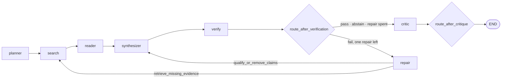
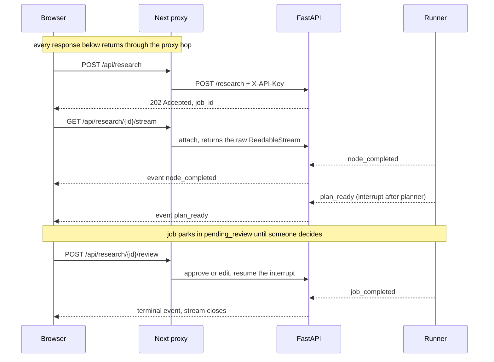

# Architecture

System-level view of `arxiv-research-agent`: the two workflow shapes,
the HTTP surface layered on top, the browser tier in front of it, and
the storage matrix that decides where every piece of state lives.
Everything here is derived from the code on `main`
(`src/graph/workflow.py`, `src/api/app.py`, `src/api/routes.py`,
`src/config.py`, `web/`); the linked ADRs carry the rationale — this
page does not restate them. The [README](../README.md) has the same
picture one level up; this page is the level below it.

## The shape of the system

Three properties of that picture are load-bearing rather than
incidental, and each is argued in ADR
[0055](decisions/0055-frontend-architecture-confirmation.md):

- **The browser never holds a credential.** `X-API-Key` is attached
  server-side in the proxy route and nowhere else. Every call the
  browser makes is same-origin. *Which* key is attached is resolved by
  `web/lib/server/principal.ts::resolveUpstreamPrincipal` — one shared
  principal in every configuration on `main`, and one key per invited
  pilot under the default-off `PILOT_EDGE_AUTH` mode (ADR
  [0063](decisions/0063-pilot-principal-edge-mapping.md)). The mode
  changes the answer; it does not move the boundary.
- **The proxy is not optional.** Native `EventSource` and `<a download>`
  cannot carry a request header, so under `ENABLE_API_AUTH=true` —
  the production configuration — neither the event stream nor any
  export could be authenticated from browser code at all.
- **Redis and Postgres are what make the tier horizontal.** On the
  defaults everything is in-process; the shared backends are what let a
  second worker exist. See the [storage matrix](#storage-matrix).

## The workflow — two shapes

`src/graph/workflow.py::build_workflow` compiles one of two LangGraph
graphs over the shared `ResearchState` (`src/graph/state.py`),
selected by `settings.enable_supervisor`:

**Fixed pipeline (default)** — the conditional edge is the whole
shape, so it is drawn as a node rather than as an annotation:

On `revision_needed` the critic's `revision_target` picks which of the
three nodes the run re-enters; revisions are capped at
`settings.max_iterations`.

**Supervisor loop** (`enable_supervisor=true`, ADR
[0014](decisions/0014-supervisor-loop-behind-flag.md)) — the fan-out is
uniform, so what matters is the cycle and where it terminates:

Every agent node hands control back to the supervisor, which picks
the next action from a strict enum — `plan / search / read /
synthesize / critique / stop`, plus `verify` when
`enable_verifier` is on (ADR
[0015](decisions/0015-verifier-agent-runtime-faithfulness.md)) and
`refine_query` when `enable_query_refiner` is on (ADR
[0018](decisions/0018-query-refiner-recovery-action.md)). Budget and
iteration caps short-circuit before the LLM call; malformed judge
output falls back to rules that mirror the fixed-pipeline order.

### A third shape, chosen by the research policy (ADR 0076)

The two shapes above are the two the `enable_supervisor` flag selects,
and they are what `research_policy="legacy"` — the default — compiles.
`research_policy="fixed_verify_repair"` compiles a third, arm C of
[`docs/agent-engineering/07-first-policy-experiment.md`](agent-engineering/07-first-policy-experiment.md):

The `verify` node is the existing verifier — same prompt, same judge —
writing a first-class `pass` / `fail` / `abstain` verdict. The `repair`
node picks one bounded, named recovery from a deterministic table (no
model call, see [`docs/agents/repair.md`](agents/repair.md)), the graph
re-enters at the node that carries it out, and verification always runs
again before the critic. One repair per run; the critic's revision loop
and `max_iterations` are unchanged.

The policy is a *selector*, not a fourth flag, and it refuses to load
unless `enable_supervisor=false`, `enable_evidence_store=true` and
`enable_verifier=false`. That refusal is what makes the arm labelling
mechanical: no combination of the three legacy flags produces this
shape, and `ENABLE_VERIFIER=true` under the fixed pipeline still adds
nothing at all. See ADR
[0076](decisions/0076-fixed-verify-repair-research-policy.md) for the
published selector, node names, verdict codes and decision table.

Regardless of shape, `build_workflow` also wires two production
knobs:

- **Checkpointing** — `SqliteSaver` (per-worker) or `PostgresSaver`
  (shared across workers), selected by
  `settings.checkpoint_backend`. Postgres is required for
  multi-worker HITL. ADRs
  [0013](decisions/0013-sprint-1-finish-retry-checkpoint-tracing-recall.md)
  / [0034](decisions/0034-postgres-checkpointer-and-cross-worker-hitl.md).
- **Tracing** — `traced_node` wraps every agent in an OpenTelemetry
  span when `settings.enable_tracing` is on (ADR
  [0012](decisions/0012-observability-core-logging-costs.md)).
  Metrics ride the same OTLP endpoint behind their own flag (ADR
  [0049](decisions/0049-otel-metrics.md)), but no instrument wraps a
  node: they hang off choke points the API layer and the cost
  accumulator already own, and only an API worker installs a provider.

The compiled graph is expensive (it opens the checkpointer's
connection), so it is built **once** at app startup and shared —
never per request (ADR 0034).

Per-agent behavior (inputs, outputs, prompt design, failure modes)
lives in [`docs/agents/`](agents/) — one page per agent.

## The API layer

`src/api/` wraps the workflow in a FastAPI app (factory:
`app.py::create_app`; routes: `routes.py`). Design in ADR
[0025](decisions/0025-fastapi-async-job-model.md).

**The edge.** One raw-ASGI middleware
(`app.py::ObservabilityMiddleware`) wraps every request, outermost in
the stack. It adopts the caller's `X-Request-Id` when it is well-formed
and mints one otherwise, echoes it in the response header and in the
error envelope, binds the ADR 0067 correlation context so every log
line for that request carries the id and a salted `principal_hash`,
extracts inbound W3C trace context so a caller's trace continues into
ours, opens the `{method} {route}` SERVER span, records the RED metrics
keyed on the route **template**, and writes one structured access line
in place of uvicorn's prose one (`serve.py` runs with
`access_log=False`). Raw ASGI rather than `BaseHTTPMiddleware` because
the latter proxies `receive` and breaks `Request.is_disconnected()`,
which the SSE route depends on. Details in
[`observability.md`](observability.md#the-http-edge).

**Health and readiness.** `GET /healthz` is liveness and is **always
200** — restarting a worker does not fix a dead Redis, so a liveness
probe that 503s on dependency failure turns a backend blip into a
rolling-restart storm (ADR 0042). `GET /readyz` is readiness and
returns **503** when a required dependency is down or when every
concurrency permit is taken, so an orchestrator can drain a worker
instead of sending it submits that can only fail. Both run the same
probes through one helper and share one latched edge set, so they
cannot disagree and an outage is logged once. `/readyz` is deliberately
not in the OpenAPI document: that document is the frontend's generated
contract, and `/readyz` has no browser client.

**Job model.** `POST /research` returns `202 Accepted` with a
`job_id` immediately; the runner (`runner.py`) drives the compiled
graph through `astream` (ADR
[0040](decisions/0040-async-checkpointer-and-runner.md)), bounded by
a process-wide semaphore (`api_max_concurrent_jobs`) and a hard
timeout (`api_job_timeout_sec`). Job lifecycle:
`pending → running → (pending_review | awaiting_learner →)*
succeeded / failed / cancelled`. `GET /research/{job_id}` polls
status + result.

**Job kinds.** A job carries a `kind` — `research` (the default, and
everything above) or `session`, a guided-read tutoring run against a
second graph (ADR
[0057](decisions/0057-job-kinds-and-awaiting-learner.md)). One driver
serves both: `runner.py`'s `JobKindRuntime` records the four
decisions that differ — the graph input, what an interrupt means, how
many interrupts are plausible, and the wall-clock ceiling.
**Five further branches on `job.kind`** live in `run_job` itself
rather than in that runtime, and naming them is the honest version of
a sentence this page used to end with "and nothing else branches on
the kind": the cost cap (`learning_session_max_cost_usd` against
`max_cost_usd`), the per-node cost log a session writes, the
progress-event persistence, the profile write, and what a breached cap
does. `tests/test_documented_claims.py` counts them in the AST, so a
sixth is a failing test rather than a stale sentence. Everything else
is genuinely shared, which is still the point of the field: a session
inherits the lease, the semaphore, the cancel token, the cost
accumulator, the terminal persistence and the outcome metrics rather
than a second driver having to earn them again.
`JobDetail.kind` reports it, defaulted so the field is additive.

The guided-read graph is a bounded second shape: check-in, opening reflection,
two guided questions, explain-back, guidance-only assessment, and append-only
progress update. Each learner input is a distinct dynamic interrupt resumed by
`Command(resume=...)`, so a checkpoint can be reattached by a new process
without replaying the preceding tutor turn. Its async node wrapper is
`SessionState`-typed rather than cast from the research wrapper because
LangGraph uses the runtime annotation to project node inputs (ADR
[0059](decisions/0059-guided-read-session-graph.md)).

**Parking.** A job can pause mid-graph and wait for a human, in
exactly one shape: it moves to a non-terminal *parked* status, the
runner publishes a frame naming the decision, and it blocks on the
job's resume event until the resume endpoint sets it locally or a
peer worker's pub/sub message does. Two parkings exist —
`pending_review`/`plan_ready` bounded by `api_hitl_timeout_sec`
(ADR 0030), and `awaiting_learner`/`turn_ready` bounded by
`session_turn_timeout_sec` (ADR 0057) — and they share
`runner.py`'s `ParkingSpec` + `_park_until_resumed`. The structural
difference is how often: a research run reviews only its *first*
interrupt and auto-resumes any re-plan, whereas a session parks on
every turn, bounded by `session_max_turns`. A parked job is held open
by a live worker refreshing its lease, so the redriver reads it as
healthy rather than stale; an *orphaned* parked job is failed and
never requeued, for the same reason an orphaned `running` job is.

**Node execution + cancellation.** Agents are synchronous, so the
async path runs each node on a lifespan-owned `ThreadPoolExecutor`
sized to `api_max_concurrent_jobs` — the semaphore then bounds
threads rather than coroutines. A timeout can only cancel the
awaiting coroutine, so the runner also sets a per-job cancel token
(checked before every LLM call and between the reader's papers) and
holds the job's permit until the node thread actually returns,
bounded by `api_job_drain_timeout_sec`. Threads it gives up on stay
counted in `/healthz`'s `active_jobs`. ADR
[0047](decisions/0047-bounded-executor-and-cooperative-cancel.md).

**SSE streaming.** `GET /research/{job_id}/stream` streams events as
the runner emits them: `node_completed`, `plan_ready`, `turn_ready`,
`job_completed`, `job_failed`, `job_cancelled`, plus heartbeats so
proxies don't drop the stream and a `stream_timeout` frame when
`api_sse_max_duration_sec` closes a long-lived connection (ADRs
[0026](decisions/0026-sse-streaming-endpoint.md) /
[0038](decisions/0038-job-redriver-and-sse-stream.md)). The two
parking frames are deliberately neither terminal nor stream-closing:
the connection carries the pause, so a session does not cost a
reconnect per turn. Connecting to
an already-finished job replays the single terminal frame and closes,
which makes reconnects idempotent; connecting to a parked job replays
its pause frame the same way, so a reconnect during plan review sees
the plan, and a page reload mid-session sees the turn, instead of
waiting out the parking timeout in silence (ADRs
[0053](decisions/0053-api-web-container-preflight.md) /
[0057](decisions/0057-job-kinds-and-awaiting-learner.md)). Under the Redis
job store, events fan out across workers via pub/sub on
`events:{job_id}` so the streaming request need not land on the
worker running the job (ADR
[0035](decisions/0035-cross-worker-sse-pubsub.md)); a late subscriber
on that path sees only events published after it connects — which is
why the replays above are snapshots read from the job row, not a
backlog.

The `job_completed` frame has **one** payload shape whether a client
watched the run or attached after it ended. It used to have two: the
runner's live frame carried `iterations` / `quality_score` /
`llm_calls`, the route's replay carried `status` / `error` /
`error_type`, so a browser reading `data.status` got a `KeyError` if it
happened to be connected when the job finished. Both now build through
`runner.py::terminal_event_data`, which carries the union — every field
was load bearing for one of the two readers. The live `job_failed` and
`job_cancelled` frames are still the runner's own smaller payloads;
that is a recorded gap in
[`observability.md`](observability.md#known-gaps), not a second design.

**Job leases + redriver.** Under the Redis job store, a worker holds
`joblease:{job_id}` (TTL `job_lease_ttl_sec`, refreshed in the
background) while it runs a job; a worker that dies stops refreshing,
and the redriver reclaims its orphaned jobs — failing them with
`error_type=orphaned` (or resubmitting still-`pending` ones when
`job_redrive_requeue_pending` is on). The sweep runs at startup **and**
on a jittered `job_redrive_interval_sec` timer, because a container
restarted inside its own lease window sees the dead lease as live at
boot and needs a later pass (ADR 0053). Sweeps serialize on a
cluster-wide `redrive:lock`, and every reclaim is a compare-and-set
(`update_if_status`, WATCH/MULTI/EXEC) so a job that finishes while
the sweep is deciding keeps its report (ADRs
[0038](decisions/0038-job-redriver-and-sse-stream.md) /
[0048](decisions/0048-redriver-cas-and-store-edges.md) / 0053).

**HITL.** When `enable_hitl` is on, the workflow interrupts after
the planner; the job parks in `pending_review` and
`POST /research/{job_id}/review` approves or edits the plan
(sub-questions + search queries) before search runs. Per-request
bypass via `{"hitl_bypass": true}` — the runner resumes the
interrupt immediately without emitting a review event. (The eval
runner and CLI avoid the pause upstream instead, compiling the
workflow with `enable_hitl=False`.) ADR
[0030](decisions/0030-hitl-plan-review.md); cross-worker resume via
Redis pub/sub in ADR 0034.

**Conversations.** `POST/GET/DELETE /conversations` group jobs into
threads; follow-up jobs get `prior_context` — top-K chunks retrieved
from the thread's prior reports (`retriever.py`) — injected into the
planner's prompt (ADR [0032](decisions/0032-conversation-mode.md)).

**Learner profile.** Opt-in behind `enable_learner_profile` (which
requires `enable_api_auth`): `GET/PUT/DELETE /learn/profile` keeps a
small per-principal record of what a learner has declared about
themselves, plus claims the system inferred or assessed. Every skill
claim carries non-nullable `declared` / `inferred` / `assessed`
provenance — enforced in the type, in the merge, and in the table's
CHECK constraints — and the prompt serializer confines inferred
claims to an "unconfirmed impressions" block so no prompt presents a
guess as fact (ADR
[0058](decisions/0058-learner-profile-store-and-provenance.md)). The
flag is off by default, and the routes answer 404 while it is.

**Guided-read sessions.** Opt-in behind `enable_session_loop`, which
requires `enable_learner_profile` (and so `enable_api_auth`) and
`enable_checkpointing`. `POST /learn/sessions` starts one
`kind="session"` job on the guided-read graph; `GET
/learn/sessions/{id}` reads it; `POST /learn/sessions/{id}/turn`
resumes a session parked in `awaiting_learner` with the learner's
reply. `SessionDetail` is assembled from **two** durable sources, and
the split matters: lifecycle fields and the currently parked `turn`
come off the job row, while `transcript` — the learner/tutor
exchange, with the internal `check_in` plan receipt filtered out —
is rehydrated from the LangGraph checkpoint for that session's
thread. A snapshot read that fails is reported as
`transcript_status: "unavailable"` rather than reconstructed from
stream events, and `assessment_status` (`""` /
`recorded_ungraded` / `unassessed` / `assessed`) reports the judge's
outcome as a fact rather than as a grade. That is what makes a
mid-session reload work: the browser re-reads the session and gets
the margin back, having held nothing (ADR
[0057](decisions/0057-job-kinds-and-awaiting-learner.md), ADR
[0059](decisions/0059-guided-read-session-graph.md)).

**Export.** `GET /research/{job_id}/export?format=md|pdf|docx`
renders the finished report via `src/api/exporters/` (ADR
[0031](decisions/0031-multi-format-export.md)).

**Auth, scoping, rate limiting** (`auth.py`). Opt-in behind
`enable_api_auth`: every route except the two probes (`/healthz`,
`/readyz` — an orchestrator cannot present a key, and both report only
counts and dependency *types*) requires an
`X-API-Key` header resolved against the keystore — either the
`api_keys` setting or a hot-reloadable JSON file (`api_keys_file`,
ADR [0037](decisions/0037-redis-rate-limiter-and-keystore-reload.md)).
Jobs and conversations are scoped to the creating principal;
cross-principal access returns 404 (ADR
[0036](decisions/0036-per-principal-store-scoping.md)). Submits are
rate-limited per key per sliding hour — in-memory per worker, or a
shared Redis ZSET under `rate_limit_backend=redis` (ADR 0037). The
broader hardening bundle (cost cap enforcement, PDF size cap, CORS
opt-in, prompt-isolation extensions) is ADR
[0033](decisions/0033-safety-hardening-bundle.md); threat model in
[`docs/security.md`](security.md).

**Web tier.** `web/` is a Next.js App Router application whose route
handler is the credential boundary above. It gets its own section
below; ADRs [0029](decisions/0029-nextjs-web-ui.md) and
[0055](decisions/0055-frontend-architecture-confirmation.md).

## The web tier

`web/` is not a single-page client. It is an App Router application
with six routes in two groups, three separable layers, and a server
boundary that is part of the security model rather than a convenience.

**Routes.** `/` (the workspace) and `/c/[id]` (a thread) under the
`(workspace)` group; `/learn` (the path library), `/learn/paths/[id]`
(one reading path), `/learn/sessions/[id]` (one guided session) and
`/learn/progress` (the **Ledger**) under `(learn)`. A parenthesised
directory contributes no URL segment, and
`web/tests/shell/routing.test.ts` pins the whole set against the
filesystem, so a route added without a decision fails the unit suite.
Both groups mount the same `WorkbenchShell`: the wedge is inside the
workbench rather than beside it, and the learning surfaces get no
second shell and no second navigation row — the anti-dashboard-soup
rule in
[`planning/07-learning-platform/00-VISION.md`](../planning/07-learning-platform/00-VISION.md)
§5.5, made structural. `/login` and `/settings` are **reserved names
with no files** — as is `web/app/api/auth/[...path]/route.ts` — because
there is no identity yet and a disabled login control would be a fake
one.

**The shell.** `app/(workspace)/layout.tsx` and `app/(learn)/layout.tsx`
each mount `WorkbenchShell`,
which owns the header, the thread rail, the skip link and the main
landmark. Components are layered `foundations → primitives → patterns
→ features`, so a primitive never imports a feature. The header
contains an `IdentitySlot` that **returns `null`**: it reserves a DOM
position and a module name for a future account control without
rendering an avatar, a "Sign in", or a disabled button. What occupies
the header is a sentence about the principal the server resolved for
that request, and on every deployment on `main` — one key, one principal
— that sentence is "Shared workspace — Everyone with access to this
deployment sees these threads. There are no separate accounts."

**Which sentence, is decided per request rather than by a flag
(WO-W17b).** Both group layouts are server components; each derives a
`WorkspaceIdentity` (`lib/server/identity.ts`) from the same environment
and the same two edge headers `lib/server/pilot.ts` reads for the
credential seam, and passes it to the shell as a serialisable prop. It
has three values: `shared` (the sentence above), `pilot` — which names
the pilot the edge authenticated and says what is per person and what is
cached in common — and `unresolved`, for a request the edge did not
vouch for under the default-off pilot overlay (`deploy/pilot/`, ADR
[0063](decisions/0063-pilot-principal-edge-mapping.md)). The descriptor
carries a username and nothing else: no key, no `key_id`, no fault. The
web tier still has no runtime feature flag (SR-07), because this is not
one — it is the request's own answer, and with the pilot mode off the
rendered element is byte-identical to what it was before the descriptor
existed.

**The data layer.** `lib/api/` is a typed client whose types are
*generated* from `contract/openapi.json` (a CI job fails on drift), and
`lib/queries/` wraps it in TanStack Query. Every query key is
`[resource, principal, …]` with `principal` a module constant today, so
that when identity arrives the caches partition without a call-site
change. All of it goes through `/api` on the same origin; no component
ever sees `API_INTERNAL_BASE`.

**The job machine.** `lib/job/machine.ts` is a pure reducer — no clock,
no network, no `EventSource`, no React. Its transition table is
**total**: all 11 phases × 26 event types are decided explicitly, a
deliberately-ignored combination is written as `IGNORE` rather than
omitted, and there is no default branch, so adding a phase or an event
fails typecheck until every cell is decided. `lib/job/useJobStream.ts`
is the impure half that owns the `EventSource` and feeds it frames.

The split exists because the hard part is not rendering — it is being
honest about what is known. The machine never invents a stage: the
`checkpoint` field is written only by `node_completed`, is reset on
every stream open (including the browser's own automatic retry), and is
never persisted or derived from a polled `JobDetail`. Terminal copy is
therefore `failed after <checkpoint>` or plain `failed` — never
`failed in <node>`, because no terminal payload carries a node.

**The Ledger** (`/learn/progress`) is that same rule pointed at
learning. `GET /learn/progress` returns a *view* folded from the
append-only `progress_events` log (`src/learning/progress_store.py`),
so the surface's job is to render what the events support and nothing
else. `components/patterns/LedgerView.tsx` takes the summary as a prop
and builds its rows through two pure functions whose row types cannot
express an unbacked claim: an evidence row's `evidenceRef` is a
non-nullable string, every row carries the `event_id`s it is made of,
and anything that would violate either is dropped and *counted* in a
footnote rather than silently omitted. Both properties are asserted
over the rendered DOM in `web/tests/patterns/LedgerView.test.tsx`.
Session arithmetic is rendered as one string — `Schedule · 3 of 3
sessions` — so no layout can separate the figure from the word that
says it is schedule progress rather than knowledge; a path with no
assessment event reads "Not yet observed" rather than a zero; and the
Ledger's export is **not built**, so no control offers it.

**The pedagogy honesty gate.** `web/lib/copy/index.ts` carries a
`PEDAGOGY_PHRASES` list — mastery, percentages, "unlocked", XP,
streaks and streak-guilt phrasing, badges, proficiency, any knowledge
scalar, "score", "grade", "dashboard" — and
`web/tests/copy/forbidden.test.ts` applies it to every copy module the
`(learn)` route group's import graph reaches. The module set is
*discovered* by walking that graph, not listed, so a new learning
surface is covered the moment it renders a string; a discovered module
the gate's table does not carry fails the suite. The list is a strict
extension of the product-wide deny-list rather than a replacement, and
it is proven by a committed fixture that must fail —
`web/tests/fixtures/copy-pedagogy.fixture.ts`, which says "87%
mastered". This is the copy half of the ban the store already enforces
structurally in `BANNED_SCALAR_TOKENS` and in the
`progress_events_no_mastery_scalar` CHECK constraint.

### How a run travels

The job id travels in the URL as `?job=`, which is what makes a reload
mid-run recoverable: the page attaches to an existing job rather than
submitting a new one (ADR
[0053](decisions/0053-api-web-container-preflight.md)). Reattaching
replays the terminal frame for a finished job, `plan_ready` for one
parked in review and `turn_ready` for a session parked in
`awaiting_learner`, so a dropped connection during a pause does not
wait out the timeout in silence.

The session surface reuses that whole machine rather than growing a
second one. `awaiting_learner` is an eleventh phase and `turn_ready` a
twenty-sixth event, both decided in every cell of the table above;
`lib/job/session.ts` projects a `SessionDetail` onto the lifecycle
fields the reducer consumes, so transport, reconnect and terminal
handling are shared code. `turn_ready` is treated as a *pause signal*,
not as a transcript source: the frame moves the phase, and the surface
then re-reads `GET /learn/sessions/{id}` for what to render — which is
why a live turn and a reloaded one produce the same screen.

**Starting one.** The only browser path into a session is the start
action on `/learn/paths/[id]`. `components/patterns/PathView.tsx`
renders it per entry and never fetches: without an `onStartSession`
prop no start control exists at all, so the pattern cannot offer a
write it has no way to issue. `components/features/PathDetailSurface.tsx`
owns the write. It sends the entry's `path_id`/`resource_id` and the
entry's own declared `est_minutes` as `available_minutes`, and **omits**
that field rather than clamping it when a manifest declares something
outside the endpoint's 5–180 range — `create_session` already falls back
to the learner's `time_budget_min_per_day`, and a clamped number would be
one the surface invented. On 202 it routes to `/learn/sessions/{id}`.

Two properties there are deliberate. The duplicate-submit guard is a
`useRef` written synchronously before the `await`, not React state:
`POST /learn/sessions` starts a graph run and carries no idempotency
key, so a second click inside one frame would buy a second session, and
a batched state update reads its pre-update value in exactly that
window. And the refusal is *mapped*: `describeSessionStart` in
`lib/copy/learn.ts` turns an `ApiFailure` into one of that dictionary's
sentences, keyed on the `detail` codes `src/api/sessions.py` actually
raises — the flag being off, no learner record for the credential, the
content tree, the rate limit, an unreachable service. Anything it has no
sentence for reads as the generic refusal **plus the service's own word,
verbatim** (RC-16), so an unmapped backend refusal reaches the reader as
something they can act on rather than as silence. WO-W06's
`session_cost_cap_refused` is deliberately not in that table: it is an
`error_type` on a session that already exists, so the surface that
states it is the session view's cost-cap fact, not the start control.

**The server boundary.** `middleware.ts` mints a per-request nonce and
sets the CSP on every document response; the proxy route emits one
structured JSON log line per proxied request with a path *template*
rather than a raw id; the container healthcheck probes `/api/healthz`
*through* the proxy. All three, plus the CSP's exact policy and the
deliberate CSRF scope note, are in
[`security.md`](security.md#browser-facing-hardening-on-the-nextjs-service-wo-30).

Because the nonce is per-request, `/` is **dynamically rendered** — a
nonce cannot live in a cached document. That is inherent to the choice,
not a regression; the consequences are recorded in ADR
[0055](decisions/0055-frontend-architecture-confirmation.md).

**Styling and weight.** Colour, space, type and motion come from one
token chain with a parity test and an ESLint ban on literal colours,
and every route carries a gzip byte ceiling enforced on every PR under
a ratchet rule. Both are ADR
[0056](decisions/0056-design-tokens.md).

**A note on the deployment gate.** The production Caddy edge asks for
HTTP basic auth before anything else. It is a **deployment gate, not a
user account**, and the UI must never render it as a signed-in user —
see [`security.md`](security.md#s7--the-deployment-gate-is-not-an-identity).

## Storage matrix

Every stateful concern has a pluggable backend chosen by one
setting in `src/config.py`. Defaults favor zero-dependency local
dev; the compose stack (`docker-compose.yml`, ADR
[0027](decisions/0027-docker-compose-redis-job-store.md)) selects
the shared backends.

| Concern | Setting | Options (default first) | Shared across workers? | ADR |
|---|---|---|---|---|
| Job store (status, result, events) | `job_store` | `memory` / `redis` | Redis only | 0025, 0027 |
| SSE + HITL fan-out | (follows job store) | in-process queue / Redis pub/sub | Redis only | 0034, 0035 |
| Conversation store | `conversation_store` | `memory` / `postgres` | Postgres only | 0032 |
| LangGraph checkpoints | `checkpoint_backend` | `sqlite` / `postgres` | Postgres only | 0013, 0034 |
| Paper cache (parsed PDF text) | `paper_cache` | `disk` / `postgres` | Postgres only | 0028 |
| Embedding cache | `embedding_cache` | `none` / `postgres` | Postgres only | 0028 |
| Rate limiter | `rate_limit_backend` | `memory` / `redis` | Redis only | 0033, 0037 |
| API keystore | `api_keys` / `api_keys_file` | env string / JSON file (hot-reload) | file is shared by mount | 0033, 0037 |

Rule of thumb: a single-process deployment can run entirely on the
defaults; any horizontally-scaled deployment needs `redis` for the
job store + rate limiter and `postgres` for checkpoints,
conversations, and caches — which is exactly what
`docker-compose.yml` wires.

The container image installs `requirements-lock.txt` (never
pyproject's ranges, so it runs the dependency set CI tested) and
bakes the MiniLM embedding weights into the image at build time —
the first live job no longer downloads ~90MB inside its own timeout
budget (ADR [0053](decisions/0053-api-web-container-preflight.md);
pinned without a build by `tests/test_container_contract.py`).

## Cross-cutting concerns

- **LLM access** — one shared client (`src/llm.py`), SDK-native
  retry (ADR [0009](decisions/0009-anthropic-sdk-native-retry.md)),
  per-agent model routing (ADR
  [0021](decisions/0021-cost-aware-model-routing.md)), prompt caching
  (ADR [0022](decisions/0022-anthropic-prompt-caching.md)).
  `call_llm` is the enforcement choke point (ADR
  [0051](decisions/0051-llm-cost-enforcement-and-visibility.md)): it
  checks the per-job cancel token, then the run's accumulated spend
  against `max_cost_usd`, before every call — so the dollar ceiling
  binds on the CLI and eval paths too, and a node's parallel fan-out
  cannot overshoot by its whole spend. The retry envelope is clamped
  so one flaky call chain fits inside 75% of `api_job_timeout_sec`,
  and the SDK's own `retries_taken` is logged and counted per call.
- **Resilience** — one owning level of retry per dependency, and a
  budget for it (ADR
  [0068](decisions/0068-resilience-policy.md)). Retry amplification is
  multiplicative, so the policy is a *decision* before it is a
  mechanism: the Anthropic SDK owns model retries, `urllib3.Retry`
  (`src/tools/http_session.py`) owns arXiv / Semantic Scholar / PDF
  retries, and `redis-py`'s own `Retry` owns Redis. Nothing above any
  of them adds a loop. On top of that, `src/resilience.py` holds a
  **retry token bucket** — a per-process budget a retry spends and a
  first attempt never consults — so an outage stops costing every job a
  full retry envelope while the healthy path stays a pass-through. A
  circuit breaker was considered and rejected; the ADR records why.
  Backoff is **Full Jitter** everywhere, the HTTP retry envelope is
  clamped against the job budget the way `llm.py`'s has been since ADR
  0051 (WARNING `retry_envelope_clamped` when it bites), and every
  timeout on these paths — arXiv, the Redis connect and socket, the
  inter-query pacing pause — is a setting justified by a false-timeout
  rate rather than by a round number. Degradation is visible rather
  than silent: the rate limiter falls back to its per-worker counter on
  a Redis failure instead of answering 500, and says so; the redriver
  dead-letters a job that has used its requeue allowance
  (`internal_dead_letter`) instead of looping on it forever; and the
  search pacing loop checks the cancel token, so a stopped job no
  longer sleeps through its drain window.
- **Embeddings** — MiniLM via sentence-transformers
  (`src/tools/embeddings.py`), shared by paper ranking, chunk
  ranking, and conversation retrieval. Torch's OpenMP pool is pinned
  to one thread at model load and the device is explicit
  (`embedding_device`, default `cpu`) — both are native-crash
  containments, logged once at model load (ADR
  [0052](decisions/0052-native-crash-containment-and-data-lifecycle-edges.md)).
  The container image ships the weights pre-baked (ADR 0053).
- **Observability** — three signals out of `src/observability/`.
  **Logs**: structured JSON with `run_id` propagation, plus per-run
  cost accounting (ADR
  [0012](decisions/0012-observability-core-logging-costs.md)); the
  runner's between-nodes `max_cost_usd` check (ADR
  [0033](decisions/0033-safety-hardening-bundle.md)) remains as the
  coarser stop above the per-call ceiling in `call_llm` (ADR 0051).
  **Traces**: `traced_node` spans per agent behind `enable_tracing`
  (ADR
  [0013](decisions/0013-sprint-1-finish-retry-checkpoint-tracing-recall.md)).
  **Metrics**: **twenty-one** OTel instruments behind `enable_metrics`
  (ADR [0049](decisions/0049-otel-metrics.md), extended by ADRs 0051
  and [0066](decisions/0066-genai-semantic-conventions.md)) —
  terminal job counts by status + error type, a job-duration
  histogram and a queue-wait histogram, LLM spend, call, retry and
  upstream-error counts by model, rate-limit rejections by backend,
  four observable gauges (this worker's in-flight jobs, its abandoned
  node threads, its queue depth and its queue saturation ratio), the
  seven-instrument conventional `gen_ai.*` family, and the two HTTP
  server RED instruments. That count is re-derived from `src/` by
  `tests/test_operability_docs.py`'s AST scan and checked against this
  sentence by `tests/test_documented_claims.py`; it read "nine" across
  three ADRs' worth of additions, because until then nothing read it
  back. Traces and metrics share one `otel_exporter_endpoint`, so
  a single OTLP collector receives both. Every metric is recorded at
  an existing choke point — the runner's terminal write, the cost
  accumulator, the shared 429 helper — and the gauges observe the
  same accounting `/healthz` reports rather than a second set of
  counters. Pointing a collector at it:
  [`development.md`](development.md#opentelemetry-traces--metrics).
- **Evaluation** — custom in-repo benchmark + LLM-judge metrics
  (`src/eval/`, ADR [0005](decisions/0005-custom-eval-over-ragas.md))
  **designed to run nightly in CI** with regression diffing (ADR
  [0010](decisions/0010-nightly-eval-ci.md)). It does not run: **the
  nightly eval workflow is disabled at the repository**
  (`disabled_manually`) and stays that way pending the owner's funding
  decision, so `.github/workflows/eval-nightly.yml` keeps a `cron:`
  that GitHub ignores and says so beside it. No campaign has ever
  produced a `summary.jsonl`; the long form is
  [`docs/eval.md`](eval.md#status-disabled-and-no-green-campaign-yet).
  The campaign runner is
  crash-safe: per-query persistence, `--resume`, per-metric judge
  isolation, a `--max-budget-usd` ceiling, and honest exit codes
  (ADR [0050](decisions/0050-eval-runner-hardening.md)); strategy in
  [`docs/eval.md`](eval.md).

## Request profiles

*Additive section, CAP-01 / ADR
[0076](decisions/0076-model-aware-request-profiles.md).*

`src/llm.py` has always been the choke point for spend, retries,
cancellation and the `chat` span. It is now also the choke point for
the **request body**, because until ADR 0076 there was only one body:
`temperature=0.3` went out on every call to every model. Opus 4.7 and
later, Opus 5, Sonnet 5 and the Fable/Mythos tier answer a request
carrying sampling parameters with an HTTP 400 — so a one-variable
change to `ANTHROPIC_MODEL`, of exactly the kind ADR
[0021](decisions/0021-cost-aware-model-routing.md) invites and
`src/observability/costs.py` already prices, failed every call on every
node.

Three pieces, and the split is the design:

| Piece | Where | Answers |
|---|---|---|
| Capability table | `src/llm_models.py` | *What will this model accept?* |
| `Settings` fields | `src/config.py`, `# ------ Agent capability (CAP-01)` | *What does the operator want sent?* |
| `RequestProfile` | `src/llm.py` | The conjunction, per call, frozen |

`src/llm_models.py` is pure — no imports from `src/`, no logging, no
I/O — and it is the only module outside the config defaults that names
a Claude model id. A row records `sampling_params`,
`adaptive_thinking`, `effort_levels`, `structured_outputs` and the
source of the claim; every id the price table knows has one, which
`tests/test_llm_models.py` and `tests/property/test_property_llm_models.py`
hold in both directions. An id with no row of its own resolves to its
base model (a dated snapshot or point release), then to a family row,
then to a conservative row — and **every fallback guesses downward**,
because guessing low costs a feature on a call that still works and
guessing high costs a 400 on every call.

A feature is sent only when it is enabled **and** supported:

| Model | `temperature` | `thinking` | `output_config.effort` |
|---|---|---|---|
| `claude-sonnet-4-6` (default) | ✅ | ✅ | ✅ (no `xhigh`) |
| `claude-opus-5`, `claude-sonnet-5`, Opus 4.7+ | ❌ 400 | ✅ | ✅ |
| `claude-haiku-4-5` | ✅ | ❌ | ❌ |
| an unrecognised id | ❌ | ❌ | ❌ |

**Thinking and effort are refused at settings load** when a routed
model does not support them; `enable_structured_outputs` and
`llm_temperature` are not. The line is whether there is a good runtime
answer: an unsupported `thinking` or `effort` is a 400 on every call
for the whole deployment, so a config that cannot make one successful
request should not start, while the other two degrade to exactly the
pre-ADR-0076 behaviour.

**Structured outputs** send a pydantic schema as
`output_config.format`, built with the SDK's own
`anthropic.transform_schema`, for the planner, critic, supervisor and
verifier (`src/agents/schemas.py` — transcriptions of the prompts, with
their own docstrings stripped so no prompt text ships through the
schema). The SDK's `messages.parse` helper is deliberately **not** used:
`with_raw_response` wraps only `create`, and `raw.retries_taken` is ADR
0051's retry-visibility fix. The agents' hand-written coercions (ADR
[0041](decisions/0041-retrieval-and-degradation-honesty.md)) stay, because
the flag is off by default and off on every unsupporting model.

**Response parsing skips `thinking` blocks** and never logs them. A
response carrying no `text` block at all now raises
`upstream_model_output` instead of returning `""` — which every caller
used to treat as a legitimate answer, so a run could finish `succeeded`
having been told nothing.

With every setting at its default the request body is byte-identical to
what shipped before, and `tests/test_llm_request_golden.py` holds it
against a fixture captured from the unmodified gateway. What is *not*
established without a live call is that the provider accepts each of
these shapes; that is CAP-06's funded smoke.
