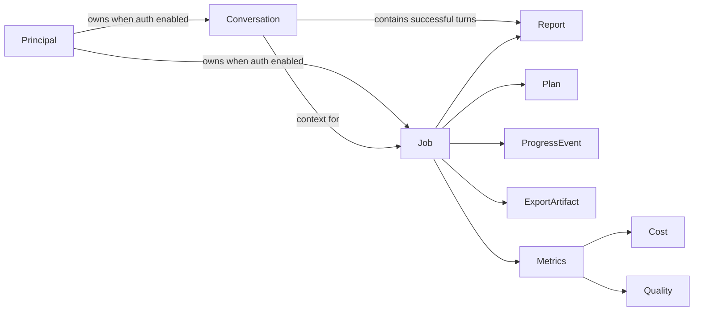

# Frontend revamp discovery

Date: 2026-08-28  
Baseline commit: `e6e87396d32be5ae985c2d7cc0dd5ed6cf84b351`  
Branch: `docs/frontend-revamp-gate-1`  
Status: Gate 1 candidate

## Resolved inputs

| Input | Discovery result |
|---|---|
| Repository | `/Users/kudratsingh/Machine-Learning-Projects/arxiv-research-agent` |
| Product | `arxiv-research-agent`, a private ML/AI literature-research workbench |
| Primary users | ML researchers, research engineers, applied-ML engineers, and technical leads; inferred with medium-high confidence from the product surface |
| Backend | Application 0.1.0 on FastAPI 0.139.0, OpenAPI 3.1, same-origin Next.js proxy at `/api`, Redis jobs/SSE and Postgres conversations/checkpoints/caches |
| Current frontend | Next.js 16.3.3, React 19.2.8, TypeScript 5.9.3, Tailwind 3.4.19, Vitest 4.1.11, Testing Library 16.3.2 |
| Hard constraints | Preserve React/Next unless an ADR proves otherwise; freeze backend shapes; keep the server-only API-key boundary; Docker/Compose deployment; no paid calls without explicit approval |
| Must keep | `/`, `/c/{conversation_id}?job={job_id}`, conversation CRUD, HITL plan review, SSE reconnect, Markdown/GFM reports, quality/cost telemetry, MD/PDF/DOCX export, dark mode, server-only API key |
| Out of scope before separate approval | Backend response changes; public multi-user identity/accounts; structured paper/evidence entities not present in the API; paid LLM/eval runs; provisioning infrastructure |
| Deploy and CI | GitHub Actions; Docker Compose behind Caddy on a cost-optimized Hetzner CX23, Ubuntu 24.04, Helsinki; deployment itself remains paused |
| Parallelism and gates | Maximum three delegated specialists; four human gates from the supplied orchestrator brief |

## Executive assessment

The current frontend is a small but credible functional MVP. Its most important product contract—the non-idempotent research submission and reload-safe `?job=` handoff—is tested carefully. The same-origin Node route is also a strong production security boundary: browser code never receives the backend API key.

It is not yet a production-grade research workspace. The interface is effectively desktop-only, server state is handwritten and unvalidated, long-running state is fragile when the job URL is lost, accessibility evidence is incomplete, and the visual system is generic Tailwind slate/blue. The quality pipeline has useful unit/component coverage but none of the Storybook, MSW, Playwright, axe, visual, Lighthouse CI, coverage, or bundle-budget tiers required by the revamp brief.

Primary product classification: **workflow/productivity application**.  
Secondary classifications: **research/content workbench** and **developer/operational tool**.

Implications:

- Moderate-to-high information density is appropriate.
- Long-form report reading and interruption recovery matter more than decorative motion.
- Human control at the plan boundary is a primary interaction, not a secondary settings panel.
- Cost, quality, and pipeline status should explain the research artifact they belong to.
- The mobile layout must change structurally; component-level wrapping cannot rescue the current fixed rail.

## Users and jobs to be done

| User | Context | Core jobs |
|---|---|---|
| ML researcher / research engineer | Frequent desktop use; evaluates evidence and produces briefings | Start a question, review the plan, inspect a cited report, continue a thread |
| Applied-ML engineer | Intermittent, decision-oriented research | Compare approaches, inspect tradeoffs and limitations, export findings |
| Technical lead / reviewer | Reviews conclusions and cost/quality | Understand provenance, scan an executive summary, assess quality, share/export |

Top five jobs:

1. Ask an ML/AI research question and receive a synthesized Markdown briefing.
2. Inspect and revise the planner's sub-questions and arXiv queries before further spend.
3. Monitor a long-running workflow and recover from interruption or failure.
4. Ask follow-up questions in a durable conversation that reuses prior findings.
5. Read, assess, and export the report as Markdown, PDF, or DOCX.

## Domain map



Frontend-visible entities are `Principal`, `Conversation`, `Job`, `Plan`, opaque Markdown `Report`, named SSE `ProgressEvent`, export artifact, and aggregate metrics. Papers, analyses, citations, and evidence claims exist inside the workflow state but are **not** exposed structurally by `JobDetail`; a frontend-only evidence graph would therefore be speculative or Markdown-parsing-dependent.

## Architecture

```text
Browser
  |
  | / and /c/:id; all API traffic stays same-origin at /api
  v
Next.js 16 App Router
  |-- client product pages and local React state
  |-- /api/[...path] Node route
          |
          | validates upstream, injects server-only X-API-Key,
          | streams SSE and download bodies
          v
FastAPI
  |-- Redis: jobs, SSE/pubsub, HITL, rate limiting
  |-- Postgres: conversations, checkpoints, caches
  `-- Anthropic/arXiv research workflow
```

Current architecture characteristics:

- `/` is statically prerendered; `/c/[id]` is dynamic and client-fed.
- Every product page is a client component.
- There is no query cache, global store, form/schema library, component library, message layer, or feature-flag system.
- Server state is fetched with handwritten `fetch` calls and compile-time casts only.
- `?job=` is the only load-bearing query state. It prevents duplicate paid work on reload.
- Next standalone output is used by the Docker runtime.

Keeping Next has a concrete security/deployment reason: a client-only migration would have to recreate the BFF that keeps `ARXIV_API_KEY` out of browser JavaScript and preserves stream/download behavior.

## Route inventory

| Route | Rendering and purpose | Reachable states |
|---|---|---|
| `/` | Static shell and first-question composer | sidebar loading/empty/list/error; form empty/filled/submitting/error/success handoff |
| `/c/[id]` | Dynamic conversation workspace | Suspense/loading; not found/generic error; empty/populated; streaming; reconnecting; plan review; success; failure; cancellation; expired job |
| `/api/[...path]` | Force-dynamic Node BFF | configured; upstream status pass-through; misconfigured 503; network 502 |
| `/_not-found` | Next framework default | generic 404 only; there is no product-specific `not-found.tsx` |
| `/_global-error` | Next framework default | no app or route recovery boundary |

There are only two user-facing route templates. The generic requirement to audit five routes is therefore interpreted as auditing the five most important **states** rather than inventing URLs: landing, empty conversation, populated conversation/report, plan review, and failure/recovery.

## Component and state inventory

| Component / hook | Responsibility | Main concern |
|---|---|---|
| `ConversationsShell` | Fixed two-column shell | No mobile rail state or `<main>` landmark |
| `ConversationSidebar` | List/create/delete/navigate | No paging/retry/undo; keyboard-invisible delete control |
| `QueryForm` | Question entry | No limit/count/cost context; shortcut untested |
| `ConversationThread` | Thread and active-run orchestrator | 310-line change hotspot; duplicates load logic |
| `useResearchStream` | Submit/attach/SSE/review lifecycle | High-risk paid-mutation and reconnect state machine |
| `EventLog` | Raw SSE timeline | Fixed columns overflow; `role=log` conflicts with child `<li>` semantics |
| `PlanReview` | Edit/approve/cancel plan | Dynamic arrays; no field-level server-error mapping |
| `JobSummary` | Cost/quality/calls/time | Detached aggregate metrics only |
| `ReportView` | Current report/failure | Failed state returns early and can hide a non-empty partial report |
| `ExportDropdown` | MD/PDF/DOCX commands | Incomplete APG menu keyboard and focus behavior |

Notable duplication:

- Conversation loading/newest expansion is implemented in both a callback and the mount effect.
- Sidebar list loading is implemented in both a callback and the mount effect.
- Current and historical Markdown report rendering diverge.
- Buttons, surfaces, alerts, focus rings, and colors repeat long utility strings.

## Backend contract relevant to the frontend

### JSON operations

| Operation | Success | Important runtime behavior |
|---|---:|---|
| `POST /research` | 202 | Query 1–8,000 chars; non-idempotent and potentially billable; 401/404/429/422 possible |
| `GET /research/{id}` | 200 | Source of final report and metrics; 404 also hides foreign resources |
| `POST /research/{id}/review` | 200 | approve/revise/cancel; 409 unless pending review; settled state is asynchronous |
| `GET /research/{id}/stream` | 200 SSE | terminal and plan replay only; no intermediate backlog or event IDs |
| `GET /research/{id}/export` | 200 | `md`, `pdf`, `docx`; 409 without a report; partial failed result may still be exportable |
| `POST /conversations` | 201 | Optional title, max 80; shares rate-limit bucket with research submission |
| `GET /conversations` | 200 array | Newest first; limit/offset, default 50; no total or `has_more` |
| `GET /conversations/{id}` | 200 | Every successful report body, unpaginated |
| `DELETE /conversations/{id}` | 204 | Destructive; conversation jobs cascade in Postgres |
| `GET /healthz` | 200 | Auth exempt; body can report `degraded` while status remains 200 |

The generated OpenAPI 3.1 document has ten operations and thirteen schemas, but it does not describe auth, most 401/404/409/429 responses, SSE payloads, or export bodies accurately enough to replace all handwritten contracts. Generated JSON types can be useful only with a checked manual SSE/export/error overlay.

### Lifecycle

```text
pending -> running -> pending_review -> running -> succeeded
                                           |----> failed
                                           `----> cancelled
```

Cancellation is only available at the plan-review pause. The public API has no general cancel endpoint after approval.

### SSE invariants

- Named events: `job_started`, `node_completed`, `plan_ready`, `job_completed`, `job_failed`, `job_cancelled`, plus transport timeout/note behavior.
- Final report text never arrives in SSE; every terminal event must reconcile through `GET /research/{id}`.
- Terminal replay payloads differ from live terminal payloads.
- Redis pub/sub has no replay backlog and the stream has no `id:` / `Last-Event-ID` contract.
- `node_completed.state_delta` is intentionally open and may include large strings; clients must tolerate unknown nodes and fields.
- `POST /research` must never be automatically retried. The API has no idempotency key.

### Error shape

There is no single error envelope:

- common errors: `{ "detail": "message" }`;
- rate limit: `{ "detail": { "error": "rate_limited", ... } }` plus `Retry-After`;
- validation: `{ "detail": [ValidationError, ...] }`;
- proxy errors: stable string details;
- transport/non-JSON failures are possible.

The target data layer needs one normalization contract for string, object, array, non-JSON, timeout, cancellation, and offline failures.

## Baseline evidence

Raw reports and screenshots live under [`baseline/`](baseline/README.md).

### Lighthouse 13.4.1

Mobile emulation used Lighthouse's default throttled mid-tier profile. Scores are single local laboratory runs, not field p75 values.

| State | Form factor | Performance | Accessibility | Best practices | LCP | TBT | CLS |
|---|---:|---:|---:|---:|---:|---:|---:|
| Landing | Mobile | 99 | 98 | 96 | 1.96 s | 16 ms | 0 |
| Empty conversation | Mobile | 98 | 98 | 96 | 2.38 s | 35 ms | 0 |
| Populated report | Mobile | 98 | 98 | 96 | 2.38 s | 56 ms | 0 |
| Plan review | Mobile | 98 | 94 | 96 | 2.28 s | 35 ms | 0 |
| Landing | Desktop | 100 | 98 | 96 | 0.27 s | 0 ms | 0 |
| Populated report | Desktop | 100 | 98 | 96 | 0.51 s | 0 ms | 0 |

Recurring findings:

- Every audited state lacks a `<main>` landmark.
- Plan review additionally fails list semantics because `role="log"` changes the parent role while retaining `<li>` children.
- Every completed audit logs a missing `/favicon.ico` 404, reducing Best Practices.
- Mobile audits report 48–83 KiB of unused JavaScript depending on the route.
- The conversation route is ineligible for back/forward cache under the measured conditions.
- The custom app 404 is absent; Lighthouse correctly treats the built-in 404 as a failed page load rather than a successful product route.

### Playwright and axe-core 4.13.0

The committed local-only fixture and Playwright specs now cover landing, loading, empty/populated reports, actual plan review, running, interrupted/reconnecting SSE, partial failure, cancellation, expiration, submission error, backend/sidebar error, both not-found surfaces, mobile, and dark mode. The state capture spec passes in 13.4 seconds.

Twelve standalone axe reports confirm `landmark-one-main` and uncontained `region` failures across the surface. Plan review, failure, and cancellation additionally fail `aria-allowed-role`/`listitem` because the event log replaces list semantics; multiple status/error combinations fail contrast; the inline conversation-not-found state has no level-one heading. Raw reports and the complete state/screenshot table are in [`baseline/`](baseline/README.md).

### Visual baseline

The mobile screenshots demonstrate a structural failure: at a 412 px audit viewport, the permanent 256 px sidebar plus main padding leaves roughly 100 px for the work surface. Headings, buttons, the question form, event rows, plan editor, report, and tables collapse into extremely narrow columns. Some internal grids have breakpoints, but the shell prevents them from becoming useful.

Desktop remains functional but visually generic. The landing screen has excessive unused canvas, very small typography, a weak product identity, and little hierarchy between navigation, question, explanatory copy, and action. The populated report is readable, but the report, export, telemetry, current run, and follow-up composer do not form a cohesive research-review workspace.

Dark mode exists through `prefers-color-scheme`, but no user control, persistence, or `color-scheme` declaration exists. A committed dark screenshot and axe report now provide baseline visual/contrast evidence.

### Bundle baseline

Measured from the production `.next` route manifests and emitted chunks:

| Asset scope | Gzip size |
|---|---:|
| `/` JavaScript, excluding polyfill | 137,272 bytes |
| `/c/[id]` JavaScript, excluding polyfill | 184,745 bytes |
| All emitted CSS | 4,288 bytes |
| All emitted JS concatenated | 322,101 bytes |

The route bundles are below the orchestrator prompt's provisional shell budget, but no CI budget exists and the manifest association is not currently generated as a stable report.

## Testing and quality baseline

Fresh local results:

```text
npm run typecheck  -> exit 0
npm run lint       -> exit 0
npm run test       -> 12 files, 78 tests passed
npm run build      -> Next 16.3.3 production build passed
npm audit          -> 0 vulnerabilities across production and development dependencies
```

Existing strengths:

- strict TypeScript with `noUncheckedIndexedAccess`;
- Next Core Web Vitals lint rules;
- no-double-submit and reload-safe job handoff tests;
- strong native EventSource attach/reconnect/terminal behavior tests;
- proxy credential/header/network tests;
- plan editing, Markdown rendering, export, and metrics tests;
- deterministic backend tests make no live model calls in per-PR CI.

Missing quality tiers:

- coverage collection and thresholds;
- Storybook component/state/interaction documentation;
- MSW JSON integration tests;
- generated OpenAPI drift check plus supplemental SSE contract;
- Playwright Chromium/Firefox/WebKit and mobile projects;
- visual regression;
- component and route axe assertions;
- Lighthouse CI and route-size budgets;
- responsive, dark-theme, offline, timeout, 401, 429, and chaos scenarios;
- dead-code, circular-dependency, and import-boundary checks.

Current test warnings:

- `vitest.config.mts` uses `__dirname`, which Vite's planned native config loader does not support.
- jsdom prints `Not implemented: navigation to another Document` during download-link interaction.

## Dependencies

The local versions of Next, React, Vitest, Testing Library, and ESLint are current on the verified 2026-08-27 registry snapshot. TypeScript 7 and Tailwind 4 are available but are migrations, not routine bumps. Tailwind 4 changes browser floors, PostCSS configuration, imports, Preflight, rings, borders, shadows, radii, and hover behavior; TypeScript 7 is a native compiler rewrite without the old programmatic API.

No component/headless primitive library, query cache, form/schema library, API generator, runtime validator, Storybook, Playwright, direct axe dependency, analytics SDK, or error tracker is installed.

## CI, security, and deployment

Strengths:

- frontend CI runs typecheck, lint, all 78 tests, and a production build;
- Node 22 and the lockfile make builds reproducible;
- the web Dockerfile is multi-stage, standalone, and non-root;
- base Compose binds host ports to loopback;
- production exposes only Caddy and keeps API/web/data services private;
- Caddy supplies TLS, site-level basic auth, request cap, HSTS, frame denial, MIME sniffing protection, referrer policy, and permissions policy;
- `react-markdown` does not enable raw HTML passthrough.

Gaps:

- CI builds only the API image, not the web image/runtime;
- CI does not validate the production Compose overlay;
- there is no dependency-audit gate or CSP;
- the web healthcheck proves Next `/` only, not `/api/healthz`;
- no browser error reporting, web-vitals reporting, or proxy observability exists;
- the Hetzner runbook still documents CAX21/FSN1 while the selected target is CX23/HEL1 with 4 GB RAM; source-building the ML image there needs a prebuilt-image or swap decision before rollout.

## Git history and risk concentration

The frontend has a small history, but churn is concentrated:

| File | Why it is risky |
|---|---|
| `web/lib/useResearchStream.ts` | Four revisions; paid mutation, native EventSource, replay/reconnect, HITL, terminal reconciliation |
| `web/components/ConversationThread.tsx` | Three revisions; thread, current job, URL synchronization, report history, form orchestration |
| `web/lib/api.ts` | Four revisions; every frontend/backend JSON operation |
| `web/app/api/[...path]/route.ts` | Credential and stream/download security boundary |
| `web/tests/ConversationThread.test.tsx` | Largest frontend test hotspot, but fixtures omit populated terminal refresh |

These contracts need state-machine and integration coverage before the visual migration consumes them.

## MUST-KEEP contract

1. `/` and `/c/{conversation_id}?job={job_id}` deep-link and reload behavior.
2. Same-origin `/api` boundary with server-only API-key injection.
3. Exactly one `POST /research` per intentional user submission; no automatic retry.
4. All job statuses, especially `pending_review`, failed partial results, and expired jobs.
5. Plan approve/revise/cancel with backend bounds.
6. Named SSE event handling, unknown-event tolerance, reconnect, and final `GET JobDetail` reconciliation.
7. Markdown/GFM report rendering without raw HTML.
8. Conversation ordering, pagination semantics, principal scoping, and destructive confirmation.
9. MD/PDF/DOCX downloads and upstream filenames/content types.
10. Cost, LLM calls, quality, iterations, and elapsed-time visibility.
11. Health body parsing; HTTP 200 alone cannot mean dependencies are ready.
12. Docker/Compose and the server-only production boundary.

## Ranked top ten problems

1. **The mobile shell is unusable.** The fixed 256 px sidebar leaves about 100 px at the audited phone width. This is directly visible in every mobile screenshot.
2. **Losing `?job=` can hide paid in-flight work.** Sidebar links return to a bare conversation URL, while only successful jobs enter conversation history.
3. **The data layer is handwritten, unvalidated, and non-resilient.** It lacks timeouts, read cancellation, central error normalization, and contract drift protection.
4. **Conversation data does not scale.** The sidebar silently stops at 50; each thread fetches and renders every full report body.
5. **The required quality matrix is mostly absent.** There is no Storybook, MSW, Playwright, axe gate, visual regression, coverage threshold, Lighthouse CI, or size enforcement.
6. **Accessibility has confirmed structural and keyboard issues.** Missing main/navigation labels, invalid event-log list semantics, an opacity-zero keyboard delete control, and an incomplete ARIA menu are evidence-backed failures.
7. **Long-running workflow state is too raw and fragile.** Progress is a developer event log, cancellation disappears after approval, and there is no offline/timeout recovery surface.
8. **The first action is non-transactional and consumes two rate-limit writes.** A failed research submission can leave an empty conversation; twenty hourly slots permit only ten fresh landing-page runs.
9. **There is no distinctive design system.** System fonts, generic slate/blue utilities, duplicated recipes, and no semantic tokens make the interface interchangeable with a template.
10. **Operational/deployment proof is incomplete.** No frontend observability, web-image CI smoke, production-overlay CI, CSP, or CX23-aware build path exists.

Additional investigation item: the terminal path may render a successful report twice—once as the newly reloaded historical turn and once as retained current-job detail. The code path supports this inference, but the current fixture cannot reproduce it; it must be confirmed with a deterministic browser test before being promoted to a defect.

## Gate 1 questions

> **Answered 2026-08-28** — recorded as
> [`DECISIONS.md` D-009](DECISIONS.md#d-009--gate-1-human-decisions):
> (1) Direction A — Evidence Workbench; (2) **not confirmed** — real
> end-user multi-tenancy is the intended end state, tracked as separate
> backend workstream MT-01 outside this revamp's frozen-backend boundary;
> (3) confirmed — omit, don't simulate; (4) confirmed as proposed.
> The "can wait" questions remain open for Phase 2.

### Blocking

1. Which candidate direction in [`02-DIRECTIONS.md`](02-DIRECTIONS.md) should become the Phase 2 design brief? Recommendation: **Evidence Workbench**.
2. Confirm that the deployed product is intentionally a private, shared-principal/single-owner workspace. The current Caddy + one server-side API key architecture is not end-user multi-tenancy.
3. Confirm the frozen-backend rule for this revamp: unsupported concepts such as structured paper/evidence inspection, rename/search, and post-approval cancellation should be omitted rather than simulated. Recommendation: yes; track them as separate backend proposals.
4. Confirm the first vertical slice: new question -> reload-safe job -> plan review -> stream/reconnect -> report/metrics/export. Recommendation: yes, because it exercises every high-risk contract.

### Can wait

1. Whether failed jobs with a non-empty partial report should expose export. The backend permits it; the current UI hides it.
2. Whether deletion copy should say “Delete thread” rather than “Delete conversation and all its jobs,” because job-store retention is separate.
3. Whether raw backend `error_type` strings should be mapped into a small user-facing vocabulary.
4. Whether `hitl_bypass` should remain unavailable to ordinary UI users.
