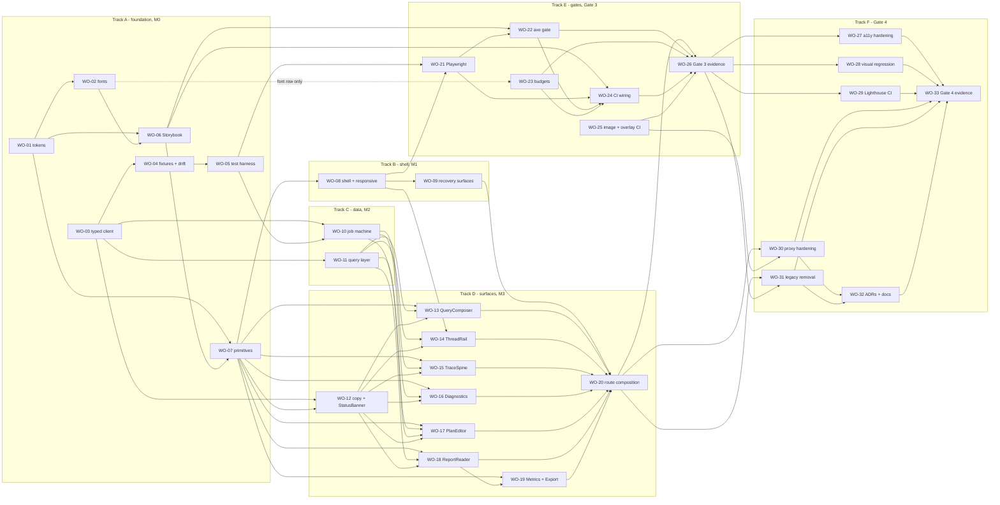

# Frontend revamp work orders

Phase: 4 (work orders and dependency graph) — input to **Gate 2**
Date: 2026-08-28
Branch: `docs/frontend-revamp-phase4-work-orders`
Base commit: `2734218` (Phase 2 brief and Phase 3 architecture merged)
Status: proposal awaiting Gate 2 approval

This document turns the merged Phase 2 design brief
([`03-DESIGN-BRIEF.md`](03-DESIGN-BRIEF.md), [`design/tokens.json`](design/tokens.json))
and the merged Phase 3 architecture ([`04-ARCHITECTURE.md`](04-ARCHITECTURE.md),
[`05-MIGRATION.md`](05-MIGRATION.md)) into 33 executable, reviewable units
covering everything from foundation through the Gate 4 ship review.

**Nothing here is implemented.** No source, config, CI, or Docker file is
modified by this document. It adds exactly one file.

## How to read this document

Read [§1](#1-reconciliations-to-ratify-at-gate-2) first. Twenty-one places
where Phase 2 and Phase 3 disagree are listed there with a proposed
resolution each; several work orders cannot be sized or written until those
resolutions are ratified. [§2](#2-decision-dependent-work-orders) then names every work
order whose *content* changes depending on a pending Gate 2 human ruling.

[§3](#3-the-work-order-set) is the work-order set itself.
[§4](#4-state-coverage-map) proves that every state in the union of the two
state matrices has an owner. [§5](#5-dependency-graph-critical-path-and-concurrency)
is the graph, the critical path, and how many worktrees can run at once.
[§6](#6-phase-and-ci-item-mapping) maps the work orders back onto
[`05-MIGRATION.md`](05-MIGRATION.md)'s five phases and its C1–C11 / B1–B5
items. [§7](#7-not-scheduled) is the honest list of everything specified in
03/04/05 that **no** work order covers, with the reason.

Inputs: [`00-DISCOVERY.md`](00-DISCOVERY.md), [`03-DESIGN-BRIEF.md`](03-DESIGN-BRIEF.md),
[`design/tokens.json`](design/tokens.json), [`04-ARCHITECTURE.md`](04-ARCHITECTURE.md),
[`05-MIGRATION.md`](05-MIGRATION.md), [`DECISIONS.md`](DECISIONS.md)
(D-009 binding), [`REVIEW.md`](REVIEW.md), [`RISKS.md`](RISKS.md),
[`baseline/README.md`](baseline/README.md), and a direct read of `web/`,
`.github/workflows/ci.yml`, and the frozen FastAPI surface in `src/api/`.

---

## 0. Conventions

**Gate assignment.** *Gate 3* = required for "foundation + ONE complete
vertical slice merged with Storybook/state evidence, end-to-end behaviour,
and tests". *Gate 4* = quality hardening and documentation before ship. The
approved slice ([`DECISIONS.md` D-009](DECISIONS.md#d-009--gate-1-human-decisions)
item 4) is: new question → reload-safe job → plan review → stream/reconnect →
report/metrics/export.

**Size.** Calibrated to the repo's PR policy — "bundle related concerns into
one cohesive PR (~400-800 additions); do not fragment cohesive work across
PRs" ([`../development.md`](../development.md), "Branching and PRs").

| Size | Additions | Rule |
|---|---|---|
| S | ≤ ~250 | Only where the work has no cohesive neighbour. Three work orders are S; none is a nano-PR. |
| M | ~400–800 | The target. |
| L | ~800–1,200 | Allowed only where splitting would ship a half-built contract. Every L work order states why below. |

Counts are **additions including tests and stories**, which is how the repo
policy counts.

**Acceptance criteria are evidence, not intent.** Every criterion is a test
that must pass or an artifact that must exist in the same PR. Per repo
policy, "every PR ships with tests for its diff" and "every PR that changes
behavior updates the relevant doc in the same PR" — so tests and doc updates
are *inside* each work order, never deferred to a later one.

**Cost boundary.** No work order calls a paid model. `POST /research`
against a real key is never exercised by any automated tier; the seeded
local stack runs with `ANTHROPIC_API_KEY=local-preview-disabled` exactly as
the Gate 1 baseline did ([`baseline/README.md`](baseline/README.md), "Test
data and safety").

---

## 1. Reconciliations to ratify at Gate 2

[`04-ARCHITECTURE.md`](04-ARCHITECTURE.md) was authored concurrently with
[`03-DESIGN-BRIEF.md`](03-DESIGN-BRIEF.md), on a branch where the brief did
not exist — it says so itself ("the path is written as plain text, not as a
Markdown link, because the file does not exist on this branch",
[§How to read](04-ARCHITECTURE.md#how-to-read-this-document)). Nineteen
tensions follow from that, and two more (RC-20, RC-21) were found while
sizing the work orders themselves — twenty-one in total. Each is proposed
for ratification rather than silently resolved; where a work order depends
on the outcome, it is named.

### RC-01 — Route bundle budgets versus the three self-hosted typefaces

**The tension.** [`04-ARCHITECTURE.md` §8.1](04-ARCHITECTURE.md#81-route-javascript-budgets)
sets budgets (145 KB `/`, 195 KB `/c/[id]`, 120 KB shared chunk, 12 KB CSS,
240 KB total route JS, 120 KB fonts).
[`03-DESIGN-BRIEF.md` §10](03-DESIGN-BRIEF.md#10-what-gate-2-must-decide)
item 7 states the same measured baselines (137,272 B for `/`, 184,745 B for
`/c/[id]`), observes that "three self-hosted families and new primitives
will move both", and asks — as written — that "Gate 2 should set the ceiling
**before the work orders, not after**". This document is the work orders, so
the ceiling has to be settled here, with the fonts accounted for, which is
what the reconciled table below does.

**Do the architecture budgets already absorb the fonts? No — and they do not
need to.** The `/` and `/c/[id]` rows measure **first-load JavaScript**,
computed by gzipping the chunk union named in `.next/app-build-manifest.json`
and `.next/build-manifest.json` ([`04-ARCHITECTURE.md` §8.4](04-ARCHITECTURE.md#84-enforcement--a-ci-check-not-an-aspiration)).
Font files are woff2 binaries emitted as static assets; they never appear in
a route's JS chunk union, so they can neither consume nor be hidden by the
JS headroom. §8.1 already gives them their own line — "All self-hosted font
files (woff2, subset) … 120 KB" — so there is no double count and no gap in
*coverage*. The two documents are consistent once the budgets are read as
per-asset-class ceilings rather than one page-weight number.

**What is genuinely missing** is the number the brief was reaching for: a
total transferred-weight figure for a cold first load. The reconciled table
adds it as a derived row, and makes the byte arithmetic explicit — §8.1's
"KB" is KiB (137,272 B ÷ 1024 = 134.06, printed as 134.1), which the
document leaves implicit.

**Reconciled budget table — proposed for Gate 2 ratification.**

| Scope | Baseline | Budget | Budget in bytes | Headroom | Gate |
|---|---:|---:|---:|---:|---|
| `/` first-load JS, excl. polyfill | 137,272 B | 145 KiB | 148,480 B | +11,208 B | every PR |
| `/c/[id]` first-load JS, excl. polyfill | 184,745 B | 195 KiB | 199,680 B | +14,935 B | every PR |
| Shared framework/runtime chunk | subset of the above | 120 KiB | 122,880 B | — | every PR |
| All emitted CSS | 4,288 B | 12 KiB | 12,288 B | +8,000 B | every PR |
| All self-hosted font files (woff2, latin subset) | 0 B | 120 KiB | 122,880 B | — | every PR |
| Total transferred JS on a settled report route, incl. lazy chunks | — | 240 KiB | 245,760 B | — | per-PR chromium E2E |
| **Derived: total first-load transfer for `/c/[id]`, cold cache** | — | **327 KiB** | **334,848 B** | — | reported, not gated |

The derived row is JS + CSS + fonts and is a **transfer ceiling, not an LCP
ceiling**: fonts load `font-display: swap`
([`03-DESIGN-BRIEF.md` §3.5](03-DESIGN-BRIEF.md#35-typography)), are cached
across both routes, and do not block first paint. It is reported in
`budget-report.md` so a reviewer sees the real page weight; the gate stays
on the six per-class rows.

**The risk this exposes, stated rather than smoothed over.** The brief names
three families across seven static faces — Atkinson Hyperlegible Next
400/600/700, Literata 400/600, IBM Plex Mono 400/500
([`design/tokens.json`](design/tokens.json), `typography.families`).
122,880 B ÷ 7 = **17.1 KiB per face**, which is at or below what a text serif
of Literata's character set typically subsets to. RC-20 adds Literata Italic
400, making it **eight** faces at **15.0 KiB each** — so the budget is
*less* likely to hold, not more, and the mitigation ladder below is
correspondingly more likely to be needed. Mitigations in preference order:
variable woff2 with a restricted weight axis (one file per family); drop
Atkinson 700 and use 600 for both roles; tighten the subset to the glyphs
actually rendered. **The order of operations is measure first**
(WO-02), then either meet the budget or raise it under the ratchet rule
([`04-ARCHITECTURE.md` §8.4](04-ARCHITECTURE.md#84-enforcement--a-ci-check-not-an-aspiration))
in a PR carrying the per-face measurement table. Inventing a number now
would be exactly the failure mode
[`REVIEW.md`](REVIEW.md) rejects.

Affects **WO-02**, **WO-23**. Ratification requested for the table above.

### RC-02 — Token namespace and semantic role set

**The tension.** [`04-ARCHITECTURE.md` §6.1](04-ARCHITECTURE.md#61-the-contract-between-phase-2-and-phase-3)
fixes names so the brief "can be written against it": roles `canvas surface
raised ink ink-muted rule primary primary-ink accent review critical focus
success warning`, `--space-{n}` over `0 1 2 3 4 6 8 12 16 24`,
`--radius-{sm,md,lg,full}`, `--font-{display,ui,data}`,
`--text-{xs…3xl}`, `--duration-{instant,fast,base,slow}`. The brief and
[`design/tokens.json`](design/tokens.json) ship a different set: `sunken`
not `raised`, `border-subtle`/`border-strong` not `rule`, `primary-on` not
`primary-ink`, a `signature` family not `accent`, added `-text`/`-surface`
variants, added `ink-faint`/`ink-disabled`, **no `success`** (explicitly cut
— "A second accent colour for 'success'. Cut.",
[`03-DESIGN-BRIEF.md` Appendix](03-DESIGN-BRIEF.md#appendix--anti-template-self-critique))
and no `warning`; a px-valued space scale `2 4 8 12 16 20 24 32 40 48 64 96`;
radii `0 / 3 / 5 / 6`; families `report / ui / mono`; three parallel type
ramps (`ui-*`, `report-*`, `mono-*`) plus `display`; and an elevation scale
`elev-0…3` that §6.1 has no namespace for.

Durations are the one place the two sets **overlap rather than conflict**,
and only the brief's prose obscures it: [`03-DESIGN-BRIEF.md` §3.7](03-DESIGN-BRIEF.md#37-motion)
tabulates `fast / base / slow / ambient`, but
[`design/tokens.json`](design/tokens.json) `motion.duration` declares
**five** — `dur-instant: 0ms` as well. So §6.1's `instant` is already
satisfied by the token file, and the reconciled duration set is the union:
`instant / fast / base / slow / ambient`. `dur-instant` is the twelfth
orphan counted in RC-15.

**Proposed resolution.** §6.1's list is a placeholder written to unblock a
concurrent branch, and §6 says so twice — "This section defines only the
mechanism; the brief owns the values" and "If the brief renames a role or
changes a value, only `tokens.css` and `tokens.ts` change." **The brief's
role set wins; §6.1's enumeration is superseded.** What survives from §6.1
is the *namespacing convention* and the whole of
[§6.2](04-ARCHITECTURE.md#62-mechanism): one file with literal values, a
typed name module, Tailwind built from that module, a parity test, an ESLint
rule banning literal colours. Applied to the brief's names, the namespace
becomes `--color-*`, `--space-*`, `--radius-*`, `--font-*`, `--text-*`,
`--duration-*` (five steps, per the union above), `--ease-*`, plus a new
`--elevation-*`. `success` and `warning` are not created; see RC-17 for what
`StatusBanner`'s "warning" severity maps to.

Affects **WO-01**, **WO-07**, **WO-12**.

### RC-03 — `useResearchStream`: "extended, not replaced" versus deleted in M4

**The tension.** [`03-DESIGN-BRIEF.md` §4](03-DESIGN-BRIEF.md#4-component-inventory)
dispositions `useResearchStream.ts` as **"Extended, not replaced"** — "its
attach/reconnect/terminal behaviour is the best-tested thing in the frontend
and is a MUST-KEEP. Additions only". [`04-ARCHITECTURE.md` §4.2](04-ARCHITECTURE.md#42-the-machine)
replaces it with a `useReducer` machine in `web/lib/job/machine.ts`, and
[`05-MIGRATION.md` §1.1](05-MIGRATION.md#11-shape-branch-by-abstraction-inside-the-same-nextjs-app)
M4 **deletes the module**.

**Proposed resolution.** The MUST-KEEP is the *behaviour*, not the module —
`00-DISCOVERY.md` §MUST-KEEP 6 names "named SSE event handling,
unknown-event tolerance, reconnect, and final `GET JobDetail`
reconciliation", none of which is a filename. Port those semantics into
`lib/job/machine.ts` plus a thin `useJobStream` adapter that keeps the
hook's public shape; run the existing hook tests against the adapter through
M2; delete `useResearchStream.ts` in M4 only once the replacement carries an
equivalent-or-larger test set, which is the rule
[`05-MIGRATION.md` §1.4](05-MIGRATION.md#14-why-this-beats-a-big-bang-replacement)
already states ("retires them only when an equivalent replacement is
proven"). This is a documented deviation from the brief's disposition
column, not a silent one.

Affects **WO-10**, **WO-31**.

### RC-04 — Rail behaviour between 768 px and 1023 px, and rail width

**The tension.** [`03-DESIGN-BRIEF.md` §7.5](03-DESIGN-BRIEF.md#75-the-mobile-repair)
specifies three modes: `<768px` drawer, `768–1023px` **56 px icon strip**,
`≥1024px` persistent **260 px** rail.
[`04-ARCHITECTURE.md` §8.3](04-ARCHITECTURE.md#83-the-mobile-narrow-strip-repair)
specifies two: below `md` (768 px) no rail, at `md` and above
`grid-cols-[16rem_minmax(0,1fr)]` — a **256 px** rail from 768 px up, with a
user collapse toggle persisted in `localStorage`.

**Proposed resolution.** Take the brief's three modes (it is the surface
authority and the 56 px strip is what makes 768–1023 px usable), implemented
with the architecture's grid mechanism (`minmax(0,1fr)` removes the
min-content floor by construction, which flex cannot). Rail width **260 px**
per [`03-DESIGN-BRIEF.md` §3.6](03-DESIGN-BRIEF.md#36-space-size-radii-elevation)
— it is a token, so `grid-cols-[var(--rail-w)_minmax(0,1fr)]`; 16rem was
shorthand, not a decision. Keep the architecture's persisted collapse
toggle, applied at ≥1024 px only (below that, collapsed *is* the default).

Affects **WO-08**.

### RC-05 — Which client-side preferences are persisted

**The tension.** [`05-MIGRATION.md` §1.3](05-MIGRATION.md#13-rollback) grounds
rollback safety partly on "The only persisted preference introduced at all is
the rail collapse state, which is cosmetic and safely absent."
[`03-DESIGN-BRIEF.md` §3.3](03-DESIGN-BRIEF.md#33-colour--dark) and
[§4.9](03-DESIGN-BRIEF.md#49-statusbanner--confirmdialog--notfound--routeerror--themetoggle)
require a **persisted theme override** (`light`/`dark`/`system`) applied
before first paint.

**Proposed resolution.** Two persisted preferences, not one: theme and rail
collapse. The rollback argument is unchanged in substance — both are
cosmetic, both are safely absent, neither is a job handle — and the property
that actually matters ("nothing that can outlive `api_job_retention_sec`")
still holds because no job id, plan, or checkpoint is ever written to
storage. The M4 documentation update restates §1.3 with both.

Affects **WO-01**, **WO-08**, **WO-32**.

### RC-06 — CLS: 0.00 versus ≤ 0.02

**The tension.** [`04-ARCHITECTURE.md` §8.2](04-ARCHITECTURE.md#82-lab-performance-targets)
budgets CLS ≤ 0.02 on both form factors.
[`03-DESIGN-BRIEF.md` §3.5](03-DESIGN-BRIEF.md#35-typography) and
[§5.6](03-DESIGN-BRIEF.md#56-motion) state "CLS budget 0.00", and
[`design/tokens.json`](design/tokens.json) records `"cls-budget": "0.00"`.

**Proposed resolution.** ≤ 0.02 is the **CI gate** (lab-noise tolerance);
0.000 is the **design intent and the measured baseline across all six
audited states**. WO-02 must achieve a measured 0.000 for the font swap
specifically, and any state that lands non-zero carries a written
justification in `budget-report.md`. Both numbers stay; they are answering
different questions.

Affects **WO-02**, **WO-23**, **WO-29**.

### RC-07 — `web/middleware.ts`: deliberately absent versus required by the CSP

**The tension.** [`04-ARCHITECTURE.md` §10](04-ARCHITECTURE.md#10-identity-ready-seams-for-mt-01)
seam S3 says middleware "does not exist … Not created now — an empty
middleware costs a hop on every request for no benefit."
[`05-MIGRATION.md` §3](05-MIGRATION.md#3-ci-and-operational-additions-planned)
C3 says a nonce-based CSP "needs `web/middleware.ts` to generate a
per-request nonce, so C3 is the one item that adds a file the architecture
otherwise deliberately omits".

**Proposed resolution.** 05 already flags the tension, so this is
self-aware, not blind. The middleware **is** created, by C3, for the nonce —
and it becomes the natural home for MT-01's session check exactly as C3
says. The per-request-hop objection is answered with a `matcher` that
excludes `/api/*`, `/_next/static/*`, and the icon, so proxy and asset
traffic take no extra hop. One further interaction neither document names:
the brief's **theme script must run before first paint**
([§3.3](03-DESIGN-BRIEF.md#33-colour--dark)), which makes it an inline
script — under `script-src 'self'` it needs the nonce or a hash. WO-30
therefore owns both the nonce plumbing and the theme script's CSP treatment.

Affects **WO-01**, **WO-30**.

### RC-08 — Is `app/api/[...path]/route.ts` untouched?

**The tension.** [`03-DESIGN-BRIEF.md` §2.1](03-DESIGN-BRIEF.md#21-routes)
marks the proxy route **"Unchanged. The server-only key boundary is not
touched by this brief"**. [`04-ARCHITECTURE.md` §1.3](04-ARCHITECTURE.md#13-recommendation-for-gate-2)
constraint 2 and [`05-MIGRATION.md` §3](05-MIGRATION.md#3-ci-and-operational-additions-planned)
C6 add structured request logging to that exact file.

**Proposed resolution.** "Unchanged" scopes to the **contract** —
credential injection, the header allowlist, `runtime = "nodejs"`,
`dynamic = "force-dynamic"`, and unbuffered stream/download pass-through.
C6 adds observability without changing any of them, and the existing
144-line `web/tests/apiProxyRoute.test.ts` plus new redaction assertions
(no key, no body, no raw id) hold the line. The brief's sentence is read as
"no behaviour change", which is what R-08 actually protects.

Affects **WO-30**.

### RC-09 — Export control: disclosure versus menu

**The tension.** [`03-DESIGN-BRIEF.md` §4.8](03-DESIGN-BRIEF.md#48-exportdisclosure-replaces-exportdropdown)
replaces `ExportDropdown` with an **`ExportDisclosure`** — "a
`<button aria-expanded>` disclosure over a plain list of three `<a download>`
links … the pattern `01-RESEARCH.md` recommends over a half-built menu".
[`04-ARCHITECTURE.md` §5.1](04-ARCHITECTURE.md#51-layers) lists a `Menu`
primitive and an **`ExportMenu`** pattern, and
[§5.3](04-ARCHITECTURE.md#53-the-degraded-state-matrix-as-stories) names
`ExportMenu/*` stories.

**Proposed resolution.** The disclosure wins on the brief's accessibility
argument (the baseline's `role="menu"` without roving focus is one of the
named defects, `ExportDropdown.tsx:69`). Component name:
**`ExportDisclosure`**; story namespace renamed `ExportDisclosure/*` in the
Gate 3 state index. The `Menu` primitive is **not** deleted from the plan —
[`03-DESIGN-BRIEF.md` §3.6](03-DESIGN-BRIEF.md#36-space-size-radii-elevation)
and [§4.2](03-DESIGN-BRIEF.md#42-threadrail--threaddrawer-replaces-conversationsidebar)
still require a thread-row **overflow menu**, which is a genuine menu; it
keeps the primitive and is the only consumer.

Affects **WO-07**, **WO-14**, **WO-19**, **WO-26**.

### RC-10 — The component inventories are not the same list

**The tension.** [`03-DESIGN-BRIEF.md` §4](03-DESIGN-BRIEF.md#4-component-inventory)
names `WorkbenchShell, SkipLink, ThreadRail, ThreadDrawer, TraceSpine,
CheckpointLedger, Diagnostics, ReportReader, SectionRail, MetricsStrip,
ExportDisclosure, ConfirmDialog, StatusBanner, ThemeToggle, NotFound,
RouteError` plus `QueryComposer`.
[`04-ARCHITECTURE.md` §5.1](04-ARCHITECTURE.md#51-layers) names
`Button, Field, Textarea, Disclosure, Dialog, Menu, StatusBadge, Skeleton,
VisuallyHidden, ScrollRegion` (primitives), `TraceSpine, PlanEditor,
ReportReader, MetricsStrip, ExportMenu, ConversationList, EmptyState,
FailureNotice` (patterns), `ComposerCard, ActiveRunPanel, ThreadTimeline,
ConversationRail` (features). Neither list is a superset.

**Proposed resolution.** Build the **union**, resolved onto the
architecture's three-layer structure, with the brief's names winning where
both name the same thing:

| Layer | Modules |
|---|---|
| `primitives/` | `Button` `Field` `Textarea` `Disclosure` `Dialog` `Menu` `StatusBadge` `Skeleton` `VisuallyHidden` `ScrollRegion` `SkipLink` |
| `patterns/` | `TraceSpine` `CheckpointLedger` `PlanEditor` `ReportReader` `SectionRail` `MetricsStrip` `ExportDisclosure` `Diagnostics` `ThreadList` `EmptyState` `StatusBanner` `ConfirmDialog` `ThemeToggle` |
| `features/` | `QueryComposer` `ActiveRunPanel` `ThreadTimeline` `ThreadRail` `ThreadDrawer` |
| `app/` | `WorkbenchShell` (the `(workspace)` layout) `NotFound` `RouteError` |

`FailureNotice` and `StatusBanner` are one component under the brief's name;
`ConversationList`/`ConversationRail` become `ThreadList`/`ThreadRail` under
RC-12. Consequence for Gate 3: **the §5.3 story list must be extended** for
exactly **four** modules — `Diagnostics`, `SectionRail`, `CheckpointLedger`,
and `ThemeToggle`. `ConfirmDialog` and `SkipLink` are **already covered** by
§5.3 (`ConversationRail/DeleteConfirm` and `Shell/SkipLinkFocused`
respectively) and need nothing added.
[`05-MIGRATION.md` §4.1](05-MIGRATION.md#41-gate-3--foundation--first-vertical-slice)
makes an uncovered state a Gate 3 blocker, so the four gaps are discharged
as named story criteria: `Diagnostics/*` in WO-16 c9, `SectionRail/*` in
WO-18 c10, `CheckpointLedger/*` in WO-15 c11, and `ThemeToggle/*` in
WO-08 c11. WO-26 c1 extends the blocker rule to cover this component list,
not only the [§4](#4-state-coverage-map) states.

Affects **WO-07**, **WO-08**, **WO-12**, **WO-14**, **WO-15**, **WO-16**,
**WO-18**, **WO-19**, **WO-26**.

### RC-11 — Which state matrix is canonical

**The tension.** [`04-ARCHITECTURE.md` §2.2](04-ARCHITECTURE.md#22-state-variants-per-route)
declares itself "the canonical state matrix" and both Storybook and
Playwright index off it. [`03-DESIGN-BRIEF.md` §2.2](03-DESIGN-BRIEF.md#22-state-matrix)
has 25 rows including **five** the architecture matrix does not carry at
all: dark mode, delete confirmation, export refused (409), route-level 404,
and validation (422) field mapping. A sixth — the inline thread-not-found
copy variant — **is** carried by §2.2's `/c/[id]` "loading / not found /
load error" row, but is not split out as its own state, and the brief's copy
requirement (a 404 means missing *or* not-yours) is invisible at that
granularity.

**Proposed resolution.** Keep the architecture's **structure** (route-indexed
with a source-of-truth column — it is the one that survives contact with
tests) and extend it with the brief's missing rows, treating theme as an
**axis** supplied by the Storybook decorator rather than a row. The union is
reproduced as [§4](#4-state-coverage-map) of this document and is the list
the Gate 3 blocker rule applies to.

Affects **WO-06**, **WO-21**, **WO-22**, **WO-26**.

### RC-12 — The lexicon versus code identifiers, API nouns, and filenames

**The tension.** [`03-DESIGN-BRIEF.md` §1.5](03-DESIGN-BRIEF.md#15-product-lexicon)
mandates *Thread / Run / Briefing / Checkpoint* "everywhere, including error
copy and export filenames".
[`04-ARCHITECTURE.md`](04-ARCHITECTURE.md) uses *conversation* throughout —
`ConversationRail`, `ConversationList`, `useQuery(['conversations', …])`,
"conversation workspace".

**Proposed resolution.** Three registers, ruled separately:

1. **User-visible copy** — the lexicon, unconditionally.
2. **Component and route-group identifiers** — the lexicon (`ThreadRail`,
   `ThreadList`), so the code reads like the product.
3. **API-shaped identifiers** — the API's noun, unchanged: paths
   (`/conversations`), generated types (`ConversationDetail`), and TanStack
   query keys (`['conversations', principal, …]`). Renaming these would make
   the client lie about the contract it speaks.

**One part of §1.5 cannot be delivered:** export filenames are set upstream
by `Content-Disposition` (`src/api/routes.py:385`) and pass through the
proxy allowlist untouched. The frontend can rename the *link labels* only.
Changing the filename is a backend change — see [§7](#7-not-scheduled).

Affects **WO-12**, **WO-14**, **WO-19**; decision-dependent on the lexicon
ruling.

### RC-13 — 100 px versus 108 px of mobile work surface

`00-DISCOVERY.md` and [`03-DESIGN-BRIEF.md` §7.5](03-DESIGN-BRIEF.md#75-the-mobile-repair)
say "roughly 100px"; [`04-ARCHITECTURE.md` §8.3](04-ARCHITECTURE.md#83-the-mobile-narrow-strip-repair)
derives "roughly 108 px" (412 − 256 rail − 48 padding). **Resolution:** use
108 px with the arithmetic shown; the difference is padding accounting, and
neither figure changes any work order. Recorded because the acceptance
threshold (≥ ~380 px at 412 px) is stated against it.

### RC-14 — Storybook viewports do not sample every layout mode

[`04-ARCHITECTURE.md` §5.2](04-ARCHITECTURE.md#52-storybook-setup-planned)
sets viewports 320 / 412 / 768 / 1440;
[`03-DESIGN-BRIEF.md` §3.6](03-DESIGN-BRIEF.md#36-space-size-radii-elevation)
sets breakpoints 480 / 768 / 1024 / 1280 and
[§7.5](03-DESIGN-BRIEF.md#75-the-mobile-repair) makes 1024 a layout-mode
boundary. Nothing samples 1024–1279, so the "rail expanded, no section rail"
mode has no story. **Resolution:** viewports become 320 / 412 / 768 / 1024 /
1440. Affects **WO-06**.

### RC-15 — The published token tables are incomplete against `tokens.json`

**The tension.** [`design/tokens.json`](design/tokens.json) declares **23
colour tokens in each theme**. The brief's published tables list fewer —
20 rows in [§3.2](03-DESIGN-BRIEF.md#32-colour--light) and 15 in
[§3.3](03-DESIGN-BRIEF.md#33-colour--dark) — so the divergence is **twelve
orphans, not the one or two a reader of §3.2 alone would infer**:

| Where | Count | Declared in `tokens.json`, absent from the table |
|---|---:|---|
| Light table (§3.2), 20 of 23 | 3 | `focus` · `signature-on` · `critical-on` |
| Dark table (§3.3), 15 of 23 | 8 | `primary-strong` · `signature-text` · `signature-on` · `review-text` · `review-surface` · `critical-text` · `critical-surface` · `critical-on` |
| Motion (§3.7) | 1 | `dur-instant` (`0ms`) — folded into RC-02's duration union |

The brief's prose accounts for some of these implicitly — §3.2 folds focus
into `--primary-strong`, and the dark section says roles are "remapped, not
inverted" — but a table that omits eight of a theme's tokens cannot be the
implementation source.

**Resolution.** [`design/tokens.json`](design/tokens.json) is the
machine-readable authority and the brief's own header says so ("the same
tokens, machine-readable"). All 23 colour tokens exist in **both** themes
and all five durations exist; §3.2/§3.3 are read as curated excerpts, not as
the token set. This matters concretely because WO-01's parity test fails on
orphan properties **in either direction**, so all twelve would fail a naive
implementation built from the tables. WO-01 c2 is the discharge; its
parity-test output is the authoritative enumeration at implementation time.
Affects **WO-01**.

### RC-16 — `error_type`: mapped sentence versus raw string

[`04-ARCHITECTURE.md` §3.4](04-ARCHITECTURE.md#34-one-error-normalization-contract)
says raw `error_type` strings are "shown in disclosure only, never as the
primary message". [`03-DESIGN-BRIEF.md` §8.3](03-DESIGN-BRIEF.md#83-error_type-vocabulary)
proposes a mapping table whose sentences *are* the primary message.
**Resolution:** compatible once *sentence* and *string* are distinguished —
the mapped sentence is primary, the raw string never is, and the raw string
always remains one disclosure away. Both documents' rules hold
simultaneously. Affects **WO-12**; decision-dependent on the `error_type`
ruling.

### RC-17 — `StatusBanner`'s "warning" severity has no colour token

[`03-DESIGN-BRIEF.md` §4.9](03-DESIGN-BRIEF.md#49-statusbanner--confirmdialog--notfound--routeerror--themetoggle)
gives `StatusBanner` five severities — info, review, live, warning, critical
— but the brief's palette deliberately ships neither `success` nor
`warning`, while [`04-ARCHITECTURE.md` §6.1](04-ARCHITECTURE.md#61-the-contract-between-phase-2-and-phase-3)
lists both as roles. **Resolution:** no new hues. Severities map to existing
roles: info → `primary`, review → `review`, live → `signature`, warning →
`review`, critical → `critical`; each still carries a distinct word and mark
per [§3.4](03-DESIGN-BRIEF.md#34-status-is-never-colour-alone), which is
what actually differentiates them. Affects **WO-01**, **WO-12**.

### RC-18 — bfcache has a requirement in 03 and no counterpart in 04/05

[`03-DESIGN-BRIEF.md` §7.6](03-DESIGN-BRIEF.md#76-what-must-be-proven-not-asserted)
requires closing the stream on `pagehide` and re-attaching on `pageshow`,
because an open `EventSource` makes `/c/[id]` bfcache-ineligible — a
confirmed baseline finding. [`04-ARCHITECTURE.md` §4](04-ARCHITECTURE.md#4-state-management-for-the-job-lifecycle)
does not mention it and [§8.2](04-ARCHITECTURE.md#82-lab-performance-targets)
has no bfcache row. **Resolution:** schedule it inside the job machine
(WO-10) with two pieces of evidence — a Playwright back-navigation assertion
that the same `job_id` is re-adopted with no second `POST /research`, and
the Lighthouse `bf-cache` audit passing on `/c/[id]` — and add a bfcache row
to the Gate 3 Lighthouse diff. Affects **WO-10**, **WO-26**, **WO-29**.

### RC-19 — Migration phase granularity versus the repo's PR policy

[`05-MIGRATION.md` §1.1](05-MIGRATION.md#11-shape-branch-by-abstraction-inside-the-same-nextjs-app)
describes five phases, "each one mergeable PR (or a short series)". M0 as
written — tokens, typed client, fixtures, primitives, Storybook, Playwright,
axe, budgets, three framework files — is several thousand additions, well
past the ~400–800 sweet spot. **Resolution:** the phases are *milestones*,
not PRs. M0 becomes seven work orders (WO-01…WO-07), M1 two, M2 two, M3
nine, M4 one; [§6](#6-phase-and-ci-item-mapping) is the mapping. No phase
boundary moves.

### RC-20 — The report family has no italic, and Markdown reports contain emphasis

Not a 03-versus-04 conflict but a gap found while sizing WO-02.
[`design/tokens.json`](design/tokens.json) gives the report family Literata
weights `[400, 600]` with no italic. The report is `react-markdown` +
`remark-gfm` (`web/package.json`), so `*emphasis*` renders `<em>`; with no
italic face the browser synthesises an oblique, which is visibly poor in a
reading serif and undercuts the "the briefing is a document" principle
([§1.3](03-DESIGN-BRIEF.md#13-experience-principles) P4). **Resolution:** add
Literata Italic 400 to the face set and fold it into the RC-01 measurement.
UI and mono families need no italic — nothing in the chrome renders `<em>`.
Affects **WO-02**, **WO-18**; ties to the typeface ruling.

### RC-21 — `JobSummary` is dispositioned "Restyled" but the module is deleted

**The tension.** [`03-DESIGN-BRIEF.md` §4](03-DESIGN-BRIEF.md#4-component-inventory)
dispositions `JobSummary.tsx` as **"Restyled"** — "Shape is right (five real
fields, `<dl>`); needs tokens, mono numerals, and a place attached to the
briefing" — which reads as *the module survives*. In this set WO-19 retires
it from the render path in favour of `MetricsStrip`, and WO-31 deletes the
file.

**Proposed resolution.** Same class as RC-03: the MUST-KEEP is the
**contract, not the module**. What survives verbatim is the five real fields
(iterations, quality score, cost, LLM calls, elapsed — `00-DISCOVERY.md`
MUST-KEEP 10) and the `<dl>` shape; what changes is the file it lives in,
its tokens, its numerals, and its position beneath the briefing rather than
detached. "Restyled" is honoured as *behaviour and semantics preserved*,
and WO-31's equivalence-table criterion covers `JobSummary.test.tsx` the
same way it covers the stream tests. Recorded so the deletion is not read as
a scope drop against §4's disposition column.

Affects **WO-19**, **WO-31**.

---

## 2. Decision-dependent work orders

Every work order below changes content — not just copy — depending on a
pending Gate 2 human ruling. Each names the ruling, what it builds if the
recommendation is ratified, and what changes if it is not. No work order in
this set begins before its ruling lands.

| Ruling (source) | Work orders | If ratified as recommended | If amended or rejected |
|---|---|---|---|
| **Partial-report export exposure** ([`03` §8.1](03-DESIGN-BRIEF.md#81-partial-report-export-exposure), [`04` §11.7](04-ARCHITECTURE.md#11-contract-ambiguities-to-resolve-at-gate-2), H5, R-14) | WO-18, WO-19, WO-26 | Failure banner above a still-rendered briefing; export present on failed runs with non-empty `result` | `ReportView`'s early return is preserved as designed behaviour; `ReportReader/PartialFromFailedRun` and `ExportDisclosure` lose a state each; WO-18 drops ~1 size step |
| **Deletion copy** ([`03` §8.2](03-DESIGN-BRIEF.md#82-deletion-copy)) | WO-14 | The two-sentence dialog copy verbatim, naming thread removal and separate run-record retention | Copy string and its snapshot test change; dialog mechanics unaffected |
| **`error_type` vocabulary** ([`03` §8.3](03-DESIGN-BRIEF.md#83-error_type-vocabulary), RC-16) | WO-12 | Nine-row mapping table, visible fall-through for unmapped values, drift test over every producible value | Without the mapping, `StatusBanner` renders the raw `error` message only and the drift test reduces to "no unmapped value is swallowed"; WO-12 drops from M to S |
| **`hitl_bypass`** ([`03` §8.4](03-DESIGN-BRIEF.md#84-hitl_bypass-availability), H12) | WO-03, WO-13 | Field stays in the typed client, never set; a test asserts no UI path passes it | If exposure is wanted, the brief's own guidance is a workspace-level deployment setting, not a per-question checkbox — that is a **new work order**, not an edit to these |
| **Product lexicon** ([`03` §1.5](03-DESIGN-BRIEF.md#15-product-lexicon), RC-12) | WO-12, WO-14, WO-19, and every user-facing string | Thread / Run / Briefing / Checkpoint in copy and component names; API nouns unchanged | Copy dictionary keys and component names revert to *conversation/job/report*; WO-12's dictionary is the single edit site either way, which is why it exists |
| **The three self-hosted OFL typefaces** ([`03` §3.5](03-DESIGN-BRIEF.md#35-typography), [`03` §10](03-DESIGN-BRIEF.md#10-what-gate-2-must-decide) item 3) | WO-02, WO-23 | Literata + Atkinson Hyperlegible Next + IBM Plex Mono self-hosted, measured, budgeted per RC-01 | Fewer families collapses WO-02 to S and frees font budget; the two-family plan editor (below) becomes unbuildable if mono or UI is dropped |
| **Two-family plan editor** ([`03` §10](03-DESIGN-BRIEF.md#10-what-gate-2-must-decide) item 4) | WO-17 | Sub-questions in the UI face, arXiv queries in mono, with an `aria-describedby` hint | Both columns in one family; the `aria-describedby` hint carries the whole distinction and becomes load-bearing |
| **Trace-spine blind-spot treatment** ([`03` §5.8](03-DESIGN-BRIEF.md#58-the-one-aesthetic-risk-and-why-it-is-worth-it), [`03` §10](03-DESIGN-BRIEF.md#10-what-gate-2-must-decide) item 2) | WO-15, WO-26 | Full spine with the visible, static, dimensioned unobserved region | The stated fallback is a **status-only chip with no spine** — never a spine with invented stages. WO-15 drops L → S, `CheckpointLedger` is not built, and 12 `TraceSpine/*` stories become ~5 |
| **Web-container healthcheck semantics** ([`04` §11.12](04-ARCHITECTURE.md#11-contract-ambiguities-to-resolve-at-gate-2), C5) | WO-30 | Probe `/api/healthz`, require HTTP 200, do **not** fail on `status: degraded` | Failing on `degraded` restarts the web container for a backend fault; if that is wanted, the compose healthcheck and its test invert |
| **Bundle budget ratification** (RC-01) | WO-02, WO-23 | The seven-row reconciled table becomes `web/budgets.json` | Any changed ceiling changes `budgets.json` and the WO-02 font strategy; a lower font ceiling forces variable fonts |
| **D-002 architecture confirmation** ([`03` §10](03-DESIGN-BRIEF.md#10-what-gate-2-must-decide) item 6, [`04` §1.3](04-ARCHITECTURE.md#13-recommendation-for-gate-2)) | WO-32 (ADR 0055), and implicitly all of them | ADR records Next + same-origin proxy retained under three constraints | A different stack invalidates this entire work-order set |
| **MT-01 seam sequencing** ([`03` §6](03-DESIGN-BRIEF.md#6-identity-ready-shell), [`03` §10](03-DESIGN-BRIEF.md#10-what-gate-2-must-decide) item 10) | WO-08, WO-11, WO-30 | `IdentitySlot` returning `null`, zero-height `owner` slot, `principal` cache key, extracted `resolveUpstreamPrincipal` | If the seams are unwanted, three small pieces are removed and MT-01 pays a retrofit later |
| **`job.plan = None` accepted as permanent** ([`03` §0](03-DESIGN-BRIEF.md#0-one-new-finding-this-brief-is-built-around), [`03` §10](03-DESIGN-BRIEF.md#10-what-gate-2-must-decide) item 8) | WO-15 | Historical runs render `Question ──? Plan ──? Run ──?` with "its plan and checkpoints are not stored" | If plan lineage is required, it is a backend proposal beside MT-01 — see [§7](#7-not-scheduled) |
| **Review-deadline exposure** ([`03` §10](03-DESIGN-BRIEF.md#10-what-gate-2-must-decide) item 9) | WO-17 | Status line states the run is paused and will stop on its own, with **no countdown** | A future API field would add a countdown; nothing in this set assumes one |

---

## 3. The work-order set

### Track A — Foundation (M0)

#### WO-01 — Design token foundation and theme mechanism

| | |
|---|---|
| Gate | 3 |
| Size | M |
| Depends | — |
| Phase | M0 |
| Decision-dependent | No (RC-02, RC-05, RC-15, RC-17 must be ratified) |

**Scope.** Creates `web/app/tokens.css`, `web/lib/tokens.ts`,
`web/app/icon.svg`; rewrites `web/tailwind.config.ts`; edits
`web/app/globals.css` and `web/app/layout.tsx` (pre-paint theme script,
`color-scheme`, `lang`); adds an ESLint rule to `web/eslint.config.mjs`;
adds `web/tests/tokens.test.ts`.

**Inputs.** [`03` §3.2](03-DESIGN-BRIEF.md#32-colour--light),
[§3.3](03-DESIGN-BRIEF.md#33-colour--dark),
[§3.4](03-DESIGN-BRIEF.md#34-status-is-never-colour-alone),
[§3.6](03-DESIGN-BRIEF.md#36-space-size-radii-elevation),
[§3.7](03-DESIGN-BRIEF.md#37-motion), [`design/tokens.json`](design/tokens.json);
[`04` §6.1](04-ARCHITECTURE.md#61-the-contract-between-phase-2-and-phase-3),
[§6.2](04-ARCHITECTURE.md#62-mechanism); [`05` §3.1](05-MIGRATION.md#31-build-path-fixes) B1.

**Acceptance criteria.**
1. `tokens.css` is the **only** file in `web/` containing a literal colour;
   an ESLint `no-restricted-syntax` rule fails on hex/rgb/hsl in `app/` and
   `components/` with `tokens.css` the sole exemption, proven by a fixture
   that must fail lint.
2. A Vitest test parses `tokens.css` and asserts bidirectional parity with
   `tokens.ts` in **both** themes against
   [`design/tokens.json`](design/tokens.json) as the source of truth — every
   declared name resolves, and **orphan properties fail in either
   direction** (RC-15 enumerates them: 3 light, 8 dark, plus `dur-instant`).
   The test's output is the authoritative enumeration; the brief's §3.2/§3.3
   tables are excerpts and must not be used as the implementation list.
3. A Vitest test recomputes the WCAG ratio for every pair in
   `design/tokens.json`'s `contrastChecks` from the hex values in
   `tokens.css` and asserts each recorded number to ±0.01, including the
   three baseline regressions in [`03` §3.1](03-DESIGN-BRIEF.md#31-how-the-ratios-were-produced).
4. Dark values apply under **both** `@media (prefers-color-scheme: dark)` and
   `:root[data-theme="dark"]`; light overrides under
   `:root[data-theme="light"]`; `darkMode` in Tailwind is
   `["class", '[data-theme="dark"]']`.
5. The theme script sets `data-theme` from `localStorage` before first paint;
   a Playwright assertion (added in WO-21) shows no flash. Persisted keys are
   documented per RC-05.
6. `app/icon.svg` exists and the `/favicon.ico` 404 is gone from the next
   Lighthouse run (B1). No `public/` directory is introduced, keeping
   `web/Dockerfile:36`'s comment accurate.
7. **Minimum rendered size is 12px anywhere**
   ([`03` §3.5](03-DESIGN-BRIEF.md#35-typography)): a test asserts no
   `--text-*` step declares a size below 12px, and no step reproduces the
   baseline's 10.4px job-id label — which has no replacement token by
   design, because deleting it is also one of the three contrast fixes in
   [`03` §3.1](03-DESIGN-BRIEF.md#31-how-the-ratios-were-produced).
   Uppercase is reserved for one- or two-word eyebrows.
8. `npm run typecheck`, `npm run lint`, and the existing 78 tests stay green.

**Risk notes.** Touching `globals.css` and `tailwind.config.ts` while every
existing component still uses raw slate/blue utilities means the visual
result mid-flight is a mix. That is intended and matches M0's "almost none"
visible change: the tokens are declared and tested but not yet consumed. The
ESLint rule must be added with the existing components allow-listed by path
until WO-31 deletes them, or M0 cannot land.

#### WO-02 — Typography, self-hosted fonts, and CLS proof

| | |
|---|---|
| Gate | 3 |
| Size | M |
| Depends | WO-01 |
| Phase | M0 |
| Decision-dependent | **Yes** — the three typefaces; the RC-01 font budget |

**Scope.** Adds `web/app/fonts/` (subset woff2 files and their licences),
font declarations in `web/app/layout.tsx` via `next/font/local`, font
variables in `tokens.css`/`tokens.ts`, a `web/scripts/measure-fonts.mjs`
report, and `docs/revamp/evidence/gate-3/fonts.md`.

**Inputs.** [`03` §3.5](03-DESIGN-BRIEF.md#35-typography),
[`design/tokens.json`](design/tokens.json) `typography`;
[`04` §6.2](04-ARCHITECTURE.md#62-mechanism) item 5,
[§8.1](04-ARCHITECTURE.md#81-route-javascript-budgets),
[§8.2](04-ARCHITECTURE.md#82-lab-performance-targets); RC-01, RC-06, RC-20.

**Acceptance criteria.**
1. All three families self-hosted, latin subset, `font-display: swap`, SIL
   OFL 1.1 licence files committed beside the fonts. No external font host —
   required anyway by the C3 CSP's `font-src 'self'`.
2. `size-adjust` / `ascent-override` / `descent-override` are **measured per
   family** against the declared fallback stack and recorded in `fonts.md`
   with the measurement method. No invented values
   ([`design/tokens.json`](design/tokens.json) `typography.loading.fallbackMetrics`).
3. A Lighthouse run on `/` and `/c/[id]` records **CLS = 0.000** with fonts
   swapping, satisfying RC-06's design intent, not just the ≤ 0.02 gate.
4. `fonts.md` carries a per-face byte table (gzip and raw) totalling against
   the ratified font budget. If the total exceeds it, the PR either ships
   variable faces or raises the budget under the ratchet rule with the table
   as justification — it does not ship a silent breach.
5. Literata Italic 400 is included per RC-20, or the PR records the decision
   to accept synthetic oblique with a rendered comparison.
6. A test asserts the three `--font-*` variables resolve and that no
   component references a family name directly.

**Risk notes.** This is the work order most likely to force a budget change
(R-11). It is deliberately early so the forcing function fires before nine
surface work orders are built on top of it.

#### WO-03 — Typed API client, error normalization, and compatibility shims

| | |
|---|---|
| Gate | 3 |
| Size | L (~1,000) |
| Depends | — |
| Phase | M0 |
| Decision-dependent | **Yes** — `hitl_bypass` |

**Why L.** The discriminated union, the client wrappers, and the shims are
one contract; landing the union without the call sites that produce it would
leave the repo with two error models simultaneously — the exact failure
M0's "branch by abstraction" is designed to avoid.

**Scope.** Creates `web/contract/openapi.json` (committed snapshot) and
`web/lib/api/{generated/schema.d.ts,models.ts,events.ts,errors.ts,client.ts,index.ts}`;
rewrites `web/lib/api.ts` and `web/lib/types.ts` as re-export shims; adds
`web/tests/apiErrors.test.ts` and extends `web/tests/api.test.ts`; adds an
`openapi-typescript` devDependency and a `generate:types` script.

**Inputs.** [`04` §3.1](04-ARCHITECTURE.md#31-the-frozen-http-surface-endpoint-by-endpoint),
[§3.2](04-ARCHITECTURE.md#32-the-frozen-sse-surface),
[§3.3](04-ARCHITECTURE.md#33-where-types-live-planned),
[§3.4](04-ARCHITECTURE.md#34-one-error-normalization-contract);
[`05` §1.1](05-MIGRATION.md#11-shape-branch-by-abstraction-inside-the-same-nextjs-app);
[`03` §8.4](03-DESIGN-BRIEF.md#84-hitl_bypass-availability);
`00-DISCOVERY.md` §Error shape.

**Acceptance criteria.**
1. `models.ts` **aliases** generated types (`export type JobDetail =
   components["schemas"]["JobDetail"]`); a hand-written duplicate of a
   generated shape fails review. `generated/schema.d.ts` carries a
   do-not-edit header.
2. One `normalizeFailure()` produces all twelve `ApiFailure` kinds; a table
   test covers each, including the 429 **object** `detail`
   (`src/api/auth.py:176-184`) which today renders as raw JSON
   (`web/lib/api.ts:129-137`), the 409 with embedded state, the 422 array,
   non-JSON bodies, abort, timeout, and offline.
3. Every variant carries `{ message, raw, requestId? }`; `raw` is never
   rendered as a primary message.
4. All read calls accept an `AbortSignal` and carry a default timeout.
5. `web/lib/api/index.ts` re-exports `submitResearch`, `getJob`,
   `reviewPlan`, `streamUrl`, `listConversations`, `getConversation`,
   `createConversation`, `deleteConversation`, `ApiError` with unchanged
   signatures; **all 78 existing tests pass unmodified**. This is the
   evidence that M0 is behaviour-neutral.
6. `hitl_bypass` remains in `ResearchSubmitOptions`; a test asserts no
   module outside `lib/api` references it (H12).
7. `web/contract/openapi.json` is generated from `create_app().openapi()`
   and its provenance commit is recorded in a header comment.

**Risk notes.** R-06 — generated types create false confidence for exactly
the parts OpenAPI does not describe. `events.ts`, the export headers, and
`errors.ts` are handwritten by design and are what WO-04 pins.

#### WO-04 — Recorded contract fixtures and four drift checks

| | |
|---|---|
| Gate | 3 |
| Size | M |
| Depends | WO-03 |
| Phase | M0 |
| Decision-dependent | No |

**Scope.** Creates `web/contract/fixtures/*.json`,
`web/contract/sse/*.jsonl`, `web/contract/record.sh`,
`web/tests/contract/*.test.ts`; adds one Python test under `tests/` for the
OpenAPI snapshot and one for SSE event-name pinning; adds a
`contract:check` npm script.

**Inputs.** [`04` §3.3](04-ARCHITECTURE.md#33-where-types-live-planned),
[§3.5](04-ARCHITECTURE.md#35-drift-detection-without-a-live-backend-in-ci),
[§3.2](04-ARCHITECTURE.md#32-the-frozen-sse-surface);
[`03` §5.9](03-DESIGN-BRIEF.md#59-test-obligations-before-this-ships);
[`baseline/fixtures/seed-local-baseline.sh`](baseline/fixtures/seed-local-baseline.sh).

**Acceptance criteria.**
1. Fixtures exist for every case in §3.3: five job states, two conversation
   shapes, and seven error envelopes (401/404/409/422/429/502/503). Each
   carries a header comment naming the commit it was recorded at.
2. SSE scripts exist for all six §7.2 scenarios plus the three extra
   obligations in [`03` §5.9](03-DESIGN-BRIEF.md#59-test-obligations-before-this-ships):
   unknown event name, unknown `state_delta` keys, and terminal replay with
   no `node`.
3. Check 1 (Python): `create_app().openapi() == json.load(web/contract/openapi.json)`
   — runs in the existing `tests` job, no network.
4. Check 2 (web): regenerating `schema.d.ts` from the snapshot produces a
   byte-identical file; CI fails on any diff.
5. Check 3 (web): every fixture parses through the typed client and
   validates against a Zod schema derived from the generated types.
6. Check 4 (both sides): a Python test pins the event-name set to
   `TERMINAL_EVENT_NAMES ∪ {job_started, node_completed, plan_ready} ∪
   {stream_timeout}` and a Vitest test asserts `events.ts` declares exactly
   that set. Adding a backend event breaks both.
7. `record.sh` is run **by hand** with `ANTHROPIC_API_KEY=local-preview-disabled`,
   never in CI, and never calls `POST /research`. A comment in the script
   says so.

**Risk notes.** R-10 — fixtures must be *recorded*, not authored. A reviewer
must be able to re-run `record.sh` against the seeded stack and get the same
bytes. This work order touches `tests/` (Python), which is a test addition,
not a contract change; the frozen-backend rule is intact.

#### WO-05 — Test harness: coverage, MSW, and `FakeEventSource`

| | |
|---|---|
| Gate | 3 |
| Size | M |
| Depends | WO-04 |
| Phase | M0 |
| Decision-dependent | No |

**Scope.** Adds `web/tests/support/{FakeEventSource.ts,msw.ts,handlers.ts,render.tsx}`;
edits `web/vitest.config.mts` (coverage provider and thresholds;
`__dirname` → `import.meta.dirname`) and `web/vitest.setup.ts`; edits
`web/tests/ExportDropdown.test.tsx` for B3; adds MSW and coverage
devDependencies.

**Inputs.** [`04` §7.1](04-ARCHITECTURE.md#71-tiers),
[§7.2](04-ARCHITECTURE.md#72-sse-in-tests); [`05` §3.1](05-MIGRATION.md#31-build-path-fixes)
B2, B3; [`05` §3](05-MIGRATION.md#3-ci-and-operational-additions-planned) C10.

**Acceptance criteria.**
1. `FakeEventSource` replays a `.jsonl` script from `web/contract/sse/`
   frame-by-frame with controllable `readyState`, `open`, `error`, and
   server-close, and is the **only** EventSource stub in the suite.
2. A test proves `FakeEventSource` tolerates an unknown event name and
   unknown `state_delta` keys without throwing.
3. MSW serves `web/contract/fixtures/` for JSON; a test asserts an
   unhandled request fails loudly rather than passing silently.
4. `npm run test -- --coverage` emits a summary; thresholds are seeded at the
   **measured** value (not a round number) and the value is recorded in the
   PR body.
5. B2: the `__dirname` warning is gone from a clean `npm run test`.
6. B3: the export test asserts the anchor's resolved `href`/`download`
   attributes instead of clicking through; the jsdom "navigation to another
   Document" warning is gone.
7. All 78 existing tests still pass.

**Risk notes.** Seeding thresholds at the measured value is deliberate: a
threshold set aspirationally is a threshold that gets skipped. The ratchet
happens in WO-31.

#### WO-06 — Storybook, global decorators, and the a11y addon

| | |
|---|---|
| Gate | 3 |
| Size | M |
| Depends | WO-01, WO-02 |
| Phase | M0 |
| Decision-dependent | No |

**Scope.** Adds `web/.storybook/{main.ts,preview.tsx,decorators/*}`, a
`storybook` and `build-storybook` script, Storybook + `addon-a11y` +
Vitest-addon devDependencies, and one exemplar story per token category
(`Foundations/Colour`, `Foundations/Type`, `Foundations/Space`).

**Inputs.** [`04` §5.2](04-ARCHITECTURE.md#52-storybook-setup-planned),
[§5.3](04-ARCHITECTURE.md#53-the-degraded-state-matrix-as-stories),
[§7.1](04-ARCHITECTURE.md#71-tiers); RC-11, RC-14.

**Acceptance criteria.**
1. Global toolbar decorators for **theme** (light / dark / forced-colors),
   **viewport** (320 / 412 / 768 / **1024** / 1440 — RC-14), and
   **reduced-motion**, applied to every story with no per-story wiring.
2. `addon-a11y` runs axe per story with the same tag set as the baseline
   (WCAG 2 A/AA + 2.1 A/AA + 2.2 AA + best-practice), so results are
   comparable to [`baseline/axe/`](baseline/README.md).
3. Stories execute as component tests in the same Vitest run; a deliberately
   broken story fails the run.
4. `npm run build-storybook` produces a static build locally; CI wiring is
   WO-24.
5. The forced-colors decorator renders the `Foundations/Colour` story
   legibly, establishing the baseline for RC-17's word+mark+colour rule.

**Risk notes.** Storybook's dependency footprint is devDependency-only and
does not touch the route budgets, but it does slow `npm ci`; the CI job in
WO-24 is separate for that reason.

#### WO-07 — Primitives library and the import-boundary rule

| | |
|---|---|
| Gate | 3 |
| Size | L (~1,100) |
| Depends | WO-01, WO-06 |
| Phase | M0 |
| Decision-dependent | No (RC-09, RC-10 must be ratified) |

**Why L.** Eleven primitives plus stories plus tests. Splitting by primitive
would produce eleven nano-PRs; splitting into two would leave patterns
importing half a library. The eleven are the closure of what the nine
surface work orders need.

**Scope.** Creates `web/components/primitives/{Button,Field,Textarea,
Disclosure,Dialog,Menu,StatusBadge,Skeleton,VisuallyHidden,ScrollRegion,
SkipLink}` with a `.stories.tsx` and a `.test.tsx` each; adds an ESLint
`no-restricted-imports` boundary rule; adds Radix devDependencies **imported
per component, never as a barrel**.

**Inputs.** [`04` §5.1](04-ARCHITECTURE.md#51-layers),
[§8.1](04-ARCHITECTURE.md#81-route-javascript-budgets),
[§8.3](04-ARCHITECTURE.md#83-the-mobile-narrow-strip-repair) item 4;
[`03` §3.4](03-DESIGN-BRIEF.md#34-status-is-never-colour-alone),
[§3.6](03-DESIGN-BRIEF.md#36-space-size-radii-elevation),
[§7.2](03-DESIGN-BRIEF.md#72-keyboard-and-focus),
[§7.4](03-DESIGN-BRIEF.md#74-targets-and-reduced-motion).

**Acceptance criteria.**
1. No primitive imports from `lib/api` or calls a fetching hook; an ESLint
   boundary rule enforces it and a fixture proves the rule fires.
2. Every primitive's full state set is reachable by props alone — a story
   needs no MSW and no network ([`04` §5.1](04-ARCHITECTURE.md#51-layers)).
3. Targets: ≥ 24×24 CSS px, product default 32, **44 under
   `@media (pointer: coarse)`**; a test asserts computed sizes at both
   pointer settings.
4. `:focus-visible` only; a 2 px `--focus` ring at 2 px offset; a test
   asserts no rule writes `outline: none` without a replacement in the same
   rule.
5. `Dialog` traps focus and restores it to the trigger on close (APG);
   `Disclosure` uses `aria-expanded` on a real `<button>`; `Menu` implements
   roving focus — the defect `ExportDropdown.tsx:69` exhibits.
6. `ScrollRegion` renders `overflow-x:auto` + `tabindex="0"` +
   `role="region"` with a required accessible name; a test fails when the
   name is omitted.
7. `StatusBadge` renders word + mark + colour, in that precedence; a test
   asserts the word survives with colour removed.
8. Every story passes axe in light, dark, and forced-colors at all five
   viewports.
9. Reduced motion: all durations collapse to 1 ms and transform entrances
   are dropped; a test asserts no information is conveyed by motion alone.

**Risk notes.** R-11 — Radix barrels are the classic budget leak. The
per-component import rule is lint-enforced here and measured by WO-23.

### Track B — Shell and recovery (M1)

#### WO-08 — Workbench shell, landmarks, and the responsive repair

| | |
|---|---|
| Gate | 3 |
| Size | L (~1,000) |
| Depends | WO-07 |
| Phase | M1 |
| Decision-dependent | **Yes** — MT-01 seam sequencing |

**Why L.** [`05` §1.4](05-MIGRATION.md#14-why-this-beats-a-big-bang-replacement)
argues this explicitly: "M1 *is* a big-bang for layout, deliberately. A
half-migrated shell cannot satisfy `landmark-one-main` (there would be two
mains or none)". Splitting it is not available.

**Scope.** Creates `web/app/(workspace)/layout.tsx` (the `WorkbenchShell`),
`components/patterns/ThemeToggle.tsx`, `components/features/ThreadDrawer.tsx`,
and an `IdentitySlot` that returns `null`; moves `web/app/page.tsx` and
`web/app/c/[id]/page.tsx` into the route group **unchanged in behaviour**;
edits `web/app/layout.tsx`. Renders the existing `ConversationSidebar`,
`ConversationThread`, and `QueryForm` unmodified.

**Inputs.** [`03` §4.1](03-DESIGN-BRIEF.md#41-workbenchshell-new-replaces-conversationsshell),
[§7.1](03-DESIGN-BRIEF.md#71-baseline-axe-findings-this-redesign-fixes),
[§7.5](03-DESIGN-BRIEF.md#75-the-mobile-repair),
[§6](03-DESIGN-BRIEF.md#6-identity-ready-shell);
[`04` §2.1](04-ARCHITECTURE.md#21-target-file-layout-planned),
[§8.3](04-ARCHITECTURE.md#83-the-mobile-narrow-strip-repair),
[§10](04-ARCHITECTURE.md#10-identity-ready-seams-for-mt-01) S4;
[`05` §1.1](05-MIGRATION.md#11-shape-branch-by-abstraction-inside-the-same-nextjs-app) M1;
RC-04, RC-05.

**Acceptance criteria.**
1. Exactly one `<main id="main">` per document; all content inside
   `header` / `nav[aria-label]` / `main` / `aside[aria-label]`. A Playwright
   axe run shows **zero** `landmark-one-main` and `region` violations across
   every audited state — the two rules that fail in **12 of 12** baseline
   reports.
2. `(workspace)` introduces no URL segment: `/` and `/c/[id]?job=` are
   byte-identical, asserted by a routing test.
3. Three layout modes per RC-04: `<768` drawer, `768–1023` 56 px icon strip
   with accessible names, `≥1024` persistent 260 px rail. Grid with
   `minmax(0,1fr)`; the content column carries `min-w-0` in every mode.
4. At 412 px the work surface is **≥ 380 px** (baseline: ~108 px per RC-13),
   asserted in Playwright.
5. `document.scrollingElement.scrollWidth <= clientWidth` at 320 / 360 /
   412 px on every state. This assertion **fails on `main` today** — the PR
   shows it going from red to green.
6. Drawer is an APG dialog: focus trapped, Escape closes, focus restored to
   the trigger; the trigger is a labelled header button, never hover-only.
7. Composer area is sticky with `env(safe-area-inset-bottom)` below 768 px.
8. `ThemeToggle` offers light / dark / system, persists, and is applied by
   WO-01's pre-paint script with no flash (Playwright).
9. Header carries the workspace indicator string from
   [`03` §6](03-DESIGN-BRIEF.md#6-identity-ready-shell) and an `IdentitySlot`
   that returns `null` — **no** avatar, no "Sign in", no disabled login.
10. Skip link is first in tab order and moves focus to `#main`.
11. **Stories.** `ThemeToggle/Light` `/Dark` `/System` `/KeyboardFocus` —
    discharging one of RC-10's four uncovered components;
    `WorkbenchShell/RailExpanded` `/RailCollapsed` `/DrawerClosed`
    `/DrawerOpen` `/Offline`; `IdentitySlot/Empty` (asserting it renders
    nothing). Every story passes axe at all five viewports in light, dark,
    and forced-colors.

**Risk notes.** R-04's whole mitigation is here. The blast radius is
deliberately layout-only so `git revert` of one merge restores the previous
shell; the existing feature components are untouched, which is what keeps
the 78 tests green through M1.

#### WO-09 — Recovery surfaces: 404, error boundaries, route loading

| | |
|---|---|
| Gate | 3 |
| Size | M |
| Depends | WO-08 |
| Phase | M1 |
| Decision-dependent | No |

**Scope.** Creates `web/app/not-found.tsx`, `web/app/global-error.tsx`,
`web/app/(workspace)/error.tsx`, `web/app/(workspace)/c/[id]/error.tsx`,
`web/app/(workspace)/c/[id]/loading.tsx`, and
`components/patterns/{NotFound,RouteError}.tsx` with stories and tests.

**Inputs.** [`03` §2.1](03-DESIGN-BRIEF.md#21-routes),
[§2.2](03-DESIGN-BRIEF.md#22-state-matrix) rows 6, 21, 22,
[§4.9](03-DESIGN-BRIEF.md#49-statusbanner--confirmdialog--notfound--routeerror--themetoggle),
[§7.1](03-DESIGN-BRIEF.md#71-baseline-axe-findings-this-redesign-fixes);
[`04` §2.1](04-ARCHITECTURE.md#21-target-file-layout-planned).

**Acceptance criteria.**
1. `not-found.tsx` renders inside the workbench shell with a real `h1`, the
   rail intact, and "Start a new question" as the primary action — replacing
   the framework default ([baseline](baseline/screenshots/framework-not-found-desktop.png)).
2. Every recovery surface renders an `h1`; axe `page-has-heading-one` is
   clean, including the inline thread-not-found state whose baseline report
   ([axe](baseline/axe/conversation-not-found.json)) fails it.
3. The inline thread-not-found copy states that a thread can be missing
   **or** belong to another principal, because the API returns 404 for both
   (`_check_ownership`, `src/api/routes.py:59`). It never says "deleted" or
   "no permission" (H8).
4. `loading.tsx` reserves the real header + report height; a Lighthouse run
   records CLS 0.000 for the loading→loaded transition, replacing the ad-hoc
   "Loading conversation…" string at `web/app/c/[id]/page.tsx:19`.
5. `global-error.tsx` renders without the shell (it replaces `<html>`) and
   without any token import that would fail if `tokens.css` did not load.
6. Stories: `Shell/NotFoundProduct`, `Shell/NotFoundFramework`,
   `Shell/ErrorBoundary`, `Shell/Skeleton`, `Shell/SkipLinkFocused`.

**Risk notes.** `global-error.tsx` is the one surface that must survive a
broken stylesheet. Its story is rendered with tokens deliberately absent.

### Track C — Data and lifecycle (M2)

#### WO-10 — Job state machine, GET-first attach, and the checkpoint rule

| | |
|---|---|
| Gate | 3 |
| Size | L (~1,200) |
| Depends | WO-03, WO-05 |
| Phase | M2 |
| Decision-dependent | No |

**Why L.** The reducer, the `JobRunProvider`, the stream adapter, and the
exhaustive transition table are one contract. This is also the highest-churn
file in the frontend's history (`web/lib/useResearchStream.ts`, four
revisions) — splitting it would produce a half-migrated lifecycle with two
sources of truth for "which job is on screen".

**Scope.** Creates `web/lib/job/{machine.ts,provider.tsx,useJobStream.ts,types.ts}`
and `web/tests/job/*.test.ts`. Leaves `web/lib/useResearchStream.ts` in place
as a thin adapter (RC-03); deletion is WO-31.

**Inputs.** [`04` §4.1](04-ARCHITECTURE.md#41-the-chosen-approach),
[§4.2](04-ARCHITECTURE.md#42-the-machine),
[§4.3](04-ARCHITECTURE.md#43-reload-safe-resumption),
[§4.4](04-ARCHITECTURE.md#44-sse-reconnect-and-the-last-observed-checkpoint-rule),
[§9.1](04-ARCHITECTURE.md#91-honesty-rules) H1–H4, H6, H9, H11;
[`03` §5.1](03-DESIGN-BRIEF.md#51-the-binding-constraint),
[§5.2](03-DESIGN-BRIEF.md#52-what-the-spine-may-read),
[§7.6](03-DESIGN-BRIEF.md#76-what-must-be-proven-not-asserted);
[`05` §2.1](05-MIGRATION.md#21-step-by-step) steps 2 and 4; RC-03, RC-18.

**Acceptance criteria.**
1. The reducer is pure and tested as an **exhaustive transition table** —
   every state × every event, with zero mocking. Unhandled combinations are
   explicit, not fall-through.
2. `attaching` always issues `GET /research/{id}` **before** opening the
   EventSource; a test asserts the request order and that a 404 renders
   "no longer available" rather than the browser's failed-connection path
   (`useResearchStream.ts:171-188`).
3. The four checkpoint rules are individually tested: set only by
   `node_completed` on the currently-open source; reset to `unknown` on
   **every** `open`, including the browser's automatic retry; never
   persisted; never derived from `JobDetail`.
4. Terminal copy is `"failed after <checkpoint>"` or plain `"failed"` —
   never `"failed in <node>"`. A test enumerates every terminal path and
   asserts the forbidden form is unreachable.
5. `stream_timeout` is registered and triggers an **immediate reopen**;
   today the frame is dropped (`useResearchStream.ts:59-66` registers six
   names, not seven).
6. Liveness poll: `refetchInterval: 20_000` while non-terminal, backing off
   to 60 s after five unchanged polls; read-only, no model spend.
7. Terminal frames are treated as **signals only**; every displayed value
   comes from `GET /research/{id}` (H9), including for the three asymmetric
   terminal shapes in [`04` §11.3](04-ARCHITECTURE.md#11-contract-ambiguities-to-resolve-at-gate-2).
8. `plan_ready` handling is idempotent — a test sends it twice
   (`routes.py:456-462`).
9. RC-18: `pagehide` closes the stream, `pageshow` re-attaches preserving
   `?job=`. A Playwright back-navigation test asserts the same `job_id` is
   re-adopted with **no** second `POST /research`; the Lighthouse `bf-cache`
   audit passes on `/c/[id]`, which it fails today.
10. `POST /research` is called from the machine as a plain function guarded
    by a submission token — never through TanStack Query, whose
    `networkMode: "online"` would replay a paid mutation on reconnect (R-01,
    H6).
11. All existing `useResearchStream` tests pass against the adapter.

**Risk notes.** R-01 and R-05 concentrate here. The "no invented checkpoint
after a gap" property is the one a reviewer should try hardest to break; the
`reconnect_gap.jsonl` script exists for exactly that.

#### WO-11 — Query layer, pagination, and mutations

| | |
|---|---|
| Gate | 3 |
| Size | M |
| Depends | WO-03 |
| Phase | M2 |
| Decision-dependent | **Yes** — MT-01 seam sequencing (S5) |

**Scope.** Creates `web/lib/queries/{client.ts,conversations.ts,job.ts,keys.ts}`
and `web/app/providers.tsx`; adds TanStack Query 5.102.2; adds
`web/tests/queries/*.test.ts`.

**Inputs.** [`04` §4.1](04-ARCHITECTURE.md#41-the-chosen-approach),
[§4.5](04-ARCHITECTURE.md#45-hitl-plan-review),
[§4.6](04-ARCHITECTURE.md#46-conversation-list-and-detail),
[§10](04-ARCHITECTURE.md#10-identity-ready-seams-for-mt-01) S5;
[`03` §2.3](03-DESIGN-BRIEF.md#23-omitted-concepts) (no totals, no search).

**Acceptance criteria.**
1. Every query key is `[resource, principal, …]` with `principal` a module
   constant `"shared"` (S5); a test asserts no key omits it.
2. `listConversations` sends **explicit `limit` and `offset`**; a test
   asserts the request URL carries both. Today the client sends neither
   (`web/lib/api.ts:67-73`) and silently truncates at 50.
3. Pagination is "Load more", hidden when a page returns fewer than `limit`
   rows. No page count, no "showing 50 of N" — the API supplies no `total`.
4. All mutations use `retry: false`. A test asserts `POST /research` is not
   registered as a mutation at all (H6).
5. Delete is optimistic with rollback on failure; a test drives the failure
   path and asserts the row returns.
6. The review mutation treats a 200 as **not resumed** — `ReviewResponse.status`
   is always `pending_review` (`schemas.py:141-160`) — and a 409 as
   "refetch and re-render", not an error to shout about.
7. Conversation detail parses Markdown lazily on expand; a test asserts a
   collapsed turn does not parse.

**Risk notes.** TanStack Query is ~13 KB gzip, which is most of `/`'s
11,208 B headroom (RC-01). WO-23 measures it; if it breaches, the response is
a documented budget change, not a silent one.

### Track D — Surfaces (M3)

#### WO-12 — Copy dictionary, `StatusBanner`, and the `error_type` vocabulary

| | |
|---|---|
| Gate | 3 |
| Size | M |
| Depends | WO-03, WO-07 |
| Phase | M3 |
| Decision-dependent | **Yes** — `error_type` vocabulary; product lexicon |

**Scope.** Creates `web/lib/copy/{index.ts,errors.ts,run.ts,threads.ts}`,
`components/patterns/StatusBanner.tsx`, `web/tests/copy/*.test.ts`; adds an
ESLint rule for forbidden strings.

**Inputs.** [`03` §1.5](03-DESIGN-BRIEF.md#15-product-lexicon),
[§4.9](03-DESIGN-BRIEF.md#49-statusbanner--confirmdialog--notfound--routeerror--themetoggle),
[§5.5](03-DESIGN-BRIEF.md#55-copy-rules),
[§7.3](03-DESIGN-BRIEF.md#73-live-regions),
[§8.3](03-DESIGN-BRIEF.md#83-error_type-vocabulary),
[§2.2](03-DESIGN-BRIEF.md#22-state-matrix) rows 15, 18, 19;
[`04` §3.4](04-ARCHITECTURE.md#34-one-error-normalization-contract),
[§9.1](04-ARCHITECTURE.md#91-honesty-rules); RC-12, RC-16, RC-17.

**Acceptance criteria.**
1. One copy module is the single edit site for every user-facing string; a
   lint rule rejects string literals rendered as text in
   `components/patterns` and `components/features`.
2. **Forbidden-string gate**: a test asserts none of *currently running*,
   *in progress*, *step N of M*, `%`, ETA, *failed during*, *failed in*,
   *stage*, *almost done* can be produced by **any** copy key or any
   composed status string ([`03` §5.5](03-DESIGN-BRIEF.md#55-copy-rules)).
   The same gate carries seam **S6's ownership prohibition**
   ([`04` §10](04-ARCHITECTURE.md#10-identity-ready-seams-for-mt-01)):
   *your conversations*, *my workspace*, *my library*, *your account* are
   forbidden too, because there is no user identity to own anything until
   MT-01. This is the mechanism that keeps S6 enforced rather than
   remembered.
3. Required qualifiers are present: "on this connection" wherever a
   checkpoint count appears, "observed" wherever a checkpoint is named,
   "not reported" rather than "unknown".
4. `StatusBanner` has five severities mapped to existing roles per RC-17,
   each with a distinct word and mark. `role="alert"` **only** for
   user-triggered failures; everything else is ordinary content or the
   single `role="status"` region ([§7.3](03-DESIGN-BRIEF.md#73-live-regions)).
5. One story per `ApiFailure.kind` — twelve — plus the 429 variant that
   consumes `Retry-After`, and the 401 that reads as a **server
   configuration** message, never a login prompt.
6. The `error_type` map covers all nine values in
   [§8.3](03-DESIGN-BRIEF.md#83-error_type-vocabulary); the default branch
   renders the generic sentence **and** the raw `error` text — a test proves
   an unmapped value is never swallowed.
7. **Drift test**: a test enumerates the `error_type` values the backend can
   produce (`runner.py:1057`, `:1085`, `:1150`, `redriver.py:507`, plus
   `type(exc).__name__` for the named exception classes) and asserts each is
   mapped or visibly falls through.
8. Raw `error_type` remains visible in diagnostics (RC-16).

**Risk notes.** The forbidden-string gate is the enforcement mechanism for
[`REVIEW.md`](REVIEW.md)'s blocking finding 2. If it is weak, the honesty
constraint degrades to a convention.

#### WO-13 — `QueryComposer` (landing and follow-up)

| | |
|---|---|
| Gate | 3 |
| Size | M |
| Depends | WO-07, WO-11, WO-12 |
| Phase | M3 · slice step 1 |
| Decision-dependent | **Yes** — `hitl_bypass` |

**Scope.** Creates `components/features/QueryComposer.tsx` with stories and
tests; wires it into the landing page.

**Inputs.** [`03` §1.4](03-DESIGN-BRIEF.md#14-landing-copy),
[§4.3](03-DESIGN-BRIEF.md#43-querycomposer-replaces-queryform),
[§2.2](03-DESIGN-BRIEF.md#22-state-matrix) rows 1, 17, 18, 20;
[`04` §2.2](04-ARCHITECTURE.md#22-state-variants-per-route),
[§9.1](04-ARCHITECTURE.md#91-honesty-rules) H6, H7;
[`05` §2.1](05-MIGRATION.md#21-step-by-step) step 1.

**Acceptance criteria.**
1. Landing copy matches [§1.4](03-DESIGN-BRIEF.md#14-landing-copy)
   **verbatim**, asserted string-for-string, including the billability
   disclosure as persistent body copy **immediately above the button** — a
   test asserts it is not a tooltip, `title`, or hover-revealed.
2. The counter is visible from zero characters and bounds at 8,000
   (`MAX_QUERY_LEN`, `src/api/schemas.py:17`); over-length blocks submit
   client-side and turns the counter critical.
3. The `h1` is the first thing on screen — a test asserts its bounding box
   is within the first viewport, against the baseline's ~440 px offset on a
   1200 px-tall viewport.
4. `Cmd/Ctrl+Enter` submits, **with a test** — currently untested
   (`QueryForm.tsx:26-32`).
5. Exactly one `POST /research` per intentional submission across
   double-click, Enter-key, React StrictMode double-mount, and an
   offline→online transition. Playwright interceptor count in WO-21; a unit
   test covers the first three.
6. On failure, the typed question is retained and only a **manual** resubmit
   is offered; no automatic retry exists on any path (R-01).
7. Backend-unreachable disables submit with the reason attached via
   `aria-disabled` + `aria-describedby` — not a bare disabled button
   ([§2.2](03-DESIGN-BRIEF.md#22-state-matrix) row 4).
8. H7: a submission that failed **after** creating the conversation says so
   and offers the orphan thread.
9. Stories: `Empty` `Filled` `NearLimit` `OverLimit` `Submitting`
   `RateLimited` `Unauthorized` `UpstreamDown` `ProxyMisconfigured`
   `FollowUp`.
10. No code path passes `hitl_bypass` (H12).

**Risk notes.** Two rate-limit slots per landing submission
(`routes.py:157` and `:545`), and production caps at 20/hour — ten fresh
landing runs. The composer must not encourage retry-spam; the copy is
tested, not just written.

#### WO-14 — `ThreadRail`, `ThreadDrawer` content, and `ConfirmDialog`

| | |
|---|---|
| Gate | 3 |
| Size | L (~900) |
| Depends | WO-08, WO-11, WO-12 |
| Phase | M3 |
| Decision-dependent | **Yes** — deletion copy; product lexicon |

**Why L.** Eight rail states, the overflow menu, the delete dialog, and the
`?job=` preservation rule are one behavioural unit; the rail's error state
is meaningless without its retry, and the delete control is meaningless
without its dialog.

**Scope.** Creates `components/features/ThreadRail.tsx`,
`components/patterns/{ThreadList,ConfirmDialog,EmptyState}.tsx`, stories and
tests; fills WO-08's drawer with real content.

**Inputs.** [`03` §2.1](03-DESIGN-BRIEF.md#21-routes),
[§4.2](03-DESIGN-BRIEF.md#42-threadrail--threaddrawer-replaces-conversationsidebar),
[§2.2](03-DESIGN-BRIEF.md#22-state-matrix) rows 2, 3, 4, 24,
[§8.2](03-DESIGN-BRIEF.md#82-deletion-copy),
[§6](03-DESIGN-BRIEF.md#6-identity-ready-shell) (owner slot);
[`04` §4.6](04-ARCHITECTURE.md#46-conversation-list-and-detail); RC-09, RC-12.
The deletion copy's second sentence rests on two backend facts that must be
verified before it ships: the Postgres cascade removes the conversation's
job rows (`src/api/conversations.py:547`, "ON DELETE CASCADE handles
conversation_jobs cleanup"), while the job store's own records live on a
separate lifecycle under `api_job_retention_sec` (`src/config.py:307`,
default 86400 s). Those two together are why "removes the thread and its
briefings" is accurate and "deletes all its jobs" is not.

**Acceptance criteria.**
1. **R-02 fix:** the row for the thread whose run is currently attached
   preserves `?job=` and is marked *Live*. A test navigates from a running
   thread's own rail row and asserts the job stays attached — today this
   silently detaches paid work.
2. The destructive control is a **permanently focusable** overflow button —
   never `opacity-0` (`ConversationSidebar.tsx:133`), never hover-only. A
   keyboard-only test reaches it.
3. `ConfirmDialog` replaces `confirm()` (`ConversationSidebar.tsx:74`): APG
   modal, focus contained and restored, labelled by its heading. Copy per
   the ratified deletion ruling, asserted verbatim.
4. Loading renders three skeleton rows **at real row height** with rail
   chrome already present, so nothing shifts; `aria-busy` on the list; no
   spinner. CLS 0.000 across the loading→loaded transition.
5. Empty state is distinct from loading and from error, with the string from
   [§2.2](03-DESIGN-BRIEF.md#22-state-matrix) row 3.
6. Error renders an inline `role="alert"` at the **top** of the rail with a
   **Retry** that re-runs `GET /conversations` only — never a mutation.
7. "Load more" appears only when a page returned `limit` rows.
8. An `owner` slot is rendered, empty and zero-height, in every row (MT-01
   seam) — no badge, no placeholder text.
9. Stories: `Loading` `Empty` `Populated` `PopulatedWithMore` `Error`
   `DeleteConfirm` `ActiveRunRow` `Drawer/Closed` `Drawer/Open`.

**Risk notes.** The `?job=` preservation rule exists only in
[`03` §2.1](03-DESIGN-BRIEF.md#21-routes); it has no counterpart in 04 and
would be easy to drop. It is called out as criterion 1 for that reason.

#### WO-15 — `TraceSpine` and `CheckpointLedger`

| | |
|---|---|
| Gate | 3 |
| Size | L (~950) |
| Depends | WO-07, WO-10, WO-12 |
| Phase | M3 · slice step 4 |
| Decision-dependent | **Yes** — blind-spot treatment; `job.plan = None` permanence |

**Why L.** Twelve spine states, the ledger, the legend, the live region, and
their tests. This is the signature interaction; a partial spine is a spine
that lies about what it knows.

**Scope.** Creates `components/patterns/{TraceSpine,CheckpointLedger}.tsx`
with stories and tests.

**Inputs.** [`03` §5](03-DESIGN-BRIEF.md#5-signature-interaction--the-research-trace-spine)
in full — [§5.1](03-DESIGN-BRIEF.md#51-the-binding-constraint),
[§5.2](03-DESIGN-BRIEF.md#52-what-the-spine-may-read),
[§5.3](03-DESIGN-BRIEF.md#53-anatomy),
[§5.4](03-DESIGN-BRIEF.md#54-state-by-state),
[§5.6](03-DESIGN-BRIEF.md#56-motion),
[§5.7](03-DESIGN-BRIEF.md#57-accessibility),
[§5.9](03-DESIGN-BRIEF.md#59-test-obligations-before-this-ships);
[§3.4](03-DESIGN-BRIEF.md#34-status-is-never-colour-alone);
[`04` §9.1](04-ARCHITECTURE.md#91-honesty-rules) H1–H4, H11.

**Acceptance criteria.**
1. The spine reads **exactly** the four inputs in
   [§5.2](03-DESIGN-BRIEF.md#52-what-the-spine-may-read); a test asserts it
   renders identically given the same four regardless of any other prop.
2. **The ledger never contains a label that did not arrive in a
   `node_completed` payload** — [§5.9](03-DESIGN-BRIEF.md#59-test-obligations-before-this-ships)
   obligation 3, tested against `reconnect_gap.jsonl`.
3. No forbidden string from [§5.5](03-DESIGN-BRIEF.md#55-copy-rules) is
   producible by **any** spine state — obligation 2, driven over all twelve
   states.
4. All seven contract fixtures from
   [§5.9](03-DESIGN-BRIEF.md#59-test-obligations-before-this-ships)
   obligation 1 render a defined state.
5. Every mark has a text equivalent on the same visual line; a test with
   colour and images disabled still distinguishes all eight statuses
   ([§3.4](03-DESIGN-BRIEF.md#34-status-is-never-colour-alone)).
6. Structure: `<ol>` of four segments in a labelled region, nested `<ol>`
   ledger. The status line is the product's **single** `role="status"` and
   announces only material transitions — never individual checkpoints
   ([§5.7](03-DESIGN-BRIEF.md#57-accessibility)).
7. A checkpoint tick appears with opacity only, no translation; a test
   asserts CLS 0.000 while ticks arrive — an arriving checkpoint must never
   move the reading column.
8. The "not observed" dashed rule is **static** under every motion setting.
   The ambient receiving indicator runs only while an EventSource is open
   and becomes a static mark plus *Live* under reduced motion.
9. Marks measure ≥ 3:1 against their surface in both themes.
10. A documented insertion point for future structured evidence exists as a
    comment and a note in the story — no code
    ([`03` §2.3](03-DESIGN-BRIEF.md#23-omitted-concepts)).
11. Stories — two groups. `TraceSpine/`: `NoJob` `StatusUnknown`
    `RunningNoCheckpoint` `RunningWithCheckpoint` `Reconnecting`
    `StreamTimeout` `AwaitingReview` `Succeeded` `SucceededFromHistory`
    `Failed` `FailedAfterCheckpoint` `Cancelled` `Unavailable`. And
    **`CheckpointLedger/`**: `Empty` `SingleCheckpoint` `Many`
    `AfterReconnectGap` `UnknownNodeLabel` — discharging one of RC-10's four
    uncovered components, since the ledger has states the spine group does
    not exercise.

**Risk notes.** If Gate 2 rejects the visible blind spot, the fallback is a
status-only chip and this work order drops to S — **not** a spine with
invented stages ([§5.8](03-DESIGN-BRIEF.md#58-the-one-aesthetic-risk-and-why-it-is-worth-it)).
That branch must be taken at Gate 2, not discovered mid-implementation.

#### WO-16 — `Diagnostics`, the ring buffer, and debug web vitals

| | |
|---|---|
| Gate | 3 |
| Size | M |
| Depends | WO-07, WO-10, WO-12 |
| Phase | M3 |
| Decision-dependent | No |

**Scope.** Creates `components/patterns/Diagnostics.tsx`,
`web/lib/diagnostics/{ring.ts,redact.ts}`, stories and tests; adds
`web-vitals` as a **dynamically imported** dependency behind `?debug=perf`.

**Inputs.** [`03` §4.5](03-DESIGN-BRIEF.md#45-diagnostics-replaces-eventlog),
[§7.3](03-DESIGN-BRIEF.md#73-live-regions),
[§2.2](03-DESIGN-BRIEF.md#22-state-matrix) rows 11, 25;
[`04` §9.2](04-ARCHITECTURE.md#92-frontend-observability).

**Acceptance criteria.**
1. `role="log"` is on a wrapper `
` containing a
   `<table>` — **not** on the list. This is the fix for `aria-allowed-role`
   and `listitem`, which fail in plan-review, failed-partial and cancelled
   ([axe](baseline/axe/plan-review.json)); axe is clean on all three.
2. Collapsed by default, so routine SSE frames are not announced
   ([§7.3](03-DESIGN-BRIEF.md#73-live-regions)).
3. Unknown event names and unknown `state_delta` keys render **verbatim**
   without throwing (H11); tested from the fixtures.
4. The table scrolls inside a labelled `ScrollRegion`; the page does not pan
   at 320 px. The baseline's three fixed grid columns
   (`EventLog.tsx:40`) overflow on phones.
5. Ring buffer holds the last 200 lifecycle records **in memory only**,
   cleared on reload.
6. "Copy diagnostics" produces redacted JSON with **no report text, no
   question text, no headers, and no URLs beyond the path template**; a test
   feeds a record containing all four and asserts none survives.
7. Web vitals are measured into the ring buffer and rendered only behind
   `?debug=perf`; a bundle assertion proves `web-vitals` is not in either
   route's first-load JS.
8. Nothing is transmitted anywhere — a test asserts no `fetch`/`sendBeacon`
   to any non-`/api` origin exists in the module graph.
9. Stories: `Collapsed` `Expanded` `Empty` `UnknownEvent` `StreamNote`.

**Risk notes.** The baseline's raw `stream_note` row moves here
([§2.2](03-DESIGN-BRIEF.md#22-state-matrix) row 11); it must not leak back
into the primary surface.

#### WO-17 — `PlanEditor`

| | |
|---|---|
| Gate | 3 |
| Size | L (~1,000) |
| Depends | WO-07, WO-10, WO-11, WO-12 |
| Phase | M3 · slice step 3 |
| Decision-dependent | **Yes** — two-family plan editor; review-deadline exposure |

**Why L.** Dynamic arrays with per-field server-error mapping, nine states,
the dynamic-import boundary, and the keyboard behaviour on removal. This is
the product's control surface ([§1.3](03-DESIGN-BRIEF.md#13-experience-principles)
P3) and a state **tied for the worst** baseline axe result — 5 violations,
level with `failed-partial` and `cancelled`, which carry the identical five
rules ([`baseline/axe/plan-review.json`](baseline/axe/plan-review.json)).

**Scope.** Creates `components/patterns/PlanEditor.tsx`,
`web/lib/plan/schema.ts`, stories and tests; adds React Hook Form and Zod as
**dynamically imported** dependencies.

**Inputs.** [`03` §4.6](03-DESIGN-BRIEF.md#46-planreview-replaced),
[§2.2](03-DESIGN-BRIEF.md#22-state-matrix) rows 9, 20,
[§3.5](03-DESIGN-BRIEF.md#35-typography) (two-family risk),
[§7.2](03-DESIGN-BRIEF.md#72-keyboard-and-focus);
[`04` §4.5](04-ARCHITECTURE.md#45-hitl-plan-review),
[§8.1](04-ARCHITECTURE.md#81-route-javascript-budgets);
[`05` §2.1](05-MIGRATION.md#21-step-by-step) step 3.

**Acceptance criteria.**
1. **One primary action**: a single **Approve plan** button that relabels to
   **Save edits and approve** when the working copy differs, sending
   `approve` or `revise` accordingly. The baseline's two mutually-disabled
   buttons (`PlanReview.tsx:90-106`) are gone; a test asserts exactly one
   enabled primary control in every state.
2. Cancel is separated to the far end, styled destructive-secondary, with
   the consequence in its copy.
3. Client bounds mirror server bounds exactly — `MAX_PLAN_ITEMS = 20`,
   `MAX_PLAN_ITEM_LEN = 500` (`src/api/schemas.py:26-27`) — so over-length
   input is blocked in the form, **not** surfaced as a 422. A test submits
   501 characters and asserts no request is made.
4. A 422 that still arrives maps to the offending row, not a page-level
   banner. The baseline maps nothing.
5. A 409 refetches and re-renders rather than dead-ending
   (`routes.py:261-264`); a test drives the `hitl_timeout` cause.
6. A 200 does **not** claim resumption; the surface enters `resolving` and
   waits for a frame or a poll (`schemas.py:141-160`).
7. `revise` cannot be submitted without a plan (`routes.py:265-269`).
8. The status line states the two true facts — paused and not spending; will
   stop on its own if unreviewed — and shows **no countdown**, because
   `api_hitl_timeout_sec` is not in the API.
9. Accessibility: visible labels; the arXiv column carries an
   `aria-describedby` stating the strings go to arXiv verbatim; remove
   buttons keep stable accessible names (`Remove sub-question 2`) and moving
   focus on removal is tested (next row, or the add control when empty);
   add/remove meet 24 px and 44 px on coarse pointers. Axe is clean on the
   plan-review state, which today is tied for the matrix's worst result
   (5 violations, with `failed-partial` and `cancelled`).
10. RHF and Zod are **dynamically imported** by this surface; a bundle
    assertion proves neither is in `/`'s first-load JS (R-11).
11. Stories: `Default` `Edited` `EmptyLists` `MaxItems` `ItemAtMaxLength`
    `Submitting` `SubmittingCancel` `Conflict409` `Validation422`
    `HitlTimedOut`.

**Risk notes.** R-09 concentrates here. The two-family typographic asymmetry
is a ratified-or-not decision; if it falls, criterion 9's
`aria-describedby` becomes the sole carrier of the prose-versus-query
distinction and its wording needs a second look.

#### WO-18 — `ReportReader` and `SectionRail`

| | |
|---|---|
| Gate | 3 |
| Size | L (~900) |
| Depends | WO-07, WO-11, WO-12 |
| Phase | M3 · slice step 5 |
| Decision-dependent | **Yes** — partial-report export exposure |

**Why L.** One reader replaces three divergent renderers (`ReportView.tsx:39-48`,
`ConversationThread.tsx:301-306`, and the historical path), plus the section
rail, plus the wide-table and dark-mode treatments. Splitting would leave two
Markdown renderers alive, which is the duplication this is meant to remove.

**Scope.** Creates `components/patterns/{ReportReader,SectionRail}.tsx`,
stories and tests; adds report-surface dark-mode rules to `tokens.css`
consumers.

**Inputs.** [`03` §1.3](03-DESIGN-BRIEF.md#13-experience-principles) P4/P5,
[§4.7](03-DESIGN-BRIEF.md#47-reportreader--sectionrail--metricsstrip),
[§2.2](03-DESIGN-BRIEF.md#22-state-matrix) rows 7, 8, 14,
[§3.3](03-DESIGN-BRIEF.md#33-colour--dark),
[§7.5](03-DESIGN-BRIEF.md#75-the-mobile-repair);
[`04` §4.6](04-ARCHITECTURE.md#46-conversation-list-and-detail),
[§9.1](04-ARCHITECTURE.md#91-honesty-rules) H5;
[`05` §2.1](05-MIGRATION.md#21-step-by-step) step 5; RC-20.

**Acceptance criteria.**
1. **P5 / H5:** a failed run with a non-empty `result` renders the briefing
   with a failure banner **above** it; `ReportView`'s early return
   (`ReportView.tsx:13-27`) is gone. The committed
   [`failed-partial` fixture](baseline/screenshots/failed-partial-desktop.png)
   is the regression case. *Contingent on the Gate 2 ruling.*
2. Exactly **one** Markdown renderer in the codebase; a test asserts current
   and historical turns produce identical DOM for identical input.
3. Markdown/GFM without raw HTML passthrough (MUST-KEEP 7); a test feeds
   `<script>` and asserts it renders as text.
4. `SectionRail` is derived from the report's own rendered `h2`/`h3` nodes —
   never from a fixed list; a test with a heading-free report asserts the
   rail is absent, not empty-shelled.
5. Reading column: report family, 68ch measure, `report-body` 17/1.65. The
   chrome family never appears in the report and vice versa — asserted by a
   computed-style test.
6. Wide tables scroll inside a labelled `ScrollRegion`; the **page** never
   pans at 320 px (SC 1.4.10).
7. Dark mode covers `code`, `th`, and `td`, which today exist only as
   `prefers-color-scheme` overrides (`web/app/globals.css:33-58`).
8. RC-20: emphasis renders in a real italic face, or the PR records the
   accepted synthetic-oblique comparison.
9. **The double-render investigation is closed**: a deterministic browser
   test drives the terminal path and asserts a successful briefing renders
   **once**, not twice as reloaded history plus retained current-run detail.
   The result — confirmed defect or retired inference — is written into the
   PR body ([§4.7](03-DESIGN-BRIEF.md#47-reportreader--sectionrail--metricsstrip),
   `00-DISCOVERY.md` "Additional investigation item").
10. Stories — two groups. `ReportReader/`: `Empty` `Short`
    `LongWithHeadings` `WithWideTable` `WithCodeBlocks`
    `PartialFromFailedRun` `Dark`. And **`SectionRail/`**: `Absent`
    (heading-free report) `ShortList` `LongSticky` `DeepNesting`
    `ActiveHeading` — discharging one of RC-10's four uncovered components,
    since the rail's absent and sticky states are not reachable from the
    reader group.

**Risk notes.** Criterion 9 is the one item Phase 2 explicitly says "Phase 4
owes". If it turns out to be a real defect, the fix belongs in this PR, not
a follow-up.

#### WO-19 — `MetricsStrip` and `ExportDisclosure`

| | |
|---|---|
| Gate | 3 |
| Size | M |
| Depends | WO-07, WO-18 |
| Phase | M3 · slice step 5 |
| Decision-dependent | **Yes** — partial-report export exposure; product lexicon |

**Scope.** Creates `components/patterns/{MetricsStrip,ExportDisclosure}.tsx`,
stories and tests; retires `JobSummary.tsx` and `ExportDropdown.tsx` from the
render path (files deleted in WO-31).

**Inputs.** [`03` §4.7](03-DESIGN-BRIEF.md#47-reportreader--sectionrail--metricsstrip),
[§4.8](03-DESIGN-BRIEF.md#48-exportdisclosure-replaces-exportdropdown),
[§2.2](03-DESIGN-BRIEF.md#22-state-matrix) rows 14, 23,
[§8.1](03-DESIGN-BRIEF.md#81-partial-report-export-exposure);
[`04` §3.1](04-ARCHITECTURE.md#31-the-frozen-http-surface-endpoint-by-endpoint);
[`05` §2.1](05-MIGRATION.md#21-step-by-step) step 5; RC-09, RC-12.

**Acceptance criteria.**
1. Five real fields — iterations, quality score, cost, LLM calls, elapsed —
   in a `<dl>`, mono numerals, **attached beneath the briefing**, never as a
   dashboard row above it.
2. Null metrics render an em dash with a visible explanation, not `-` and
   not a `title` attribute.
3. `ExportDisclosure` is a `<button aria-expanded>` over three
   `<a download>` links to the same-origin proxy (RC-09); a keyboard test
   covers open, arrow/tab traversal, Escape, and focus restore.
4. The control is **absent** — not disabled-and-silent — when no briefing
   exists; if a 409 still returns, an inline message names why
   ([§2.2](03-DESIGN-BRIEF.md#22-state-matrix) row 23).
5. Export is present on a **failed** run with a retained briefing, because
   `export_research` gates only on a falsy `result` (`routes.py:364-368`).
   *Contingent on the Gate 2 ruling.*
6. Anchor `href` and `download` are asserted by unit test (B3); real
   downloads for `md`, `pdf`, `docx` with `content-disposition` intact are
   asserted in Playwright (WO-21).
7. Stories: `Closed` `Open` `KeyboardFocus` `UnavailableNoReport`
   `OnFailedRun`; `MetricsStrip/AllPresent` `AllNull`
   `PartialFailureMetrics`.

**Risk notes.** The filename shown to the user comes from upstream
`Content-Disposition` and cannot follow the lexicon (RC-12); only the link
label is ours.

#### WO-20 — Route composition: `ThreadTimeline`, `ActiveRunPanel`, both pages

| | |
|---|---|
| Gate | 3 |
| Size | M |
| Depends | WO-09, WO-13, WO-14, WO-15, WO-16, WO-17, WO-18, WO-19 |
| Phase | M3 |
| Decision-dependent | No |

**Scope.** Creates `components/features/{ThreadTimeline,ActiveRunPanel}.tsx`;
rewrites `web/app/(workspace)/page.tsx` and
`web/app/(workspace)/c/[id]/page.tsx` against the new features. Retires
`ConversationThread.tsx` from the render path.

**Inputs.** [`03` §2.1](03-DESIGN-BRIEF.md#21-routes),
[§2.2](03-DESIGN-BRIEF.md#22-state-matrix) rows 5, 6, 7, 10, 12;
[`04` §2.2](04-ARCHITECTURE.md#22-state-variants-per-route),
[§5.1](04-ARCHITECTURE.md#51-layers).

**Acceptance criteria.**
1. `?job=` is written **at most once per job id**
   (`ConversationThread.tsx:132-142` behaviour preserved), asserted by test.
2. The landing submit still performs `POST /conversations` → `POST /research`
   → `router.push('/c/{id}?job={job_id}')` with no change in ordering or URL
   shape (MUST-KEEP 1).
3. Current run and thread history share **one** source of truth for "which
   job is on screen"; a test asserts they cannot disagree.
4. Turns collapse to a question row with the newest expanded; a test asserts
   collapsed turns are not Markdown-parsed.
5. Incoming events never move the report column — CLS 0.000 during a live
   run.
6. `ConversationThread.tsx`'s duplicated load logic (`:38-59` and `:61-93`)
   has exactly one replacement path.
7. Every state in [§4](#4-state-coverage-map) is reachable in the running
   app, evidenced by the Playwright state sweep.

**Risk notes.** This is the integration point where nine surface work orders
first meet. It is deliberately M — if it grows past 800 additions, the
surfaces did not decompose correctly and that is worth surfacing rather than
absorbing.

### Track E — Quality gates and CI (Gate 3)

#### WO-21 — Playwright harness, seeded stack, and the paid-path interceptor

| | |
|---|---|
| Gate | 3 |
| Size | L (~1,000) |
| Depends | WO-05, WO-08 |
| Phase | M0/M1 tooling, extended per surface |
| Decision-dependent | No |

**Why L.** The config, five browser/device projects, the promoted seed
script, the interception layer, and the reflow sweep. A harness that ships
without its seed or its interceptor cannot run.

**Scope.** Creates `web/playwright.config.ts`, `web/e2e/*.spec.ts`,
`web/e2e/fixtures/seed.sh` (promoted from
[`baseline/fixtures/seed-local-baseline.sh`](baseline/fixtures/seed-local-baseline.sh)),
`web/e2e/support/*`.

**Inputs.** [`04` §7.2](04-ARCHITECTURE.md#72-sse-in-tests),
[§7.3](04-ARCHITECTURE.md#73-playwright-against-the-seeded-local-stack),
[§8.3](04-ARCHITECTURE.md#83-the-mobile-narrow-strip-repair);
[`05` §2.1](05-MIGRATION.md#21-step-by-step);
[`baseline/fixtures/capture-baseline.spec.ts`](baseline/fixtures/capture-baseline.spec.ts).

**Acceptance criteria.**
1. Projects: `chromium`, `firefox`, `webkit`, `Pixel 7`, `iPhone 15`, all
   with `ANTHROPIC_API_KEY=local-preview-disabled`.
2. The seed keeps its safety properties — idempotent upserts of `baseline-*`
   records only, Redis leases so the redriver does not reclaim synthetic
   non-terminal jobs, and **no call to `POST /research`** — extended with
   rows for rate-limited, unauthorized, and stream-timeout.
3. **Paid-path proof:** an interceptor counts `POST /api/research` and
   asserts **exactly one** per intentional submission across double-click,
   Enter-key, StrictMode double-mount, and offline→online. Output is written
   to `research-post-count.txt`.
4. Route interception covers the two failures a seeded stack cannot produce
   on demand: the interrupted 200 stream (proven at
   `capture-baseline.spec.ts:63-76`) and the `stream_timeout` frame.
5. **Reflow sweep:** `scrollWidth <= clientWidth` at 320 / 360 / 412 px on
   every state in [§4](#4-state-coverage-map). Fails before WO-08, passes
   after.
6. The five slice steps run green end to end on chromium.
7. Export downloads for `md`, `pdf`, `docx` are asserted with
   `content-disposition` intact through the proxy.
8. Traces and screenshots are retained on failure.

**Risk notes.** R-13 — this is the work order that converts "browser
evidence deferred" into browser evidence. The one paid-path rule is
non-negotiable: the new-question journey never submits to a real model.

#### WO-22 — axe gate

| | |
|---|---|
| Gate | 3 |
| Size | M |
| Depends | WO-06, WO-21 |
| Phase | M1 tooling |
| Decision-dependent | No |

**Scope.** Creates `web/e2e/axe.spec.ts`, `web/e2e/axe-allowlist.json`
(empty), and `web/e2e/support/axe.ts`; adds `@axe-core/playwright` 4.13.0.

**Inputs.** [`04` §7.4](04-ARCHITECTURE.md#74-axe-in-ci);
[`03` §7.1](03-DESIGN-BRIEF.md#71-baseline-axe-findings-this-redesign-fixes);
[`baseline/axe/`](baseline/README.md).

**Acceptance criteria.**
1. Same tag set as the baseline (WCAG 2 A/AA + 2.1 A/AA + 2.2 AA +
   best-practice), so the twelve retained reports are directly comparable.
2. **Zero** violations of `landmark-one-main`, `region`,
   `aria-allowed-role`, `listitem`, `color-contrast`, and
   `page-has-heading-one` across every state in [§4](#4-state-coverage-map).
3. `axe-allowlist.json` starts and stays **empty**; the harness fails on a
   non-empty allowlist without a justification field per entry.
4. The three replacement colour pairs in
   [`03` §3.1](03-DESIGN-BRIEF.md#31-how-the-ratios-were-produced) are
   confirmed **in a real render**, not just arithmetically — the brief
   explicitly defers this proof to Phase 4.
5. Storybook stories run axe in the same CI invocation (WO-24 wires the job).

**Risk notes.** Automation cannot establish keyboard order, focus
restoration, announcement quality, or screen-reader comprehension. Those are
WO-27 and are not claimed here.

#### WO-23 — Route budget script and `budgets.json`

| | |
|---|---|
| Gate | 3 |
| Size | M |
| Depends | **none to start** · WO-02 gates completion of the font row only |
| Phase | M0 |
| Decision-dependent | **Yes** — bundle budget ratification (RC-01) |

**Dependency shape.** This is the one work order with a split dependency,
and the graph draws it as such: the script, `budgets.json`, and the five
JS/CSS rows need nothing and can start at t=0 against the current build
(criterion 6 is measured against `main`). Only the **font row** needs WO-02's
measured faces, so WO-02 → WO-23 appears in [§5.1](#51-graph) as a dashed
*completion gate*, not a start gate. The card, the graph, and the wave table
in [§5.3](#53-concurrency) all say this same thing.

**Scope.** Creates `web/scripts/route-budgets.mjs`, `web/budgets.json`, a
`budgets` npm script, and `web/tests/budgets.test.ts`.

**Inputs.** [`04` §8.1](04-ARCHITECTURE.md#81-route-javascript-budgets),
[§8.4](04-ARCHITECTURE.md#84-enforcement--a-ci-check-not-an-aspiration);
[`05` §3](05-MIGRATION.md#3-ci-and-operational-additions-planned) C7; RC-01,
RC-06.

**Acceptance criteria.**
1. Reads `.next/app-build-manifest.json` and `.next/build-manifest.json`
   after `npm run build`, gzips the file union per route, compares to
   `budgets.json`, writes a Markdown table to `budget-report.md`, and
   **exits non-zero on any breach**.
2. `budgets.json` encodes the seven-row reconciled table from RC-01 in
   **bytes**, not KB strings, so the comparison is unambiguous.
3. The font row is measured from the emitted woff2 files, not from the JS
   manifests (RC-01).
4. The "total transferred JS incl. lazy chunks" row **cannot** come from the
   manifests — it is asserted by a Playwright network-transfer measurement on
   a settled report route, added to WO-21's chromium job. Without this the
   240 KiB row would be a silently unenforced number.
5. The derived total-first-load row is reported, not gated.
6. Running against the current `main` build reproduces the retained baseline
   figures (137,272 / 184,745 / 4,288 bytes) to the byte — the script's own
   correctness proof.
7. Ratchet rule: no environment variable or flag skips the check; a budget
   change requires the same commit to edit `budgets.json` and the PR body to
   say why.

**Risk notes.** R-11. The headroom is deliberately tight and this is the
mechanism that makes it a forcing function instead of an aspiration.

#### WO-24 — CI wiring: web job extensions, Storybook job, E2E/axe job

| | |
|---|---|
| Gate | 3 |
| Size | M |
| Depends | WO-06, WO-21, WO-22, WO-23 |
| Phase | M0–M1 tooling |
| Decision-dependent | No |

**Scope.** Edits `.github/workflows/ci.yml` — extends the existing `web` job
(`ci.yml:168-197`) and adds `web-storybook` and `web-e2e` jobs.

**Inputs.** [`04` §7.5](04-ARCHITECTURE.md#75-what-is-added-to-githubworkflowsciyml-planned);
[`05` §3](05-MIGRATION.md#3-ci-and-operational-additions-planned) C4, C7,
C8, C9, C10.

**Acceptance criteria.**
1. `web` job gains `npm run test -- --coverage` with the WO-05 thresholds
   (C10), `npm audit --audit-level=high` (C4, baseline 0 vulnerabilities
   across 669 dependencies — [`baseline/npm-audit.json`](baseline/npm-audit.json)),
   and `npm run budgets` uploading `budget-report.md` as an artifact (C7).
2. `web-storybook`: static build plus story tests, artifact uploaded (C9).
3. `web-e2e`: Compose up with `ANTHROPIC_API_KEY=local-preview-disabled`,
   seed, Playwright + axe, uploading traces, screenshots, and axe JSON (C8).
4. **Chromium only per PR**; the full browser matrix runs nightly, so PR
   wall-clock stays bounded.
5. A deliberately introduced budget breach, axe violation, and coverage drop
   each fail their job — demonstrated in the PR body, not asserted.
6. **B4 is enforced, not aspirational**: a test asserts
   `web/package.json`'s build script is still exactly `next build --webpack`
   ([`05` §3.1](05-MIGRATION.md#31-build-path-fixes) B4). Turbopack is a
   separate ADR (R-15), and without this assertion "the build tool stays
   pinned" is a sentence rather than a gate.
7. `docs/testing.md` gains the new tiers in the same PR (repo policy).

**Risk notes.** `.github/workflows/ci.yml` is edited by WO-24, WO-25, and
WO-30. See [§5.4](#54-fleet-coordination-hazards).

#### WO-25 — Web image smoke and production overlay validation

| | |
|---|---|
| Gate | 3 |
| Size | S |
| Depends | — |
| Phase | M0 |
| Decision-dependent | No |

**Scope.** Edits `.github/workflows/ci.yml` — a new `web-image` job and an
extension to `docker-build`. Adds `web/e2e/support/stub-upstream.mjs`.

**Inputs.** [`05` §3](05-MIGRATION.md#3-ci-and-operational-additions-planned)
C1, C2; [`04` §7.5](04-ARCHITECTURE.md#75-what-is-added-to-githubworkflowsciyml-planned).

**Acceptance criteria.**
1. C1: `docker build ./web`, `docker run` against a stub upstream, assert
   HTTP 200 on `/` **and** on `/api/healthz` through the proxy. Today CI
   builds only the API image.
2. C2: `docker compose -f docker-compose.yml -f deploy/hetzner/compose.prod.yml
   config --quiet` with dummy env, mirroring the existing base-file check at
   `ci.yml:150-154`.
3. Both jobs are green on `main` before any other work order merges — they
   are a pre-existing-gap closure, not a regression guard for this revamp.

**Risk notes.** S is justified: this is CI YAML plus a ~40-line stub. It has
no cohesive neighbour that is not decision-dependent, and it is the one work
order that can start on day one with zero dependencies.

#### WO-26 — Gate 3 evidence pack

| | |
|---|---|
| Gate | 3 |
| Size | M |
| Depends | WO-20, WO-22, WO-23, WO-24, WO-25 |
| Phase | Gate 3 |
| Decision-dependent | **Yes** — inherits every ruling; the state index records which branch was taken |

**Scope.** Creates `docs/revamp/evidence/gate-3/` with `storybook/`,
`storybook-states.md`, `playwright/`, `research-post-count.txt`, `reflow/`,
`axe/*.json` + `axe-diff.md`, `lighthouse/*.json` + `lighthouse-diff.md`,
`budget-report.md`, `coverage-summary.md`, `contract/`, `fonts.md`,
`known-gaps.md`.

**Inputs.** [`05` §4.1](05-MIGRATION.md#41-gate-3--foundation--first-vertical-slice);
[`04` §5.3](04-ARCHITECTURE.md#53-the-degraded-state-matrix-as-stories); RC-11.

**Acceptance criteria.**
1. `storybook-states.md` maps **story ID → state (from [§4](#4-state-coverage-map))
   → the baseline screenshot it replaces → axe result**. A state with no
   story is a Gate 3 blocker; the file must show zero such rows. The blocker
   rule covers **two** lists, not one: every [§4](#4-state-coverage-map)
   state, **and** every module in RC-10's union component table — so the
   four components §5.3 never named (`Diagnostics`, `SectionRail`,
   `CheckpointLedger`, `ThemeToggle`) cannot pass by being absent from the
   state matrix.
2. Every story renders in light, dark, and reduced-motion at 320 / 412 / 768
   / 1024 / 1440 (RC-14).
3. The five slice steps green on chromium, firefox, webkit, `Pixel 7`, and
   `iPhone 15`.
4. `research-post-count.txt` shows exactly one `POST /api/research` per
   intentional submission across the four scenarios.
5. `reflow/` shows `scrollWidth <= clientWidth` at 320 / 360 / 412 px on
   every state, with before/after screenshots against
   [`home-mobile-full.png`](baseline/screenshots/home-mobile-full.png) and
   [`conversation-populated-mobile-full.png`](baseline/screenshots/conversation-populated-mobile-full.png).
6. `axe-diff.md` is a **row-for-row** diff against the twelve retained
   baseline reports; the six named rules are at zero; the allowlist is
   empty.
7. `lighthouse-diff.md` covers the four baseline states on mobile and
   desktop plus a new 320 px audit, against the
   [§8.2](04-ARCHITECTURE.md#82-lab-performance-targets) budgets, plus the
   bfcache audit row from RC-18. It repeats the baseline's provenance
   disclosure verbatim: single local lab runs on the seeded stack, not field
   p75.
8. `contract/` shows all four drift checks green.
9. `known-gaps.md` states what is **not** done: manual keyboard and
   screen-reader passes, visual-regression baselines, CSP enforcement, LHCI
   nightly, and any budget that had to be raised with its justification.
10. The pack claims **no** accessibility conformance
    ([`05` §4.1](05-MIGRATION.md#41-gate-3--foundation--first-vertical-slice)).

**Risk notes.** This work order produces evidence; it must not fix anything.
If a criterion fails, the fix belongs in the owning work order and this one
re-runs.

### Track F — Hardening, cleanup, ship (Gate 4)

#### WO-27 — Accessibility hardening and manual evidence

| | |
|---|---|
| Gate | 4 |
| Size | M |
| Depends | WO-26 |
| Phase | Gate 4 |
| Decision-dependent | No |

**Scope.** Creates `docs/revamp/evidence/gate-4/axe/` and
`.../manual/{keyboard.md,screen-reader.md,reflow/,reduced-motion.md}`; ships
whatever component fixes the manual passes reveal.

**Inputs.** [`03` §7.6](03-DESIGN-BRIEF.md#76-what-must-be-proven-not-asserted),
[§7.2](03-DESIGN-BRIEF.md#72-keyboard-and-focus),
[§7.3](03-DESIGN-BRIEF.md#73-live-regions),
[§7.4](03-DESIGN-BRIEF.md#74-targets-and-reduced-motion);
[`04` §7.4](04-ARCHITECTURE.md#74-axe-in-ci);
[`05` §4.2](05-MIGRATION.md#42-gate-4--quality-and-documentation-before-ship).

**Acceptance criteria.**
1. Full-matrix axe: every state × light/dark × 320/412/1440, zero
   violations, allowlist still empty.
2. `keyboard.md` walks skip link, rail, drawer, composer, plan arrays,
   approve/revise/cancel, diagnostics disclosure, report headings/links/
   tables, export, deletion dialog, and error recovery — each with observed
   focus order **and** restoration.
3. `screen-reader.md` transcribes VoiceOver + Safari (macOS and iOS) and
   NVDA + Firefox for the plan-review decision, a reconnect announcement,
   and a terminal outcome.
4. `reflow/` covers 320 CSS px, phone landscape, 200% and 400% zoom, and a
   very long unbroken report.
5. `reduced-motion.md` confirms no status meaning is motion-only and that
   live regions do not announce every frame — the test
   [`03` §3.7](03-DESIGN-BRIEF.md#37-motion) says the policy must pass.
6. A forced-colors pass on the trace spine and status marks (RC-17).
7. Any defect found is fixed **in this PR**, with its regression test.

**Risk notes.** R-09. If a manual pass finds a structural problem in the plan
editor, the fix may reopen WO-17 — that is the correct outcome and the
reason this is Gate 4, before ship.

#### WO-28 — Visual regression baselines

| | |
|---|---|
| Gate | 4 |
| Size | S |
| Depends | WO-26 |
| Phase | Gate 4 |
| Decision-dependent | No |

**Scope.** Adds Playwright screenshot snapshots for the slice states in
light and dark at 412 and 1440, plus the snapshot update workflow.

**Inputs.** `00-DISCOVERY.md` missing tier "visual regression";
[`05` §4.2](05-MIGRATION.md#42-gate-4--quality-and-documentation-before-ship)
`residual-risks.md`.

**Acceptance criteria.**
1. Snapshots exist for the five slice steps plus the four degraded states
   with retained baseline screenshots.
2. A deliberate 2 px shift fails the check.
3. `residual-risks.md` records the accepted **depth** limit — this is
   coverage of the slice, not of the whole matrix, which
   [`05` §4.2](05-MIGRATION.md#42-gate-4--quality-and-documentation-before-ship)
   already lists as an accepted residual risk.

**Risk notes.** S is justified: snapshot infrastructure is thin once WO-21
exists. Deliberately scoped narrow — a full-matrix visual baseline is
maintenance debt disproportionate to a single-deployment product.

#### WO-29 — Lighthouse CI and performance hardening

| | |
|---|---|
| Gate | 4 |
| Size | M |
| Depends | WO-26 |
| Phase | Gate 4 |
| Decision-dependent | No |

**Scope.** Creates `web/lighthouserc.json` and
`.github/workflows/nightly.yml`; produces `docs/revamp/evidence/gate-4/lhci/`.

**Inputs.** [`04` §8.2](04-ARCHITECTURE.md#82-lab-performance-targets),
[§8.4](04-ARCHITECTURE.md#84-enforcement--a-ci-check-not-an-aspiration);
[`05` §3](05-MIGRATION.md#3-ci-and-operational-additions-planned) C11; RC-06,
RC-18.

**Acceptance criteria.**
1. `lhci autorun` encodes every §8.2 assertion per state and form factor,
   run nightly against the seeded stack — nightly rather than per-PR because
   it needs the full Compose stack.
2. Accessibility **100** and Best Practices **100** are met, not
   approximated; both gaps were named as reachable (the landmark/role
   failures and the favicon 404).
3. CLS is asserted at ≤ 0.02 as the gate, with the measured value recorded;
   any state above 0.000 carries a justification (RC-06).
4. The bfcache audit passes on `/c/[id]` (RC-18).
5. A regression blocks the next Gate 3/4 evidence run, and the workflow says
   so in its own comment.
6. The lab-versus-field caveat is restated in `lhci/README.md`: there is no
   field data; every number is a local lab run.

**Risk notes.** Lighthouse scored 98–99 on mobile while the UI was unusable
([`baseline/README.md`](baseline/README.md)). These assertions are a
regression guard, not a usability claim; the reflow gate is what actually
holds.

#### WO-30 — Proxy hardening: CSP, request logging, healthcheck, MT-01 seams

| | |
|---|---|
| Gate | 4 |
| Size | L (~850) |
| Depends | WO-20, WO-25 |
| Phase | Gate 4 |
| Decision-dependent | **Yes** — web-container healthcheck semantics; MT-01 seam sequencing |

**Why L.** The CSP, the nonce middleware, the theme-script interaction, the
proxy logger, and the healthcheck all touch the same security boundary and
must be verified together; landing the CSP without the logging redaction
tests would leave the boundary half-proven.

**Scope.** Creates `web/middleware.ts`, `web/lib/server/principal.ts`; edits
`web/next.config.mjs`, `web/app/api/[...path]/route.ts`, `web/Dockerfile`,
`docker-compose.yml`; adds `web/tests/proxyLogging.test.ts` and
`web/e2e/csp.spec.ts`.

**Inputs.** [`05` §3](05-MIGRATION.md#3-ci-and-operational-additions-planned)
C3, C5, C6; [`04` §1.3](04-ARCHITECTURE.md#13-recommendation-for-gate-2),
[§9.2](04-ARCHITECTURE.md#92-frontend-observability),
[§10](04-ARCHITECTURE.md#10-identity-ready-seams-for-mt-01) S1, S2, S3,
[§11.12](04-ARCHITECTURE.md#11-contract-ambiguities-to-resolve-at-gate-2);
RC-07, RC-08.

**Acceptance criteria.**
1. CSP ships **`Content-Security-Policy-Report-Only` first**, verified by a
   Playwright test asserting zero CSP console violations across every state
   in [§4](#4-state-coverage-map); only then does the enforcing header land,
   in the same PR, with both runs recorded.
2. Policy is exactly the one in C3:
   `default-src 'self'; script-src 'self' 'nonce-…' 'strict-dynamic';
   style-src 'self'; img-src 'self' data:; font-src 'self'; connect-src 'self';
   frame-ancestors 'none'; base-uri 'none'; object-src 'none'; form-action 'self'`.
   `connect-src 'self'` suffices because SSE is same-origin.
3. RC-07: `middleware.ts` generates the per-request nonce and carries a
   `matcher` excluding `/api/*`, `/_next/static/*`, and the icon, so proxy
   and asset traffic take no extra hop. The **pre-paint theme script**
   (WO-01) carries the nonce; a test asserts the page renders themed with
   the enforcing policy active.
4. C6: one structured JSON line per proxied request — method, **path
   template**, upstream status, duration, response bytes. A test feeds a
   request containing a key, a body, and a raw job id and asserts none of
   the three appears in the log line. Sample retained as
   `ci/proxy-log-sample.txt`.
5. RC-08: the existing `apiProxyRoute.test.ts` passes **unmodified** —
   evidence that credential injection, the header allowlist, and stream
   pass-through are behaviourally unchanged.
6. C5: the web healthcheck probes `/api/healthz` and requires HTTP 200, and
   **does not** fail on `status: degraded`, so a Redis blip does not restart
   the web container for a backend fault. *Contingent on the Gate 2 ruling;
   the inverted behaviour is a one-line change plus its test.*
7. **H10**: the healthcheck parses the response body's `status` **and**
   `dependencies` — HTTP 200 alone never means healthy, because `/healthz`
   is always 200 by design (`routes.py:786-802`,
   [`04` §9.1](04-ARCHITECTURE.md#91-honesty-rules) H10, MUST-KEEP 11). A
   test feeds a 200 carrying `status: degraded` and asserts the probe
   distinguishes it from a healthy body even though it does not fail the
   container. This is the only place health is surfaced at all; no product
   UI consumes `/healthz`.
8. S1: `resolveUpstreamPrincipal(request)` is extracted; the shared-principal
   implementation returns the env key unchanged, proven a **no-op refactor**
   by the unmodified proxy tests.
9. S2: `/api/auth/*` is documented as reserved. **No route file is created.**
10. `docs/security.md` is updated in the same PR, and must state explicitly
    that **CSRF on the proxy remains unaddressed and out of scope pending
    MT-01** — the proxy forwards same-origin requests with a server-held
    credential and has no per-user session to protect yet, so "proxy
    hardened" must never be read as "CSRF considered". When MT-01 introduces
    a session at S1/S3, CSRF becomes a live requirement.

**Risk notes.** R-08 — this is the only work order that edits the credential
boundary. Reviewers should treat criterion 5 as the gate: if any existing
proxy test needed editing, the boundary changed.

#### WO-31 — Legacy removal and ratchet

| | |
|---|---|
| Gate | 4 |
| Size | M (mostly deletions) |
| Depends | WO-20, WO-26 |
| Phase | M4 |
| Decision-dependent | No |

**Scope.** Deletes `web/components/{ConversationsShell,ConversationSidebar,
QueryForm,ConversationThread,EventLog,PlanReview,JobSummary,ReportView,
ExportDropdown}.tsx`, `web/lib/useResearchStream.ts`, and the `lib/api.ts` /
`lib/types.ts` shims; deletes the superseded tests; removes the WO-01 ESLint
path allowlist; ratchets coverage and budget thresholds.

**Inputs.** [`05` §1.1](05-MIGRATION.md#11-shape-branch-by-abstraction-inside-the-same-nextjs-app)
M4; [`04` §5.1](04-ARCHITECTURE.md#51-layers); RC-03.

**Acceptance criteria.**
1. No module in `web/` imports any deleted file; the build and typecheck
   prove it.
2. RC-03: the deletion PR shows a **test-count and behaviour equivalence
   table** — each retired `useResearchStream` test mapped to its replacement
   in `web/tests/job/`. A retired test with no replacement blocks the PR.
3. The ESLint literal-colour rule is enforced with **no** path allowlist.
4. Coverage thresholds are ratcheted to the new measured value.
5. Budget thresholds are ratcheted down to the measured post-cleanup values,
   under the same ratchet rule.
6. `budget-report.md` shows the final numbers against the ratified budgets.

**Risk notes.** The one irreversible-feeling work order, and it is not: the
backend never changed, URLs never changed, and `git revert` restores the
modules. The real risk is retiring a test whose behaviour has no replacement
— criterion 2 exists for that.

#### WO-32 — ADRs and documentation refresh

| | |
|---|---|
| Gate | 4 |
| Size | M |
| Depends | WO-30, WO-31 |
| Phase | Gate 4 |
| Decision-dependent | **Yes** — D-002 confirmation is the ADR's subject |

**Scope.** Creates `docs/decisions/0055-frontend-architecture-confirmation.md`
and `docs/decisions/0056-design-tokens.md`; updates
[`../architecture.md`](../architecture.md),
[`../testing.md`](../testing.md), and [`../development.md`](../development.md).

**Inputs.** [`04` §1.3](04-ARCHITECTURE.md#13-recommendation-for-gate-2)
(ADR is named a planned Gate 4 deliverable),
[§6](04-ARCHITECTURE.md#6-styling-and-token-integration);
[`05` §4.2](05-MIGRATION.md#42-gate-4--quality-and-documentation-before-ship);
RC-05, RC-19.

**Acceptance criteria.**
1. ADR 0055 records the D-002 confirmation with its three constraints: the
   proxy stays the sole credential boundary; `runtime = "nodejs"` and
   `dynamic = "force-dynamic"` unchanged; Tailwind 4 / TypeScript 7 /
   Turbopack each need their own ADR.
2. ADR 0056 records the token contract, the reconciled role set (RC-02), and
   the ratified budgets (RC-01). Numbers 0055/0056 are confirmed against
   `docs/decisions/` at authoring time — 0054 is currently the highest.
3. `docs/architecture.md:165-168` no longer describes `web/` as "a Next.js
   single-page client (query form, live …)"; it describes the shell, the
   data layer, and the job machine.
4. `docs/testing.md` describes all eight test tiers and how to run each
   locally.
5. `docs/development.md` records the two persisted client preferences
   (RC-05) and the budget ratchet rule.
6. **S7 is documented**: `docs/architecture.md` (or `docs/security.md`,
   whichever the reviewer prefers) states that the Caddy site-level HTTP
   basic auth at `deploy/hetzner/Caddyfile:8-10` is a **deployment gate, not
   a user account**, and that the UI must never render it as a signed-in
   user ([`04` §10](04-ARCHITECTURE.md#10-identity-ready-seams-for-mt-01)
   S7). Without this written down, the next reader mistakes the basic-auth
   prompt for the identity D-009 says does not exist yet.
7. Every relative link in the new and edited files resolves.

**Risk notes.** The ADR template and numbering conventions live in
`docs/decisions/TEMPLATE.md` and `README.md`; both must be followed or the
ADR index goes stale.

#### WO-33 — Gate 4 evidence pack and residual risks

| | |
|---|---|
| Gate | 4 |
| Size | M |
| Depends | WO-27, WO-28, WO-29, WO-30, WO-31, WO-32 |
| Phase | Gate 4 |
| Decision-dependent | No |

**Scope.** Assembles `docs/revamp/evidence/gate-4/` — `axe/`, `manual/`,
`lhci/`, `budget-report.md`, `npm-audit.json`, `ci/web-image.log`,
`ci/compose-prod-config.log`, `ci/csp.md`, `ci/proxy-log-sample.txt`,
`residual-risks.md`.

**Inputs.** [`05` §4.2](05-MIGRATION.md#42-gate-4--quality-and-documentation-before-ship),
[§4.3](05-MIGRATION.md#43-what-gate-4-must-not-claim).

**Acceptance criteria.**
1. Every artifact in the §4.2 table exists and is non-empty.
2. `npm-audit.json` is exact `npm audit --json` output, comparable to
   [`baseline/npm-audit.json`](baseline/npm-audit.json).
3. `residual-risks.md` names, with owners: field CWV still unmeasured,
   visual-regression depth, browser matrix limits, and the MT-01 dependency
   for real multi-tenancy.
4. The pack makes **none** of the four claims
   [§4.3](05-MIGRATION.md#43-what-gate-4-must-not-claim) forbids — not field
   CWV, not WCAG certification, not multi-tenancy, not resolved contract
   ambiguities. A checklist in the pack states each explicitly.
5. Each of the twelve [§11](04-ARCHITECTURE.md#11-contract-ambiguities-to-resolve-at-gate-2)
   ambiguities is listed with the assumption shipped and whether Gate 2
   ratified it.

**Risk notes.** The temptation at ship is to overstate. The four
prohibitions are criterion 4 for that reason.

---

## 4. State coverage map

The union matrix (RC-11). Every row has an owning work order; **the empty
set here is the claim this section makes.** Row numbers 1–25 are
[`03` §2.2](03-DESIGN-BRIEF.md#22-state-matrix); rows A–F are
[`04` §2.2](04-ARCHITECTURE.md#22-state-variants-per-route) variants the
brief does not enumerate separately.

| # | State | Owner | Story group |
|---|---|---|---|
| 1 | Landing | WO-13 | `QueryComposer/Empty` |
| 2 | Rail loading | WO-14 | `ThreadRail/Loading` |
| 3 | Rail empty | WO-14 | `ThreadRail/Empty` |
| 4 | Rail / backend error | WO-14 + WO-12 + WO-13 | `ThreadRail/Error`, `QueryComposer/UpstreamDown` |
| 5 | Empty thread | WO-20 | `ThreadTimeline/Empty` |
| 6 | Thread loading | WO-09 + WO-20 | `Shell/Skeleton` |
| 7 | Populated briefing | WO-18, WO-19, WO-20 | `ReportReader/LongWithHeadings` |
| 8 | Dark mode | WO-01 + WO-08 | theme **axis** on every story |
| 9 | Plan review | WO-17 | `PlanEditor/Default` |
| 10 | Running | WO-15 | `TraceSpine/RunningWithCheckpoint` |
| 11 | Reconnecting | WO-10 + WO-15 | `TraceSpine/Reconnecting` |
| 12 | Rejoined after reload | WO-10 + WO-15 | `TraceSpine/RunningNoCheckpoint` |
| 13 | Cancelled | WO-15 + WO-12 | `TraceSpine/Cancelled` |
| 14 | Failed with partial briefing | WO-18, WO-19 | `ReportReader/PartialFromFailedRun` |
| 15 | Failed, no result | WO-12 + WO-15 | `TraceSpine/Failed`, `StatusBanner/*` |
| 16 | Expired run | WO-10 + WO-15 | `TraceSpine/Unavailable` |
| 17 | Submission error | WO-13 | `QueryComposer/*` failure set |
| 18 | Rate limited (429) | WO-12 + WO-13 | `StatusBanner/RateLimited` |
| 19 | Unauthorized (401) | WO-12 | `StatusBanner/Unauthorized` |
| 20 | Validation (422) | WO-13 + WO-17 | `PlanEditor/Validation422` |
| 21 | Thread not found (inline) | WO-09 + WO-20 | `Shell/NotFoundInline` |
| 22 | Route not found (404) | WO-09 | `Shell/NotFoundProduct` |
| 23 | Export refused (409) | WO-19 | `ExportDisclosure/UnavailableNoReport` |
| 24 | Delete confirmation | WO-14 | `ThreadRail/DeleteConfirm` |
| 25 | Stream recycled (`stream_timeout`) | WO-10 + WO-15 + WO-16 | `TraceSpine/StreamTimeout` |
| A | Handoff `router.push('/c/{id}?job=')` | WO-13 + WO-20 | E2E only |
| B | No active job (`/c/[id]` without `?job=`) | WO-20 | `ThreadTimeline/NoActiveRun` |
| C | Attached — status unknown | WO-10 + WO-15 | `TraceSpine/StatusUnknown` |
| D | Review submitted, not settled | WO-17 | `PlanEditor/Submitting` |
| E | Review conflict (409) | WO-17 | `PlanEditor/Conflict409` |
| F | Proxy misconfigured 503 / upstream 502 | WO-12 + WO-13 | `StatusBanner/ProxyMisconfigured`, `/UpstreamDown` |

---

## 5. Dependency graph, critical path, and concurrency

### 5.1 Graph

33 nodes; **71 hard edges plus one soft completion gate** (the dashed
WO-02 ⇢ WO-23 font-row edge, see that card's *Dependency shape*). Every
edge is a dependency named on a work-order card, and every card dependency
appears as an edge — the two are checked against each other, not written
twice.

### 5.2 Critical path

**The longest chain in the graph is 12 work orders**, and there are two of
them. Both start at the tokens and end at the Gate 4 evidence pack:

- **By dependency depth (chain A):** WO-01 → WO-02 → WO-06 → WO-07 → WO-12 →
  WO-18 → WO-19 → WO-20 → WO-26 → WO-31 → WO-32 → WO-33.
- **By dependency depth (chain B):** WO-01 → WO-02 → WO-06 → WO-07 → WO-08 →
  WO-21 → WO-22 → WO-24 → WO-26 → WO-31 → WO-32 → WO-33.

They share a seven-node head and tail and differ only in the middle: chain A
runs through the reading surfaces, chain B through the test harness and CI
wiring. **Either one is the schedule-determining path**, so neither can be
descheduled in favour of the other.

**The path to plan against, ranked by size and risk rather than node count,
is chain B's shell variant:** WO-01 → WO-02 → WO-06 → WO-07 → WO-08 → WO-09
→ WO-20 → WO-26 → WO-31 → WO-32 → WO-33 — 11 nodes but carrying three L
units (WO-07, WO-08, WO-20). Nothing shortens the head of any of these:
tokens gate fonts, fonts gate the Storybook theme decorator, the decorator
gates the primitive stories, the primitives gate the shell, and the shell
gates every route.

**The branch to watch is neither of the longest:**
**WO-03 → WO-04 → WO-05 → WO-10 → WO-17 → WO-20**. Six nodes, but it carries
the two highest-risk L units in the set — the job machine (R-01, R-05, the
repo's highest-churn file) and the plan editor (R-09, a state tied for the
worst baseline axe result). Schedule these against the most experienced
worktree, not the earliest-free one.

### 5.3 Concurrency

The exact topological wave schedule, computed from the card dependencies
(WO-23 startable at t=0 per its *Dependency shape*; the WO-02 font-row gate
is a completion gate and does not delay its start):

| Wave | Work orders that become startable | Count |
|---|---|---:|
| 1 (t=0) | WO-01, WO-03, WO-23, WO-25 | **4** |
| 2 | WO-02, WO-04, WO-11 | 3 |
| 3 | WO-05, WO-06 | 2 |
| 4 | WO-07, WO-10 | 2 |
| 5 | WO-08, WO-12 | 2 |
| **6** | WO-09, WO-13, WO-14, WO-15, WO-16, WO-17, WO-18, WO-21 | **8** |
| 7 | WO-19, WO-22 | 2 |
| 8 | WO-20, WO-24 | 2 |
| 9 | WO-26, WO-30 | 2 |
| 10 | WO-27, WO-28, WO-29, WO-31 | 4 |
| 11 | WO-32 | 1 |
| 12 | WO-33 | 1 |

**Maximum safe concurrency at the start: 4 worktrees.** WO-01, WO-03,
WO-23, and WO-25 have no start dependencies and no overlapping files.
**Peak concurrency is 8**, at wave 6, and that is the number to size the
fleet for; those eight are file-disjoint by construction because each owns
its own component directory
([`04` §5.1](04-ARCHITECTURE.md#51-layers)'s layering is what makes this
true).

Note that no wave falls to a single work order until wave 11 — WO-07 is a
*bottleneck*, not a solo wave: WO-10 becomes startable alongside it at
wave 4. Track D still cannot begin until the primitives exist, so if
schedule pressure appears the correct response is to add reviewers to
WO-07, not to fan out around it.

### 5.4 Fleet coordination hazards

Real conflicts a parallel fleet will hit, and the mitigation:

| Shared file | Work orders | Mitigation |
|---|---|---|
| `.github/workflows/ci.yml` | WO-24, WO-25, WO-30 | WO-25 is independent and first; WO-24 rebases on it; WO-30 adds only a job step. Coordinator publishes the merge order. |
| `web/package.json` + `package-lock.json` | WO-02, WO-03, WO-05, WO-06, WO-07, WO-11, WO-17, WO-21, WO-23 | Lockfile conflicts are the dominant fleet friction. Each work order adds its own dependencies and rebases before merge; no work order pre-adds a dependency it does not use. |
| `web/app/layout.tsx` | WO-01, WO-02, WO-08 | Strictly sequenced by dependency; no concurrency exists here. |
| `web/lib/copy/` | WO-12 (owner) and every surface | Per-surface files under `lib/copy/<surface>.ts` behind an index barrel, so surfaces never edit the same file. |
| `web/app/tokens.css` | WO-01 (owner), WO-02, WO-18 | WO-02 adds only `--font-*`; WO-18 adds only report-surface rules. Append-only sections with comment fences. |
| `docs/revamp/evidence/gate-*/` | WO-26, WO-33 (owners) | Producing work orders write **into** the pack; only WO-26 and WO-33 author the index files. |

---

## 6. Phase and CI item mapping

### 6.1 [`05-MIGRATION.md`](05-MIGRATION.md) phases → work orders

| Phase | Work orders | Note |
|---|---|---|
| **M0 — foundation** | WO-01, WO-02, WO-03, WO-04, WO-05, WO-06, WO-07, WO-23, WO-25 | RC-19: nine PRs, not one. Visible change stays "almost none" — product 404 and favicon appear, nothing else. |
| **M1 — shell** | WO-08, WO-09, WO-21, WO-22 | The deliberate layout big-bang plus the harness that proves it. |
| **M2 — job machine** | WO-10, WO-11 | |
| **M3 — surfaces** | WO-12 … WO-20 | [`05` §1.1](05-MIGRATION.md#11-shape-branch-by-abstraction-inside-the-same-nextjs-app) names six surfaces and says "one PR each"; five map directly (WO-14 ← `ConversationList`, WO-15 ← `TraceSpine`, WO-17 ← `PlanEditor`, WO-18 ← `ReportReader`, WO-19 ← `MetricsStrip` + `ExportMenu`). **Four are additions its list does not name: WO-12** (copy dictionary and `StatusBanner`), **WO-13** (`QueryComposer`), **WO-16** (`Diagnostics`), and **WO-20** (route composition). |
| **M4 — cleanup** | WO-31 | |
| Gate 3 evidence | WO-24, WO-26 | |
| Gate 4 | WO-27 … WO-30, WO-32, WO-33 | |

### 6.2 [`05` §3](05-MIGRATION.md#3-ci-and-operational-additions-planned) items → work orders

| Item | Work order | Gate |
|---|---|---|
| C1 web image CI smoke | WO-25 | 3 |
| C2 production overlay validation | WO-25 | 3 |
| C3 CSP | WO-30 | 4 |
| C4 dependency audit gate | WO-24 | 3 |
| C5 meaningful web healthcheck | WO-30 | 4 (decision-dependent) |
| C6 proxy request logging | WO-30 | 4 |
| C7 route budget check | WO-23 + WO-24 | 3 |
| C8 E2E + axe job | WO-21, WO-22, WO-24 | 3 |
| C9 Storybook build + story tests | WO-06 + WO-24 | 3 |
| C10 coverage thresholds | WO-05 + WO-24, ratcheted by WO-31 | 3 / 4 |
| C11 Lighthouse CI | WO-29 | 4 |
| B1 favicon 404 | WO-01 | 3 |
| B2 `vitest.config.mts` `__dirname` | WO-05 | 3 |
| B3 jsdom download warning | WO-05 + WO-19 | 3 |
| B4 build tool stays pinned | WO-24 c6 — a test asserts `web/package.json`'s build script is still exactly `next build --webpack`, so the constraint is enforced rather than aspirational | 3 |
| B5 CX23 build path | **not scheduled** — DEPLOY workstream, see [§7](#7-not-scheduled) | — |

### 6.3 Gate evidence → producing work order

| Gate 3 artifact ([`05` §4.1](05-MIGRATION.md#41-gate-3--foundation--first-vertical-slice)) | Produced by |
|---|---|
| Storybook static build, `storybook-states.md` | WO-06, WO-24, indexed by WO-26 |
| Playwright report, paid-path proof, reflow proof | WO-21, collected by WO-26 |
| axe rerun + `axe-diff.md` | WO-22, diffed by WO-26 |
| Lighthouse rerun + diff | WO-26 (Lighthouse CLI, as the baseline used) |
| `budget-report.md` | WO-23 |
| `coverage-summary.md` | WO-05 + WO-24 |
| `contract/` | WO-04 |
| `known-gaps.md` | WO-26 |

| Gate 4 artifact ([`05` §4.2](05-MIGRATION.md#42-gate-4--quality-and-documentation-before-ship)) | Produced by |
|---|---|
| Full-matrix axe, keyboard, screen-reader, reflow, motion | WO-27 |
| `lhci/` | WO-29 |
| `budget-report.md` final | WO-31 |
| `npm-audit.json` | WO-24, collected by WO-33 |
| `ci/web-image.log`, `ci/compose-prod-config.log` | WO-25, collected by WO-33 |
| `ci/csp.md`, `ci/proxy-log-sample.txt` | WO-30 |
| ADRs, `docs/*` updates | WO-32 |
| `residual-risks.md` | WO-33 |

---

## 7. Not scheduled

Everything specified in [`03`](03-DESIGN-BRIEF.md), [`04`](04-ARCHITECTURE.md),
or [`05`](05-MIGRATION.md) that **no work order covers**, with the reason.
The list is not empty, and it should not be.

| Item | Source | Reason not scheduled |
|---|---|---|
| Partial-result marker **inside** the exported file | [`03` §8.1](03-DESIGN-BRIEF.md#81-partial-report-export-exposure), [`03` §10](03-DESIGN-BRIEF.md#10-what-gate-2-must-decide) item 1 | Backend exporter change; outside the frozen-backend boundary and needs its own approval. The frontend's "labelled partial on screen" half **is** scheduled (WO-18). |
| Export filenames following the lexicon | [`03` §1.5](03-DESIGN-BRIEF.md#15-product-lexicon), RC-12 | Filename comes from upstream `Content-Disposition` (`src/api/routes.py:385`). Backend change. Link labels are ours and are scheduled (WO-19). |
| Durable plan snapshot / plan lineage on finished runs | [`03` §0](03-DESIGN-BRIEF.md#0-one-new-finding-this-brief-is-built-around), [§2.3](03-DESIGN-BRIEF.md#23-omitted-concepts), [§10](03-DESIGN-BRIEF.md#10-what-gate-2-must-decide) item 8 | `job.plan = None` on resume (`src/api/runner.py:454`). Backend proposal beside MT-01. |
| Review-deadline exposure / countdown | [`03` §1.4](03-DESIGN-BRIEF.md#14-landing-copy), [§2.3](03-DESIGN-BRIEF.md#23-omitted-concepts), [§10](03-DESIGN-BRIEF.md#10-what-gate-2-must-decide) item 9 | `api_hitl_timeout_sec` is server config, not an API field. Backend proposal. |
| Structured paper / evidence inspection | [`03` §2.3](03-DESIGN-BRIEF.md#23-omitted-concepts), D-007 | Not in `JobDetail`. Separate versioned backend contract; WO-15 ships the documented insertion point only. |
| Thread rename; search/filter; post-approval cancellation; page counts/totals; retry-this-run | [`03` §2.3](03-DESIGN-BRIEF.md#23-omitted-concepts) | No endpoint, no idempotency key, no `total`. Backend proposals; omitted with a stated reason, never simulated (D-009 item 3). |
| Determinate progress, %, ETA, "step 3 of 5", "currently running: X", "failed in stage X" | [`03` §2.3](03-DESIGN-BRIEF.md#23-omitted-concepts), H1–H4 | Impossible under this contract. Actively **prevented** by WO-12's forbidden-string gate. |
| Completion notification; pre-submission cost estimate | [`03` §2.3](03-DESIGN-BRIEF.md#23-omitted-concepts) | No delivery channel, no pricing endpoint. Out of scope. |
| Accounts, login, avatars, sharing, per-user views | [`03` §6](03-DESIGN-BRIEF.md#6-identity-ready-shell), [`04` §10](04-ARCHITECTURE.md#10-identity-ready-seams-for-mt-01), D-009 | MT-01, a separate backend workstream with its own gated proposal. Only the seams are built (WO-08, WO-11, WO-30). |
| `/login` and `/settings` route files | [`03` §2.1](03-DESIGN-BRIEF.md#21-routes), [§6](03-DESIGN-BRIEF.md#6-identity-ready-shell) | Reserved names, deliberately **not created**. Documented in WO-32 so nothing else claims them. |
| `web/app/api/auth/[...]/route.ts` | [`04` §10](04-ARCHITECTURE.md#10-identity-ready-seams-for-mt-01) S2 | Reserved path documented by WO-30; no file created. |
| `last-event-id` allowlist decision | [`04` §11.1](04-ARCHITECTURE.md#11-contract-ambiguities-to-resolve-at-gate-2) | No code change is required either way. The assumption "reserved, unused" needs Gate 2 ratification only; if Gate 2 says drop it, that is a one-line edit inside WO-30. |
| Field Core Web Vitals SLOs, RUM, session replay, error-tracking SaaS, breadcrumb upload, third-party source maps | [`04` §9.2](04-ARCHITECTURE.md#92-frontend-observability), [`05` §4.3](05-MIGRATION.md#43-what-gate-4-must-not-claim) | Deliberately not built. Zero data egress is a product decision, and a telemetry endpoint would breach the frozen backend. |
| Tailwind 4, TypeScript 7, Turbopack | [`04` §1.3](04-ARCHITECTURE.md#13-recommendation-for-gate-2) constraint 3, [`05` §3.1](05-MIGRATION.md#31-build-path-fixes) B4, R-15 | Each needs its own ADR. Keeping them out is what makes a regression in this revamp attributable. |
| Server-rendering the conversation list | [`04` §1.3](04-ARCHITECTURE.md#13-recommendation-for-gate-2) | Would create a second credential path and fork the MT-01 seam. Explicitly out of scope. |
| Runtime feature flags | [`05` §1.2](05-MIGRATION.md#12-coexistence-and-why-there-are-no-runtime-feature-flags) | Deliberately not built; would double the state space every axe and Playwright run must cover. |
| Thread-history virtualization | [`04` §4.6](04-ARCHITECTURE.md#46-conversation-list-and-detail), R-11 | Deferred until measured. WO-23's budget gate and WO-29's LHCI are the triggers that would reopen it. |
| CX23 prebuilt-image build path | [`05` §3.1](05-MIGRATION.md#31-build-path-fixes) B5, R-12 | DEPLOY workstream. Paused pending server availability and explicit cost approval; recorded so no work order assumes on-box `--build`. |
| `hitl_bypass` UI exposure | [`03` §8.4](03-DESIGN-BRIEF.md#84-hitl_bypass-availability), H12 | Deliberately absent and test-enforced (WO-03, WO-13). If Gate 2 wants it, the brief's own guidance is a deployment setting, which is a **new** work order. |
| Dead-code, circular-dependency, and import-boundary checks as a full tier | `00-DISCOVERY.md` "Missing quality tiers" | Not carried into 03/04/05, so out of this set's scope. Partial coverage only: WO-07 adds the `primitives → lib/api` import-boundary rule that [`04` §5.1](04-ARCHITECTURE.md#51-layers) requires. |
| A second Storybook story for every theme × viewport combination | [`04` §5.2](04-ARCHITECTURE.md#52-storybook-setup-planned) | Not needed and not scheduled by design — global decorators cover the matrix "without writing 4× the stories". Recorded so the absence is not read as a gap. |

---

## 8. What Gate 2 is being asked to approve in this document

1. The **twenty-one reconciliations** in [§1](#1-reconciliations-to-ratify-at-gate-2),
   most consequentially the reconciled budget table (RC-01), the token role
   set (RC-02), and the two "the MUST-KEEP is the contract, not the module"
   dispositions (RC-03 for `useResearchStream`, RC-21 for `JobSummary`).
2. The **33 work orders**, their gate assignment (26 at Gate 3, 7 at
   Gate 4), and their sizes.
3. The **two 12-node critical paths** and a fleet sized for **8 concurrent
   worktrees** at peak, 4 at the start.
4. The **not-scheduled list** in [§7](#7-not-scheduled) as complete — if
   something is missing from it, that is the finding this document most
   wants back.

Fifteen of the 33 work orders are decision-dependent
([§2](#2-decision-dependent-work-orders)). None of them starts before its
ruling lands; the rest can begin the moment Gate 2 approves the package.
