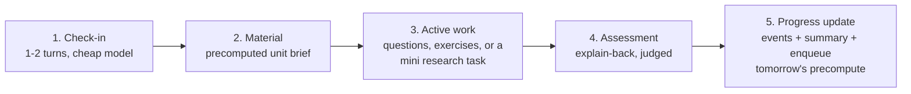
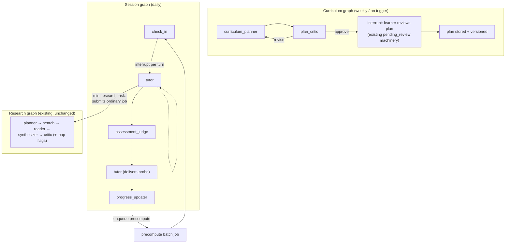

# LP-01 — The learning agent

> ## ⚠ STATUS: PROPOSED
>
> **Nothing in this document is approved, decided, or implemented.**
> No code, schema, flag, or deployment change described here exists on
> `main`. This is a planning document in the tradition of
> [`05-agentic-upgrade-plan.md`](../05-agentic-upgrade-plan.md) and
> [`docs/proposals/multi-tenancy.md`](../../docs/proposals/multi-tenancy.md):
> it argues for a design so a human can approve, amend, or reject it.
> Every cost figure is an estimate with its assumptions shown; every
> reuse claim cites the module it reuses; judgment calls are marked
> **[judgment call]**.

- **Workstream**: LP-01 (learning platform, document 01)
- **Date**: 2026-08-29
- **Decider**: kudratsingh — **pending**
- **Scope**: the agent design for the pivot from "answers research
  questions with RAG" to "understands the user and coaches them to
  their goals" — learner model, long-horizon planning, the daily
  session loop, assessment, architecture, cost, and eval.
- **Sibling documents** (owned by other workstreams; referenced, not
  written here): `00-VISION.md` (product framing and why),
  `02-CONTENT.md` (where course units / videos / curated papers come
  from and under what rights), `03-ARCHITECTURE-ROADMAP.md`
  (sequencing and delivery phases).
- **Hard dependencies named up front**:
  [MT-01](../../docs/proposals/multi-tenancy.md) (per-user identity —
  §1.3) and MT-01's Phase 0 global spend cap (its finding F4 — §6.5).
- **Builds on**: the Sprint 2 flag discipline
  ([`05-agentic-upgrade-plan.md`](../05-agentic-upgrade-plan.md),
  ADRs 0014–0020), the job/checkpoint/HITL machinery
  ([`docs/architecture.md`](../../docs/architecture.md), ADRs
  0025/0030/0032/0040), model routing and cost enforcement (ADRs
  0021/0022/0051), and the eval harness
  ([`docs/eval.md`](../../docs/eval.md), ADRs 0005–0010, 0044, 0050).

---

## 0. What pivots and what doesn't

Today the system is a **research instrument**: a query goes in, a
five-agent graph (`src/graph/workflow.py`) produces a cited briefing,
and the relationship ends when the job reaches a terminal state. The
learning platform keeps that instrument intact and builds a **coach**
around it:

- The coach knows *who* it is teaching (§1), holds a *multi-week plan*
  it negotiated with the learner (§2), meets the learner *daily* for a
  bounded session (§3), and records progress it can actually defend
  (§4).
- The research pipeline is demoted from "the product" to "one of the
  coach's teaching instruments" — a mini research task inside a
  session is a real run of the existing graph, with the learner in
  the HITL review seat as pedagogy (§3.3).

The repo's own roadmap already points this direction without naming
it: [`05-agentic-upgrade-plan.md`](../05-agentic-upgrade-plan.md)
deferred a *skills registry* (item 9) to Sprint 6+ on the grounds
that skills multiply the eval surface before the loop's core quality
is proven. The loop landed and is measurable; a learning agent is the
skills-registry idea grown up — new *capabilities around* the proven
loop, each behind its own flag, each with its own eval story, rather
than variants *of* the loop. This document extends that plan; nothing
here contradicts its sequencing.

Two constraints repeated from the sibling workstreams because
everything below assumes them:

1. **Per-user anything requires MT-01.** The backend scopes data per
   principal (ADR 0036), but the web tier collapses every browser
   into one principal
   (`docs/proposals/multi-tenancy.md` §1.2). A learner model keyed to
   "the one shared principal" is a shared diary. §1.3 states exactly
   which pieces are MT-01-gated.
2. **A daily-scheduled agent multiplies spend exposure.** MT-01's F4
   (per-run cap only, no aggregate cap anywhere) gets strictly worse
   when the system initiates work on a schedule instead of waiting
   for a human to click. The global spend cap is a prerequisite, not
   a follow-up (§6.5).

---

## 1. The learner model

### 1.1 What the agent knows about a user

The learner model is a small, structured, per-user record — not a
transcript dump. Schema sketch, in the house TypedDict style of
`src/graph/state.py`:

```python
class SkillEntry(TypedDict):
    """One skill the system has an opinion about."""
    skill: str            # controlled vocabulary, e.g. "backprop"
    level: str            # "none" | "aware" | "working" | "solid"
    source: str           # "declared" | "inferred" | "assessed"
    evidence_ref: str     # session/assessment/artifact id, "" if declared
    confidence: float     # 0.0-1.0; 1.0 reserved for "declared"
    updated_at: str       # ISO timestamp

class LearnerGoal(TypedDict):
    goal_id: str
    statement: str        # "read modern RLHF papers critically"
    target_date: str      # ISO date; "" = open-ended
    status: str           # "active" | "paused" | "reached" | "abandoned"
    priority: int

class LearnerProfile(TypedDict):
    learner_id: str       # stable per-user id (MT-01's owner id, §1.3)
    academic_level: str   # "self-taught" | "undergrad" | "grad" | "postdoc" | "industry"
    time_budget_min_per_day: int      # declared, e.g. 20
    preferred_days: list[str]         # declared
    goals: list[LearnerGoal]
    skills: list[SkillEntry]
    style_signals: dict[str, float]   # inferred only — see §1.2
    profile_note: str     # free text the learner wrote about themselves
```

`style_signals` is deliberately a low-commitment bag of floats
(e.g. `prefers_worked_examples`, `abandons_long_readings`,
`asks_why_questions`) rather than a "learning styles" taxonomy — the
taxonomy literature is weak, and the agent should adapt to observed
behavior, not to a label. **[judgment call]**

### 1.2 Honest updating: declared vs inferred vs assessed

The three `source` values are the integrity core of the model, and
they follow the same honesty discipline the repo already enforces
elsewhere (the reader's audible abstract-only fallback, ADR 0052; the
job machine's "never invent a stage" rule in
[`docs/architecture.md`](../../docs/architecture.md)):

- **`declared`** — the learner said so (onboarding or any session).
  Never overwritten by inference. If assessment contradicts a
  declaration ("declared solid, explained it with major gaps"), the
  agent records a *second* entry with `source="assessed"` and
  surfaces the tension in conversation; it does not silently
  downgrade the learner's self-image in a database.
- **`inferred`** — derived from behavior (skipped exercises, question
  patterns). Capped at `confidence <= 0.6` and always displayed to
  the learner as a guess they can correct. Inference writes are
  batched into the end-of-session progress update (§3.5), never made
  mid-conversation, so every inference has a reviewable session
  attached as `evidence_ref`.
- **`assessed`** — backed by a concrete assessment event (§4) whose
  id is in `evidence_ref`. The only source that can justify the
  coach *changing the plan* on skill grounds.

Rule stated so it can be tested: **no prompt ever presents an
inferred skill to the LLM as fact.** The profile serializer renders
`inferred` entries under an explicit "unconfirmed impressions"
heading. This mirrors how the evidence store refuses to fabricate
`source_text` from abstracts (`docs/agents/reader.md`, ADR 0016).

### 1.3 Where it lives, and the MT-01 gate

- **Store**: a `learner_profiles` table (plus `progress_events`,
  §4.4, and `plans`, §2) in the existing Postgres, following the
  idempotent `SCHEMA_DDL` pattern of
  `src/tools/postgres_pool.py` — the same pattern the conversation
  store uses (ADR 0032). No new infrastructure.
- **Key**: the stable per-user owner id that MT-01 delivers. This is
  where MT-01's finding **F1** bites: `key_id` today is a mutable
  display name, and `docs/security.md`'s open follow-up (derive a
  stable `owner_id` from the secret) becomes a *data-integrity*
  requirement here, not just a hygiene item — a reassigned key must
  never inherit another human's skill history.
- **Gating**: `enable_learner_profile` (§5.4) requires
  `enable_api_auth=true` and refuses to run against the anonymous
  principal. Until MT-01 lands, the flag is usable only for
  single-human deployments and dev — honestly labeled as such, the
  way the web tier's "Shared workspace" banner is honest today.

### 1.4 Privacy posture

The learner model is the first *personal* data this repo stores —
jobs and conversations are about papers; this is about a person.
Posture, stated for the ADR that would implement it:

1. **Deletion is a first-class operation** covering profile, plans,
   progress events, session transcripts, and rollup summaries.
   MT-01 §7.3's caveat carries over: the shared paper/embedding
   caches of public arXiv text are not per-user and are excluded
   from the promise, and the promise must say so.
2. **Retention**: raw session transcripts are working data — kept
   ~90 days for replanning context, then dropped in favor of the
   rollup summaries (§5.5). The summaries and progress events are
   the durable record. **[judgment call]** on the number; the
   principle (raw is transient, derived is durable) is the proposal.
3. **The profile is untrusted input.** `profile_note`, goal
   statements, and free-text answers are learner-authored text that
   flows into prompts week after week — the same cross-turn
   injection shape ADR 0033 closed for `prior_context`. The profile
   serializer wraps learner-authored fields under
   `enable_prompt_isolation`, reusing
   `src/security/prompt_isolation.py` verbatim. A prompt-injecting
   learner mostly attacks their own coach, but under the supervisor
   pattern control-flow fields must stay clean regardless (ADR 0020's
   lesson).
4. **No third-party disclosure.** Nothing in the learner model is
   sent anywhere except Anthropic's API inside prompts, which the
   deployment already does for every query.

---

## 2. Long-horizon goal planning

### 2.1 The decomposition hierarchy


Each level is a separate artifact with a separate cadence:

- **Goal → milestones**: produced once per goal by the *curriculum
  planner* (§5.2), reviewed by the human (§2.3), revised on replan
  triggers only (§2.4).
- **Milestone → weekly plan**: produced weekly, cheap (§6.2),
  because it must absorb reality — the learner's actual pace, the
  sessions that actually happened.
- **Weekly plan → daily session spec**: mostly *selection*, not
  generation — pick the unit, pull due reviews (§4.2), attach the
  precomputed material (§3.4).

### 2.2 How the planner/critic pattern extends

The existing planner (`src/agents/planner.py`) decomposes a question
into 2–4 sub-questions with a strict JSON schema, independent
per-field fallbacks, and parse defense (ADR 0041). The curriculum
planner is a **new agent in that mold, not a new mode of that
agent** — the research planner's contract (sub-questions + search
queries out) is load-bearing for four downstream consumers
(`docs/agents/planner.md`), and overloading it would couple the
learning path to every research-pipeline change. **[judgment call]**

What transfers from the pattern, module by module:

| Pattern | Research pipeline source | Curriculum analog |
|---|---|---|
| Strict JSON schema + per-field fallback | `src/agents/planner.py` | milestones list falls back to a single "explore the goal area" milestone, never fabricated detail |
| Judge with schema + routing verdict | `src/agents/critic.py` (five dimensions, `revision_needed`/`revision_target`) | *plan critic*: judges prerequisite ordering, load vs `time_budget_min_per_day`, milestone measurability, date feasibility; routes back to the curriculum planner or approves |
| Iteration cap + force-approve | critic's `max_iterations` force-approve | same cap so a stubborn plan ships visibly imperfect rather than looping |
| Parse defense to safe defaults | ADR 0041 across all agents | identical discipline; a malformed plan response degrades to "needs human review", never to a silently wrong plan |

### 2.3 Plan review IS the existing HITL machinery

This is the deepest reuse in the document. The workflow already
supports "interrupt after the planner, park the job in
`pending_review`, let a human edit the plan, resume" — compiled via
`interrupt_after=["planner"]` in `src/graph/workflow.py::_compile`,
surfaced as `POST /research/{job_id}/review` with a `plan_ready` SSE
frame, resumable across workers (ADRs 0030/0034,
[`docs/architecture.md`](../../docs/architecture.md)).

A curriculum-planning run is a job on that same machinery: the
curriculum graph (§5.3) interrupts after the plan critic approves,
the job parks in `pending_review`, the *learner* reviews and edits
their own milestones, and the resume path is byte-identical plumbing.
No new interrupt mechanism, no new review endpoint shape — a new
graph compiled with the same `_compile` knobs. The web tier's
existing plan-review surface (the `plan_ready` handling in
`lib/job/machine.ts`) is the seed of the plan-review UI.

Review here is not a safety formality — it is the moment the plan
becomes *the learner's* plan, which the replanning design below
depends on.

### 2.4 Replanning: the interesting case

Learners fall behind. The failure mode to design against is the
**shame loop**: the plan says week 3, the learner is at week 1.5,
every session opens with a deficit, the learner stops opening
sessions. Design rules:

1. **Rebase, don't backfill.** A replan is a fresh weekly plan from
   the *current* verified state (progress events, §4), not a
   compressed catch-up of everything missed. Missed sessions are not
   debt; they are history. The replanner's prompt receives "what the
   learner can do today" and "the goal", never a list of missed
   items to redistribute.
2. **Triggers are mechanical, tone is not.** Replan triggers are
   deterministic checks run at weekly-plan time (no LLM): sessions
   completed < 50% of scheduled for 2 consecutive weeks; assessment
   gaps on a milestone's exit skills; or the symmetric happy case —
   assessments clearing early, sessions consistently under time
   budget → accelerate. Firing a trigger enqueues a replanning job;
   it never generates copy like "you've fallen behind".
3. **Feasibility honesty over cheerleading.** When the mechanical
   projection says the target date is no longer reachable at the
   observed pace, the agent says so and offers the two honest
   levers — move the date or cut scope — as a plan-review interrupt
   (§2.3) where the learner chooses. It does not quietly thin the
   curriculum to preserve the date, and it does not keep an
   impossible date to preserve morale. This is the critic's
   "degradation must be visible" principle (ADR 0041) applied to a
   human relationship.
4. **Acceleration is a trigger too, with a damper.** One strong week
   does not restructure a curriculum; two consecutive
   trigger-positive weeks do. Replans have a cost (§6.2) and a
   cognitive cost — a plan that visibly thrashes teaches the learner
   the plan is meaningless.

What the checkpoint machinery contributes beyond review: a
curriculum-planning job that dies mid-replan resumes from its
checkpoint like any job (ADR 0013/0040), and the plan history — every
approved plan version with its review edits — is an auditable record
of *what was agreed*, which is what makes "rebase, don't backfill"
enforceable rather than aspirational.

---

## 3. The daily interaction loop

### 3.1 Shape of a session

A session is a **conversational job**: 15–30 minutes, bounded turn
count, one artifact of progress at the end. End-to-end:



1. **Check-in** (~1–2 min). "How did yesterday's reading sit? 20
   minutes today as usual?" Reads the profile + last session summary
   + today's session spec. Adjusts today's scope down honestly if the
   learner has 10 minutes, and records the signal. Cheap model
   (`tutor_model` → Haiku tier, §6.1).
2. **The day's material** (~5–10 min). The unit brief was
   **precomputed** (§3.4): a framing of today's concept, the assigned
   external material (course unit / video segment / paper section —
   sourcing is `02-CONTENT.md`'s problem, the session only links and
   frames it), and why it matters for the learner's goal.
3. **Active work** (~10–15 min). One of: Socratic Q&A over the
   material; a generated exercise (precomputed, with a worked
   solution held back); or — the flagship — a **mini research task**
   (§3.3).
4. **Assessment** (~3–5 min). Explain-back on today's concept or a
   due spaced-repetition item (§4).
5. **Progress update** (~seconds, no learner interaction). Progress
   events written, session summary generated, inference batch
   applied (§1.2), tomorrow's precompute job enqueued.

### 3.2 Session runtime: a second graph, not a bigger one

The research graph is job-shaped: state in, nodes run, terminal
state out. A tutoring session is **turn-shaped**: it blocks on a
human between most steps. Wedging turns into the research graph
would fight its whole runner design (`src/api/runner.py` drives a
job to termination; HITL is the one sanctioned pause).

**[judgment call]** Proposal: a second compiled LangGraph graph,
`build_session_workflow`, with its own `SessionState` TypedDict +
`initial_session_state` constructor (mirroring the ADR 0052 "state
and constructor edited together" rule), using LangGraph interrupts
for *every* learner turn — the same checkpointer, the same
`pending_review`-style parking generalized to `awaiting_learner`.
This buys: crash-safe mid-session resume for free (a session
surviving a page reload is table stakes for a daily habit),
per-session cost accounting through the existing accumulator
(ADR 0051 — `call_llm` is already the choke point), and the same
tracing/metrics story. The alternative — a thin chat loop outside
LangGraph — is less code but forfeits checkpointing, cancellation,
and cost enforcement the repo already paid for. Open question Q7.

### 3.3 The research pipeline as a learning instrument

Once or twice a week, the active-work block is a real research run:
*"You've done three sessions on RLHF reward models. Formulate a
question about reward hacking and run it."*

- The session submits an ordinary job through the existing surface
  (`POST /research` semantics via the runner), in a conversation
  attached to the learning thread so `prior_context` (ADR 0032,
  `src/api/retriever.py::retrieve_prior_context`) carries what the
  learner has already covered into the research planner's prompt —
  the existing field, no schema change.
- **HITL plan review becomes the exercise.** `enable_hitl` is
  already per-job; the learner reviewing the planner's sub-questions
  — "is this a good decomposition of *your* question?" — is exactly
  the skill a research coach should train, running on machinery that
  exists (`POST /research/{id}/review`).
- The run executes in a **learning-mode config**: `max_papers`
  lowered (~5), `reader_model` on Haiku (ADR 0021's recommended
  override anyway), `max_cost_usd` at a learning-tier ceiling
  (~$0.75) — all existing knobs in `src/config.py`, set per
  deployment or (open question Q6) per submission.
- The report the learner gets back is an **artifact of progress**
  (§4.3), exportable through the existing export path (ADR 0031).
- The session does not block on the run: the job streams via SSE as
  today; a short run lands in-session, a long one opens tomorrow's
  check-in. **[judgment call]** on the UX; the mechanism is existing.

### 3.4 Session-time vs precomputed — the cost line

The cost discipline (numbers in §6): **anything that doesn't need
the learner's live input runs before the session, on cheap models,
batchable.**

| Work | When | Why |
|---|---|---|
| Unit brief (material framing) | Precomputed, nightly batch | Needs plan + profile, not the live learner; tolerant of hours of latency → batchable at discount |
| Exercise + held-back solution | Precomputed | Same; also lets a solution-quality check run offline |
| Spaced-repetition due list | Precomputed, **no LLM** — deterministic scheduler (§4.2) | It's arithmetic |
| Check-in, tutoring turns | Session time | Live conversation |
| Assessment judgment | Session time | Learner is waiting for the response |
| Session summary + inference batch | Session close, async | Learner isn't waiting |
| Weekly replan check | Weekly, **no LLM** for triggers; LLM only when a trigger fires | Mechanical triggers, §2.4 |

Precompute runs as ordinary background jobs through the existing job
model (bounded by `api_max_concurrent_jobs`, leased and redriven
like any job under Redis — ADRs 0038/0048). What the repo does
**not** have is a scheduler to *enqueue* nightly work — the closest
thing is the redriver's interval sweep. That gap is open question
Q3, and it is honest to say the daily-loop design has a missing
infrastructural leg there.

---

## 4. Progress and assessment

### 4.1 Principles

The system measures understanding **without pretending**. Three
allowed currencies of progress, one banned one:

- Allowed: **assessment events** (a judged explain-back with its
  transcript), **repetition history** (item-level recall record),
  **artifacts** ("you produced a briefing on reward hacking on
  Sep 12" — a fact, with the artifact attached).
- Banned: **mastery percentages.** "You are 87% through Transformers"
  is a claim about a latent variable no LLM judge can measure. The
  UI may show *plan* progress ("14 of 21 sessions in this milestone
  complete") because that is arithmetic about sessions, and must
  label it as schedule progress, not knowledge.

### 4.2 Spaced repetition where it fits

A deterministic SM-2-family scheduler over discrete review items
(definitions, theorem statements, "what does KL penalty do in
RLHF") — pure Python, zero LLM cost per scheduling decision, the
review *prompt* text precomputed once at item creation. Where it
does **not** fit, don't force it: deep conceptual understanding is
assessed by explain-back, not flashcards; the item extractor (an LLM
pass in precompute) is told to emit only genuinely atomic items and
that fewer is better. Behind `enable_spaced_repetition`,
independent of every other flag (§5.4).

### 4.3 Explain-back via the critic pattern

The assessment judge is the critic's shape
(`src/agents/critic.py`) pointed at a transcript instead of a
report: strict JSON schema
(`{gaps: [...], strengths: [...], follow_up_probe: str, evidence:
[...]}`), parse defense to a safe default, and the same honesty
property the verifier has (`src/agents/verifier.py`): every gap it
asserts must quote the learner's own words as evidence, exactly as
the verifier must trace claims to `source_text`. A judge response
that asserts a gap without evidence is treated as malformed
(ADR 0041 discipline).

Two deliberate differences from the critic **[judgment call]**:
the judge's output is **advice to the tutor, not a score shown raw
to the learner** — the tutor turns "gap: confuses reward model with
value function" into a follow-up question; and there is no
`revision_needed` loop — one probe, then record and move on. A
15-minute session cannot afford judge iterations, and an
interrogation is not a coaching move.

### 4.4 The progress record

Append-only `progress_events` table (same DDL pattern as §1.3):

```python
class ProgressEvent(TypedDict):
    event_id: str
    learner_id: str
    ts: str
    kind: str        # "session_completed" | "assessment" | "review_item"
                     # | "artifact_produced" | "plan_approved" | "replan"
    payload: dict    # kind-specific: gaps found, item grade,
                     # artifact job_id, plan version, ...
    evidence_ref: str # transcript / artifact / plan id
```

Everything the UI or the replanner says about progress is a *view*
over these events — derived, recomputable, and traceable to
evidence. This is the state-machine honesty rule from the web tier
("the machine never invents a stage") applied to learning: no
displayed claim without an event behind it.

---

## 5. Architecture of the agent itself

### 5.1 Reused, with the module that proves it

| Capability | Reused module(s) | Change needed |
|---|---|---|
| Research runs as a teaching instrument | entire graph: `src/agents/{planner,search,reader,synthesizer,critic}.py`, `src/graph/workflow.py` | none — invoked as-is with learning-mode settings |
| Supervisor loop / verifier / refiner | `src/agents/{supervisor,verifier,query_refiner}.py` | none — orthogonal flags stay orthogonal |
| Job model, SSE, leases, redriver | `src/api/{routes,runner,streaming,redriver}.py` | new job *types* (session, curriculum, precompute), same lifecycle |
| Plan review interrupt + resume | `_compile`'s `interrupt_after`, `POST /research/{id}/review`, ADR 0030/0034 | generalized to curriculum + session graphs (§2.3, §3.2) |
| Learning thread memory injection | `prior_context` + `src/api/retriever.py::retrieve_prior_context` (ADR 0032) | none for research runs; extended retrieval corpus in §5.5 |
| Cost enforcement + accounting | `src/llm.py::call_llm` choke point, `src/observability/costs.py` (ADR 0051) | new caps read the same accumulator |
| Model routing + prompt caching | `<agent>_model` fields, `enable_prompt_caching` (ADRs 0021/0022) | new `tutor_model` etc. knobs, same plumbing |
| Prompt-injection isolation | `src/security/prompt_isolation.py` (ADR 0020/0033) | applied to profile + transcript text (§1.4) |
| Storage substrate | `src/tools/postgres_pool.py` DDL pattern, embedding + paper caches | three new tables (§1.3, §4.4); caches shared as-is |
| Eval harness patterns | `src/eval/{runner,metrics,regression_diff}.py` | new metric modules + benchmark, same runner discipline (§7) |

### 5.2 New components, with what each costs

| Component | What it is | Build cost (est.) | Run cost (see §6) |
|---|---|---|---|
| Curriculum planner | new agent, planner-pattern (§2.2) | ~3–4 days incl. prompts + parse defense | ~$0.05–0.10/plan, Sonnet |
| Plan critic | new judge, critic-pattern (§2.2) | ~2 days | ~$0.02–0.05/review |
| Session graph + tutor node | new graph + `SessionState` (§3.2) — **the big build** | ~2–3 weeks incl. runner generalization (`awaiting_learner`) | dominant per-session cost, §6.1 |
| Assessment judge | new judge, critic-pattern (§4.3) | ~2 days | ~$0.02/session |
| Progress store + event views | tables + deterministic code | ~3–4 days | ~$0 |
| Spaced-repetition scheduler | deterministic + item-extractor LLM pass | ~3 days | extractor folded into precompute |
| Precompute pipeline | batch jobs producing unit briefs + exercises | ~1 week; **blocked on Q3 (scheduler)** | ~$0.02–0.05/session |
| Learner-profile store + serializer | tables + isolation-aware prompt rendering | ~4–5 days | ~$0 |
| Learning eval (§7) | judges + simulator + benchmark | ~1–2 weeks | campaign-priced, §7 |

Rough total: **6–9 engineering weeks** before UI, which is the
sibling roadmap's problem to schedule.

### 5.3 The graphs



Three graphs, one runtime: all compiled by the same build/compile
path, checkpointed by the same savers, driven by the same runner,
billed through the same accumulator. The research graph is invoked
*by* the session, never entangled *with* it.

### 5.4 The flag ladder

Matching the Sprint 2 discipline exactly — every capability an
independent, default-off boolean in `src/config.py`, so each is
A/B-able against a baseline and a broken one is a one-line rollback
(the property ADRs 0014–0020 bought and
`05-agentic-upgrade-plan.md` codified):

| Flag | Gates | Depends on (hard) |
|---|---|---|
| `enable_learner_profile` | profile store + prompt injection of profile | `enable_api_auth`; MT-01 for multi-human |
| `enable_curriculum_planner` | curriculum graph + plan store | `enable_learner_profile`, `enable_checkpointing` |
| `enable_plan_critic` | plan-critic node in curriculum graph | `enable_curriculum_planner` (else planner output goes straight to review — A/B-able lift, like `enable_verifier`) |
| `enable_session_loop` | session graph + `awaiting_learner` | `enable_learner_profile`, `enable_checkpointing` |
| `enable_assessment_judge` | judge node in session graph | `enable_session_loop` (off = tutor self-assesses informally; the A/B) |
| `enable_spaced_repetition` | scheduler + item extraction | `enable_session_loop` |
| `enable_session_precompute` | nightly batch | `enable_session_loop`; Q3 scheduler (off = material generated at session open, slower + pricier — itself the A/B) |
| `enable_motivation_replanning` | §2.4 triggers + replan jobs | `enable_curriculum_planner` (off = plans only replan on explicit learner request) |

Model knobs (`tutor_model`, `curriculum_planner_model`,
`plan_critic_model`, `assessment_model`, `precompute_model`) follow
the ADR 0021 pattern: empty string falls back to `anthropic_model`.
Cost knobs: `learning_session_max_cost_usd` (per session, enforced
at the `call_llm` choke point like `max_cost_usd`) and
`learning_monthly_cost_usd_per_learner` (aggregate — which requires
the F4-style windowed accounting MT-01 Phase 0 builds; named as a
shared dependency, not duplicated here).

### 5.5 Memory across weeks — the hard problem

Named as such. A learner relationship spans months; no context
window holds it, and "stuff the history in" fails on cost before it
fails on tokens. Three tiers, with the specific store/summarize/
retrieve split:

**Tier 1 — structured state, always in context (~1.5–2.5K tokens).**
The serialized profile (§1.1), the active milestone + this week's
plan, today's session spec, due review items, and the *last session
summary*. Bounded by construction: goals and skills are capped
lists, the plan excerpt is one milestone deep. This is the only tier
the tutor is guaranteed to see every turn, so anything that must
never be forgotten (goal, time budget, declared constraints) lives
here as structured fields — never only in prose summaries.

**Tier 2 — hierarchical rolling summaries (bounded growth).**
Session close writes a ~150-token summary (what was covered, how it
went, one line of tone). Weekly rollup compresses the week's
summaries into a ~250-token weekly note; monthly rollup compresses
weeks into a ~400-token month note. Active context carries: current
week's session summaries + current month's weekly notes + all month
notes (a year ≈ 12 × 400 ≈ 5K tokens — trimmed to the last ~3 plus
the first, because "where you started" has coaching value).
Summaries are **lossy and marked as such**: a fact that matters gets
promoted into Tier 1 structured state or a §4.4 progress event;
summaries are never cited as evidence for a skill claim (§1.2's
provenance rule).

**Tier 3 — retrieval over the full record (on demand).** Session
transcripts (while retained, §1.4), produced research reports, and
assessment transcripts are chunked and embedded into the existing
retrieval machinery — `src/api/retriever.py` +
`src/tools/embeddings.py` + the Postgres embedding cache (ADRs
0028/0032). Pulled top-K only when the tutor or replanner needs
specifics ("we discussed this exact confusion on Aug 12"), injected
through the same `prior_context`-shaped, isolation-wrapped path.
This is an *extension of the corpus* the ADR 0032 retriever already
serves, not a new retrieval system.

What is deliberately **not** stored: model-authored psychological
profiles of the learner beyond the capped `style_signals` floats.
Rich narrative dossiers about a person are a privacy liability and
an honesty liability (they read as fact, they were inference), and
Tier 2's tone lines are the ceiling. **[judgment call]**

The failure mode to test for (§7): **summary drift** — an error in
an early summary compounding through rollups into confident false
memory. Mitigations: rollups quote-check against progress events
(the deterministic record), and any Tier-2 claim contradicted by a
Tier-1 field or a progress event loses.

---

## 6. Cost economics per learner

All prices from the repo's own table
(`src/observability/costs.py::PRICES_USD_PER_MILLION`, verified
2026-08-20): Haiku $1/$5, Sonnet $3/$15 per M input/output tokens;
prompt-cache reads at 10% of input price, writes at 125%
(ADR 0022). Estimates are pre-measurement — the eval harness's own
history says treat unmeasured numbers as hypotheses
([`docs/eval.md`](../../docs/eval.md), "no green campaign yet").

### 6.1 One session, online (learner present)

Assumptions: ~12 tutor turns; ~4K input tokens/turn of which ~3K is
a stable cached prefix (system prompt + Tier-1 context + day
material — the same fan-out cache economics the reader enjoys,
ADR 0022); ~400 output tokens/turn; Haiku for check-in and tutor
turns; Sonnet for 1–2 hard-explanation escalations and the
assessment judge.

| Item | Model | Est. |
|---|---|---|
| Check-in, 2 turns | Haiku | $0.005 |
| 12 tutor turns, cached prefix | Haiku | $0.040 (uncached: $0.072) |
| 2 escalation turns | Sonnet | $0.039 |
| Assessment judge (3K in / 500 out) | Sonnet | $0.017 |
| Summary + inference batch | Haiku | $0.004 |
| **Session online total** | | **≈ $0.07–0.17** (routing-dependent) |

### 6.2 Amortized per session

| Item | Est. |
|---|---|
| Precompute (unit brief + exercise, ~6K in / 1.5K out Sonnet ≈ $0.04; ≈ $0.02 if batched at a 50%-off batch tier — see Q9) | $0.02–0.05 |
| Weekly plan + rollups (Haiku) + occasional replan (Sonnet plan + critic ≈ $0.10, ~2×/month) | $0.01–0.03 |
| **All-in per session** | **≈ $0.10–0.25** |

### 6.3 Mini research runs

Learning-mode config (§3.3): `max_papers=5`, `reader_model=Haiku`,
fixed pipeline. Reader ~5 Haiku calls (~5K in/800 out each ≈
$0.045), planner ≈ $0.01, synthesizer Sonnet (8K in / 3K out ≈
$0.07), critic ≈ $0.025 → **≈ $0.15/run**, up to ~$0.50 with
revision rounds — versus the current default `max_cost_usd=$2.00`
research ceiling. A `learning` run submits with a ~$0.75 cap.

### 6.4 Monthly per active learner

| Engagement | Sessions/mo | Research runs | Est. monthly LLM cost |
|---|---|---|---|
| Daily-habit learner | 20 | 4 | 20×($0.10–0.25) + 4×($0.15–0.50) ≈ **$2.60–7.00** |
| Realistic (3×/week) | 12 | 2 | ≈ **$1.50–4.00** |
| Free tier (§6.5) | 8, Haiku-only, 0–1 runs | 0–1 | ≈ **$0.50–1.20** |

**Headline: roughly $3–7/month of LLM spend per daily-active
learner under model routing + caching + precompute; ~$1.50–4 at
realistic engagement.** The naive comparison that justifies the
engineering: all-Sonnet, uncached, no precompute puts tutor turns
alone at ~$0.22/session and research runs at the $2 default cap —
**~$11–15+/month, a 3–4× multiplier** — which is the difference
between a plausible $10–15 subscription with margin and one without.

Sensitivity, honestly: the estimate is most fragile to **turns per
session** (chatty learners 2× the tutor line) and **context bloat**
(Tier-1 discipline slipping from 2.5K to 8K tokens roughly doubles
session cost — §5.5 is a cost control, not just a memory design).
Per-session caps (§5.4) turn both from open-ended risks into
degraded-session modes.

### 6.5 What a free tier can afford, and the cap that gates all of it

At ~$0.50–1.20/month, a free tier of ~8 Haiku sessions with no (or
one) research run is sustainable at hundreds of users on a
hobby-scale budget — 500 free learners ≈ $250–600/month — but
**only** under the aggregate spend ceiling MT-01 Phase 0 defines
(its F4): a scheduled daily agent with per-run caps and no global
cap is an unbounded liability multiplied by user count. Restated as
this document's position: **no learning flag ships to a multi-user
deployment before the global cap does.**

---

## 7. Eval story

The learning agent needs its own eval, in the same architecture as
the research eval (custom in-repo harness, ADR 0005; crash-safe
runner, ADR 0050; regression differ, ADR 0044) — and it inherits the
same honesty constraint: the research eval has never had a funded
green campaign, so every threshold below starts as a prior, not a
measurement.

1. **Plan-coherence judge (offline, cheap, first to build).** A
   metric module beside `src/eval/metrics.py` scoring generated
   curricula on prerequisite ordering, load vs time budget,
   milestone measurability, and date feasibility — batched
   single-call judge (the ADR 0006 pattern), same parse defense,
   scored over a fixed benchmark of ~15 learner profiles × goals
   (the analog of `benchmark_queries.py`, with the same invariant
   tests). Runs on every curriculum-planner prompt change.
2. **Learner-simulation benchmark (the regression harness).** A
   scripted simulated learner — fixed personas (novice undergrad,
   career-switcher, time-poor industry engineer), fixed behavior
   scripts including *falls behind in week 2* and *accelerates* —
   drives N simulated weeks against the session + curriculum graphs
   with a cheap model playing the learner. Judged outputs: does the
   replan rebase rather than backfill (string-level checks on the
   replan prompt inputs + judge on the output); does check-in copy
   stay shame-free (rubric judge); do progress events stay
   evidence-linked (deterministic check). Runs paid-campaign style
   through the eval runner's discipline (`--resume`,
   `--max-budget-usd`, per-metric judge isolation).
3. **Assessment-judge calibration.** Hand-labeled explain-back
   transcripts (~20–30, the same shape as `docs/eval.md`'s pending
   calibration set) scoring the judge's gap-detection against human
   judgment. Until it exists, the assessment judge's outputs are
   treated as tutor guidance only — which §4.3 already makes them.
4. **Goal-attainment proxies (online, post-launch, labeled as
   proxies).** Session completion rate, streak survival across a
   replan (the direct measure of §2.4 working), assessment-gap
   closure over time, artifact production rate. Explicitly *not*
   claimed as learning outcomes; they are engagement and process
   metrics, and the docs that surface them must say so.
5. **Regression gating.** New metrics enter
   `regression_diff.METRIC_FIELDS` with per-metric thresholds under
   the ADR 0044 class system, and the simulation benchmark gets the
   same three-repeat rule `05-agentic-upgrade-plan.md` imposed
   before believing any supervisor result — LLM-judged deltas on
   small benchmarks are noise until repeated.

What is deliberately not proposed: an "does the human actually learn
more" study. That is real research with human subjects, out of scope
for an eval harness, and pretending a judge can measure it would
violate §4.1.

---

## 8. Open technical questions for the owner

Q1–Q3 are blocking for any build; the rest shape it.

1. **MT-01 sequencing.** The learner model is per-human (§1.3). Does
   LP wait for MT-01's cutover, run behind flags in single-user mode
   until then, or force MT-01's approval? (MT-01's own Q8 asked the
   symmetric question of the frontend revamp.) **Blocking** for any
   multi-user deployment.
2. **The aggregate spend ceiling.** MT-01 Phase 0 / F4, made worse
   by scheduled work (§6.5). What number, what window, and what does
   a learner see at the cap — session refused, or degraded
   Haiku-only session? **Blocking.**
3. **The scheduler.** Nothing in the repo initiates work on a clock
   except the redriver's sweep. Nightly precompute and weekly
   replanning need one: in-process interval task (cheapest, per-
   worker duplication questions), external cron / GitHub Actions
   hitting an API endpoint, or a real queue with delayed jobs.
   **Blocking** for §3.4; the fallback (generate at session open) is
   the flag-off mode of `enable_session_precompute`, not a plan.
4. **Re-engagement channel.** A daily coach that can only speak when
   the learner opens a page cannot nudge a lapsing learner. Email /
   push infrastructure is a product decision with real abuse and
   privacy surface — in scope for LP at all, or does `00-VISION.md`
   declare pull-only?
5. **Session runtime shape.** Second LangGraph graph with
   per-turn interrupts (§3.2, recommended) vs a lighter chat loop
   outside the graph machinery. The recommendation trades ~1 week of
   runner generalization (`awaiting_learner`) for checkpointed
   resume + enforced per-session cost caps. Confirm or overrule.
6. **Learning-mode research config.** Per-deployment settings (two
   deployments) vs per-request overrides on `POST /research`
   (`max_papers`, cap, model routing per job — a new API surface
   with its own abuse angles). §3.3 assumes per-deployment initially.
7. **Retention numbers.** §1.4 proposes raw transcripts ~90 days,
   summaries + events durable, deletion on request excluding shared
   public-paper caches (MT-01 §7.3's caveat). Confirm the promise
   before the first real learner exists, not after.
8. **Free-tier definition.** §6.5's 8 Haiku sessions / 0–1 research
   runs is an economic sketch. The actual number is a product +
   budget decision that gates the F4 ceiling arithmetic.
9. **Batch API adoption.** The precompute estimate's low end assumes
   a ~50%-discount batch tier for overnight generation. That is a
   new integration (the repo calls the Messages API synchronously
   via `src/llm.py` only) — worth it at what learner count?
10. **Content licensing dependency.** Sessions assign external
    material (§3.1); `02-CONTENT.md` owns sourcing, but LP-01's
    session spec format needs to know: links-only (safe, thin) or
    ingested excerpts (rich, rights-encumbered)? The session design
    above assumes links-plus-framing until told otherwise.

---

## 9. Evidence index

Primary sources for the claims above: the two graph shapes and HITL
(`src/graph/workflow.py`, `docs/architecture.md`, ADRs 0014/0030/
0034/0040); state discipline (`src/graph/state.py`, ADR 0052); the
agent pattern library (`src/agents/*.py`, `docs/agents/*.md`, ADRs
0015–0020, 0041); conversations + retrieval (`src/api/retriever.py`,
ADR 0032); cost machinery (`src/llm.py`, `src/observability/costs.py`,
ADRs 0021/0022/0051); storage patterns (`src/tools/postgres_pool.py`,
ADRs 0027/0028); multi-tenancy constraints
(`docs/proposals/multi-tenancy.md`, findings F1/F4, §7.3); eval
harness and its unfunded status (`docs/eval.md`, `src/eval/`, ADRs
0005/0006/0044/0050); the deferred skills registry this extends
(`planning/05-agentic-upgrade-plan.md` item 9,
`planning/03-roadmap.md`).
