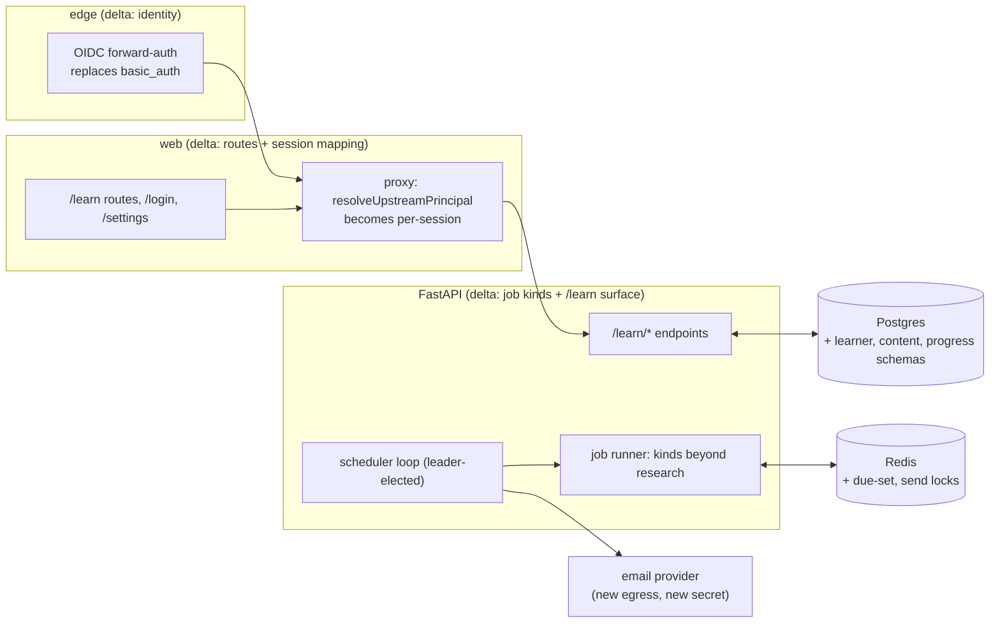

# 03 — Learning platform: architecture delta and phased roadmap

> ## ⚠ STATUS: PROPOSED
>
> **Nothing in this document is approved, decided, or implemented.**
> No code, schema, config, infra, or deployment change described here
> exists on `main`. It follows the convention of
> [`docs/proposals/multi-tenancy.md`](../../docs/proposals/multi-tenancy.md)
> (MT-01): a proposal a human gates, not an ADR. ADRs are written when
> something is actually decided, and they record what was decided
> rather than what this document recommends.
>
> Every phase below costs money — some of it **recurring**, which this
> repository has never had before. Read [§6 the roadmap's
> gates](#6-phased-roadmap) and [§8 the owner-decision
> list](#8-owner-decision-list) before agreeing to anything.

- **Workstream**: LP (learning platform), document 03 of the series
- **Date**: 2026-08-29
- **Decider**: kudratsingh — **pending**; nothing here is decided
- **Siblings**: documents 00 (vision and product definition), 01
  (product shape and per-learner economics), and 02 (the learning
  agent's design) in this same directory are owned by their own
  authors. This document cites them by number and does not restate
  them; where a number here depends on one of theirs (unit economics
  especially), the sibling is the authority.
- **Scope**: the platform architecture **delta** — what the existing
  system already provides, what must be built, in what order, behind
  what gates. Backend changes are **in scope to plan**: the frontend
  revamp's frozen-backend rule ended when Gate 4 closed
  ([`docs/revamp/STATUS.md`](../../docs/revamp/STATUS.md)). Two revamp
  constraints carry forward undiminished and §5.4 and §7 say exactly
  where they bite:
  1. **The credential boundary** — the same-origin proxy is the sole
     place an upstream credential exists (ADR
     [0055](../../docs/decisions/0055-frontend-architecture-confirmation.md)
     constraint 1), and every *new* secret this platform introduces
     (OIDC client secret, email-provider key) stays server-side.
  2. **Honesty** — no simulated identity, no invented progress, no
     promise the system cannot keep (D-009's rule, extended in §7.2 to
     streaks, notifications, and grading labels).

---

## 1. What this document is for

The research agent is becoming the engine of an AI/ML learning
platform: real learners, learning paths grounded in the literature the
agent can already read, a daily interaction loop, and progress that
persists. Documents 00–02 own *what* the product is and *why* it can
pay for itself. This document owns *how the existing system gets
there*: the asset inventory (§2), the component-by-component delta
(§3–§4), the cost and scaling posture (§5), a revamp-style phased
roadmap with gates and kill checkpoints (§6), a seeded risk register
(§7-adjacent, [§7](#7-risk-register-seed)), and the consolidated list
of decisions only the owner can make (§8).

The honest headline, stated up front rather than discovered at the
end: **this campaign is roughly 2.5–3× the frontend revamp** (33 work
orders, 4 gates, ~28 PRs of implementation in two days of fleet time)
— on the order of **70–85 work orders across five phases and ~11
gates**, it reaches into the backend the revamp deliberately froze, it
carries MT-01's six gates inside its first phase, and it is the first
workstream whose approval creates **recurring bills** (identity,
email, likely a server resize) and the first whose content pipeline
makes **paid model calls outside the nightly eval**. §6.6 does the
arithmetic.

---

## 2. Asset inventory — what the platform gets for free

The platform is not greenfield. The following exists on `main`, is
tested, and transfers directly. Citations are to code and ADRs so a
reviewer can check each claim.

### 2.1 The job model — an async backbone that generalizes

- `POST /research` → `202` + `job_id`; lifecycle
  `pending → running → (pending_review →) succeeded / failed /
  cancelled` (`src/api/routes.py`, `src/api/jobs.py`, ADR
  [0025](../../docs/decisions/0025-fastapi-async-job-model.md)).
- The runner drives the compiled graph via `astream` on a
  lifespan-owned bounded executor with per-job cancel tokens and a
  drain timeout (`src/api/runner.py`, ADRs
  [0040](../../docs/decisions/0040-async-checkpointer-and-runner.md) /
  [0047](../../docs/decisions/0047-bounded-executor-and-cooperative-cancel.md)).
- **Worker leases + redriver**: `joblease:{job_id}` with TTL refresh,
  orphan reclamation on a jittered timer, cluster-wide `redrive:lock`,
  and compare-and-set terminal writes (`src/api/redriver.py`,
  `src/api/redis_store.py`, ADRs 0038/0048/0053). This is precisely
  the machinery a *scheduled* daily loop needs and does not have to
  reinvent (§4.5).

### 2.2 SSE and HITL — live surfaces and human checkpoints

- `GET /research/{job_id}/stream` with heartbeats, idempotent
  terminal-frame replay, `plan_ready` replay for parked jobs, and
  cross-worker fan-out via Redis pub/sub (`src/api/streaming.py`,
  ADRs 0026/0035/0053).
- HITL: the workflow interrupts after the planner, parks in
  `pending_review`, resumes via `POST /research/{job_id}/review`
  with cross-worker resume (ADRs 0030/0034). **The learning agent's
  "review and adjust my plan for this week" interaction is this
  exact mechanism** with different nouns — interrupt, park, replay
  on reconnect, approve-or-edit — already reload-safe and
  multi-worker-safe.

### 2.3 Per-principal scoping — multi-tenancy's enforcement half

Already built and tested (ADR
[0036](../../docs/decisions/0036-per-principal-store-scoping.md),
hardened by 0043): owner columns on jobs and conversations, rows
stamped from the authenticated caller, `_check_ownership()` returning
**404-not-403** on mismatch (`src/api/routes.py:59-84`), list filters
pushed into SQL, cross-principal piggybacking blocked at submit, and a
per-principal Redis rate limiter (`src/api/auth.py`, ADR 0037). MT-01
§1.1 documents this at line-level. What is missing is the *identity*
half — the web tier collapses every browser into one principal
(MT-01 §1.2) — which is why MT-01 is the platform's prerequisite, not
an option (§4.1).

### 2.4 The research pipeline as a callable capability

`build_workflow` (`src/graph/workflow.py`) compiles either workflow
shape over `ResearchState`, with Postgres checkpointing for
multi-worker resume, per-agent tracing, and — critically for a
content pipeline — **cost enforcement at the `call_llm` choke point**
(`src/llm.py`, ADR
[0051](../../docs/decisions/0051-llm-cost-enforcement-and-visibility.md)):
cancel-token check and accumulated-spend check before *every* call,
per-agent model routing (ADR 0021), prompt caching (ADR 0022). A
lesson-generation job that invokes this pipeline inherits the dollar
ceiling, the routing, and the caching without new code (§4.2).

### 2.5 The Evidence Workbench frontend — a shell built to be extended

- One token chain with a parity test and an ESLint literal-colour ban;
  per-route gzip budgets under a ratchet rule (ADR
  [0056](../../docs/decisions/0056-design-tokens.md),
  `web/budgets.json`). New routes get new budget rows; nothing about
  the mechanism changes.
- Layered components (`foundations → primitives → patterns →
  features`), a typed client generated from
  `web/contract/openapi.json` with CI drift checks, and TanStack
  query keys already shaped `[resource, principal, …]` so caches
  partition the day identity arrives without a call-site change
  (`web/lib/queries/`, [`docs/architecture.md`](../../docs/architecture.md)
  §the web tier).
- The job machine (`web/lib/job/machine.ts`) — a pure reducer with a
  **total** transition table — and its `useJobStream` adapter. Any
  new job kind streamed to the browser reuses this discipline.
- The report surface (`ReportReader`, the Literata report family) is,
  with small changes, a *lesson* reader: the "briefing is a document"
  design was built for long-form reading.

### 2.6 MT-01's built seams — identity can land without rearchitecture

- `resolveUpstreamPrincipal` extracted to
  `web/lib/server/principal.ts` — "a no-op refactor today and the
  only edit site later"; the proxy route is untouched when a session
  arrives.
- Reserved names with **no files**: `web/app/login/`,
  `web/app/settings/`, `web/app/api/auth/[...path]/route.ts` (ADR
  0055, "Reserved names"). The App Router's more-specific segment
  takes precedence when created, so the login surface lands without
  editing the credential boundary.
- `IdentitySlot` returning `null` in the header; the truthful
  shared-workspace copy it will replace.

### 2.7 The quality machinery every new work order inherits

- **8-job per-PR CI** (`.github/workflows/ci.yml`, described in
  [`docs/testing.md`](../../docs/testing.md)): lint, mypy-strict,
  the full Python suite (1,400+ tests, `-m "not e2e"`), docker-build,
  web-image smoke, web (typecheck/lint/contract-drift/coverage
  thresholds/audit gate/route budgets), web-storybook, web-e2e
  (seeded Compose stack + Playwright + axe, paid-path structurally
  interdicted three ways).
- **Nightly**: full browser matrix (`ci.yml` cron), Lighthouse CI
  (`nightly.yml`), and the LLM-judged eval with regression diffing
  (`eval-nightly.yml`, ADRs 0010/0050) — the *only* workflow that
  spends Anthropic credits today, a boundary §6 keeps explicit when
  the content pipeline changes it.
- **The eval harness itself** (`src/eval/`): crash-safe campaign
  runner, `--resume`, `--max-budget-usd`, per-metric judge isolation.
  §4.2 reuses it as the content-quality gate.
- Observability: structured JSON logs with `run_id`, per-run cost
  accounting, OTel traces and nine metrics at existing choke points
  (ADRs 0012/0049/0051).

### 2.8 What is *not* an asset (known debts that intersect)

From [`planning/01-enterprise-gaps.md`](../01-enterprise-gaps.md)'s
still-open list and [`docs/testing.md`](../../docs/testing.md):
**no webhooks or any outbound notification channel** (named in
01-enterprise-gaps §6 and never built — the daily loop needs one,
§4.5); **no audit log** and **no RBAC/admin role** (deferred three
times; MT-01 Q5); **no secrets-manager integration** (every new
secret lands in env files); **no DLQ** (failed scheduled sends need
one, §4.5); **the Python e2e cassette tier is planned, not built**,
so cross-node integration changes — which §4.2's runner refactor is —
carry extra review risk; and **no jobs list endpoint**
(`list_by_principal` deferred by ADR 0036 — required for any "my
runs/sessions" view). [`planning/04-architecture-refactors.md`](../04-architecture-refactors.md)
is historical, but its `user_id`-on-state idea returns here as the
owner-id question (F1).

---

## 3. The delta at a glance

Storage rule of thumb, kept from the
[storage matrix](../../docs/architecture.md#storage-matrix): durable,
relational, cross-worker state → **Postgres** (idempotent
`SCHEMA_DDL` pattern, no migration framework — ADR 0039's precedent
stands); ephemeral, TTL-bounded, coordination state → **Redis**. No
new datastore category is proposed anywhere in this document; a graph
database, a queue broker, and a vector DB were each considered and
rejected in their sections below. Adding any of them would need its
own ADR *and* its own RAM on a box that has none to spare.

---

## 4. The delta architecture, component by component

Sizes use the repo's convention
([`docs/revamp/06-WORK-ORDERS.md`](../../docs/revamp/06-WORK-ORDERS.md)
§0): S ≤ ~250 additions, M ~400–800, L ~800–1,200, counted with tests.
Where a component is several work orders, the size is given per major
unit in §6's phase tables; here it is the component's total shape.

### 4.1 Identity and auth — MT-01, executed as specified

**This is not designed here; it is scheduled here.** MT-01 is the
platform's prerequisite — real learners are impossible while every
browser collapses to one principal — and this roadmap sequences it
first-class as Phase L0's core (§6.1), preserving all six of MT-01's
gates (MT-A … MT-F) *inside* L0 rather than flattening them.

**The concrete shape recommended: MT-01 Option C1** — OIDC at the
edge (an `oauth2-proxy` sidecar or Caddy's security plugin in front
of the existing `reverse_proxy web:3000`), mapped to per-user
principals in `resolveUpstreamPrincipal`, with the **global spend cap
(F4) shipped first as MT-01 Phase 0**. The learning platform
*strengthens* MT-01 §4.2's own reasoning for C over A/B:

- A learning platform's users are, by intent, eventually **outside
  the operator's direct control** — MT-01 §4.2 names exactly this as
  what makes C stronger ("anyone outside the operator's direct
  control makes C stronger still").
- The platform's support load (password resets, lockouts) at even
  100 learners is a real recurring cost under A/B; under C it is the
  IdP's.
- The worst security bug we can write under C does not leak a
  password — and a *learning* platform additionally holds minors'-
  adjacent data risk if it ever broadens, which raises the price of
  credential custody further.

**Which MT-01 §8 answers this roadmap needs, and when** (consolidated
with everything else in §8): Q1 and Q3 are blocking before L0 starts
(Q1's answer for this platform is different from the research tool's —
see OD-1); Q2 blocks the identity spike; Q6 blocks Gate MT-C; Q4/Q5/
Q7/Q8/Q9 block their MT-01 phases as that proposal already sequences.
One MT-01 assumption is **superseded and must be re-decided**: MT-01
non-goal 1 ("public self-serve signup — not proposed") holds through
L0–L2 of this roadmap (invite/allowlist cohorts), but a learning
platform's growth eventually collides with it; OD-1 makes that an
explicit owner decision with a phase attached rather than an
inherited assumption.

**New requirements the platform adds on top of MT-01's own scope:**

- **CSRF closes at L0, not later.** MT-01 T2 / revamp residual RR-13:
  the moment a session cookie exists, the proxy's mutating routes are
  forgeable. `Origin`/`Sec-Fetch-Site` checks on mutating methods plus
  `SameSite` are an L0 gate criterion, not a follow-up.
- **The stable owner-id follow-up (`docs/security.md` §open
  follow-ups; MT-01 F1) is forced.** Learner rows must be keyed by an
  identifier derived from the IdP `sub` (never email, never a mutable
  display name); the learner-profile schema (§4.3) is *born* on the
  stable id so it never needs the two-phase rename MT-01 §7.4 warns
  about for the legacy columns.
- **Session-cookie SSE compatibility** must be proven in the identity
  spike exactly as MT-01 Phase 1 specifies: native `EventSource`
  cannot set headers, so the session must be cookie-borne through the
  whole stream.

Size: MT-01's own estimate ("small-medium + one infra decision" for
C1) plus the F4 cap ADR — in this roadmap's units, ~7 work orders,
mostly M. Constraint respected: the proxy remains the sole credential
boundary; the OIDC client secret lives in the edge container's env,
never in `web/` browser code, never in the repo.

### 4.2 The content-graph store and the content pipeline

**What it is.** Three layers, all Postgres:

1. **Concept graph**: `concepts` (id, slug, title, level) and
   `concept_edges` (prerequisite DAG, edge type). Scale honesty: an
   AI/ML curriculum is *thousands* of nodes, not millions — recursive
   CTEs over an indexed edge table answer "what can this learner
   study next" in milliseconds. A graph database is rejected: wrong
   scale, new infra, no matrix entry, needs its own ADR.
2. **Content units**: `lessons` (id, concept refs, **content_version**,
   status draft/reviewed/published, provenance run_id, license notes
   for cited papers), `courses`/`paths` (ordered compositions).
   Lesson bodies are Markdown — the same medium the report surface
   already renders — stored in Postgres (they are tens of KB, not
   media assets).
3. **Assessment items** attached to lessons (§4.4 owns their attempt
   data).

**How content gets made.** The research pipeline is the generator:
a `content_generation` job kind (§4.5's job-kind refactor) invokes
`build_workflow` with a lesson brief instead of a user query, writes a
draft lesson row, and — this is the load-bearing design choice —
**content is generated once per lesson version and served to every
learner**. Per-learner LLM spend is reserved for the *personalization
delta* (session assembly, feedback), which is the platform's dominant
cost lever (§5.2). Quality gating reuses the eval machinery:
an extended rubric (faithfulness to cited papers, pedagogy checks) run
by the campaign runner under `--max-budget-usd`, plus a **human
review state** — a lesson reaches `published` only through a review
the same way a plan reaches approval through HITL. Generation runs are
operator-triggered in L1 (no scheduler dependency), scheduled at L2+.

**The cost-boundary change, stated loudly:** this is the first
workload beyond the nightly eval that spends Anthropic credits, and it
runs under three controls — per-run `max_cost_usd` (existing), the F4
global cap (L0 prerequisite), and a per-campaign budget in the
generation runner (eval-runner precedent, ADR 0050). It never runs
from CI per-PR; the testing.md cost boundary is unchanged. Owner
approval for the first funded generation campaign is OD-6.

Size: L (schema + DAG queries + admin/status tooling) + L (generation
job kind + rubric) + M (seed curation tooling). Constraint respected:
idempotent `SCHEMA_DDL`, no Alembic; storage matrix gains
`content_store: memory | postgres` with memory-default for
zero-dependency dev, exactly like `conversation_store`.

### 4.3 The learner-profile store

Postgres: `learners` (stable owner-id from §4.1, created on first
login), `learner_profiles` (goals, background, self-assessed level,
pace, **daily time budget**, timezone, notification channel + local
send-hour, consent/opt-in flags, created/updated). One row per
learner, written from `/learn/profile` endpoints behind
`require_principal`, scoped identically to conversations.

Deliberately *not* here: anything derived (mastery, streaks — §4.4
owns those), and anything the IdP owns (email verification, password
anything). Deletion promise: profile + progress + sessions are
deletable per-learner; the shared public-paper caches are not
per-learner and never were (MT-01 §7.3) — the honest deletion promise
is scoped accordingly (OD-4 carries MT-01 Q7).

Size: M (schema + endpoints + tests) + S (settings surface wiring).
Constraint respected: `learner_store` follows the matrix convention;
profile fields never enter LLM prompts unescaped (prompt-isolation
rules, ADR 0020/0033, apply to learner-authored goal text exactly as
they apply to paper text).

### 4.4 The progress and assessment store

Two shapes, both Postgres, one rule: **events are the truth, derived
state is a cache.**

- `learner_events` — append-only: lesson_opened, lesson_completed,
  item_attempted (with response, correct/score), session_started/
  completed, notification_sent/opened. This is also the audit trail
  the platform otherwise lacks (§2.8).
- Derived: `concept_mastery` (per learner × concept: score, last
  reviewed, next-due under a spaced-repetition schedule),
  `streaks`/`session_stats`. Recomputable from events by a
  `mastery_recompute` job kind, so a bug in the derivation is a
  recompute, not a data loss.

Grading: objective items (MCQ, numeric) grade in code, no model call.
Free-text grading is LLM-judged using the eval stack's judge patterns,
with the label honesty rule (§7.2): a model-graded answer is presented
as model-graded, never as ground truth. LLM grading is a per-learner
marginal cost and is routed to the cheapest capable model (ADR 0021
routing extends with a `grader` role).

Size: M (events + endpoints) + L (mastery/SRS model + recompute job)
+ M (assessment items + grading). Constraint: the 404-not-403 rule
and SQL-side owner filters apply to every read.

### 4.5 Scheduling, notifications, and job kinds beyond research

**What "daily" actually requires operationally** — named rather than
hand-waved, because nothing in the system today wakes up on a clock
except CI cron and the redriver's interval timer:

1. **A wake mechanism inside the trust boundary.** Recommended: a
   scheduler loop in the API service behind a default-off flag,
   leader-elected via a Redis lock (the `redrive:lock` pattern,
   verbatim precedent), scanning Postgres for due learners
   (`next_session_at`, timezone-aware) and enqueuing jobs through the
   existing job store. Rejected: a separate scheduler container (RAM
   on a 4 GB box, §5.1) and external cron such as GitHub Actions
   (wrong trust zone; the platform's clock must not live in a public
   CI system).
2. **Job kinds.** The `Job` model gains a `kind` field
   (`research` default) and the runner gains a dispatch layer:
   `content_generation` (§4.2), `session_prep` (assemble today's
   session for one learner: due reviews + next lesson + one
   personalization pass on a cheap model), `notification_send`,
   `mastery_recompute`. Everything else — leases, redriver, semaphore,
   cancel tokens, SSE — is inherited unchanged. This refactor touches
   `runner.py`/`jobs.py`/stores and is the highest-review-risk backend
   change in the campaign (the cassette-tier gap, §2.8, bites exactly
   here — R-LP-08).
3. **A delivery channel.** **Email first.** Web push requires a
   service worker, VAPID keys, per-browser permission prompts, and
   still reaches nobody whose browser is closed on desktop; email is
   deliverable to 100% of accounts the IdP already verified, is
   inspectable, and is the retention channel every comparable product
   leads with. Web push is an L3 *addition*, not the L2 foundation.
   Email means: an outbound provider (a transactional API — the first
   deliberate egress beyond arXiv/Anthropic/IdP), a sending domain
   with SPF/DKIM/DMARC, a verbatim unsubscribe link and suppression
   list (legally required, and the honesty rule anyway), bounce
   handling, idempotent sends (send-key + Redis lock so a redriven
   job cannot double-send), quiet-hours respect, and a dead-letter
   record for failed sends (the DLQ debt from §2.8 arrives here).
   Provider choice and its recurring cost are OD-5.
4. **Exactly-once-enough semantics.** A daily nudge sent twice is
   product damage; sent zero times occasionally is acceptable. Sends
   are therefore at-most-once per (learner, day) via a unique
   send-key, and the gate criterion measures delivery rate rather
   than asserting perfection.

Size: M (scheduler loop + leader election) + L (job-kind dispatch
refactor) + M (email adapter + templates + suppression) + S (send
idempotency + DLQ table). Constraint respected: the provider API key
is a backend env secret beside `ANTHROPIC_API_KEY`; it never exists in
`web/`; email templates render no learner-authored HTML.

### 4.6 API surface additions

A new `/learn` namespace on the existing FastAPI app, all behind
`require_principal`, all scoped by the §2.3 machinery:

| Endpoint group | Verbs | Notes |
|---|---|---|
| `/learn/profile` | GET/PUT | §4.3 |
| `/learn/paths`, `/learn/courses/{id}`, `/learn/lessons/{id}` | GET | published content only; content is shared, *progress overlay* is per-learner |
| `/learn/session/today` | GET | today's assembled session (or its `session_prep` job handle) |
| `/learn/events` | POST | append learner events; idempotency key per event |
| `/learn/progress` | GET | mastery/streak summary |
| `/research` jobs list | GET | the ADR-0036-deferred `list_by_principal`, finally required |

Contract discipline is inherited: the OpenAPI snapshot, generated
types, fixture drift checks (WO-04 machinery) extend to every new
endpoint automatically — a new endpoint without a recorded fixture
fails the same way it would have in the revamp. Size: spread across
phases; each endpoint group lands inside the work order of the store
it exposes.

### 4.7 Frontend surfaces

New routes in the existing shell, as a `(learn)` route group beside
`(workspace)` sharing `WorkbenchShell`:

| Route | What it is | Size |
|---|---|---|
| `/login`, `/settings` | The reserved names finally get files (MT-01 owns their shape: under C1, login is largely a redirect + "signed in as" + sign-out) | S–M |
| `/learn` | Daily-session view: today's reviews + lesson + an honest "nothing due" state | L |
| `/learn/paths/[id]` | Path view: the prerequisite DAG as a progress-annotated outline (not a graph viz in v1) | M |
| `/learn/sessions/[id]` | The guided-read session — `ReportReader`'s document surface carrying the briefing companion, with the learner/tutor margin beside it and the arXiv link-out in the header. **Built under this name, not `/learn/lessons/[id]`** (WO-W13): the backend resource is a *session* (`kind="session"`, `awaiting_learner`, `POST /learn/sessions`), and a URL that called it a lesson would be the only place in the system using a word the API does not. | L |
| `/learn/progress` | Mastery/streak surface, evidence-first (numbers with provenance, no vanity gauges) | M |

Every constraint the revamp ratified applies unchanged: tokens only
(no literal colours), per-route budget rows added to `budgets.json`
under the ratchet rule, stories + axe for every new state, the nonce
CSP keeps these routes dynamically rendered, and **all data fetching
stays client-side through `/api`** — a Server Component fetching
lesson content from `API_INTERNAL_BASE` directly would create the
second credential path ADR 0055 constraint 1 forbids, however
tempting static lesson pages look. If server-rendered lessons are
ever wanted for SEO/performance, that is the "second data path" ADR
0055 explicitly says needs its own ADR; this roadmap does not assume
it.

Where the design system needs *extension* rather than reuse, it is
small and goes through the token process: assessment
correct/incorrect marks reuse existing roles + distinct shape + word
(the "status is never colour alone" rule; note the palette
deliberately has **no `success` role** — RC-02 — so "correct" maps to
an existing role pair, and creating a new role is a token-chain
change with parity tests, not a hex code in a component).

---

## 5. Cost and scaling posture

Numbers here are planning estimates for owner approval, not measured
facts; every recurring figure is approximate and marked. Per-learner
LLM *unit economics* are sibling document 01's — this section names
the levers and the infra envelope only.

### 5.1 Infra footprint at 100 / 1k / 10k learners

**Baseline**: one Hetzner CX23 (4 GB RAM, Helsinki) running Caddy +
web + api + Redis + Postgres, with the memory budget *already flagged
unresolved* before any of this
([`docs/revamp/00-DISCOVERY.md`](../../docs/revamp/00-DISCOVERY.md):308),
and DEPLOY itself still blocked on owner cost approval.

| Scale | What changes | Est. monthly infra |
|---|---|---|
| **100 learners** (pilot cohorts, L0–L2) | The 4 GB box does not absorb an OIDC sidecar + scheduler + email traffic on top of the flagged-tight baseline. **Resize to an 8 GB instance at L0** (Gate MT-C is where MT-01 already puts this decision). Single node otherwise unchanged; daily sessions are light (reads + one cheap `session_prep` call), research runs remain the heavy tail. | roughly €8–15 server + IdP free tier + email free/low tier |
| **1k learners** | Postgres/Redis are still comfortable (thousands of rows/day; the matrix's shared backends were built for horizontal workers). Two pressures appear: (a) **MT-01 F2** — O(N) constant-time keystore comparison per request is a hot-path regression as per-user keys grow; this is the trigger MT-01 §4.2 names for the contained **C1→C2 migration** (trusted-header resolver, O(1)), scheduled here as an L4 item with its topology guard (T6). (b) Peak-hour `session_prep` fan-out wants the job semaphore tuned and sends batched across the send window, not a bigger box. Likely split web+api from data stores or step to 16 GB. | roughly €25–50 + email volume (order of $10–30) + IdP tier |
| **10k learners** | C2 done; either a managed Postgres or a dedicated DB node; 2+ API workers (the storage matrix already makes the tier horizontal — Redis job store + pub/sub + Postgres checkpoints exist precisely for this); email at ~300k sends/mo is a real line item; observability wants a hosted collector. This is also where "single Hetzner box" stops being the story the architecture doc tells, and an ADR must retell it. | order of €150–400 all-in, dominated by DB + email + egress |

The honest summary: **infra is never the dominant cost — the LLM
line is** (sibling 01), and the infra posture's job is to not get in
the way while staying under owner-approved ceilings.

### 5.2 LLM spend-control levers

Ordered by leverage, largest first:

1. **Precomputed shared content** (§4.2). Generating a lesson once
   per version and amortizing it over every learner who reads it
   converts the largest potential per-learner cost into a fixed,
   budgeted campaign cost. The marginal cost of a learner-day is then
   only session assembly + grading + feedback.
2. **Model routing per role** (ADR 0021 extends): `session_prep` and
   objective feedback on the cheapest capable model; free-text
   feedback one tier up; content generation on the quality tier but
   amortized; judges per the eval stack's existing choices.
3. **Prompt caching** (ADR 0022): lesson context is *identical*
   across every learner interacting with that lesson — a near-ideal
   cache shape.
4. **Caps, layered**: per-call/per-run `max_cost_usd` (ADR 0051) →
   per-principal hourly rate limit (ADR 0037) → **the F4 global
   deployment cap, which is a hard L0 prerequisite** (MT-01 Phase 0:
   per-user principals multiply worst-case exposure to
   `n_users × api_key_hourly_limit × max_cost_usd` with no global
   stop today).
5. **Batch/off-peak generation** where the provider offers batch
   pricing for the non-interactive content campaigns.

Per-learner-day arithmetic, target prices, and the
willingness-to-pay comparison live in sibling 01; the kill checkpoint
that consumes them is Gate LG-1 (§6.2).

### 5.3 Rate limiting and the abuse surface of a public platform

Through L2 the platform is invite/allowlist-only (MT-01 non-goal 1
kept deliberately), which parks most abuse. The moment OD-1 opens it
further, the surface is: signup abuse and free-tier farming (mitigated
at the IdP layer — allowlist domains, IdP-side CAPTCHA/verification —
which is another point for Option C); LLM-cost DoS through any
endpoint that triggers a model call (mitigations already exist:
per-principal buckets, F4 global cap, and keeping `session_prep`
learner-triggerable at most once per day by construction); content
scraping of published lessons (accept for now — the content cites
public papers; revisit with product); and the CSRF/session surface
(closed at L0, §4.1). One structural note: **research-run submission
remains the most expensive user-triggerable action** — whether
learners get research-run rights at all, at what quota, is a product
decision (OD-7) with a direct cost consequence, and the default here
is *no* for learner-tier principals at launch.

---

## 6. Phased roadmap

Revamp-style ([`06-WORK-ORDERS.md`](../../docs/revamp/06-WORK-ORDERS.md)
§5's model): phases are milestones, work orders are the mergeable
units (~400–800 additions target), every phase ends at a gate with
evidence, kill/pivot checkpoints are written before the work starts,
and a worktree fleet can parallelize inside a phase along the
dependency sketch. Two standing rules carry over verbatim: **no work
order calls a paid model without the separately-approved budget**
(D-004 precedent; the exceptions are the explicitly-funded generation
campaigns), and **every phase leaves `docker compose up` a
zero-config, auth-off, single-user demo** (MT-01's rule — the
learning surfaces render seeded fixture content in that mode).

One process hazard is new and named now: **the frozen-backend era is
over, so fleet collisions move into `src/`**. The §5.4 hazard table
gains rows — `src/api/runner.py`/`jobs.py` (the job-kind refactor is
a bottleneck work order exactly like WO-07 was: sequence it, don't
fan out around it), `src/tools/postgres_pool.py` SCHEMA_DDL (one
owner per phase, append-only sections), `src/config.py` (every new
setting lands through one coordinator-ordered merge queue).

### 6.1 Phase L0 — Foundations: identity, spend safety, profile

**Contents** (≈14 work orders):

| WO (indicative) | Size | Depends |
|---|---|---|
| L0-01 Global spend cap (MT-01 Phase 0; its own ADR) | M | — |
| L0-02 OIDC edge spike, local overlay (MT-01 Phase 1) | M | Gate MT-B |
| L0-03 Per-user principal mapping in `resolveUpstreamPrincipal` + provisioning (MT-01 Phase 2) | L | L0-02 |
| L0-04 CSRF: Origin/Sec-Fetch-Site checks on mutating proxy methods | S | L0-03 |
| L0-05 Stable owner-id derivation + keystore hardening | M | L0-03 |
| L0-06 `admin_migrate` predicate for `web`-owned rows (MT-01 Phase 3) | M | L0-05 |
| L0-07 Cutover + Caddyfile + key rotation (MT-01 Phase 4) | S | MT-E |
| L0-08 `/login` + `/settings` routes, IdentitySlot goes live, 401→login in the data layer | M | L0-03 |
| L0-09 Learner/profile schema + endpoints | M | L0-05 |
| L0-10 Profile surface in `/settings` | M | L0-08, L0-09 |
| L0-11 Jobs `list_by_principal` + "my runs" | M | L0-03 |
| L0-12 Server resize + deploy overlay updates (with DEPLOY unblock) | S | MT-C, OD-3 |
| L0-13 Security.md + threat-model deltas T1–T8 documented as shipped | S | L0-04..07 |
| L0-14 L0 evidence pack | S | all |

**Gate LG-0** (subsumes MT-F): two real humans on the production
deployment each see only their own threads/runs; revocation latency
measured and written into `docs/security.md`; the global cap
demonstrably refuses a submit at the ceiling; CSRF probes fail; CI
fully green with auth-on e2e coverage. **Demoable**: sign in with a
real IdP account, see your own empty workspace and your profile.
**Kill/pivot**: if the owner rejects an external IdP (Q2), fall back
to MT-01 Option B *and re-plan L0's size upward* (B is "the largest
greenfield security surface in this repo's history" — that is a
re-gate, not a substitution); if Q1 comes back "just me,
indefinitely", **the platform premise itself fails — stop here**, the
spend cap and profile store were still worth shipping.

### 6.2 Phase L1 — Content graph and read-only learning

**Contents** (≈16 work orders): content schema + DAG queries (L);
lesson/course/path endpoints + fixtures (M); job-kind dispatch
refactor (L — the bottleneck WO, most experienced hands, cassette-gap
review care); `content_generation` job kind + generation runner with
budget ceiling (L); content-quality rubric + judge harness extension
(M); human review state + minimal review tooling (M); seed curation
of course 1's concept DAG (M, mostly data); `(learn)` route group +
`/learn` shell + path view (L); lesson reader (L); budgets rows +
stories + axe for every new state (M); fixtures/drift extension (S);
docs (S).

**Gate LG-1**: a learner reads a published course end-to-end on the
production deployment; **measured cost per generated-and-published
lesson** and rubric pass-rate reported against sibling 01's ceiling;
every new route inside its budget row; zero new axe violations.
**Demoable**: browse a real AI/ML course with prerequisite structure,
read lessons with citations into real papers. **Kill/pivot**: if
generation cost/lesson or rubric quality misses the 01-doc ceiling
after one tuning iteration → pivot content strategy to
curated/hand-authored with agent-assist (the schema does not change;
only the pipeline WO is descheduled). This checkpoint is deliberately
*before* any daily-loop investment.

### 6.3 Phase L2 — The daily loop

**Contents** (≈13 work orders): scheduler loop + leader election (M);
`session_prep` job kind + assembly logic (L); email adapter +
provider setup + SPF/DKIM + templates + unsubscribe/suppression (M);
send idempotency + DLQ (S); notification prefs in profile + settings
surface (S); `/learn/session/today` + daily session view (L);
learner-events endpoint + minimal streak (M); plan-adjustment HITL
reuse ("this week's plan" park/approve) (M); timezone/quiet-hours
correctness tests (S); ops runbook + alarms on send failures (S);
evidence pack (S).

**Gate LG-2**: a pilot cohort (≤10, invite-only) receives scheduled
daily sessions for **14 consecutive days**; delivery rate, open rate,
and session-completion rate reported honestly; zero double-sends;
at-cap behaviour exercised once deliberately. **Demoable**: the daily
email lands, the link opens today's session, completing it updates
tomorrow's. **Kill/pivot — the big one**: if pilot daily engagement
misses the 00/01-doc threshold, pivot cadence (weekly digest) or
product shape *before* building assessment on top; the scheduler and
email plumbing survive any pivot.

### 6.4 Phase L3 — Assessment, progress, retention

**Contents** (≈16 work orders): events schema hardening + audit
queries (M); assessment items + objective grading (M); LLM-graded
free-text with honest labeling (M); mastery/SRS model + recompute job
(L); progress endpoints + surface (M); assessment blocks in the
lesson reader (M); streaks/retention mechanics — evidence-first, no
dark patterns (M); web push as an *optional* second channel (M);
grading-cost routing + measurement (S); expanded eval rubric for
grading quality (M); a11y/stories/budgets for all new states (M);
evidence pack (S).

**Gate LG-3**: mastery state provably recomputable from events;
grading label honesty verified by a forbidden-string-style test; 30-day
pilot retention numbers reported against the 00-doc target;
per-learner-day marginal LLM cost measured against sibling 01.
**Kill/pivot**: if LLM-graded feedback quality misses the rubric,
ship objective-only assessment (the SRS loop works fine on it).

### 6.5 Phase L4 — Hardening and scale

**Contents** (≈12 work orders): C1→C2 migration behind its
topology-guarded flag (M); quotas + per-tier limits (M); public-signup
mechanics *if OD-1 approved* (L); load test at 1k-learner synthetic
scale (M); backup/restore + data-lifecycle runbook (M); admin surface
per Q5's answer (M); observability dashboards + alerting on the new
job kinds and send pipeline (M); the Python cassette tier for the
job-kind dispatch paths — paying down §2.8's debt where this campaign
made it riskiest (L); security review pass against the T1–T8 deltas
as-built (M); docs + ADR consolidation (M); evidence pack (S).

**Gate LG-4**: the scale posture in §5.1's 1k column demonstrated or
consciously deferred with numbers; every risk in §7 re-dispositioned.

### 6.6 The total shape, honestly

| | Frontend revamp (actual) | This campaign (estimate) |
|---|---|---|
| Work orders | 33 | **~71** (14+16+13+16+12), ±20% |
| Gates | 4 | **11** (LG-0…LG-4 + MT-A…MT-F inside L0) |
| Trees touched | `web/` only (backend frozen) | `web/`, `src/`, `deploy/`, schemas, CI |
| New infra | none | IdP/edge auth, email provider, resize |
| Recurring cost | none | first in repo history (≈€10–30/mo at pilot scale, before LLM spend) |
| Paid model calls | nightly eval only | + funded generation campaigns + per-learner marginal |

Call it **2.5–3× the revamp's effort**, with more of it in the
backend and more of it gated on owner decisions. The revamp ran its
33 WOs with an 8-worktree peak fleet in roughly two days of execution;
this campaign's serial chain is longer (MT-01's six gates are
irreducibly sequential at the head) — even a same-size fleet should
expect the calendar shape to be dominated by gate decisions, not
build time.

---

## 7. Risk register seed

Seeded in the format of the repo's residual-risk register
([`docs/revamp/evidence/gate-4/residual-risks.md`](../../docs/revamp/evidence/gate-4/residual-risks.md)),
`RR-L` prefix to avoid colliding with RR-01…19. Status here is
`open` for all — nothing is accepted yet, because nothing is decided
yet.

| # | Risk | Kind | Owner | Mitigation | Revisit trigger |
|---|---|---|---|---|---|
| RR-L01 | Nobody comes back daily — the loop's premise fails | product | owner + doc 00 author | Pilot cohort at LG-2 with a pre-committed engagement threshold and a pre-written pivot (weekly cadence); build assessment only after the loop proves | LG-2 numbers |
| RR-L02 | Per-learner LLM cost exceeds what doc 01 says a learner is worth | cost | owner + doc 01 author | Precomputed content as the default; routing + caching; measured cost gates at LG-1 and LG-3; kill checkpoint before the daily loop is built | LG-1 cost/lesson report |
| RR-L03 | Aggregate spend explosion once per-user principals exist (MT-01 F4) | cost | L0-01 owner | **Global cap ships before any per-user principal exists** — hard ordering, gate-enforced | any change to cap enforcement; principal count crossing 100 |
| RR-L04 | Identity execution defect — session fixation, CSRF, header spoofing (T1/T2/T6) | technical/security | L0 auth WOs; MT-D reviewer | MT-01's threat deltas as gate criteria; CSRF closed at L0; header resolver off-by-default with topology guard; revocation latency measured not assumed | Gate MT-D; any new mutating route |
| RR-L05 | Generated lessons are confidently wrong — a *teaching* product amplifies faithfulness failures | product/technical | L1 rubric owner | Human review state before `published`; faithfulness rubric via the eval stack; provenance (run_id + cited papers) on every lesson; versioned content so a correction is a re-publish | rubric pass-rate at LG-1; first learner-reported error |
| RR-L06 | The 4 GB box cannot host the platform; resize approval stalls the campaign | infra/cost | owner (OD-3) | Memory measured at the MT-C spike; resize decision made once, early, with numbers; compose overlays keep local dev box-independent | Gate MT-C measurement |
| RR-L07 | Email deliverability fails silently (spam-foldered, bounced) and "daily" quietly becomes "never" | operational | L2 email WO owner | Provider with deliverability tooling; SPF/DKIM/DMARC at setup; sends + opens are learner_events, so delivery rate is measured at LG-2, not assumed; DLQ + alarm on failure rate | LG-2 delivery report |
| RR-L08 | The job-kind refactor breaks research runs — highest-churn backend change with no cassette tier under it | technical | L1 dispatch WO owner | Bottleneck WO discipline (one owner, sequenced, senior review); production-wiring smoke test extended per kind; cassette tier paid down in L4 where the risk was created | any red in `test_api_smoke_e2e`; L4 cassette WO |
| RR-L09 | Honesty erosion — fake streaks, invented progress %, "AI-graded" presented as truth, reminder toggles before a channel exists | product integrity | every surface WO; enforced like WO-12's forbidden-string gate | Extend the forbidden-string test to progress/notification vocabulary; grading labels tested; no notification UI ships before the send path is live | every surface PR; LG-3 label audit |
| RR-L10 | Fleet collisions in `src/` now that the backend is unfrozen — the revamp's §5.4 hazards assumed `web/`-only | process | campaign coordinator | New hazard rows (runner/jobs, SCHEMA_DDL, config.py) with named owners and merge order; schema changes append-only per phase; one coordinator-ordered queue for `src/config.py` | first cross-worktree conflict in `src/` |

---

## 8. Owner-decision list

Everything below is **reserved for the user**; nothing proceeds past
its named gate without it. MT-01 §8's questions are carried forward
verbatim where still open, renumbered here so this list is the single
index.

**Blocking before L0 starts:**

1. **OD-1 — Who are the learners, per phase?** MT-01 Q1, sharpened:
   this roadmap assumes invite/allowlist cohorts through L2 (≤10 at
   LG-2 pilot, ~100 by L3) and makes *any* broader opening an explicit
   L4 decision. Confirm the cohort shape and whether public signup is
   ever intended — it changes the abuse posture (§5.3), the IdP
   choice, and MT-01's own recommendation weighting.
2. **OD-2 — The global spend ceiling** (MT-01 Q3, blocking): value,
   window, and at-cap behaviour (refuse vs degrade; who is told).
   L0-01 cannot start without the number.
3. **OD-3 — Hosting**: approve the DEPLOY unblock and the L0 resize
   (≈€8–15/mo class), or direct that the platform stays local-only
   through L1 (possible, but LG-0's "two real humans in production"
   gate then weakens to a staging claim — say so if chosen).

**Blocking at their named gates:**

4. **OD-4 — External IdP acceptable?** (MT-01 Q2; blocks the L0-02
   spike.) If yes: which, its recurring cost, and its login-path
   availability implication. If no: the fallback is Option B and L0
   re-gates at a larger size. Also carries MT-01 Q7 (the narrowed
   deletion promise — §4.3) for ratification.
5. **OD-5 — Email provider and sending domain** (blocks L2): which
   transactional provider, which domain sends (SPF/DKIM/DMARC are DNS
   changes on a domain the owner controls), and the recurring cost
   envelope.
6. **OD-6 — The first funded content-generation campaign** (blocks
   L1's generation WO): a budget ceiling for generating course 1
   (the number comes from doc 01's cost model; the eval-runner-style
   `--max-budget-usd` enforces it). This is the first paid model
   spend outside the nightly eval — approve it as such.
7. **OD-7 — Do learner-tier principals get research-run rights?**
   Default in this plan: no at launch (the most expensive
   user-triggerable action stays operator/invite-tier); quota design
   if yes.
8. **OD-8 — Existing data's fate at MT-01 Phase 3** (MT-01 Q4):
   reassign `web`-owned rows to your first account, archive, or
   delete. Safe default: archive. Destructive gate MT-E is run by
   you personally, dry-run first.
9. **OD-9 — Admin role now or shell-only?** (MT-01 Q5 / T8.) The
   platform adds a content-review surface (§4.2) that wants *some*
   admin notion; the cheap answer is "operator = the review UI behind
   an operator principal, `admin_migrate` stays shell" — confirm or
   direct otherwise.
10. **OD-10 — Machine clients after cutover** (MT-01 Q9): `X-API-Key`
    stays for eval/CLI; confirm how those keys are distinguished from
    learner principals in ownership terms.
11. **OD-11 — Sequencing confirmation** (MT-01 Q8, now concrete):
    this roadmap *is* the answer proposed — MT-01 runs as Phase L0 of
    the learning-platform campaign rather than as a parallel
    workstream. Confirm that framing.
12. **OD-12 — The engagement thresholds** for the LG-1/LG-2/LG-3
    kill checkpoints: this document deliberately does not invent the
    numbers — docs 00/01 propose them; you ratify them **before** the
    phase that will be judged against them, so the kill checkpoint is
    a commitment rather than a negotiation.

---

## 9. Evidence index

- **Existing system**: [`docs/architecture.md`](../../docs/architecture.md)
  (workflow shapes, API layer, web tier, storage matrix);
  `src/api/{routes,runner,jobs,auth,streaming,redriver,redis_store}.py`;
  `src/llm.py`; `src/graph/workflow.py`; `web/lib/server/principal.ts`;
  `web/lib/job/machine.ts`; `web/contract/openapi.json`.
- **Constraints carried forward**: ADR
  [0055](../../docs/decisions/0055-frontend-architecture-confirmation.md)
  (credential boundary, nodejs runtime, reserved names, framework
  migrations need own ADRs), ADR
  [0056](../../docs/decisions/0056-design-tokens.md) (token chain,
  budget ratchet), D-009 honesty rules
  ([`docs/revamp/DECISIONS.md`](../../docs/revamp/DECISIONS.md)).
- **Multi-tenancy**: [`docs/proposals/multi-tenancy.md`](../../docs/proposals/multi-tenancy.md)
  — findings F1–F5, options A/B/C, threat deltas T1–T8, phases
  MT-A…MT-F, open questions Q1–Q9.
- **Campaign model**: [`docs/revamp/06-WORK-ORDERS.md`](../../docs/revamp/06-WORK-ORDERS.md)
  §0 (sizes), §5 (graph/waves/fleet hazards);
  [`docs/revamp/STATUS.md`](../../docs/revamp/STATUS.md);
  [`docs/revamp/evidence/gate-4/residual-risks.md`](../../docs/revamp/evidence/gate-4/residual-risks.md)
  (RR format, RR-06/RR-13 handed to this campaign).
- **Quality machinery**: [`docs/testing.md`](../../docs/testing.md);
  `.github/workflows/{ci,nightly,eval-nightly}.yml`.
- **Known debts**: [`planning/01-enterprise-gaps.md`](../01-enterprise-gaps.md)
  (webhooks/audit/RBAC/DLQ still open),
  [`planning/04-architecture-refactors.md`](../04-architecture-refactors.md)
  (historical; owner-id idea returns via F1),
  [`docs/revamp/00-DISCOVERY.md`](../../docs/revamp/00-DISCOVERY.md):308
  (the 4 GB flag).
- **Siblings**: documents 00, 01, 02 in this directory — vision,
  economics, and the learning agent's design respectively; owned by
  their authors, cited by number throughout.
