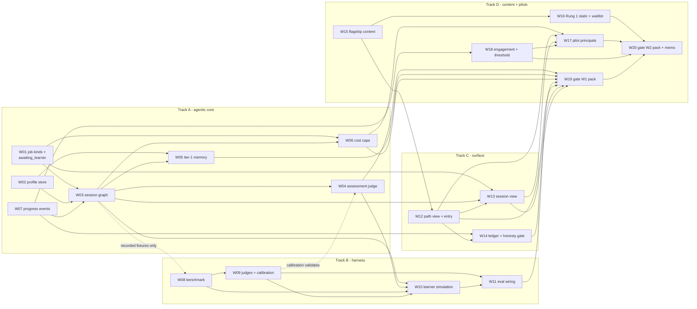

# Phase W work orders — the guided-read wedge (05)

> ## ⚠ STATUS: PROPOSED
>
> **Nothing in this document is approved, decided, or implemented.**
> No code, schema, flag, CI, or deployment change described here
> exists on `main`. This document adds exactly one file — itself.
> It decomposes Phase W into executable work orders in the format of
> [`docs/revamp/06-WORK-ORDERS.md`](../../docs/revamp/06-WORK-ORDERS.md)
> so the owner can approve, amend, or reject a concrete plan.
> Every claim about existing machinery cites the module; judgment
> calls are marked **[judgment call]**.

- **Workstream**: LP-05 (learning platform, document 05)
- **Date**: 2026-08-30
- **Branch**: `plan/lp-05-wedge-wos`
- **Decider**: kudratsingh — **pending**
- **Authorizing ruling**: **LP-D1** ([`STATUS.md`](STATUS.md), PR #129
  in flight) — the objective is a real product with users and
  learning-by-building; the guided-read wedge executes as **Phase W
  of the platform**, with the **agentic and model-harness investment
  front-loaded** per the owner's explicit emphasis. The 04
  alternatives are rejected; the pre-committed engagement thresholds
  stand and **will be measured, not waived**.
- **Scope**: the executable decomposition of Phase W — the ladder's
  Rung 1 + Rung 2 ([`04-STRATEGY-ALTERNATIVES.md` §5](04-STRATEGY-ALTERNATIVES.md#5-the-cheap-test-ladder))
  plus the front-loaded agentic core and learning eval from
  [`01-LEARNING-AGENT.md`](01-LEARNING-AGENT.md) — into work orders,
  a dependency graph, a wave schedule for a concurrent agent fleet,
  and two gates.
- **Inputs**: [`00-VISION.md`](00-VISION.md) (§4.2, §5, §6.1),
  [`01-LEARNING-AGENT.md`](01-LEARNING-AGENT.md),
  [`02-CONTENT.md`](02-CONTENT.md) (§2.2, §2.3, §5),
  [`03-ARCHITECTURE-ROADMAP.md`](03-ARCHITECTURE-ROADMAP.md) (§2, §4,
  §6, §8), [`04-STRATEGY-ALTERNATIVES.md`](04-STRATEGY-ALTERNATIVES.md)
  (§2.B, §5, §6), [`STATUS.md`](STATUS.md) (LP-D1),
  [`planning/05-agentic-upgrade-plan.md`](../05-agentic-upgrade-plan.md),
  [`docs/eval.md`](../../docs/eval.md),
  [`docs/revamp/06-WORK-ORDERS.md`](../../docs/revamp/06-WORK-ORDERS.md)
  (the format model), and a direct read of `src/graph/`, `src/agents/`,
  `src/api/`, `src/config.py`, `src/eval/`, `src/tools/postgres_pool.py`,
  `web/`, and `.github/workflows/`.

---

## How to read this document

Read [§1](#1-scope-rulings-to-ratify-with-this-plan) first: ten
places where the input documents leave Phase W a choice, each with a
proposed ruling; several work orders cannot be sized or written until
those rulings are ratified. [§2](#2-decision-dependent-work-orders-and-the-owner-approval-ledger)
names every owner approval this phase waits on — all six are
spend-bearing or product-exposure decisions, and every card that
needs one names it.

[§3](#3-the-work-order-set) is the work-order set: **20 work orders
in four tracks** (A agentic core, B model-harness/eval, C product
surface, D content + pilots). [§4](#4-coverage-maps) proves coverage
twice over — every Phase-W-relevant element of the 01 design has an
owning work order or an honest deferral, and every new UI state has
an owner. [§5](#5-dependency-graph-critical-path-and-concurrency) is
the graph, waves, and fleet hazards.
[§6](#6-gates-w1-and-w2--criteria-and-evidence) is the two gates.
[§7](#7-not-scheduled) is the honest list of everything in the
sibling documents that **no** Phase W work order covers, with the
reason and the phase where it lands.

---

## 0. Conventions

**Gate assignment.** Two gates, defined by LP-D1's sequencing:

- **Gate W1 — the agent is real and measurable.** The guided-read
  agent core merged; the learning eval green on the harness (its own
  tests plus the first funded campaign); a guided-read session
  demoable end-to-end on the seeded local stack with
  `ANTHROPIC_API_KEY=local-preview-disabled`. This is the
  front-loaded agentic/harness investment, proven before any user
  sees it.
- **Gate W2 — the wedge is measured.** Rung 1's static publication
  launched; ≤5 invited pilot users live on per-principal keys for a
  14-day observation window; engagement measured against the
  pre-committed threshold ([SR-10](#sr-10--the-engagement-threshold-carried-verbatim));
  per-session cost measured against 01 §6's estimates. Gate W2's
  evidence pack is the go/no-go input for Phase L0 / MT-01.

**Size.** The repo convention
([`06-WORK-ORDERS.md` §0](../../docs/revamp/06-WORK-ORDERS.md#0-conventions),
calibrated to `docs/development.md` "Branching and PRs"): **S** ≤
~250 additions, **M** ~400–800 (the target), **L** ~800–1,200 and
only where splitting would ship a half-built contract — every L card
states why. Counts include tests, stories, and fixtures.

**Acceptance criteria are evidence, not intent.** Every criterion is
a test that must pass or an artifact that must exist in the same PR.
Tests and doc updates live inside each work order, never deferred.

**Cost boundary — extended, not relaxed.** The revamp's rule ("no
work order calls a paid model") remains the **default**: local dev
and every automated tier run with
`ANTHROPIC_API_KEY=local-preview-disabled` exactly as the Playwright
harness pins it (`web/e2e/support/compose.e2e.yml`,
`.github/workflows/ci.yml` `web-e2e`). Phase W introduces the first
work orders that legitimately spend — and each such card **says so
explicitly and names the owner approval it waits on**
([§2](#2-decision-dependent-work-orders-and-the-owner-approval-ledger)).
Exactly five cards can spend: WO-W09 (calibration scoring run),
WO-W10 (simulation campaign), WO-W11 (the nightly lane, when
scheduled), WO-W15 (briefing generation), WO-W17 (live pilot
sessions). Every other card calls no paid model, full stop.

**Standing constraints carried verbatim** (from
[`03` §6](03-ARCHITECTURE-ROADMAP.md#6-phased-roadmap) and the LP-D1
record): the web proxy
(`web/app/api/[...path]/route.ts` + `web/lib/server/principal.ts`)
remains the **sole credential boundary**; every capability lands
behind an **independent default-off flag** in `src/config.py`; the
honesty rules extend to pedagogy — **no fabricated mastery,
provenance on every skill claim**; and every merged state leaves
`docker compose up` a zero-config, auth-off, single-user demo in
which the learning surfaces render seeded fixture content.

---

## 1. Scope rulings to ratify with this plan

The input documents were written before LP-D1 and leave Phase W ten
concrete choices. Each is proposed for ratification with this
document rather than silently resolved; where a work order depends on
the outcome, it is named.

### SR-01 — Session runtime shape: second graph, `awaiting_learner`

[`01` §3.2](01-LEARNING-AGENT.md#32-session-runtime-a-second-graph-not-a-bigger-one)
recommends a second compiled LangGraph graph with per-turn interrupts
and left it open as its Q5. **Proposed: ratify the recommendation.**
A tutoring session is turn-shaped; wedging turns into
`src/api/runner.py`'s drive-to-termination design would fight it,
and the graph route buys checkpointed mid-session resume (a session
surviving a page reload is table stakes), per-session cost
enforcement through the existing `src/llm.py::call_llm` choke point,
and the same tracing story — machinery the repo already paid for.
The `pending_review` parking machinery
(`src/api/runner.py::_handle_hitl_pause`, ADRs 0030/0034) is
generalized to an `awaiting_learner` state rather than duplicated.
Affects **WO-W01**, **WO-W03**.

### SR-02 — The Phase W flag subset, and the profile's pre-MT-01 key

Of [`01` §5.4](01-LEARNING-AGENT.md#54-the-flag-ladder)'s eight-flag
ladder, Phase W ships **three** — `enable_learner_profile`,
`enable_session_loop`, `enable_assessment_judge` — plus one new flag
the ladder did not need (`enable_learn_content`, gating the
read-only path/briefing endpoints). The other five
(`enable_curriculum_planner`, `enable_plan_critic`,
`enable_spaced_repetition`, `enable_session_precompute`,
`enable_motivation_replanning`) are not built ([§7](#7-not-scheduled)).
All four Phase W flags are independent, default-off booleans in
`src/config.py` following the house style (ADRs 0014–0020).

The profile and progress stores key on the **existing**
`principal_key_id` (ADR 0036), exactly as
[`01` §1.3](01-LEARNING-AGENT.md#13-where-it-lives-and-the-mt-01-gate)
sanctions for single-human/pilot deployments — honestly labeled as
such. MT-01's finding F1 (key_id is a mutable display name, not a
stable owner id) is handled operationally, not structurally: **pilot
keys are issued fresh per person and never reassigned** (WO-W17
runbook rule), and the real fix remains MT-01/L0-05. No MT-01 work
is performed in Phase W. Affects **WO-W02**, **WO-W07**, **WO-W17**.

### SR-03 — The plan-coherence judge points at the session plan

[`01` §7.1](01-LEARNING-AGENT.md#7-eval-story) specifies a
plan-coherence judge over generated *curricula* — but Phase W builds
no curriculum planner. **Proposed: build the judge now, pointed at
the guided-read session plan** (the per-session artifact WO-W03's
`check_in` emits: which sections today, close-read vs skim, where
the comprehension checks sit, sized against the learner's declared
time budget). This is the harness-first discipline
[`planning/05-agentic-upgrade-plan.md`](../05-agentic-upgrade-plan.md)
codified ("the harness must exist before the loop lands") applied
under LP-D1's front-loading emphasis: when the curriculum planner
arrives in Phase L, it lands against a judge that already exists and
whose dimensions (ordering, load vs `time_budget_min_per_day`,
measurability) transfer per 01 §2.2's table. Affects **WO-W09**.

### SR-04 — Active work is Q&A over the paper; no mini research task

[`01` §3.3](01-LEARNING-AGENT.md#33-the-research-pipeline-as-a-learning-instrument)'s
flagship active-work block — a real research run inside a session —
is **deferred to Phase L**.
[`04` §2.B](04-STRATEGY-ALTERNATIVES.md#2b--the-narrow-wedge-ship-guided-paper-reading-inside-the-existing-product)'s
effort shape for the wedge does not include it, it multiplies pilot
spend (a ~$0.15–0.50 run per 01 §6.3 versus ~$0.10 of session
turns), and the guided read is the differentiator being tested.
Phase W's active work is Socratic Q&A and comprehension checks over
the assigned paper passage. The session graph keeps the insertion
point (a `dict`-shaped activity payload) so the research-task
activity lands in Phase L without a state migration.
Affects **WO-W03**; recorded in [§7](#7-not-scheduled).

### SR-05 — No scheduler: guided-read material is content, not precompute

[`01` §3.4](01-LEARNING-AGENT.md#34-session-time-vs-precomputed--the-cost-line)'s
nightly precompute is blocked on its own Q3 (the repo has no
scheduler). Phase W does not need one: the guided-read's material is
the **briefing companion**, generated once per paper in a funded,
human-reviewed campaign (WO-W15) and versioned as content — 02's
model, not a nightly batch. Q3 stays open without blocking anything,
exactly as Rung 2 promised ("no scheduler, no email, no MT-01, no
recurring bills"). Affects **WO-W15**; recorded in [§7](#7-not-scheduled).

### SR-06 — Memory subset: Tier 1 plus session summaries only

Of [`01` §5.5](01-LEARNING-AGENT.md#55-memory-across-weeks--the-hard-problem)'s
three tiers, Phase W builds **Tier 1** (structured always-in-context
state, bounded by construction) and the **per-session ~150-token
summary** that feeds the next check-in. Weekly/monthly rollups and
Tier-3 retrieval are deferred: a 14-day pilot never exercises a
monthly rollup, and deferring them defers the summary-drift failure
mode with them. The Tier-1 discipline is a **cost control** (01 §6.4:
context bloat from 2.5K to 8K tokens roughly doubles session cost),
so its token bound is a tested invariant, not advice.
Affects **WO-W05**; recorded in [§7](#7-not-scheduled).

### SR-07 — The web tier keeps its no-runtime-flags rule

The revamp deliberately built no runtime feature flags in `web/`
([`06-WORK-ORDERS.md` §7](../../docs/revamp/06-WORK-ORDERS.md#7-not-scheduled))
because flags double the state space every axe and Playwright run
must cover. Phase W keeps that: **gating is backend-only**. The
`(learn)` routes always exist once merged; when a backend flag is
off, the surface renders the mapped failure honestly (the same
normalized-error discipline as every other surface), and in the
zero-config local demo the surfaces render seeded fixture content
([`03` §6](03-ARCHITECTURE-ROADMAP.md#6-phased-roadmap)'s rule).
Affects **WO-W12**, **WO-W13**, **WO-W14**.

### SR-08 — Pilot identity: a thin, guarded slice at the declared seam

Rung 2 pilots run "on per-principal API keys — the scoping half of
multi-tenancy already exists" ([`04` §2.B](04-STRATEGY-ALTERNATIVES.md#2b--the-narrow-wedge-ship-guided-paper-reading-inside-the-existing-product)).
The backend half is real (`X-API-Key` keystore, ADR 0036 scoping,
404-not-403 `_check_ownership`); what the wedge needs is the web
tier resolving *which* key per request, and today
`web/lib/server/principal.ts::resolveUpstreamPrincipal` returns the
single `"shared"` principal. **Proposed:** a default-off,
topology-guarded mapping at exactly that seam — the edge
(`basic_auth`, one user per pilot) forwards the authenticated
username; `resolveUpstreamPrincipal` maps it to that pilot's
per-principal API key from a **server-side** env map. No session
system, no login page, no MT-01: keys never reach a browser, the
proxy stays the sole credential boundary, and the resolver refuses
the header unless the pilot mode is explicitly enabled (the
off-by-default-with-topology-guard discipline
[`03` §7](03-ARCHITECTURE-ROADMAP.md#7-risk-register-seed) RR-L04
demands). This is a deliberate hand-run slice of what MT-01 L0-03
does properly; MT-01 **replaces** it, it does not grow from it.
Affects **WO-W17**; needs its own ADR.

### SR-09 — Pilot spend is bounded by arithmetic, not by the F4 cap

MT-01's F4 (no aggregate spend cap) is real and unfixed in Phase W —
the global cap is Phase L0-01. The pilot is acceptable without it
**only** because the exposure is bounded by construction, and the
bound is written down: ≤5 pilots × per-principal rate limiting
(`src/api/auth.py`, ADR 0037) × `learning_session_max_cost_usd` per
session × the existing `max_cost_usd` per research run (if W-OD-5
grants research rights at all) × a 14-day window, with the worst-case
dollar figure computed on WO-W17's card and re-checked in the Gate W2
report. Any cohort beyond 5, any public opening, or any scheduled
(system-initiated) work re-triggers the F4 prerequisite — restating
01 §6.5's position: no learning flag ships to a multi-user
deployment beyond this bounded pilot before the global cap does.
Affects **WO-W06**, **WO-W17**, Gate W2.

### SR-10 — The engagement threshold, carried verbatim

Rung 2's test, quoted from
[`04` §5](04-STRATEGY-ALTERNATIVES.md#5-the-cheap-test-ladder) and
carried into Gate W2 unchanged: *"Tests A1 on the surviving
differentiator (do invited users return in week 2 without being
nudged — a 7-day-return proxy against 00 §6.1's ≥40% target), A4
with real measured sessions, and A2's surviving-slice hypothesis.
Pre-commit the threshold before the pilot, per 03's own OD-12
discipline."* The referenced target
([`00` §6.1](00-VISION.md#61-the-metric-hierarchy)): **7-day return
≥ 40%**. The observation window is **14 days**; "without being
nudged" is structural (Phase W has no notification channel to nudge
with). W-OD-6 ratifies the number **before** WO-W17 starts — the
dependency edge W18 → W17 enforces the ordering — and LP-D1 already
rules it is measured, not waived. Affects **WO-W18**, **WO-W20**.

---

## 2. Decision-dependent work orders, and the owner approval ledger

Every open owner decision Phase W waits on. All six are spend-bearing
or public-exposure decisions; none is a design question (design
questions are [§1](#1-scope-rulings-to-ratify-with-this-plan),
ratified with this document). The STATUS ledger's standing items map
here: eval funding → W-OD-1; DEPLOY cost approval → inside W-OD-4/5;
content licensing posture → W-OD-3; MT-01 §8 answers → deferred to
Phase L0 (not needed here); notification channel → not needed
([§7](#7-not-scheduled)).

| # | Decision | Blocks | What is being approved |
|---|---|---|---|
| **W-OD-1** | **Eval funding** — set the `ANTHROPIC_API_KEY` repository secret (54/54 nightly runs have failed without it, [`docs/eval.md`](../../docs/eval.md) §Status) and approve the learning-eval budget: the calibration scoring run (WO-W09), the first simulation campaign (WO-W10, sized on its card), and a nightly-lane ceiling (WO-W11) | WO-W09 c6, WO-W10, WO-W11 c4–c5, Gate W1's funded-campaign row | The first funded eval campaigns in repo history; order $25–75 per campaign per [`04` §5 Rung 0](04-STRATEGY-ALTERNATIVES.md#5-the-cheap-test-ladder), enforced by `--max-budget-usd` |
| **W-OD-2** | **Briefing generation campaign** — budget ceiling for generating 8–10 briefing companions through the existing pipeline, plus the owner's own review hours (~1–2 h per briefing, [`02` §5](02-CONTENT.md#5-cold-start-plan)) | WO-W15 (content half) | The first paid model spend outside the eval — approved as such, the [`03` §8](03-ARCHITECTURE-ROADMAP.md#8-owner-decision-list) OD-6 precedent |
| **W-OD-3** | **Licensing posture ratified** — the [`02` §2.2](02-CONTENT.md#22-papers) posture table verbatim: link out, never re-host full text; abstracts displayed with attribution; quotes sparing and attributed; S2-derived facts link back; the platform stays non-commercial through Phase W (02 §6 Q2 tightens if money ever appears) | WO-W15 (publication of content), WO-W16 | The legal posture the published path and briefings are built under; 02's counsel-confirmation caveats carry with it |
| **W-OD-4** | **Rung 1 publication** — where the static path is hosted, what the waitlist mechanism is, and the launch itself (one post set: HN / r/ML / X — drafted in the PR, **sent by the owner**) | WO-W16 | Public exposure and the distribution test (assumption A6); per [`04` §2.B](04-STRATEGY-ALTERNATIVES.md#2b--the-narrow-wedge-ship-guided-paper-reading-inside-the-existing-product), distribution "is part of the work order list, not an afterthought" |
| **W-OD-5** | **Pilot approval** — the ≤5 invitee names; the deployment they use (the DEPLOY unblock at ≈€8–15/mo class, or an owner-hosted box — [`03` §8](03-ARCHITECTURE-ROADMAP.md#8-owner-decision-list) OD-3's shape); the pilot inference budget; the at-cap behaviour (refuse vs degraded close); whether pilot keys keep `POST /research` rights (OD-7's default: the expensive action stays operator-tier) | WO-W17, Gate W2 | Real users spending real inference money on the owner's key, inside SR-09's arithmetic bound |
| **W-OD-6** | **Engagement threshold ratification** — the ≥40% 7-day-return proxy and the 14-day window, ratified **before the pilot starts** (the [`03` §8](03-ARCHITECTURE-ROADMAP.md#8-owner-decision-list) OD-12 discipline: a commitment, not a negotiation) | WO-W18 c5, and therefore WO-W17's start | The number Gate W2 is judged against; LP-D1 already rules it will be measured, not waived |

---

## 3. The work-order set

### Track A — Agentic core (Gate W1)

The owner's front-loading emphasis lands here: the session lifecycle,
the graph, the judge, the memory, the caps — all before any surface.

#### WO-W01 — Job kinds and the `awaiting_learner` lifecycle

| | |
|---|---|
| Gate | W1 |
| Size | **L** (~900–1,100) |
| Depends | — |
| Track | A |
| Decision-dependent | No (SR-01 must be ratified) |

**Why L.** The job `kind` field, the generalized interrupt parking,
and the `turn_ready` event are one lifecycle contract; landing the
kind without the parking would ship a job type that cannot pause,
which is the only reason it exists.

**Scope.** `src/api/jobs.py`: `Job` gains
`kind: Literal["research", "session"]` (default `"research"`) and the
non-terminal status `awaiting_learner`. `src/api/runner.py`: the
`pending_review` parking (`_handle_hitl_pause` — park, emit frame,
await `resume_event` with timeout, cross-worker resume via the
`hitl:resume:{job_id}` channel duck-type) is **refactored into a
generalized interrupt-parking helper** with `pending_review` as its
first client and `awaiting_learner` as its second; a
`session_turn_timeout_sec` setting mirrors `api_hitl_timeout_sec`.
`src/api/streaming.py`: new `turn_ready` event name;
`TERMINAL_EVENT_STATUS` / `TERMINAL_EVENT_NAMES` /
`STREAM_CLOSING_EVENT_NAMES` updated deliberately (`turn_ready` is
neither terminal nor stream-closing — like `plan_ready`).
`src/api/redis_store.py` serialization of the new fields; redriver
treats `awaiting_learner` parking exactly as it treats
`pending_review`. `src/api/schemas.py` additive `JobDetail.kind`;
`web/contract/openapi.json` regenerated and `npm run contract:check`
green with regenerated types. Docs: `docs/architecture.md` job
lifecycle section updated in the same PR; ADR (0057+) for the
lifecycle generalization.

**Inputs.** [`01` §3.2](01-LEARNING-AGENT.md#32-session-runtime-a-second-graph-not-a-bigger-one),
[§5.1](01-LEARNING-AGENT.md#51-reused-with-the-module-that-proves-it)
(new job *types*, same lifecycle);
[`03` §2.1–2.2](03-ARCHITECTURE-ROADMAP.md#21-the-job-model--an-async-backbone-that-generalizes),
[§6](03-ARCHITECTURE-ROADMAP.md#6-phased-roadmap) (the job-kind
refactor named as the bottleneck WO); SR-01; ADRs 0030/0034/0035.

**Acceptance criteria.**
1. With every Phase W flag off, the research path is
   behaviour-identical: the full Python suite passes unmodified, and
   the HITL e2e path (`pending_review` → review → resume) passes
   through the refactored helper — the refactor is proven on the
   existing behaviour before the new state has any client.
2. A `kind="session"` job parks in `awaiting_learner`, emits
   `turn_ready`, resumes on the resume channel from a *different*
   worker (the ADR 0034 cross-worker property), and times out to a
   terminal state on `session_turn_timeout_sec` — each asserted by a
   test against a stub graph.
3. `awaiting_learner` jobs are never redriven as stale while parked
   (redriver test), and job retention/TTL semantics are unchanged.
4. `web/contract/openapi.json` is regenerated; `contract:check` and
   the recorded-fixture drift tests pass; the `JobDetail.kind` field
   is additive (existing fixtures remain valid).
5. `docs/architecture.md` describes the second job kind and the new
   status in the same PR; the ADR is merged with it.

**Risk notes.** This is Phase W's bottleneck work order and the
highest-blast-radius backend change (RR-L08's shape: runner churn
with no Python cassette tier under it). One owner, sequenced first,
most experienced hands, no fan-out around it — the WO-07 rule from
the revamp. The mitigation *is* criterion 1: the refactor lands
proven against `pending_review` before `awaiting_learner` exists.

#### WO-W02 — Learner-lite profile store, provenance, and the isolation-aware serializer

| | |
|---|---|
| Gate | W1 |
| Size | M |
| Depends | — |
| Track | A |
| Decision-dependent | No (SR-02 must be ratified) |

**Scope.** Appends `learner_profiles` to
`src/tools/postgres_pool.py::SCHEMA_DDL` (append-only, comment-fenced
section): keyed by `principal_key_id`; columns for
`academic_level`, `time_budget_min_per_day`, capped `goals` and
`skills` JSONB (the [`01` §1.1](01-LEARNING-AGENT.md#11-what-the-agent-knows-about-a-user)
`SkillEntry`/`LearnerGoal` shapes — `skill`, `level`, `source` ∈
`declared|inferred|assessed`, `evidence_ref`, `confidence`,
`updated_at`), `profile_note`, timestamps. `style_signals` is **not**
built ([§7](#7-not-scheduled)). New package `src/learning/` with
`profile_store.py` (store functions in the conversation-store style)
and `profile_serializer.py` — the prompt renderer that wraps
learner-authored fields (`profile_note`, goal statements) via
`src/security/prompt_isolation.py` and renders `inferred` entries
under an explicit "unconfirmed impressions" heading. New flag
`enable_learner_profile` (default off; a `@model_validator` refuses
it without `enable_api_auth`, per 01 §1.3, and the store refuses the
anonymous principal). Endpoints `GET/PUT /learn/profile` behind
`require_principal`, scoped by `_check_ownership` semantics, with
OpenAPI snapshot + recorded fixtures. ADR for the store and its
privacy posture (retention/deletion promises quoted from
[`01` §1.4](01-LEARNING-AGENT.md#14-privacy-posture) as *proposed*,
pending 01's Q7).

**Inputs.** [`01` §1.1–1.4](01-LEARNING-AGENT.md#1-the-learner-model),
[§5.4](01-LEARNING-AGENT.md#54-the-flag-ladder); SR-02; ADRs
0020/0032/0033/0036/0039.

**Acceptance criteria.**
1. Provenance is enforced by tests: an `inferred` write with
   `confidence > 0.6` is rejected; a `declared` entry is never
   overwritten by an inference (the contradiction is stored as a
   second `assessed`/`inferred` entry); `confidence = 1.0` is
   reserved for `declared`.
2. **No prompt ever presents an inferred skill as fact**: a
   serializer test asserts every `inferred` entry renders only under
   the "unconfirmed impressions" heading, and an adversarial test
   plants prompt-injection text in `profile_note` and asserts it
   arrives isolation-wrapped (the `tests/test_reader_isolation.py`
   pattern).
3. Deletion is first-class: a delete removes profile rows and is
   covered by a test; the docstring states the shared paper/embedding
   caches are excluded from the promise (01 §1.4's carried caveat).
4. `SCHEMA_DDL` remains idempotent (double-`init_schema` test);
   `enable_learner_profile=false` leaves every existing test and
   endpoint byte-identical.
5. Contract snapshot + fixtures recorded; `contract:check` green.

**Risk notes.** This is the first *personal* data the repo stores.
The card deliberately ships the smallest honest subset — no
`style_signals`, no narrative dossiers (01 §5.5's ceiling) — because
every field added here is a field the deletion promise must cover.

#### WO-W03 — The guided-read session graph

| | |
|---|---|
| Gate | W1 |
| Size | **L** (~1,000–1,200) |
| Depends | WO-W01, WO-W02, WO-W07 |
| Track | A |
| Decision-dependent | No (SR-01, SR-04, SR-05 must be ratified) |

**Why L.** The state module, the graph, the tutor prompts, and the
session endpoints are one contract: a graph without its endpoints is
untestable end-to-end, and endpoints without the graph would have to
fake the very lifecycle WO-W01 built.

**Scope.** `src/graph/session_state.py`: `SessionState` TypedDict +
`initial_session_state()` constructor (the ADR 0052 edited-together
rule), carrying the serialized Tier-1 block, the session spec (paper
id + briefing-companion reference), the session plan, the turn
`messages`, the activity payload (SR-04's insertion point), the
assessment record, and cost/turn counters.
`src/graph/session_workflow.py`: `build_session_workflow()`
compiling `check_in → passage → tutor ⇄ (interrupt per turn) →
assess → progress_update` over the same checkpointer backends via
the existing `_open_checkpointer`/`_aopen_checkpointer` selection and
the same `NodeWrapper` indirection so sync and async surfaces both
work; per-turn pauses via the WO-W01 parking. `src/agents/tutor.py`:
`check_in` and `tutor` node functions with module-level prompt
constants (house style); `check_in` reads the Tier-1 block and emits
the **session plan** (sections, close-vs-skim from the briefing
companion's chunker-section guidance, check placement, honestly
downscoped when the learner declares less time); learner-authored
turn text is isolation-wrapped. `tutor_model` setting (ADR 0021
empty-string fallback). Endpoints: `POST /learn/sessions` (submit;
rate-limited via `enforce_rate_limit`), `GET /learn/sessions/{id}`,
`POST /learn/sessions/{id}/turn` (resume with the learner's message;
rate-limited), streaming via the existing SSE surface — all behind
`enable_session_loop` (default off; requires `enable_learner_profile`
and `enable_checkpointing` per [`01` §5.4](01-LEARNING-AGENT.md#54-the-flag-ladder)).
Mock mode: under `use_mock_data=true` the tutor and check-in nodes
return canned deterministic turns so the zero-config demo works with
`ANTHROPIC_API_KEY=local-preview-disabled`. Records the session SSE
scenarios into `web/contract/sse/` and endpoint fixtures into
`web/contract/fixtures/`. ADR for the session graph. Agent doc
`docs/agents/tutor.md`.

**Inputs.** [`01` §3.1–3.2](01-LEARNING-AGENT.md#3-the-daily-interaction-loop),
[§5.3](01-LEARNING-AGENT.md#53-the-graphs);
[`00` §5.3](00-VISION.md#53-surface-3--the-lesson-reader) (the guided
read as flagship session type);
[`04` §2.B](04-STRATEGY-ALTERNATIVES.md#2b--the-narrow-wedge-ship-guided-paper-reading-inside-the-existing-product);
SR-01/SR-04/SR-05; `src/graph/workflow.py::_compile`,
ADRs 0041/0047/0052.

**Acceptance criteria.**
1. An integration test with a stubbed `call_llm` drives a full
   session — check-in → passage → three tutor turns → explain-back →
   progress event — through the compiled graph via the API surface,
   asserting each `awaiting_learner` park and `turn_ready` frame.
2. Mid-session crash-resume: kill between turns, re-attach, and the
   session resumes from its checkpoint with the transcript intact
   (the ADR 0040 property, asserted for the session graph).
3. Parse defense per ADR 0041: a malformed tutor/check-in response
   degrades to a safe default (re-ask / end honestly), never to an
   invented plan or fabricated passage guidance; asserted per node.
4. The session plan honors the declared time budget: a check-in with
   "10 minutes today" yields a plan whose scope is reduced and says
   so — asserted structurally (plan size), with copy honesty left to
   WO-W09's rubric.
5. Under `use_mock_data=true` and the disabled key sentinel, the full
   session path runs with **zero** Anthropic calls (asserted by a
   test that fails on any client construction).
6. `enable_session_loop=false` leaves the API surface and OpenAPI
   snapshot free of session routes' behaviour (404/flag-refused,
   documented shape) and every existing test green.
7. SSE scenario files and endpoint fixtures recorded; contract drift
   checks green.

**Risk notes.** The big build (01 §5.2 sizes it 2–3 weeks). The two
design risks — turn cadence through interrupts, and cost-per-turn —
are exactly what WO-W06's caps and WO-W09/W10's judges exist to
bound; this card deliberately ships no unjudged copy surface to
learners (pilots arrive only at Gate W2).

#### WO-W04 — The explain-back assessment judge

| | |
|---|---|
| Gate | W1 |
| Size | M |
| Depends | WO-W03 (soft: WO-W09 calibration) |
| Track | A |
| Decision-dependent | No |

**Scope.** `src/agents/assessment.py`: `assessment_judge` in the
critic's shape (`src/agents/critic.py`) pointed at the session
transcript — strict JSON schema
`{gaps, strengths, follow_up_probe, evidence}`, parse defense to a
safe default, **no revision loop** (one probe, then record and move
on, per [`01` §4.3](01-LEARNING-AGENT.md#43-explain-back-via-the-critic-pattern)).
`assessment_model` setting (ADR 0021 pattern). Wired as the session
graph's `assess` node behind `enable_assessment_judge` (default off;
requires `enable_session_loop`; off = the tutor closes informally —
the A/B position 01 §5.4 designs). The judge's output is **advice to
the tutor, never a learner-facing score**; the tutor node turns a
gap into the follow-up probe. Writes the `assessment` progress event
with `evidence_ref` = the transcript reference. Agent doc + ADR.

**Inputs.** [`01` §4.1](01-LEARNING-AGENT.md#41-principles),
[§4.3](01-LEARNING-AGENT.md#43-explain-back-via-the-critic-pattern),
[§5.4](01-LEARNING-AGENT.md#54-the-flag-ladder);
`src/agents/{critic,verifier}.py`; ADRs 0015/0041.

**Acceptance criteria.**
1. The verifier's honesty property, transplanted and tested: **every
   gap must quote the learner's own words as evidence**; a judge
   response asserting a gap without a learner quote is treated as
   malformed and degrades to "unassessed" — never to a recorded gap.
2. The malformed/timeout path records an `assessment` event with an
   explicit `unassessed` payload (a fact), never a fabricated grade.
3. No learner-facing rendering of raw judge output exists: a test
   asserts the judge's schema fields never appear in any SSE frame
   or `JobDetail` field the web client renders (the score is not in
   the contract).
4. Flag off: the session closes with an informal tutor line and
   still writes a `session_completed` event; the A/B is real.
5. Learner turn text enters the judge isolation-wrapped
   (adversarial test with a jailbreak in the explain-back).

**Risk notes.** Until WO-W09's calibration set exists, judge outputs
are tutor guidance only — which is all this card lets them be, so
the dependency is soft by design (01 §7.3 makes the same move).

#### WO-W05 — Tier-1 memory and session summaries

| | |
|---|---|
| Gate | W1 |
| Size | M |
| Depends | WO-W02, WO-W03 |
| Track | A |
| Decision-dependent | No (SR-06 must be ratified) |

**Scope.** `src/learning/memory.py`: the Tier-1 serializer — the
profile block (WO-W02's serializer), the active path position,
today's session spec, and the **last session summary**, composed
into a bounded block; the session-close summary generator (~150
tokens, `tutor_model`) written by the `progress_update` node with
the inference batch applied at close (01 §1.2's batching rule:
inference writes happen at session end, each with the session as
`evidence_ref`). Summaries are stored on the session record, marked
lossy, and are **never** a valid `evidence_ref` for a skill claim.

**Inputs.** [`01` §1.2](01-LEARNING-AGENT.md#12-honest-updating-declared-vs-inferred-vs-assessed),
[§5.5](01-LEARNING-AGENT.md#55-memory-across-weeks--the-hard-problem)
Tier 1/2, [§6.4](01-LEARNING-AGENT.md#64-monthly-per-active-learner)
(context bloat as the cost sensitivity); SR-06.

**Acceptance criteria.**
1. The Tier-1 block is bounded **by test**: a fixture profile at
   every cap (max goals, max skills, max note length) serializes
   under a hard token ceiling (~2.5K tokens via the tokenizer-free
   chars/4 heuristic, stated in the test), and the bound failing
   fails CI — 01 §6.4's cost control as an invariant.
2. Anything that must never be forgotten is structural: goal, time
   budget, and declared constraints reach the prompt from structured
   fields, asserted by a test that corrupts the summary and shows
   the structured facts still arrive.
3. A skill-claim write with a summary as `evidence_ref` is rejected
   (the provenance rule, enforced at the store).
4. The inference batch applies only at session close and each entry
   carries the session `evidence_ref` (test).
5. Summary generation under mock mode is deterministic; no paid
   calls anywhere in this card.

**Risk notes.** Summary drift is deferred with Tier 2
([§7](#7-not-scheduled)) but not ignored: the "structured fields
win" test (c2) is exactly the Tier-1-beats-Tier-2 rule 01 §5.5 ends
on, landed early.

#### WO-W06 — Per-session cost caps, routing, and cost instrumentation

| | |
|---|---|
| Gate | W1 |
| Size | M |
| Depends | WO-W01, WO-W03 |
| Track | A |
| Decision-dependent | No |

**Scope.** `learning_session_max_cost_usd` setting (proposed default
$0.50 — headroom over 01 §6.1's $0.07–0.17 estimate, tightened once
measured **[judgment call]**). Enforcement at the existing choke
point: the runner sets an effective-cap context for `kind="session"`
runs that `src/llm.py::_check_cost_budget` reads
(`settings.max_cost_usd` remains the default when unset), so every
tutor/judge call passes `enforce_cost_cap` against the session's own
ceiling — no second enforcement path. At-cap behaviour: the session
parks/closes honestly with an explicit at-cap status and copy hook
(the refuse-vs-degrade choice is W-OD-5's; both paths are built and
testable, the deployment picks). Per-session accounting surfaced:
session `JobDetail` carries `cost_usd`/`llm_calls` per the existing
accumulator (ADR 0051), per-turn costs visible in traces, and the
model-routing knobs (`tutor_model` from WO-W03, `assessment_model`
from WO-W04) verified against
`src/observability/costs.py::PRICES_USD_PER_MILLION`
(`unpriced_models` warning covers them).

**Inputs.** [`01` §5.4](01-LEARNING-AGENT.md#54-the-flag-ladder)
(cost knobs), [§6.1–6.2](01-LEARNING-AGENT.md#61-one-session-online-learner-present);
SR-09; ADRs 0021/0051; `src/llm.py`.

**Acceptance criteria.**
1. A test drives simulated spend past
   `learning_session_max_cost_usd` mid-session and asserts the next
   LLM call is refused at the choke point and the session reaches
   the honest at-cap state — never a silent truncation.
2. A research-kind job in the same process is governed by
   `max_cost_usd` alone (no cap bleed between kinds; test).
3. Session `JobDetail` cost fields reconcile with the accumulator to
   the cent on the mock-mode integration session (deterministic).
4. Both at-cap behaviours (refuse; degraded close) have tests and
   copy hooks; which one runs is a deployment setting, defaulting to
   refuse **[judgment call]**.
5. `unpriced_models` warns on a `tutor_model` absent from the price
   table (test), so routing changes can't silently unprice.

**Risk notes.** 01 §6.4 names turns-per-session and context bloat as
the two cost fragilities; this card turns both into "degraded
session modes instead of open-ended risks" exactly as §6.4 asks —
the cap is the product behaviour, not an ops afterthought.

#### WO-W07 — The progress-events store and honest views

| | |
|---|---|
| Gate | W1 |
| Size | M |
| Depends | — |
| Track | A |
| Decision-dependent | No |

**Scope.** Appends `progress_events` to `SCHEMA_DDL` (its own
comment-fenced section, after WO-W02's — see the
[§5.4](#54-fleet-coordination-hazards) merge order): append-only;
`event_id`, `principal_key_id`, `ts`, `kind` ∈
`session_completed | assessment | review_item | artifact_produced |
plan_approved | replan` (the full 01 §4.4 vocabulary, of which
Phase W *writes* the first two and `artifact_produced`; the rest are
reserved so Phase L needs no migration), `payload` JSONB,
`evidence_ref`. `src/learning/progress_store.py` (append +
deterministic views: sessions per principal per day, per-path
schedule progress). `GET /learn/progress` behind
`enable_learner_profile`, per-principal scoped, OpenAPI + fixtures.
ADR shared with WO-W02's or its own.

**Inputs.** [`01` §4.1](01-LEARNING-AGENT.md#41-principles),
[§4.4](01-LEARNING-AGENT.md#44-the-progress-record);
[`00` §5.4](00-VISION.md#54-surface-4--the-progress-ledger); ADR 0036.

**Acceptance criteria.**
1. Append-only is enforced: no update/delete API exists on events
   (deletion is the account-level operation from WO-W02's promise);
   a mutation attempt fails a test.
2. Every view is recomputable from events alone: a test rebuilds the
   progress summary from a raw event fixture and gets identical
   output — "no displayed claim without an event behind it"
   (01 §4.4) as a property test.
3. **No mastery percentage exists anywhere in the store or its
   views**: the views expose schedule arithmetic ("N of M sessions")
   explicitly labeled `schedule_progress`, and no field or docstring
   offers a knowledge/mastery scalar (asserted by a schema test —
   the 01 §4.1 ban, enforced at the source).
4. Events written without a resolvable `evidence_ref` are rejected
   for `assessment` kinds (provenance at the write boundary).
5. Contract snapshot + fixtures; idempotent-DDL test; flag-off
   byte-identical.

**Risk notes.** Reserving the full kind vocabulary now is cheap and
saves a Phase L migration; the risk of speculative schema is
answered by writing only what Phase W produces and testing that the
reserved kinds are refused until a producer exists.

### Track B — Model harness and eval (Gate W1)

What makes the agent improvable rather than vibes
([`01` §7](01-LEARNING-AGENT.md#7-eval-story)); inherits the honesty
constraint that every threshold starts as a prior, because the
research eval itself has never had a funded green campaign
([`docs/eval.md`](../../docs/eval.md) §Status).

#### WO-W08 — The guided-read benchmark and recorded session fixtures

| | |
|---|---|
| Gate | W1 |
| Size | M |
| Depends | — (soft: WO-W03 for recorded transcript fixtures) |
| Track | B |
| Decision-dependent | No |

**Dependency shape.** Startable at t=0: the scenario set and its
invariant tests need only this document and 01. The recorded
mock-session transcript fixtures are appended once WO-W03 merges —
a completion gate, not a start dependency (the WO-23 precedent in
the revamp).

**Scope.** `src/eval/learning_benchmark.py`: ~12–15 scenarios, each
a learner profile × paper × behaviour script (the
[`01` §7.2](01-LEARNING-AGENT.md#7-eval-story) personas — novice
undergrad, career-switcher, time-poor industry engineer — crossed
with papers from the flagship path and scripts including *declares
10 minutes*, *answers wrongly then self-corrects*, *tries a prompt
injection in the explain-back*). TypedDict + invariant tests
mirroring `tests/test_benchmark_queries.py` (unique kebab-case ids,
non-empty scripts, persona diversity). Deterministic mock-session
transcript fixtures under `tests/fixtures/learning/` recorded from
WO-W03's mock mode. No LLM calls anywhere in this card.

**Inputs.** [`01` §7.1–7.2](01-LEARNING-AGENT.md#7-eval-story);
`src/eval/benchmark_queries.py` and its invariant-test pattern
(ADR 0013); SR-03.

**Acceptance criteria.**
1. Invariant tests pin the scenario schema exactly as
   `test_benchmark_queries.py` pins the research benchmark.
2. Scenario scripts are executable by WO-W10's simulator without
   modification (the schema is the contract; a schema test in both
   cards imports the same TypedDict).
3. At least one scenario per persona, one time-poor script, and one
   adversarial (injection) script exist.
4. Fixture transcripts carry a provenance header naming the
   generating commit and mock mode (never presentable as real
   sessions).

**Risk notes.** Benchmarks age; the card writes scenarios against
the flagship path's papers so WO-W15's content review doubles as
benchmark review.

#### WO-W09 — Session-plan coherence judge and explain-back calibration

| | |
|---|---|
| Gate | W1 |
| Size | M |
| Depends | WO-W08 |
| Track | B |
| Decision-dependent | **Yes** — W-OD-1 (the calibration scoring run is the only paid step) |

**Scope.** `src/eval/learning_metrics.py`, in the
`src/eval/metrics.py` discipline (batched single-call judges,
ADR 0006 pattern; per-metric guard isolation; judges on
`settings.anthropic_model` with deliberately no judge-model knob):
**(a)** the session-plan coherence judge per SR-03 — scores a
session plan on section ordering vs the briefing companion's
close/skim guidance, load vs the declared
`time_budget_min_per_day`, check placement, and downscope honesty;
**(b)** explain-back grading quality — a hand-labeled calibration
set of ~20–30 explain-back transcripts
([`01` §7.3](01-LEARNING-AGENT.md#7-eval-story)'s shape; labeling is
**owner/operator hours**, stated as such) with an agreement metric
between the assessment judge's gaps and the human labels;
**(c)** deterministic checks needing no LLM: progress events
evidence-linked; a shame-lexicon scan over tutor/check-in copy
(the [`01` §2.4](01-LEARNING-AGENT.md#24-replanning-the-interesting-case)
"never generates copy like 'you've fallen behind'" rule as a
forbidden-vocabulary list). Unit tests run every judge against
canned responses — no spend; the one paid step is the calibration
scoring run over the labeled set, gated on **W-OD-1**.

**Inputs.** [`01` §7.1, §7.3](01-LEARNING-AGENT.md#7-eval-story);
SR-03; `src/eval/metrics.py`; ADRs 0006/0041/0044.

**Acceptance criteria.**
1. Both judges parse-defend to `None`-metric + `metrics_error`
   (never a fabricated score) — the metrics.py guard discipline,
   asserted per judge.
2. The plan judge penalizes a fixture plan that ignores a declared
   10-minute budget and passes the honest downscoped variant
   (paired fixture test with canned judge responses).
3. The calibration set exists in-repo with provenance (who labeled,
   when), and the agreement metric computes against it
   deterministically given judge outputs.
4. The deterministic checks run in plain pytest with zero LLM calls.
5. Documentation: `docs/eval.md` gains a learning-eval section in
   the same PR.
6. **Paid, W-OD-1**: one calibration scoring campaign executed under
   `--max-budget-usd`; its agreement number is recorded in the
   Gate W1 evidence pack **as a prior** — until it clears a
   ratified bar, assessment-judge outputs remain tutor guidance
   only (which WO-W04 already enforces structurally).

**Risk notes.** The calibration set is the long human pole (~the
same order as 02's briefing review-hours). If labeling stalls, the
judge ships as guidance-only — the system is built so that is safe —
but Gate W1 records the gap rather than waving it through.

#### WO-W10 — The learner-simulation benchmark

| | |
|---|---|
| Gate | W1 |
| Size | **L** (~800–1,000) |
| Depends | WO-W03, WO-W04, WO-W08, WO-W09 |
| Track | B |
| Decision-dependent | **Yes** — W-OD-1 (the funded campaign) |

**Why L.** The simulator, its judged-outcome pipeline, and the
campaign runner integration are one instrument; a simulator without
its judges measures nothing, and judges without the driver have
nothing to score.

**Scope.** `src/eval/simulate_learner.py`: drives WO-W08's scenario
scripts against the compiled session graph — the scripted tier
(deterministic learner responses from the scenario; zero spend when
the graph runs mock mode) and the funded tier (a cheap model plays
the learner; the graph runs real models). Judged outcomes per
[`01` §7.2](01-LEARNING-AGENT.md#7-eval-story), scoped to what
Phase W builds: check-in and tutor copy stay shame-free (rubric
judge + the WO-W09 deterministic lexicon scan); scope adjustment is
honest under the time-poor script; progress events stay
evidence-linked (deterministic); assessment honesty under the
adversarial script (the injection never reaches a control field —
the ADR 0020 property observed end-to-end). Campaign discipline
inherited from `src/eval/runner.py`: `--resume`, `--max-budget-usd`,
per-metric judge isolation, per-scenario durable records, the exit
codes. The **three-repeat rule** before believing any delta
([`planning/05-agentic-upgrade-plan.md`](../05-agentic-upgrade-plan.md)
"Judge noise mandates repeat runs") is written into the runner
output as a warning on single-run deltas.

**Inputs.** [`01` §7.2, §7.5](01-LEARNING-AGENT.md#7-eval-story);
`src/eval/runner.py` (ADRs 0008/0050); SR-03/SR-04.

**Acceptance criteria.**
1. The scripted tier runs the full scenario set with zero paid calls
   (CI-runnable; asserted the WO-W03 c5 way).
2. Per-scenario records are durable and `--resume`-able; a kill
   loses at most the in-flight scenario (the ADR 0050 properties,
   tested).
3. The funded tier refuses to start without an explicit
   `--max-budget-usd` and stops cleanly at the ceiling
   (`EXIT_BUDGET_STOP` semantics preserved).
4. Judged outcomes emit in `summary.jsonl` shape with the workflow
   vs judge cost split (ADR 0050's accounting carried over).
5. **Paid, W-OD-1**: the first funded simulation campaign (sized on
   the card: full scenario set ≈ 12–15 sessions ≈ **$2–6** at 01
   §6.1's per-session estimates plus judge costs; ceiling proposed
   at $15 **[judgment call]**) executed and recorded in the Gate W1
   pack, results as priors.

**Risk notes.** A simulated learner is not a learner; 01 §7.4's
honesty applies — these are process metrics. The card's value is
regression detection (a prompt change that makes check-ins shaming
or plans dishonest fails *before* a pilot sees it), not outcome
proof.

#### WO-W11 — Eval wiring: regression fields, the nightly lane, cost reporting

| | |
|---|---|
| Gate | W1 |
| Size | M |
| Depends | WO-W09, WO-W10 |
| Track | B |
| Decision-dependent | **Yes** — W-OD-1 (the lane spends when scheduled) |

**Scope.** New metrics enter
`src/eval/regression_diff.py::METRIC_FIELDS` with per-metric
thresholds under the ADR 0044 class system (score metrics on the
threshold leg; per-session `cost_usd` on the two-leg
absolute+relative `RESOURCE_THRESHOLDS`).
`.github/workflows/eval-nightly.yml` gains a **learning lane** —
this card is that file's sole Phase W editor
([§5.4](#54-fleet-coordination-hazards)): behind the same
`ANTHROPIC_API_KEY` preflight, its own `max_budget_usd` input, its
own baseline artifact (`learning-summary-latest`, the
`eval-summary-latest` pattern), `continue-on-error` diff step with
the separate red-flip step, artifacts under `if: always()`. The
scripted (zero-spend) simulation tier is added to plain CI's Python
suite so regressions in the harness itself surface per-PR without
spending. Per-session cost columns land in the learning summary so
the Gate W2 cost measurement reads from eval plumbing, not ad-hoc
scripts. `docs/eval.md` updated in the same PR.

**Inputs.** [`01` §7.5](01-LEARNING-AGENT.md#7-eval-story);
`src/eval/regression_diff.py`; `.github/workflows/eval-nightly.yml`
(preflight, baseline, artifact patterns);
[`docs/eval.md`](../../docs/eval.md); ADRs 0010/0044/0050.

**Acceptance criteria.**
1. `regression_diff` unit tests cover every new field, both
   directions, and the missing-scenario-is-a-regression rule.
2. The workflow parses (`actionlint`-clean if configured; otherwise
   a dry `workflow_dispatch` on a fork branch) and the preflight
   fails with the titled annotation when the secret is unset —
   preserving the honest-failure behaviour the research lane has.
3. The scripted tier runs in per-PR CI with the disabled-key
   sentinel and zero spend (asserted as in WO-W03 c5).
4. **Paid when scheduled, W-OD-1**: the lane's first scheduled run
   is recorded; until W-OD-1 lands, the lane fails at preflight
   exactly as the research lane has 54/54 times — documented, not
   hidden.
5. No change to the research lane's baseline chain (its
   `eval-summary-latest` artifact name and semantics untouched;
   test-by-inspection recorded in the PR).

**Risk notes.** Two campaigns now share one nightly budget
conversation; the card keeps them separable (independent
`max_budget_usd` inputs) so the owner can fund one without the
other.

### Track C — Product surface (Gate W1)

The wedge inside the Evidence Workbench: `(learn)` route group
beside `(workspace)`, every revamp constraint unchanged — tokens
only, budget rows under the ratchet rule, stories + axe for every
new state, client-side data fetching through `/api` only
([`03` §4.7](03-ARCHITECTURE-ROADMAP.md#47-frontend-surfaces)), the
[`00` §5.5](00-VISION.md#55-the-anti-dashboard-soup-rule) lexicon
(Path / Session / Ledger; never dashboard, never mastered).

#### WO-W12 — The `(learn)` shell, path view, and landing entry

| | |
|---|---|
| Gate | W1 |
| Size | M |
| Depends | WO-W15 (manifest schema + fixture path only) |
| Track | C |
| Decision-dependent | No |

**Scope.** `web/app/(learn)/` route group sharing `WorkbenchShell`;
`/learn` (the path list — in Phase W, one flagship path) and
`/learn/paths/[id]` (the path view: the ordered papers as an
outline, each entry `[arXiv link-out] + [briefing]` per
[`02` §2.2](02-CONTENT.md#22-papers); the learner's position from
progress events when the backend flags are on; completed entries
marked as observed, future entries plainly not-yet-observed — the
[`00` §5.2](00-VISION.md#52-surface-2--the-path) checkpoint-spine
rule at path scale; no percentages). Landing entry: one link from
the `(workspace)` landing surface into `/learn`, copy in a new
`web/lib/copy/learn.ts` behind the barrel. Data via the typed
client against WO-W15's `GET /learn/paths*` fixtures. Budget rows
for both routes in `web/budgets.json` (ratchet rule); stories + axe
for every state in [§4.2](#42-ui-state-coverage); the seeded local
stack renders the labeled fixture path.

**Inputs.** [`00` §5.2, §5.5](00-VISION.md#52-surface-2--the-path);
[`03` §4.7](03-ARCHITECTURE-ROADMAP.md#47-frontend-surfaces);
[`02` §2.2](02-CONTENT.md#22-papers) (link-out rule); SR-07;
`docs/revamp/03-DESIGN-BRIEF.md` §3 (tokens), §7 (a11y).

**Acceptance criteria.**
1. Full-text is **never** fetched or rendered: paper entries link
   out to arXiv abs pages; a test asserts no PDF/full-text URL
   appears in the page or its requests (the W-OD-3 posture,
   enforced in code).
2. Position rendering derives only from `progress_events` data;
   with the backend flags off the path renders content-only with no
   invented position (story + test).
3. Both routes hold their `budgets.json` rows; stories exist for
   every §4.2 path-view state; axe clean at the `test: "error"`
   level.
4. All copy through `lib/copy/learn.ts`; the `copy/no-inline-text`
   rule passes; the lexicon holds (no "curriculum", "track",
   "dashboard" — asserted in the forbidden-string suite WO-W14
   extends).
5. Coverage thresholds re-measured per the
   `web/vitest.config.mts` re-seed protocol
   ([§5.4](#54-fleet-coordination-hazards)).

**Risk notes.** Smallest surface card first so the `(learn)` layout
exists before the two heavier surfaces; its dependency on WO-W15 is
only the manifest schema + labeled fixture path (WO-W15's
dependency shape), not the funded content.

#### WO-W13 — The guided-read session view

| | |
|---|---|
| Gate | W1 |
| Size | **L** (~1,000–1,200) |
| Depends | WO-W01, WO-W03, WO-W12 |
| Track | C |
| Decision-dependent | No |

**Why L.** The job-machine extension, the turn surface, and the e2e
evidence are one contract — a turn UI against an unextended machine
would re-implement state ad hoc, the exact failure the machine's
total transition table exists to prevent.

**Scope.** `web/lib/job/machine.ts` extended for
`kind="session"`: `awaiting_learner` and `turn_ready` enter the
**total** transition table (every event × state pair still decided;
the never-invent-a-stage rule carries). `/learn/sessions/[id]`:
check-in and tutor turns as a conversation column; the passage stage
rendering the briefing-companion framing through `ReportReader`'s
document surface with the arXiv link-out beside it; the explain-back
prompt; the honest close line
([`00` §5.3](00-VISION.md#53-surface-3--the-lesson-reader): "one
honest line about what this session advanced"); turn composer on
the `Textarea` primitive. States surfaced honestly: working (no
fake typing/progress), reconnecting, resumed-after-reload
(mid-session), at-cap (WO-W06's status, both behaviours),
judge-unassessed (a fact, not an apologetic fake grade),
flag-off/expired mapped errors. SSE handling via `useJobStream`
against WO-W03's recorded `web/contract/sse/` session scenarios.
E2E: session specs in `web/e2e/` against the seeded stack, with
`web/e2e/support/paid-path.ts` extended so session submits/turns
are fulfilled in-browser — the paid path stays structurally
interdicted. Budget row, stories + axe for every §4.2 session
state.

**Inputs.** [`00` §5.3](00-VISION.md#53-surface-3--the-lesson-reader);
[`01` §3.1](01-LEARNING-AGENT.md#31-shape-of-a-session);
[`03` §2.5, §4.7](03-ARCHITECTURE-ROADMAP.md#25-the-evidence-workbench-frontend--a-shell-built-to-be-extended);
SR-07; `web/lib/job/machine.ts`, `web/lib/job/useJobStream.ts`,
`patterns/ReportReader.tsx`.

**Acceptance criteria.**
1. The extended transition table remains total: the machine test
   enumerates every event × state pair including the new ones; an
   unknown event in a session run is tolerated exactly as the
   research machine tolerates it.
2. Reload mid-session re-attaches and renders the transcript from
   the checkpointed state (Playwright, seeded stack, disabled key).
3. Every §4.2 session state has a story and passes axe; the at-cap
   and judge-unassessed states render the honest copy (snapshot
   tests on the copy module).
4. The paid-path interceptor covers session routes: the e2e suite
   proves no session turn reaches a real model (the existing
   paid-path proof extended, cited in the Gate W1 pack).
5. Route budget row holds; coverage thresholds re-measured;
   `copy/no-inline-text` green.

**Risk notes.** The machine file is the repo's highest-churn web
module (revamp R-01/R-05); this card gets the most experienced
hands, the same rule the revamp applied to WO-10.

#### WO-W14 — The Ledger view and the pedagogy honesty gate

| | |
|---|---|
| Gate | W1 |
| Size | M |
| Depends | WO-W07, WO-W12 |
| Track | C |
| Decision-dependent | No |

**Scope.** `/learn/progress` — the **Ledger**
([`00` §5.4](00-VISION.md#54-surface-4--the-progress-ledger)):
events rendered with their evidence (which check, which date, which
artifact), unobserved skills marked unobserved, schedule progress
("N of M sessions in this path") labeled as schedule, never
knowledge. **The pedagogy honesty gate**: extends the existing
forbidden-string machinery (`web/tests/copy/forbidden.test.ts`, the
revamp WO-12 pattern that already prevents invented run progress)
with the pedagogy vocabulary — mastery percentages, "mastered",
"unlocked", "XP", streak-guilt phrasing, any knowledge-progress
scalar — enforced across **all** `(learn)` copy modules, not just
the Ledger's. Budget row, stories + axe.

**Inputs.** [`00` §5.4–5.5](00-VISION.md#54-surface-4--the-progress-ledger);
[`01` §4.1, §4.4](01-LEARNING-AGENT.md#41-principles);
[`03` §7](03-ARCHITECTURE-ROADMAP.md#7-risk-register-seed) RR-L09;
`web/tests/copy/forbidden.test.ts`.

**Acceptance criteria.**
1. Every rendered claim traces to an event: the Ledger component
   takes events as props (patterns never fetch) and a test asserts
   no rendered row lacks an `evidence_ref`-bearing source event.
2. The forbidden-string suite fails on a planted "87% mastered"
   fixture in any `(learn)` copy module — the gate is proven by a
   fixture that must fail, the WO-01-of-the-revamp technique.
3. Schedule progress renders with its label in the same visual
   unit (story-level assertion), satisfying 01 §4.1's "must label
   it as schedule progress, not knowledge".
4. Empty state ("no sessions yet") is honest and calm; export of
   the Ledger is **not** built ([§7](#7-not-scheduled)) and no
   affordance pretends it is.
5. Budget row, axe, coverage re-seed, `copy/no-inline-text` — all
   green.

**Risk notes.** RR-L09 (honesty erosion) is the platform's product-
integrity risk; this card makes the forbidden-string gate the
enforcement point for every future learning surface, which is why
it owns the vocabulary file others append to
([§5.4](#54-fleet-coordination-hazards)).

#### Coordinator-added cards (execution, 2026-09-02)

Four cards the plan did not carry, added during execution and
recorded here so the set is complete. Each names its merged PR or
its branch; the rulings that created them are in
[`STATUS.md`](STATUS.md) §"Phase W execution".

##### WO-W13b — Start a guided-read session from the path view

| Gate | Size | Depends | Track | State |
|---|---|---|---|---|
| W1 | S → M as built | WO-W12, WO-W13 | C | merged, PR #150 (`3ccb650`) |

**Scope.** The start action on `/learn/paths/[id]` — the pattern
renders it and never fetches, the feature owns the write, and the
duplicate-submit guard is a `useRef` written before the `await`.
`describeSessionStart` maps the refusal codes `src/api/sessions.py`
actually raises, with the RC-16 fall-through showing the service's
own word. The e2e tier's first mock-mode write pass-through, its
precondition asserted against both the overlay and the running
container. The darwin snapshot baseline regenerated (ten PNGs, stale
since WO-W12) and the coverage floors re-seeded on the union tree.

**Acceptance criteria** as merged in #150: the four new §4.2 states
with stories and axe; the end-to-end row start → turn → reload →
close on the seeded stack with `llm_calls === 0` read back; the
`mode=` column in `research-post-count.txt`; the darwin set green.

##### WO-W03b — The tutor close line no longer names the frame it rejects

| Gate | Size | Depends | Track | State |
|---|---|---|---|---|
| W1 | S | WO-W03, WO-W14 | C | merged, PR #151 (`1026534`) |

**Scope.** The three learner-facing sentences in
`src/agents/tutor.py` that named a banned scalar in order to deny it
— the `progress_update_agent` close line, the probe feedback, the
probe transcript message. Each now states what the session did
rather than what it is not. A backend `PEDAGOGY_DENY_LIST` mirrors
WO-W14's `PEDAGOGY_PHRASES` (the dictionary stays the authority) and
is scanned over everything `learner_facing_copy` collects, which now
includes `draft_report`. `TUTOR_SYSTEM_PROMPT`'s prohibition is
deliberately untouched: it addresses the model, not the learner. The
fifteen recorded fixtures were re-recorded (provenance stamp only).

##### WO-W17b — The identity slot under pilot mode

| Gate | Size | Depends | Track | State |
|---|---|---|---|---|
| W2 | S | WO-W17 | C | merged, PR #153 (`72e65b9`) |

**Scope.** The shell rendered *"Shared workspace — Everyone with
access to this deployment sees these threads. There are no separate
accounts."* Under `PILOT_EDGE_AUTH=on` neither clause was true, and
it was shown to the people the separation is for. WO-W17 wrote the
discrepancy down rather than editing another card's file (ADR 0063
§Consequences, `docs/security.md`, `docs/architecture.md`,
`evidence/gate-w2/pilot-record.md` §6). The fix is SR-07-compliant:
a **server-resolved per-request descriptor** (`shared` / `pilot` /
`unresolved`) derived at seam S1 and passed to the shell as a prop,
never a runtime flag in `web/`. Merged with mode-off byte-identity
proved twice and the pilot e2e at 5/5; the prerequisite it removes
from W-OD-5 is closed.

##### WO-W13c — The CI-only layout shift on `/c/[id]`

| Gate | Size | Depends | Track | State |
|---|---|---|---|---|
| W1 | S | WO-W13 | C | merged, PR #155 (`9fa99b8`) |

**Scope.** `e2e/cls.spec.ts` read `0.039` against an expected
`0.000` on `/c/[id]` — three pixels down on one frame and back on
the next — on main's runs for `4fbe239` and `3ccb650`, with an
identical signature, never on a PR run, and passing on rerun and
80/80 locally. The coordinator's state probe classified it
**deterministic and CI-environment-conditioned**, not flaky, which
held; its attribution of the cause did not. **The cause:** the
spine's status line is `items-baseline` and the `Live` badge is its
only non-text item, so Chromium synthesises the badge's baseline
from the 16px SVG that leads it and the line grows 20→23px on the
one frame a 2-vCPU runner is slow enough to paint. Fixed at the
cause with `align-self: center` on the badge — no height pinned,
the assertion not widened — with a new browser test that parks the
surface in the live state and is red without the fix, a unit test
on the class and the row, and a CLS attribution that now prints
whole rects and each source's parent. The defect **predates
WO-W13**, which changed this route's timing and not its geometry;
`web/lib/job/machine.ts` is not involved
([`STATUS.md`](STATUS.md) erratum (g)). Rode along: the e2e
overlay's daemon-global image tags are interpolated
(`E2E_APP_IMAGE`, `E2E_WEB_IMAGE`, defaults unchanged), which two
stacks on one machine contended for
([§5.4](#54-fleet-coordination-hazards)).

### Track D — Content and pilots (Gates W1/W2)

#### WO-W15 — The flagship path: "Reading your first papers"

| | |
|---|---|
| Gate | W2 (manifest schema + fixture path are W1 prerequisites — see dependency shape) |
| Size | **L** (~800–1,100 plus content files) |
| Depends | — |
| Track | D |
| Decision-dependent | **Yes** — W-OD-2 (generation budget), W-OD-3 (licensing posture) |

**Why L.** The manifest contract and its first real content must
land together — a schema with no content is untested fiction, and
content with no schema is unpublishable.

**Dependency shape.** Two halves. The **schema half** (manifest
format, validation, read endpoints, a clearly-labeled fixture path)
starts at t=0 with no spend and unblocks WO-W12/W13. The **content
half** (real briefings) is completion-gated on W-OD-2/W-OD-3.

**Scope.** Path manifest schema:
`content/paths/reading-first-papers/path.json` (versioned per
[`02` §1.2](02-CONTENT.md#12-schema-sketch)'s flagship-versioning
rule) + one briefing markdown file per paper, each carrying a
provenance header (`generated-by` run id, `reviewed-by`, date, the
`generated, human-reviewed` label per
[`02` §3.2](02-CONTENT.md#32-attribution-rules)). The 8–10-paper
sequence per [`02` §2.3](02-CONTENT.md#23-courses): word2vec →
seq2seq → attention → Transformer → BERT/GPT lineage → scaling laws
→ RLHF → a rotating current-paper slot. Briefing bodies recut for
pedagogy per [`02` §2.2](02-CONTENT.md#22-papers): why this paper
now; read-closely vs skim keyed to the chunker's detected sections;
vocabulary-first pointers; what superseded it. Generation runs the
**existing** research pipeline per paper under a hard ceiling
(W-OD-2, enforced `--max-budget-usd`-style); sequencing sanity via
`semantic_scholar.get_references` where the flag allows. Read
endpoints `GET /learn/paths`, `GET /learn/paths/{id}` behind new
default-off `enable_learn_content`, serving the repo-shipped
manifest (no content database — deferred to L1); OpenAPI +
fixtures. A curated status queue lite: papers carry
`proposed | approved` in the manifest and only `approved` entries
publish ([`02` §3.1](02-CONTENT.md#31-the-vetting-pipeline)'s
smallest slice).

**Inputs.** [`02` §2.2, §2.3, §3.2, §5](02-CONTENT.md#22-papers);
[`00` §4.2](00-VISION.md#42-the-ladder-ranked-by-attraction-power)
item 1; [`04` §2.B](04-STRATEGY-ALTERNATIVES.md#2b--the-narrow-wedge-ship-guided-paper-reading-inside-the-existing-product);
SR-05; W-OD-2/W-OD-3.

**Acceptance criteria.**
1. Manifest validation is a test: unreviewed briefings
   (missing/empty `reviewed-by`) cannot reach `approved`, and the
   endpoints never serve a non-approved entry.
2. The licensing posture is enforced in the schema: entries carry
   arXiv abs links only; the manifest has **no field** for full
   text or PDF re-hosting; abstracts, when present, carry
   attribution — each asserted by the validator's tests (W-OD-3
   in code, not in prose).
3. The labeled fixture path (schema half) renders in the seeded
   local demo with an unmistakable fixture banner sourced from the
   manifest itself.
4. **Paid, W-OD-2**: the generation campaign runs under its ceiling
   with per-briefing cost recorded; the campaign report (cost per
   briefing, review hours actually spent vs 02 §5's 1–2 h estimate)
   lands in the Gate W2 pack — the A3 sample Rung 1 promised.
5. Every published briefing is human-reviewed by the owner; the
   provenance headers say so per-file.

**Risk notes.** The long pole is owner review-hours (~10–20 h for
the path — [`02` §5](02-CONTENT.md#5-cold-start-plan) budgets it;
nobody should pretend otherwise). The rotating current-paper slot's
monthly commitment (02 §6 Q7) is **not** accepted here — Phase W
ships it frozen with a dated staleness note, and the rotation
decision goes to Phase L.

#### WO-W16 — Rung 1: the static publication and waitlist

| | |
|---|---|
| Gate | W2 |
| Size | M |
| Depends | WO-W15 |
| Track | D |
| Decision-dependent | **Yes** — W-OD-3, W-OD-4 |

**Scope.** [`04` §5 Rung 1](04-STRATEGY-ALTERNATIVES.md#5-the-cheap-test-ladder)
verbatim: "build nothing interactive." A public, static rendering of
the flagship path — the 8–10 papers with their reviewed briefing
companions — plus a one-page description of the mentor vision and a
waitlist. Static export (host per W-OD-4; the page embeds no
credential, no third-party analytics, no tracking script — signups
and, where the host provides them, server logs are the only
numbers). Waitlist per W-OD-4's mechanism (an external form or
mailto — nothing that adds a data-collection surface to the repo's
own deployment). The launch-post set (HN / r/ML / X) is drafted in
the PR and **sent by the owner** — distribution is in the work
order, per 04 §2.B's kill-risk 1. The published artifact links back
to the repo (alternative E's banked value).

**Inputs.** [`04` §5 Rung 1, §2.B](04-STRATEGY-ALTERNATIVES.md#5-the-cheap-test-ladder);
[`02` §2.2](02-CONTENT.md#22-papers) posture; W-OD-3/W-OD-4.

**Acceptance criteria.**
1. The published page passes the same licensing assertions as
   WO-W15 c2 (link-out only; attribution present), checked against
   the built artifact, not the source.
2. No credential, key, or API endpoint of the product deployment is
   reachable from the static artifact (grep-level test on the built
   output).
3. The launch is executed **once**; the launch posts, dates, and
   links are recorded in the Gate W2 pack.
4. The outcome is recorded whatever it is — "meaningful traffic +
   waitlist signups from one launch, or not" (04 Rung 1's
   falsifiable outcome, verbatim) — with the raw numbers and their
   source named.

**Risk notes.** This card tests A6 (distribution), the
zero-evidence assumption. A null result is a *finding*, not a
failure of the card; the ladder's contract is that the artifact
retains value (published path = portfolio flagship) regardless.

#### WO-W17 — Pilot principals and onboarding

| | |
|---|---|
| Gate | W2 |
| Size | M |
| Depends | WO-W06, WO-W12, WO-W13, WO-W18 |
| Track | D |
| Decision-dependent | **Yes** — W-OD-5 |

**Scope.** SR-08's mechanism: per-pilot `basic_auth` users at the
edge (deploy overlay); the edge forwards the authenticated username;
`web/lib/server/principal.ts::resolveUpstreamPrincipal` — the
declared MT-01 seam S1 and "the only edit site later" — maps
username → that pilot's per-principal API key from a server-side
env map. Default-off (`PILOT_EDGE_AUTH`-style setting) with a
topology guard: the resolver refuses the username header unless the
mode is explicitly enabled, and refuses to run at all if the map
and the shared-key fallback are both configured ambiguously. Pilot
keys live in `api_keys_file` (hot-reloaded by `KeystoreReloader`;
revocation = delete the entry, latency bounded by
`api_keys_reload_interval_sec`). Runbook
(`docs/runbooks/pilot.md`): key issuance, the **never-reassign
rule** (SR-02/F1), revocation, the SR-09 worst-case spend
arithmetic filled in with W-OD-5's numbers, and the onboarding note
sent to pilots — which states plainly what is shared
(paper/embedding caches), what is per-person (threads, sessions,
profile, ledger), and what the pilot is testing. Research-run
rights per W-OD-5 (default: pilot keys rate-limited as today;
OD-7's posture noted). ADR (0057+) for the mapping, marked
*superseded by MT-01* on arrival.

**Inputs.** [`04` §2.B, §5 Rung 2](04-STRATEGY-ALTERNATIVES.md#2b--the-narrow-wedge-ship-guided-paper-reading-inside-the-existing-product);
[`03` §2.3, §2.6](03-ARCHITECTURE-ROADMAP.md#23-per-principal-scoping--multi-tenancys-enforcement-half);
SR-02/SR-08/SR-09; `src/api/auth.py`, `web/lib/server/principal.ts`,
`web/tests/principal.test.ts`.

**Acceptance criteria.**
1. With the mode off, `resolveUpstreamPrincipal` behaviour is
   byte-identical (the existing `principal.test.ts` suite passes
   unmodified) and the reserved `/api/auth/*` seam S2 remains
   asserted-absent.
2. With the mode on: a spoofed username header on a request that
   did not come through the edge is refused (topology-guard test);
   an unknown username maps to **no** key (503, not the shared
   key — failing closed).
3. Two pilot principals on the seeded stack each see only their own
   threads/sessions/profile/ledger (the ADR 0036 property observed
   through the web tier, Playwright).
4. Keys never appear in any response, page, log line, or client
   bundle (the proxy-boundary redaction discipline extended to the
   map; grep + runtime tests).
5. **Paid once live, W-OD-5**: pilot sessions spend real money on
   the owner's key; the card's SR-09 arithmetic table is filled in
   with the approved numbers before any invitation is sent.
6. The runbook exists and the Gate W2 pack records each onboarding
   date (the 14-day clock's start is per-pilot).

**Risk notes.** The identity slice is the most security-sensitive
thing in Phase W (RR-L04's shape). The mitigations are the ones
MT-01 already designed — off-by-default, topology guard, edge does
the authenticating, web maps but never mints — and the ADR's
supersession note prevents this becoming load-bearing identity
infrastructure by accretion.

#### WO-W18 — Engagement instrumentation and the pre-committed threshold

| | |
|---|---|
| Gate | W2 |
| Size | M |
| Depends | WO-W07 |
| Track | D |
| Decision-dependent | **Yes** — W-OD-6 (threshold ratification; blocks WO-W17's start via the dependency edge) |

**Scope.** `src/learning/engagement.py` + a CLI
(`python -m src.learning.engagement`): deterministic computation
from `progress_events` alone — sessions completed per principal per
day; first-session date per principal; the **7-day-return proxy**
(a completed session on day ≥7 after the principal's first); the
14-day window table; per-session cost joined from the job records.
No LLM, no third-party analytics, no client-side tracking beyond
the events the product already writes — "without being nudged" is
structural (no channel exists) and stays that way for the window.
The report renders as markdown into the Gate W2 evidence directory.
The **pre-commitment record**: a dated section in this document's
evidence directory quoting SR-10 verbatim with W-OD-6's ratified
number and the owner's sign-off line, created **before** the first
pilot onboards.

**Inputs.** SR-10; [`00` §6.1](00-VISION.md#61-the-metric-hierarchy)
(7-day return ≥40%), [§6.2](00-VISION.md#62-what-we-refuse-to-optimize)
(refused metrics — the report deliberately contains no
minutes-in-app or app-opens);
[`04` §5 Rung 2](04-STRATEGY-ALTERNATIVES.md#5-the-cheap-test-ladder);
[`03` §8](03-ARCHITECTURE-ROADMAP.md#8-owner-decision-list) OD-12.

**Acceptance criteria.**
1. The metric is a pure function of an events fixture: given a
   synthetic 14-day event set, the report reproduces hand-computed
   numbers exactly (golden test), including edge cases (a pilot who
   never returns; a pilot onboarded mid-window).
2. The refused-metrics rule is enforced: the report schema has no
   field for app-opens, minutes, or notification metrics (schema
   test — 00 §6.2 as code).
3. The 7-day-return definition in code matches SR-10's text
   verbatim (the definition is quoted in the module docstring and
   the test names it).
4. Cost-per-session joins the ADR 0051 accounting; the report
   separates guided-read session spend from any research-run spend.
5. The pre-commitment record exists, is dated before the first
   onboarding (cross-checked against WO-W17's onboarding dates in
   the Gate W2 pack), and carries W-OD-6's number.

**Risk notes.** With ≤5 pilots the percentages are coarse (one
pilot = 20 points). The report states denominators everywhere and
the Gate W2 memo interprets against that honestly — small-N is a
limit of Rung 2 by design, priced into the ladder.

#### WO-W19 — Gate W1 evidence pack

| | |
|---|---|
| Gate | W1 |
| Size | S |
| Depends | WO-W04, WO-W05, WO-W06, WO-W11, WO-W12, WO-W13, WO-W14 |
| Track | D |
| Decision-dependent | Indirectly (W-OD-1 via the funded-campaign entries) |

**Scope.** `planning/07-learning-platform/evidence/gate-w1/` —
this card authors the index; producing work orders write into the
pack ([§5.4](#54-fleet-coordination-hazards)). Contents per
[§6](#6-gates-w1-and-w2--criteria-and-evidence): the local
end-to-end demo evidence (Playwright run: seeded stack, disabled
key, full session with reload-resume), the flag-off
behaviour-identical proof, the paid-path interception proof for
session routes, the eval-harness results (unit-green everywhere;
the W-OD-1 funded calibration + simulation campaign reports with
their numbers recorded as priors), the per-session mock-mode cost
reconciliation, the honesty-test inventory (provenance, no-
inferred-as-fact, evidence-quoting judge, forbidden pedagogy
strings), and `known-gaps.md` — the honest list of what W1 does
not prove (no real learner has been observed; every threshold is a
prior).

**Acceptance criteria.**
1. Every §6 Gate W1 row resolves to an artifact in the pack; the
   index links each to its producing work order.
2. `known-gaps.md` exists and is non-empty (an empty gap list at a
   gate is the revamp's definition of dishonesty).

**Risk notes.** None beyond schedule; the pack is assembled, not
produced, here.

#### WO-W20 — Gate W2 evidence pack and the go/no-go memo

| | |
|---|---|
| Gate | W2 |
| Size | S |
| Depends | WO-W16, WO-W17, WO-W18, WO-W19 |
| Track | D |
| Decision-dependent | Indirectly (all of W-OD-2…6 feed it) |

**Scope.** `planning/07-learning-platform/evidence/gate-w2/`:
the Rung 1 outcome record (WO-W16 c3–c4); the pilot record
(onboarding dates, incidents, revocations); the 14-day engagement
report against the pre-committed threshold (WO-W18), with the
pre-commitment record beside the result; measured cost — per
session against [`01` §6.1–6.2](01-LEARNING-AGENT.md#61-one-session-online-learner-present)'s
$0.07–0.17 online / $0.10–0.25 all-in estimates, and per briefing
against WO-W15 c4; the content campaign report; the honesty audit
(forbidden-string run on the shipped surfaces + a manual pass over
pilot-visible copy); and the **go/no-go memo** for Phase L0/MT-01 —
the memo weighs the evidence against
[`04` §5 Rung 3](04-STRATEGY-ALTERNATIVES.md#5-the-cheap-test-ladder)'s
entry condition ("only if Rung 2 clears its pre-committed bar") and
*recommends*; **the owner rules**. A miss has a pre-written honest
shape: the ladder stops or pivots, and the artifacts keep their
value (the ladder's contract, quoted in the memo template).

**Acceptance criteria.**
1. Every §6 Gate W2 row resolves to an artifact; the engagement
   result and the pre-commitment record appear side by side.
2. The memo contains a recommendation, the evidence table, the
   denominators, and the Rung 3 entry condition verbatim — and no
   language that waives a missed threshold (LP-D1's "measured, not
   waived" is quoted at the top).

**Risk notes.** The calendar risk is the 14-day window itself —
nothing in the fleet can compress it, and the memo is worthless if
the window is cut short. The schedule in
[§5.3](#53-concurrency) treats the window as a hard wait.

---

## 4. Coverage maps

### 4.1 The 01 design → Phase W disposition

Every section of [`01-LEARNING-AGENT.md`](01-LEARNING-AGENT.md) that
describes a buildable element, with its Phase W owner or its honest
deferral. **The claim this table makes is that nothing is dropped
silently.**

| 01 element | § | Phase W disposition |
|---|---|---|
| Learner profile schema (goals, skills, provenance) | §1.1 | **WO-W02** (subset: no `style_signals` — [§7](#7-not-scheduled)) |
| Declared / inferred / assessed discipline | §1.2 | **WO-W02** (store rules), **WO-W05** (inference batching at close) |
| Profile store + MT-01 gate posture | §1.3 | **WO-W02** per SR-02 (per-principal, single-human-honest) |
| Privacy posture, deletion, isolation | §1.4 | **WO-W02** (deletion + isolation; retention numbers stay proposed pending 01 Q7) |
| Goal → milestone → weekly plan hierarchy | §2.1–2.2 | **Deferred to Phase L** ([§7](#7-not-scheduled)); the judge dimensions land early via SR-03 (**WO-W09**) |
| Plan review on HITL machinery | §2.3 | Deferred with the curriculum planner; the *mechanism* is exercised by WO-W01/W03's generalization |
| Replanning / shame-loop rules | §2.4 | Deferred; the shame-free copy rule lands now as eval vocabulary (**WO-W09**, **WO-W10**) |
| Session shape (check-in → material → work → assess → update) | §3.1 | **WO-W03** |
| Second graph, per-turn interrupts, `awaiting_learner` | §3.2 | **WO-W01**, **WO-W03** (SR-01 ratifies Q5) |
| Mini research task in-session | §3.3 | **Deferred** (SR-04); insertion point kept in `SessionState` |
| Precompute / scheduler | §3.4, Q3 | **Replaced for Phase W** by content-time generation (SR-05, **WO-W15**) |
| Progress principles, banned mastery % | §4.1 | **WO-W07** (store), **WO-W14** (surface + forbidden-string gate) |
| Spaced repetition | §4.2 | **Deferred to Phase L** ([§7](#7-not-scheduled)) |
| Explain-back judge | §4.3 | **WO-W04** |
| Progress-events record | §4.4 | **WO-W07** (full kind vocabulary reserved; W writes 3 kinds) |
| Reuse map | §5.1 | Honored throughout; each card cites its reused module |
| Flag ladder | §5.4 | **3 of 8 flags** ship (SR-02); model knobs `tutor_model`/`assessment_model`; `learning_session_max_cost_usd` (**WO-W06**); the monthly per-learner cap waits for F4 (Phase L0) |
| Tier-1 / Tier-2 / Tier-3 memory | §5.5 | **WO-W05** (Tier 1 + session summaries); rollups and retrieval deferred (SR-06) |
| Cost model | §6 | **WO-W06** (enforcement), **WO-W18/W20** (measurement against §6.1–6.2) |
| Eval: plan judge, simulation, calibration, proxies, gating | §7 | **WO-W09** (a, c per SR-03), **WO-W10** (b), **WO-W18** (d, as engagement proxies), **WO-W11** (e) |
| Open questions Q1–Q10 | §8 | Q5 → SR-01; Q3 → SR-05; Q10 → links-plus-framing confirmed by W-OD-3; Q1/Q2 (MT-01, global cap) deferred to L0 by LP-D1's sequencing; Q4/Q6/Q7/Q8/Q9 remain open and unneeded in W |

### 4.2 UI state coverage

Every new state has an owning work order, a story, and axe coverage;
the revamp's rule that an uncovered state blocks the gate carries
over to Gate W1.

| # | State | Owner | Story group |
|---|---|---|---|
| 1 | Path view, fixture/local mode (labeled) | WO-W12 | `PathView/FixtureLabeled` |
| 2 | Path view, no progress (content only) | WO-W12 | `PathView/NoProgress` |
| 3 | Path view, position marked, future not-yet-observed | WO-W12 | `PathView/WithProgress` |
| 4 | Path view, backend flag off / error | WO-W12 | `PathView/Unavailable` |
| 5 | Landing entry present | WO-W12 | `Landing/LearnEntry` |
| 6 | Session check-in (awaiting learner) | WO-W13 | `Session/CheckIn` |
| 7 | Session passage (briefing + link-out) | WO-W13 | `Session/Passage` |
| 8 | Tutor turn awaiting learner | WO-W13 | `Session/AwaitingTurn` |
| 9 | Turn in flight (honest working state) | WO-W13 | `Session/Working` |
| 10 | Explain-back prompt | WO-W13 | `Session/ExplainBack` |
| 11 | Probe delivered (judge on) | WO-W13 | `Session/Probe` |
| 12 | Session complete, honest close line | WO-W13 | `Session/Complete` |
| 13 | Judge unassessed (failure as fact) | WO-W13 | `Session/Unassessed` |
| 14 | At-cap (refused / degraded close) | WO-W13 | `Session/AtCap` |
| 15 | Reconnecting / resumed after reload | WO-W13 | `Session/Reconnecting`, `Session/Resumed` |
| 16 | Session expired / flag off | WO-W13 | `Session/Unavailable` |
| 17 | Ledger empty | WO-W14 | `Ledger/Empty` |
| 18 | Ledger populated, evidence-linked | WO-W14 | `Ledger/WithEvidence` |
| 19 | Ledger schedule-progress labeling | WO-W14 | `Ledger/ScheduleLabeled` |
| 20 | Dark mode | all four | theme axis on every story (revamp mechanism) |
| 21 | Path view, start available | WO-W13b | `PathView/StartAvailable` |
| 22 | Path view, start in flight (no progress claim) | WO-W13b | `PathView/Starting` |
| 23 | Path view, start refused (mapped backend refusal) | WO-W13b | `PathView/StartRefused` |
| 24 | Path view, start refused (unmapped; the service's own word, RC-16) | WO-W13b | `PathView/StartRefusedUnmapped` |

---

## 5. Dependency graph, critical path, and concurrency

### 5.1 Graph

20 nodes; **38 hard edges plus two soft completion gates** (the
dashed edges: WO-W08's recorded fixtures wait on WO-W03; WO-W09's
calibration validates WO-W04 without blocking it). Every edge is a
dependency named on a card and vice versa.

### 5.2 Critical path

**By dependency depth** (7 nodes):
WO-W01 → WO-W03 → WO-W04 → WO-W10 → WO-W11 → WO-W19 → WO-W20 —
the agent core into the funded harness into both gates. The chains
through WO-W02 and WO-W07 join it at WO-W03, so the three wave-1
backend cards are all head-of-path: **nothing shortens the head**
— the lifecycle gates the graph, the graph gates the judge, the
judge gates the simulation, the simulation gates the wiring.

**By risk**, the same path: it carries three of the five L cards
(WO-W01, WO-W03, WO-W10) and the two highest-blast-radius changes
in the set (the runner refactor, RR-L08's shape; the session
graph). Staff it with the most experienced worktree, the WO-07
rule.

**By calendar**, the tail is not code: WO-W15's owner review-hours
(~10–20 h), the W-OD approvals, and WO-W17→WO-W20's **hard 14-day
observation window** dominate wall-clock. The fleet can finish
every W1 card while the window runs; nothing may shorten the
window.

### 5.3 Concurrency

Topological waves from the card dependencies (WO-W08 and WO-W15
startable at t=0 per their dependency shapes):

| Wave | Startable | Count |
|---|---|---:|
| 1 (t=0) | W01, W02, W07, W08, W15 | **5** |
| 2 | W03, W09, W12, W16, W18 | **5** |
| 3 | W04, W05, W06, W13, W14 | **5** |
| 4 | W10, W17 | 2 |
| 5 | W11 | 1 |
| 6 | W19 | 1 |
| 7 | W20 (after the 14-day window) | 1 |

**Maximum safe concurrency: 5 worktrees, sustained across waves
1–3** — size the fleet for 5 (the revamp peaked at 8). WO-W01 is
the bottleneck card, not a solo wave: W02/W07/W08/W15 run beside
it, but Track A cannot fan out past wave 2 until it merges — if
schedule pressure appears, add review to WO-W01, don't fan out
around it. Waves 2 and 3 each span all four tracks and are
file-disjoint only if the [§5.4](#54-fleet-coordination-hazards)
merge orders are respected — those waves are where the fleet
coordination earns its keep.

### 5.4 Fleet coordination hazards

The revamp's §5.4 table, extended for the hazard
[`03` §6](03-ARCHITECTURE-ROADMAP.md#6-phased-roadmap) names: the
frozen-backend era is over, so collisions move into `src/`.

| Shared file | Work orders | Mitigation |
|---|---|---|
| `src/config.py` | W01, W02, W03, W04, W06 (every new setting/flag) | The 03 §6 rule verbatim: every new setting lands through **one coordinator-ordered merge queue**; each card adds only its own comment-banner section; `.env.example` updated by the same card that adds the setting |
| `src/api/runner.py`, `jobs.py`, `streaming.py`, `redis_store.py` | W01 (owner), then W03, W06 | Bottleneck discipline: W01 merges first with the refactor proven on existing behaviour; W03/W06 rebase on it; no other card touches the runner |
| `src/tools/postgres_pool.py::SCHEMA_DDL` | W02, W07 | Append-only comment-fenced sections; merge order W02 → W07; the idempotence test is the shared guard |
| `src/graph/` | W03, W05 | New files only (`session_state.py`, `session_workflow.py`); `src/graph/state.py` and `workflow.py` are **not edited** by Phase W — asserted in review |
| `web/contract/openapi.json` + `fixtures/` + `sse/` | W01, W02, W03, W07, W15 | The snapshot is a regenerate-not-merge file: coordinator publishes the merge order (W01 → W02 → W07 → W03 → W15); fixtures are per-endpoint files and don't collide |
| `.github/workflows/eval-nightly.yml` | W11 only | Single named editor; no other Phase W card edits any workflow file |
| `.github/workflows/ci.yml` | W11 (scripted-tier step, if any) | If a per-PR step is added it is W11's alone; otherwise ci.yml is untouched in Phase W |
| `web/package.json` + `package-lock.json` | W12, W13, W14 | The revamp's dominant friction: each adds only dependencies it uses; rebase before merge |
| `web/vitest.config.mts` coverage thresholds | W12, W13, W14 | The seeded thresholds are re-measured by **whichever surface PR merges last**; the re-seed protocol in the file's comment block is followed, never bypassed |
| `web/lib/copy/index.ts` barrel + the forbidden-vocabulary list | W12, W13 (copy files), W14 (owner of the pedagogy vocabulary) | Per-surface copy files behind the barrel (revamp convention); the forbidden list has comment-fenced append sections, W14 owns the file |
| `web/budgets.json` | W12, W13, W14 | Append-only per-route rows |
| `docker-compose.yml` hardcoded `container_name` | Every WO running the seeded stack (W03 recording, W13 e2e, W19) | Carried verbatim from the revamp: run the stack under a scratchpad overlay with distinct names/ports; never run bare `docker compose down` while the fleet is active |
| `web/e2e/support/compose.e2e.yml` + `seed.sh` + `paid-path.ts` | W13, W13b, W17, W17b, W13c | The overlay is shared harness: rebase before merge; container names and (after W13c) image tags interpolated so concurrent worktrees never collide; never a bare `docker compose down` |
| `planning/07-learning-platform/evidence/gate-w*/` | W19, W20 (owners) | Producing work orders write into the pack; only W19/W20 author the index files |
| `docs/decisions/README.md` ADR index | W01, W02, W03, W04, W17 | Coordinator assigns ADR numbers (0057+) at branch time so parallel cards don't claim the same number |

---

## 6. Gates W1 and W2 — criteria and evidence

### Gate W1 — agent core + harness (the LP-D1 front-load, proven)

| Criterion | Evidence | Produced by |
|---|---|---|
| Full guided-read session end-to-end on the seeded local stack, disabled key, zero paid calls | Playwright run + the no-client-construction test | W03, W13, collected by W19 |
| Mid-session reload resumes from checkpoint | Playwright + integration test | W03, W13 |
| Flags: all four default-off; flag-off behaviour identical | full-suite runs both positions | W01–W07, indexed by W19 |
| Paid path structurally interdicted for session routes | interceptor proof | W13 |
| Judges + benchmark green on their own tests; scripted simulation tier green in per-PR CI | CI runs | W08–W11 |
| Regression differ carries the learning metrics | unit tests | W11 |
| **First funded learning-eval campaign executed** (calibration + simulation) under `--max-budget-usd`; numbers recorded **as priors** | campaign reports | W09 c6, W10 c5 — **waits on W-OD-1** |
| Per-session cost accounting reconciles; cap enforcement proven | deterministic tests | W06 |
| Honesty inventory: provenance rules, no-inferred-as-fact, evidence-quoting judge, no-mastery-% gate | named tests, all green | W02, W04, W07, W14 |
| `known-gaps.md` — what W1 does *not* prove | the file, non-empty | W19 |

### Gate W2 — the wedge, measured (the go/no-go evidence)

| Criterion | Evidence | Produced by |
|---|---|---|
| Rung 1 published + launched once; outcome recorded whatever it is ("meaningful traffic + waitlist signups from one launch, or not" — A6) | launch record + numbers | W16 — **waits on W-OD-3/4** |
| Content campaign within ceiling; per-briefing cost + review-hours vs [`02` §5](02-CONTENT.md#5-cold-start-plan) (A3 sample) | campaign report | W15 — **waits on W-OD-2** |
| ≤5 pilots on per-principal keys, 14 consecutive days observed | onboarding + pilot record | W17 — **waits on W-OD-5** |
| **The SR-10 threshold, verbatim**: 7-day-return proxy vs the ≥40% target, pre-committed before the pilot, measured not waived | engagement report + the dated pre-commitment record, side by side | W18 — **waits on W-OD-6** |
| Per-session cost measured vs [`01` §6.1–6.2](01-LEARNING-AGENT.md#61-one-session-online-learner-present) (A4) | cost table in the engagement report | W18, W06 |
| Honesty audit of every pilot-visible surface | forbidden-string run + manual pass record | W14 machinery, run by W20 |
| Go/no-go memo for Phase L0/MT-01, against Rung 3's entry condition | the memo | W20 |

---

## 7. Not scheduled

Everything in the sibling documents that **no** Phase W work order
covers, with the reason and where it lands. The list is not empty,
and it should not be.

| Item | Source | Reason not scheduled |
|---|---|---|
| Curriculum planner + plan critic (goal → milestones) | [`01` §2.1–2.2](01-LEARNING-AGENT.md#2-long-horizon-goal-planning) | Phase L; the wedge tests the guided read, not long-horizon planning. The judge dimensions land early (SR-03) so Phase L builds against an existing harness |
| Replanning triggers + feasibility honesty | [`01` §2.4](01-LEARNING-AGENT.md#24-replanning-the-interesting-case) | Needs plans to replan; Phase L. The shame-free copy rule ships now as eval vocabulary (W09/W10) |
| Mini research task in-session | [`01` §3.3](01-LEARNING-AGENT.md#33-the-research-pipeline-as-a-learning-instrument) | SR-04: pilot spend and wedge scope; insertion point preserved in `SessionState` |
| Scheduler / nightly precompute (Q3) | [`01` §3.4](01-LEARNING-AGENT.md#34-session-time-vs-precomputed--the-cost-line) | SR-05: material is content in W. The scheduler is L2's problem |
| Spaced repetition + item extractor | [`01` §4.2](01-LEARNING-AGENT.md#42-spaced-repetition-where-it-fits) | 04 §2.B accepts the pessimistic bias of a wedge without retrieval mechanics; Phase L3 |
| Tier-2 rollups, Tier-3 retrieval, summary-drift defenses | [`01` §5.5](01-LEARNING-AGENT.md#55-memory-across-weeks--the-hard-problem) | SR-06: a 14-day pilot never exercises them; the Tier-1-wins rule lands now (W05 c2) |
| `style_signals` inference bag | [`01` §1.1](01-LEARNING-AGENT.md#11-what-the-agent-knows-about-a-user) | Smallest honest profile first; every added field extends the deletion promise |
| MT-01 / identity / global spend cap (F4) / `learning_monthly_cost_usd_per_learner` | [`01` §6.5](01-LEARNING-AGENT.md#65-what-a-free-tier-can-afford-and-the-cap-that-gates-all-of-it), [`03` §6.1](03-ARCHITECTURE-ROADMAP.md#61-phase-l0--foundations-identity-spend-safety-profile) | Phase L0, gated on Gate W2's evidence — that ordering is the point of the wedge. SR-09 bounds the pilot arithmetically meanwhile |
| Notification/re-engagement channel (Q4), email, push | [`01` §8](01-LEARNING-AGENT.md#8-open-technical-questions-for-the-owner) Q4, [`03` §6.3](03-ARCHITECTURE-ROADMAP.md#63-phase-l2--the-daily-loop) | Rung 2 is explicitly unnudged — the *absence* is part of the measurement design (SR-10) |
| Content-graph store, courses, videos, topics taxonomy | [`02` §1](02-CONTENT.md#1-the-content-model), [§2.1](02-CONTENT.md#21-youtube), [§2.3](02-CONTENT.md#23-courses) paths 1–2 | Phase L1; Phase W ships one repo-versioned manifest, no content DB, one path — the differentiated one |
| Rotating current-paper slot maintenance | [`02` §3.3](02-CONTENT.md#33-link-rot-and-freshness), §6 Q7 | The monthly editorial commitment is not accepted here; W ships the slot frozen with a dated staleness note |
| Ledger export | [`00` §5.4](00-VISION.md#54-surface-4--the-progress-ledger) | The export pipeline exists (ADR 0031) but wiring it to the Ledger is polish the wedge doesn't need; Phase L3 with assessments |
| "Today" surface and daily check-in front door | [`00` §5.1](00-VISION.md#51-surface-1--today-the-daily-check-in) | A daily front door without a daily loop is a lie; sessions in W are learner-initiated from the path view |
| Batch API adoption (Q9), free tier (Q8), per-request research config (Q6) | [`01` §8](01-LEARNING-AGENT.md#8-open-technical-questions-for-the-owner) | Economics work that only matters at scale W cannot reach |
| A "does the human actually learn more" study | [`01` §7](01-LEARNING-AGENT.md#7-eval-story) | Out of scope for an eval harness, per 01's own refusal — restated so nobody reads Gate W2's engagement numbers as learning outcomes |

---

## 8. What approving this document means

1. The **ten scope rulings** in [§1](#1-scope-rulings-to-ratify-with-this-plan)
   — most consequentially SR-01 (the second graph), SR-08 (the
   pilot identity slice at the declared seam), and SR-09 (the
   bounded-pilot posture ahead of the F4 cap).
2. The **20 work orders** (5 L, 13 M, 2 S — an estimated ~9,000–
   16,000 additions), their two-gate assignment (15 at W1, 5 at
   W2), and the tracks' front-loading: the agentic core and the
   harness are 11 of the 20 cards, per LP-D1's emphasis.
   For calibration: the frontend revamp shipped 33 work orders;
   the full platform estimate is ~71
   ([`03` §6.6](03-ARCHITECTURE-ROADMAP.md#66-the-total-shape-honestly)).
   Phase W is ~28% of the platform by card count — deliberately
   larger than 04's Rung-2 costing (~8–12%) because LP-D1
   front-loads the agentic/harness tracks that Rung 2 alone would
   have skipped, and that delta is the owner's stated intent, not
   scope creep.
3. The **six owner approvals** in [§2](#2-decision-dependent-work-orders-and-the-owner-approval-ledger)
   as the complete spend/exposure ledger for the phase — if a cost
   appears during execution that is not in that table, that is a
   plan defect to be raised, not absorbed.
4. The **wave schedule** (a fleet of 5, sustained across the first
   three waves) and the
   [§5.4](#54-fleet-coordination-hazards) hazard mitigations,
   including the `src/`-side rows the revamp never needed.
5. The **not-scheduled list** in [§7](#7-not-scheduled) as complete
   — if something is missing from it, that is the finding this
   document most wants back.

Build begins when the owner approves this plan; the five
spend-bearing cards additionally wait on their named W-OD lines.
Gate W2's evidence pack — not this document, and not the build — is
what earns or refuses Phase L0.
